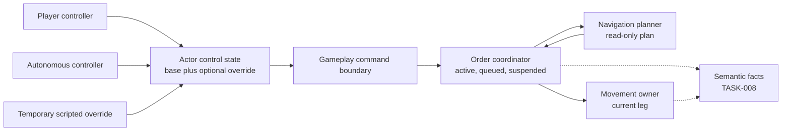
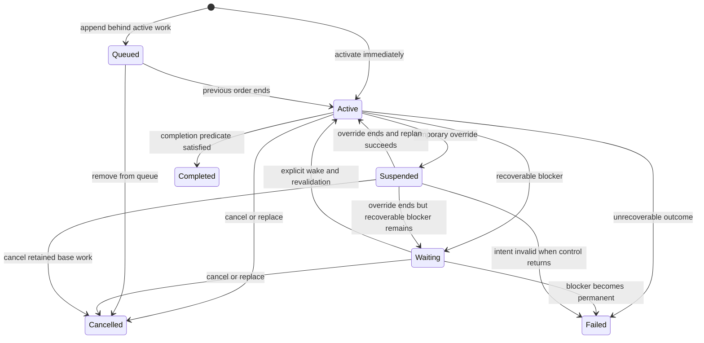

# Actor control and order lifecycle

[Project index](../README.md) · [Player experience](player-experience.md) · [Gameplay integration](gameplay-integration.md) · [Navigation and spatial architecture](navigation-architecture.md) · [Concurrency and performance](concurrency-and-performance.md) · [Project task list](task-list.md)

## Purpose

Ships and other commandable actors need one consistent model for player
direction, autonomous behavior, queued work, and temporary scripted control.
The model must explain who may issue an order, what happens to existing work,
how an order progresses, and why it is waiting, cancelled, or failed.

`TASK-005` proved one current player move order. It deliberately did not define
queues, autonomous control, scripted overrides, or post-acceptance failure.
This document records the accepted boundaries implemented by `TASK-006` and
retained for the later expansion into multiple connector travel legs.

These decisions do not add multiplayer authority, authentication, remote
control, prediction, or replication. All control is local single-player
simulation state.

**Decision status:** Accepted by the project owner on 2026-07-27.

## Implementation status

`TASK-006` now implements:

- Explicit player and autonomous base controllers, exact source matching, and
  stable controller revisions
- One non-nesting scripted override with separate work, suspended base work,
  an opaque stable reason, explicit cancel-outstanding release policy, and
  deterministic base restoration
- Explicit replace-all and append placement, one active order, a FIFO queue,
  stable order-ID cancellation, and same-timestamp promotion
- Active, queued, waiting, suspended, completed, cancelled, and failed lifecycle
  vocabulary with stable reasons; `TASK-028` now proves connector-transit
  waiting and emergence-driven wake behavior
- A private multi-leg plan executor that separates leg completion from order
  completion
- Immutable controller, current-order, queue, and suspended-work snapshots
- Read-only move and cancel evaluation proposals followed by owner commit
- The same move-order model for player and autonomous sources

Godot exposes replace, append, and active-order cancellation for the current
move order. Semantic transition facts remain in `TASK-008`. `TASK-028` now
proves connector-driven waiting, emergence wake, and replanning; target
invalidation and its post-acceptance failure proof remain in `TASK-011`.

The current runtime still does not schedule or persist long-running scripted
behavior. The override commands provide only the control boundary described
here; `TASK-017` retains script scheduling, checkpointing, wake, cancellation,
and persistence behavior.

## Accepted model at a glance

Each actor has one persistent base controller. It may also have one temporary
scripted override. The controller submits destination-oriented orders through
the normal command boundary. The order coordinator owns the active order,
queue, and lifecycle; navigation owns replaceable travel plans; movement owns
only the currently executing physical leg.

The active controller determines whose commands are eligible. It does not own
the actor, move the actor directly, or bypass normal validation.

## Terms

| Term | Meaning |
| --- | --- |
| Base controller | The persistent player or autonomous controller that normally directs an actor |
| Temporary override | A bounded scripted takeover that temporarily replaces the base controller |
| Active controller | The override when one exists; otherwise the base controller |
| Order | Stable gameplay intent with identity, source, lifecycle, and type-specific payload |
| Active order | The one order currently being evaluated or executed for an actor |
| Queued order | Accepted future work waiting behind the active order |
| Suspended order | Base-controller work retained while a temporary override is active |
| Travel plan | Replaceable navigation output used to execute a movement order |
| Current leg | The one physical local-movement or connector-traversal step currently executing |
| Reason | Stable explanation for the current lifecycle state |

## Decision summary

| Question | Accepted decision |
| --- | --- |
| What identifies a controller? | A local opaque controller reference with a kind and stable ID; do not infer control from asset ownership |
| How many controllers can direct one actor? | One base controller and at most one non-nesting temporary override |
| Can dialogue control an actor? | No by default; dialogue submits normal commands or explicitly requests a scripted override |
| What happens when an override begins? | Materialize physical state, suspend base work, and give the override a separate active order and queue |
| How does control return? | Discard or explicitly finish override work, restore the base controller, then replan and resume suspended work |
| What happens to base commands during override? | Reject them with a stable overridden reason rather than silently queueing them |
| How are multiple orders handled? | One active order plus a FIFO queue, with explicit replace or append placement |
| Is interruption an order state? | No; interruption is a transition cause leading to suspended, waiting, cancelled, failed, or replanned active state |
| When does an order wait rather than fail? | Wait only for a recoverable condition with an explicit wake trigger; fail when policy determines completion is no longer possible |
| Is initial unreachability an order failure? | No; invalid or immediately unreachable submissions remain command rejections |
| Who owns a multi-leg journey? | The order retains destination intent; an internal plan executor advances replaceable legs |
| How is parallelism preserved? | Workers evaluate immutable inputs into proposals; deterministic owner commit assigns order and command sequence |

## Controller identity and command eligibility

### Question

Is command attribution enough to determine control, and how should player,
autonomous, dialogue, and script sources relate to an actor?

### Accepted decision

Give every commandable actor an authoritative `ActorControlState` containing:

- One base controller reference
- An optional temporary override reference
- A generation or equivalent revision used to invalidate stale control work

A controller reference should contain a local controller kind and stable opaque
ID. Initial base kinds are player and autonomous. A script may occupy the
temporary override slot. Dialogue remains a command source, not a persistent
controller; a dialogue effect either submits an ordinary eligible command or
explicitly begins a scripted override through a later approved command.

The current runtime does not execute long-running scripted behaviors. The
script source and temporary-override contracts define how a future script
runtime may interact with actors; they do not provide script scheduling,
checkpointing, persistence, wake conditions, or long-running execution.
`TASK-017` retains that broader scripted-behavior work.

`CommandSource` remains submission attribution. The order coordinator compares
it with the actor's active controller before accepting actor-directed intent.
Asset ownership, faction membership, and control are separate concepts. Their
relationship can be validated when faction and ownership state exists without
changing the controller contract.

This provides one local eligibility rule for player and autonomous commands
without turning local simulation metadata into authentication.

## Temporary scripted overrides

### Question

Should an override replace, cancel, or suspend existing work? Can overrides
nest, and what happens when the override ends?

### Accepted decision

Support one non-nesting temporary override per actor initially. A request to
begin another override while one is active is rejected as a conflict.

Beginning an override:

1. Validates the actor and expected current controller revision.
2. Records a required opaque stable reason ID for snapshots and future semantic
   facts.
3. Materializes any active physical motion at the current simulation time.
4. Invalidates pending completion for the interrupted leg.
5. Suspends the base controller's active order and FIFO queue as one retained
   base-work set.
6. Installs the scripted controller with a separate active order and queue.

Ending an override:

1. Completes or cancels all remaining override-owned work according to the
   explicit release request.
2. Removes the override and restores the unchanged base controller.
3. Restores the suspended base queue.
4. Re-evaluates the suspended active order from the actor's current state.
5. Replans and resumes it when still valid, waits when a recoverable condition
   blocks it, or fails when its completion condition is no longer achievable.

Release requests require an explicit policy. The current runtime supports only
`CancelOutstanding`: it cancels any unfinished override-owned order and then
restores base work. Completion-based or delayed release would require the
long-running scripted behavior owned by `TASK-017`.

```mermaid
sequenceDiagram
    participant Base as Base controller
    participant Orders as Order coordinator
    participant Move as Movement owner
    participant Script as Script override

    Base->>Orders: Active order and queue
    Script->>Orders: Begin override
    Orders->>Move: Materialize and invalidate current leg
    Orders->>Orders: Suspend base work
    Orders->>Script: Override becomes active controller
    Script->>Orders: Override orders
    Script->>Orders: End override
    Orders->>Orders: Restore base controller and work
    Orders->>Orders: Revalidate and replan suspended order
```

Base-controller commands submitted during the override should be rejected with
a stable `actor-overridden` reason. Silently adding them to a hidden queue would
make player input difficult to understand and could create a large burst of
stale work when control returns.

Nesting, override priority, and multiple simultaneous script claimants are
deferred until a concrete narrative need justifies them.

## Order queue and placement

### Question

Should new orders always replace current work, or should actors maintain a
queue? How should cancellation interact with that queue?

### Accepted decision

Each controller work set owns:

- Zero or one active order
- A FIFO queue of accepted future orders

Order submission explicitly chooses a placement:

- **Replace all:** cancel the active order and all queued orders, then activate
  the new order. Direct map clicks use this behavior by default.
- **Append:** retain existing work and append the new order. A later Godot
  interaction such as a modifier key may expose this.

Avoid an implicit heuristic based on order type or timing. The same command
sequence must have the same meaning headlessly and through Godot.

Cancelling the active order materializes any physical state, invalidates its
scheduled work, marks it cancelled, and activates the next queued order at the
same authoritative timestamp. Cancelling a queued order removes only that
order. Cancellation by stable order ID should be supported so presentation and
scripts do not depend on queue indexes.

Replacing or cancelling orders emits semantic facts under `TASK-008`; it does
not require retaining an unlimited authoritative order history.

## Order lifecycle

### Question

Which states are authoritative, and what does interruption mean?

### Accepted decision

Use these durable order states:

- `Queued`
- `Active`
- `Waiting`
- `Suspended`
- `Completed`
- `Cancelled`
- `Failed`

`Completed`, `Cancelled`, and `Failed` are terminal. `Interrupted` should be a
transition cause and recorded reason, not a durable state with ambiguous next
behavior. An interruption must resolve immediately to suspended, waiting,
cancelled, failed, or a newly replanned active state.

Every transition records a stable reason separate from the state. For example,
two orders may both be waiting while one awaits an enabled connector and the
other awaits a target entity to become available.

The authoritative model should retain current and queued state. Bounded
explanation history and player-facing transition facts remain separate work in
`TASK-008` and `TASK-025`.

## Rejection, waiting, and failure

### Question

When should an invalid request be rejected immediately, and when should an
accepted order later wait or fail?

### Accepted decision

Keep the three outcomes distinct:

- **Command rejection:** no order is created. The source is ineligible, the
  payload is invalid, the actor does not exist, the requested placement
  conflicts, or the initial intent cannot begin or enter an explicitly allowed
  waiting condition.
- **Waiting order:** the accepted intent remains meaningful and a recoverable
  authoritative condition prevents progress.
- **Failed order:** the order was accepted, but later state or policy determines
  that its completion condition can no longer be achieved.

The `TASK-005` behavior remains correct: an immediately unreachable direct
move is rejected and does not replace current work.

Waiting must always name both a stable reason and a wake mechanism. Prefer
event- or fact-triggered re-evaluation when topology, access, target state, or
capacity changes. A scheduled retry is valid only when passage of time itself
is the relevant rule. Do not poll every waiting order every tick.

Connector work in `TASK-028` supplies the first concrete waiting case: a
replacement order accepted during non-interruptible transit waits for emergence
and wakes from the physical completion event. Runtime connector disablement
remains deferred. Target destruction in `TASK-011` should supply the first
post-acceptance failure case when no order-specific fallback exists.

## Completion rules and multi-leg execution

### Question

Does finishing a movement leg complete the order, and where should a
multi-leg plan live?

### Accepted decision

Each order type owns a completion predicate. A move-to-position order completes
when the actor satisfies that destination's movement rule. Docking, following,
patrolling, attacking, and hauling will have different completion conditions
even when they use movement internally.

The order retains stable destination intent and lifecycle. A private plan
executor owns:

- The latest replaceable travel plan
- The current leg
- Any remaining planned legs
- The topology and target revisions against which the plan was evaluated

Movement owns only the current physical leg. Completing a leg returns control
to the order coordinator, which either starts the next valid leg, replans at an
approved boundary, waits, fails, or completes the order. It must not assume
that every arrival event completes the whole order.

This boundary removes the `TASK-005` restriction that a command contain exactly
one local leg and allows `TASK-028` to add connector traversal without exposing
gate or route selection in actor intent.

## One model for player and autonomous actors

### Question

Should autonomous behavior mutate orders directly or use a separate order
type?

### Accepted decision

Player and autonomous controllers submit the same gameplay commands and create
the same order types. Both pass through active-controller validation, placement
rules, lifecycle transitions, planning, and authoritative commit.

Autonomous evaluation may run in batches and produce command proposals. A
coordinator sorts those proposals by a stable key and submits accepted work in
that order. Command and order sequence values are assigned during deterministic
commit, never in worker completion order.

The controller source and reason remain visible so the player can distinguish
direct orders from automation without creating two execution models.

## Ownership and parallel readiness

### Question

How should the order system support parallel execution without allowing races
to determine results?

### Accepted decision

Separate order work into:

1. **Stable read input:** actor controller, current and queued orders, spatial
   state, topology revisions, and relevant capabilities.
2. **Evaluation:** independent workers validate intent, evaluate waiting
   conditions, or request plans and produce immutable proposals.
3. **Deterministic merge:** proposals are sorted and conflicts are resolved by
   stable actor, controller, command, order, and proposal keys.
4. **Owner commit:** the order owner mutates lifecycle and queues; the movement
   owner commits a leg; the agenda assigns event creation sequence.

An actor's order state has exactly one authoritative owner at commit time.
Ownership may be partitioned into batches; it must not imply one actor, one
system, or one order per thread. Workers do not mutate shared queues, spatial
state, or the event agenda.

## Presentation and observability

### Question

What must a snapshot expose for the player to understand control and orders?

### Accepted decision

An actor snapshot should expose:

- Base and active controller references
- Whether a temporary override is active and its reason
- Active order identity, kind, source, state, reason, and destination
- Current physical leg and expected completion when applicable
- Ordered summaries of queued work
- Suspended base work when an override makes it relevant to the player

Godot may choose how much detail fits the current view. It must not infer queue
state, order completion, or controller return from animations.

Command records continue to explain immediate acceptance or rejection.
Lifecycle changes become ordered semantic facts in `TASK-008`; internal
scheduled-event records remain diagnostic rather than player-facing history.

## Save and lifecycle boundaries

The authoritative save boundary will eventually include base and override
controllers, controller revision, active and queued orders, suspended work,
order identities and generations, replaceable plan state, and pending
completion events. `TASK-014` owns the complete save inventory and `TASK-022`
owns format selection.

Actor destruction must invalidate active work and pending events before removing
controller and order state. Runtime spawning and destruction remain in
`TASK-011`; `TASK-006` exposes an internal coordinated cleanup boundary that
`TASK-011` can call without defining spawning or destruction policy itself.

## Implemented sequence

`TASK-006` was implemented in bounded slices:

1. Added controller references, base-controller setup, active-controller
   validation, and controller snapshots.
2. Replaced the current-order-only owner with an order coordinator supporting
   stable order identity, explicit replace/append placement, one active order,
   and a FIFO queue.
3. Separated leg completion from order completion and introduced the internal
   multi-leg plan executor needed by connector travel.
4. Added one non-nesting scripted override with a stable reason ID, explicit
   cancel-outstanding release, suspended base work, and deterministic
   restoration.
5. Added waiting and failed states to the lifecycle contract. `TASK-028` proves
   transit waiting and emergence wake; target invalidation and failure remain
   with `TASK-011` rather than synthetic production behavior.
6. Semantic transition facts remain in `TASK-008` now that the lifecycle owner
   is stable.

The implementation should preserve a single-thread reference path and compare
identical snapshots, command records, event records, order transitions, and
facts across valid evaluation batch layouts when concurrent execution begins.

## Deferred choices

The initial `TASK-006` work did not decide:

- Nested or prioritized scripted overrides
- Shared group or fleet orders
- Standing orders and recurring automation
- Player-configurable autonomous policy
- Order dependencies or general workflow graphs
- Combat-specific interruption and retreat policy
- Gate queueing or congestion rules
- Bounded historical explanation retention

Promote these only when a concrete gameplay task requires them.
