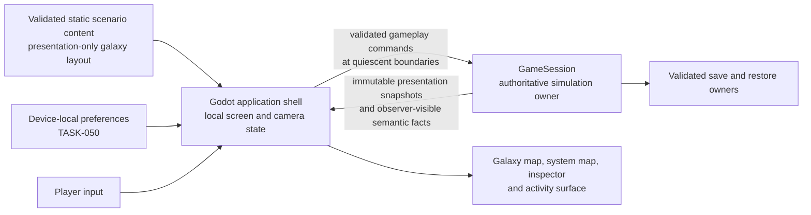
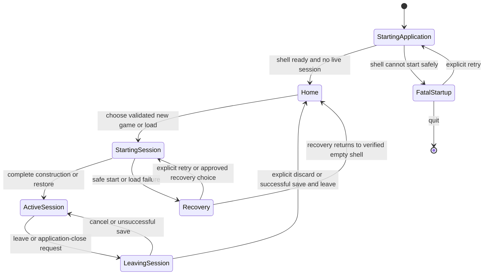

# Application shell and map experience

[Project index](../README.md) · [Player experience](player-experience.md) · [Presentation snapshots](presentation-snapshots.md) · [Fog-of-war and scouting](fog-of-war-and-scouting.md) · [Gameplay content](gameplay-content.md) · [Save slots and local preferences](save-slots-and-local-preferences.md) · [Time and pacing](time-and-pacing.md) · [Project task list](task-list.md)

## Purpose and decision status

The desktop application must let a player create or load one valid local
session, understand it through a map, issue only valid gameplay intent, and
leave it without turning Godot into a second owner of the simulation. The
application is a consumer of immutable presentation snapshots and semantic
facts. It does not own galaxy state, derive simulation outcomes from rendered
positions, or repair failed authoritative state.

The project owner approved the initial `TASK-049` baseline on 2026-08-21:

- one local active session at a time, with explicit new-game, load-game, and
  leave-session flows;
- a galaxy-topology view and a system-local map view;
- local, unsaved pan and cursor-centred zoom;
- client-owned generic selection and inspection;
- activity and map surfaces that respect fog-of-war, stale observations, and
  confirmed absence; and
- authored, presentation-only galaxy coordinates in static scenario content.

For the initial map application, every system and declared connection in the
static scenario is player-visible from session creation. Fog-of-war governs
entities and their state, not the static topology. The project owner approved
this initial boundary on 2026-08-24.

Nonpublic topology and connector discovery are planned future work. They need
their own observation, persistence, and presentation contract in `TASK-076`;
the initial shell must not imply that a public topology settles that later
exploration model.

**Decision status:** Accepted by the project owner on 2026-08-24. `TASK-049`
completed the design. `TASK-077` owns implementation after its stated
dependencies are available.

## Ownership boundary

`GameSession` remains the only facade that advances simulation time and
submits gameplay commands. The application may hold selection, focus, camera
position, expanded inspector sections, notification retention, and the active
fact cursor, but none of those values is authoritative state, a deterministic
snapshot input, or save data.

The application may interpolate a supplied local-motion segment for drawing.
That disposable visual value cannot become a destination, collision input,
event time, command-validation value, or later snapshot input. A ship in
connector transit has no fabricated system-local position and is shown as in
transit rather than on either system map.

## Static scenario presentation layout

Each static new-game scenario supplies one authored two-dimensional
presentation position for every system it declares. These coordinates belong
to scenario composition, are resolved and validated with the scenario, and
are consumed by the application only to place topology on the galaxy view.

The layout has these constraints:

- Every layout entry refers to one declared system and every declared system
  has exactly one entry.
- Coordinates are finite presentation values. Their values, scale, and axes
  have no physical, navigational, economic, or simulation meaning.
- The layout is not localized or right-to-left mirrored. Rendering may mirror
  directional user-interface controls, but never galaxy or system geometry.
- A missing, duplicate, unknown, or invalid layout entry rejects the static
  scenario through the normal content-validation path. The application does
  not generate a replacement graph layout after a session starts.
- Layout positions are not copied into `GameSession`, checkpoints, saves,
  routes, topology traversal, or deterministic ordering. Loading a save uses
  the compatible resolved content catalog to recover the same presentation
  layout.

Authors retain responsibility for making their layout legible. If authored
positions overlap, the renderer may disambiguate the draw and hit order using
stable system identity, but it must not relocate systems or create a different
topology. `TASK-048` owns the content-model, adapter, validation, and
production new-game integration required to consume this scenario data.

## Application lifecycle

The shell has no hidden or background session. At most one fully constructed,
healthy `GameSession` is active. It publishes no map, inspector, command, or
fact surface before construction or restore succeeds.

### New game

The home screen lists only static scenarios that reached the production
content-validation and catalog-resolution boundary. Starting one delegates to
the `TASK-048` static new-game composition path; it must not construct the
hard-coded Godot demonstration session or use direct test builders.

The shell creates a live session only after the selected scenario has completed
all required content validation and authoritative session construction. It may
show progress while that work occurs, but cannot expose a partially constructed
session. Procedural generation, scenario-generation choices, and random-seed
policy remain `TASK-047` and its dependencies.

### Load game

The home screen obtains save-slot identity and non-authoritative display data
through the local save policy. Selecting a slot requests the existing strict
restore, compatible-catalog resolution, and saved-reference migration paths.
Only a successful complete restore creates the active session.

`TASK-050` owns slot discovery, external-change conflict handling, backup
visibility, autosave policy, and local preference storage. `TASK-037` owns
content compatibility and saved-reference migration. The shell neither treats
its old presentation state as needed to restore a session nor silently replaces
a failed primary save with its backup.

### Active session and leaving

An active session has one shared application shell around its map, inspector,
activity, dialogue, and pacing surfaces. A request to leave or close the
application first reaches a completed-timestamp boundary and pauses local
pacing before the leave confirmation is actionable. No map command is issued
by asking to leave.

The confirmation has these outcomes:

- **Save and leave** opens the normal manual-save flow. It uses a completed,
  healthy authoritative boundary and respects all slot, overwrite, and
  external-change safeguards. The session remains active if the save is
  cancelled or fails.
- **Leave without saving** explicitly discards the in-memory session and
  returns to Home. It does not create a manual save or force an autosave.
- **Cancel** keeps the session loaded and paused. The player resumes through
  the normal pacing control.

Leaving discards client-only selection, camera, expanded-inspector, and local
activity-feed state for that session. It does not continue simulation in the
background. Application-close follows this same flow before process exit.

### Failure and fatal startup

An invalid or failed session never enters `ActiveSession`, resumes a partial
world, or receives a map command. The application presents a localized,
actionable safe explanation rather than raw exception detail. It may retain a
diagnostic record for local support, but diagnostic content is not part of the
player-facing game state.

`TASK-040` owns the precise recovery choices for corrupt saves, poisoned live
state, and unavailable, incompatible, or corrupt content. This shell owns the
state transition: an approved recovery outcome either starts a newly verified
session or returns to Home with no live session.

Fatal startup is narrower: the application cannot prepare a safe Home screen.
It holds no live session and offers only explicit retry of application startup
or quit. An unreadable local-preference store is not fatal when `TASK-050` can
run with defaults and offer a later explicit reset.

## Map hierarchy and camera behavior

The active-session map has two peer presentation scales:

| View | Purpose | Source and limits |
| --- | --- | --- |
| Galaxy | Navigate the complete declared static topology and choose the system context to inspect. | Uses scenario presentation coordinates and every declared system and connection. It does not infer route access or in-system entity positions. `TASK-076` owns any future nonpublic-topology view. |
| System | Inspect player-permitted entities, connectors, orders, and movement in one system-local coordinate space. | Uses immutable observer-scoped presentation data. It never displays a fabricated position for connector transit or an unobserved mobile contact. |

A system context is a local navigation focus, not an entity selection and not a
simulation command. Entering a system map changes only the rendered scale;
returning to galaxy restores the previous galaxy camera. An entity may remain
selected while its system is not the system currently rendered, provided that
the entity still resolves in the latest permitted presentation snapshot.

Both views support pan and cursor-centred zoom. Galaxy view initially frames
the permitted topology; system view initially centres a focused, currently
positioned entity when one exists, otherwise the system origin. A visible
recenter control may centre the focused entity or restore the initial view.
The camera never automatically follows a moving entity after that initial or
explicit recenter action. Camera state is local to the active application
lifetime and is not stored in saves or authoritative preferences.

The numeric relationship between system-local coordinates and screen pixels is
a renderer concern. The application must preserve authoritative coordinate
ordering and direction when transforming them, but it does not expose a
physical distance unit merely because it offers zoom.

## Selection, inspection, and state loss

Generic entity selection is a client-owned ordered set of stable session entity
identities, with an optional focused member. It replaces the current
ship-specific presentation-selection boundary as entity-owning tasks provide
presentable records. A system navigation focus remains separate because a
system is not an entity selection target.

The presentation facade resolves the requested identity set against the same
completed, observer-scoped read boundary as its world and fact data. It returns
the resolved presentable entities, unresolved identities, and a resolved focus.
Each resolved entity provides its stable kind, observation state, and only the
typed fields its owner permits for presentation. Neither the Godot client nor
the shell may reconstruct missing fields, derive an entity from its label, or
read domain owners directly.

Selection is not a command target. Multiple selected entities receive map
highlights and a summary, while the focused entity supplies inspector detail.
Group commands remain `TASK-033`; the shell does not turn multi-selection into
shared movement or any other gameplay action. The inspector shows only actions
that the selected entity's owning command contract explicitly offers, and every
such action revalidates through `GameSession`.

| Latest permitted result | Map and inspector behavior |
| --- | --- |
| Current entity | Draw its current permitted state and allow only owner-provided actions. |
| Stale persistent discovery | Draw it as stale, show its observation simulation time, and inspect only retained observed fields. The shell does not present stale data as a current guarantee. |
| Confirmed missing persistent discovery | Draw a clearly marked last-known-location record, not a live entity. State only that its absence was confirmed, without a cause or inferred time, and offer no generic action. |
| Unresolved selected identity | Remove it from local selection and focus, close the entity inspector, and show a local no-longer-available status. A fact may explain the change only when one was delivered. |
| Non-owned mobile contact lost outside coverage | Treat it as unresolved immediately. Do not retain, extrapolate, or render a ghost marker. |

`TASK-073` owns the presentation records that make live contacts, stale
persistent discoveries, refresh, and confirmed absence available. Future
station, deployable, inventory, production, combat, and dialogue owners retain
control of their entity-specific fields and actions.

## Overlays and activity surface

The minimal map always distinguishes a selected set, a focused entity, current
local motion, and a current order route when the presentation snapshot supplies
those values. A route overlay ends when the underlying order no longer has an
active or waiting route. It is not a prediction of uncommitted motion.

Additional overlays are opt-in local presentation controls. The first supported
ones are player sensor coverage when `TASK-073` exposes it, and observed-state
markers that distinguish current, stale, and confirmed-missing presentation.
Every overlay must have an explicit snapshot or validated content input. It
cannot expose hidden cargo, production, combat, sensor, or relationship data,
and it cannot calculate a hidden contact's location from past frames.

The activity surface consumes the observer-visible `GameFactReadResult` in
source sequence order. It maintains bounded local retention and the current
cursor only in the client. When `CursorGap` is reported, it visibly marks the
prior activity history incomplete and may clear the retained entries; it never
claims that it reconstructed lost events. The minimal surface provides a
non-blocking feed and an unread indicator. Dialogue and recovery retain their
own foreground flows, so an ordinary fact does not pause simulation or seize
focus.

The initial map does not define fact grouping, severity, combat alerts, or
cross-save notification history. A later owner may add those only with a stable
semantic fact contract and an explicit presentation rule.

## Localization and accessibility boundary

All shell labels, map legends, stale and missing labels, controls, failure
messages, and activity wording use application-owned semantic localization keys
and complete templates. Stable identifiers, fact kinds, reason codes, times,
and quantities cross from the simulation as typed values; localized wording is
never sent back as gameplay input.

Map geometry, physical direction, galaxy coordinates, and system-local
coordinates remain unmirrored. Layout containers, reading order, controls, and
directional user-interface affordances follow the locale direction established
by `TASK-045`. `TASK-061` separately owns keyboard and controller equivalence,
focus navigation, assistive-technology behavior, contrast, non-color cues,
reduced motion, captions, audio cues, and supported text-scale behavior.

## Implementation handoffs and proof

`TASK-077` implements this application contract. It must preserve the existing
immutable presentation boundary and add focused proof for:

1. no session surface before successful new-game construction or restore;
2. leave, save-and-leave, discard, cancel, and application-close behavior;
3. no active session after failed start, load, or fatal startup;
4. one local session only, with discarded client state after leave;
5. deterministic rendering of authored galaxy coordinates without simulation
   or save influence;
6. pan, zoom, system-context changes, and explicit recenter without command
   submission;
7. generic selection ordering, stale focus resolution, current, stale,
   confirmed-missing, and unresolved rendering;
8. no ghost location for lost non-owned mobile contacts;
9. observer-visible fact consumption, cursor-gap warning, and bounded local
   retention; and
10. localized and layout-safe shell text without localized values becoming
    simulation input.

`TASK-048` implements validated static scenario layout consumption and
production new-game composition. `TASK-037` supplies compatible saved-content
resolution, `TASK-040` supplies recovery outcomes, `TASK-038` supplies pacing
checkpoints, `TASK-073` supplies fog-of-war presentation records, and `TASK-061`
supplies comprehensive accessibility behavior. `TASK-077` must not absorb
those owners' authoritative or domain-specific policies.

## Initial topology visibility and deferred discovery

The initial galaxy map exposes every static scenario system and declared
connection, including their authored presentation positions, from session
creation. This public-map rule applies only to static topology. It grants no
knowledge of a system's current entities, route access, economic state, or
events beyond the observer-scoped presentation and fact contracts.

`TASK-076` owns any later nonpublic system or connector discovery model. It
must define the information boundary before an application surface hides,
reveals, persists, or otherwise infers topology from entity coverage or past
map frames.
