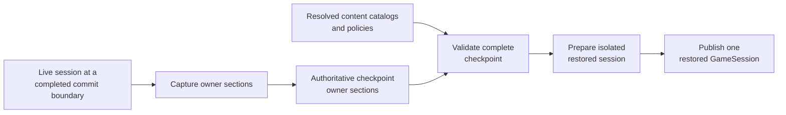

# Authoritative save boundary

[Project index](../README.md) · [Inventory and cargo](inventory-and-cargo.md) · [Runtime orchestration](runtime-orchestration.md) · [Entity lifecycle and explicit spawning](entity-lifecycle.md) · [Actor control and order lifecycle](actor-control-and-orders.md) · [Navigation and spatial architecture](navigation-architecture.md) · [Semantic game facts](semantic-game-facts.md) · [Relational simulation architecture](relational-simulation-architecture.md) · [Project task list](task-list.md)

## Purpose

A save is a checkpoint of the authoritative single-player simulation. Loading
one must continue from the same committed world, not reconstruct a plausible
world from presentation snapshots, semantic facts, or replayed commands.

This document defines the state boundary and restoration rules for `TASK-014`.
It deliberately does not select an encoding, persistence medium, schema
versioning mechanism, or content migration policy. Those decisions remain with
`TASK-022` and `TASK-037`.

`TASK-034` brought construction, economy, and transport owners into the
`GameSession` aggregate and retired the public operations that accepted a
caller-supplied `ConstructionProcess`. The session is now the complete
authoritative aggregate required for checkpoint work. This establishes
aggregate admission; it does not implement save encoding or storage, which
remain `TASK-022` work.

**Decision status:** Proposed for project-owner review.

## Boundary at a glance

The save boundary contains every value whose absence could change a later
authoritative result: state, pending work, identities, allocation high-water
marks, idempotency receipts, and deterministic random state. It excludes views
and history unless a separately owned feature explicitly requires them across a
load.

An owner section is authoritative only when it can restore that owner's future
behavior directly. A section may reference immutable authored content, but it
must retain the stable identity and compatibility information needed to resolve
the exact definition. Display strings, localized text, and other derived
content are not runtime authority.

## Checkpoint timing and atomicity

Capture and publication occur only at a completed authoritative commit
boundary. In the current engine, that means after the full timestamp has
drained its `PhysicalCompletion`, `StateUpdate`, and `Decision` phases, and
after any resulting fact and agenda commits. Capture must not observe a
partially applied cross-owner operation, an open event phase, or an
evaluation buffer that has not committed.

Capture additionally requires that the source aggregate is healthy. After input
is frozen at the completed boundary and before any owner capture begins, the
checkpoint coordinator verifies a healthy aggregate and healthy participating
owners. An unexpected apply failure poisons that health state permanently for
the session: capture returns a typed failure, captures no owner section, and
produces no checkpoint. A poisoned session also cannot advance, accept commands,
or begin another capture.

The session's application boundary must stop accepting or draining gameplay
input while capture takes its coherent view. When `TASK-038` adds buffered
input, the checkpoint includes that deterministic input queue and its ordering
metadata, or capture occurs before the queue is admitted. It must never drop or
silently reorder admitted input.

Load validates every section and cross-owner reference before publishing a live
session. It constructs private owner instances, restores them directly, and
publishes the session only after all validation succeeds. A rejected or failed
restore exposes no partially restored session and must not mutate a live
session. An unexpected failure after publication makes the new session invalid;
it is not repaired by replaying part of the checkpoint.

## Aggregate admission boundary

The selected boundary requires clean-session construction, economy, and
transport owners inside one `GameSession` aggregate. `TASK-034` established
that ownership: their workflow state, pending effects, reservations,
commitments, scheduled work, allocators, and receipts now sit behind the same
private aggregate boundary as lifecycle, movement, relationships, agenda,
commands, and facts. The future checkpoint coordinator captures the whole
aggregate at one completed commit boundary and restores the whole aggregate
before publication.

`GameSession.CaptureSnapshot` remains a presentation read model; neither it nor
any new API may be represented as an authoritative save capture. `TASK-022`
must define a separate checkpoint representation over the complete aggregate.

## Required owner sections

The following inventory is format-independent. "Current" identifies state
already present in the clean `GameSession`; "reserved" identifies an obligatory
section whose owning task has not yet defined its internal model.

| Section | Required authoritative information | Status and owner |
| --- | --- | --- |
| Aggregate admission | Evidence that all authoritative workflow owners are inside the checkpoint aggregate. No caller-supplied construction, economy, or transport owner may remain outside it. | Established by `TASK-034`; future owners must meet the same rule. |
| Capture health | A healthy aggregate and healthy participating owners at the completed capture boundary. A poisoned or partially failed source is rejected before any owner state is captured. | Capture precondition only; never saved. |
| Checkpoint identity | Save identity, the compatible game/content identity, and the authoritative simulation time. The format/schema representation is deferred. | Format in `TASK-022`; content compatibility in `TASK-037`. |
| Engine checkpoint | The completed checkpoint state needed to continue rather than repeat initialization: current time, initialized/accrual progress, and the fact that no event phase is open. | Current engine. |
| Pending agenda | Every pending event's complete `EventKey` (time, phase, creation sequence), generation, and discriminated payload, plus the next agenda creation sequence including exhaustion. Entity removal must first cancel its movement events; ordinary stale-generation events for live actors remain valid deterministic no-ops. | Current engine and each event-owning domain. |
| Deterministic runtime policies | A policy manifest naming every injected strategy that can affect a later authoritative decision. Each entry requires a stable kind, algorithm/behavior version, exact parameters, and its compatible content references or a rejection if the implementation is unavailable. It includes materialization policies and allowed ship designs, navigation planning and travel-time policy, fact-retention capacity, and every future injected decision strategy. | Current setup and `GameSession` composition; concrete encoding in `TASK-022`. |
| World topology | Every star system, connector endpoint, directional connection, and any later enabled, access, or dynamic topology state. Immutable authored definitions may be resolved by stable content reference only when exact compatibility is validated. | Current topology; future topology policy belongs to its owning domain. |
| Entities and inventories | Live entity-to-typed-ID mappings; every live ship's principal, design reference, and cargo inventory identity; each inventory's typed physical owner, controlling principal, capacity, fungible holdings, discrete instances, reservations, allocators, and required receipts; lifecycle materialization and removal receipts. | Current material aggregate ownership was established by `TASK-034`; the generalized contract is defined by completed `TASK-041` and implemented by `TASK-069`; encoding remains `TASK-022`. |
| Entity and resource allocators | The next value or exhausted state for every runtime allocator, including entity, ship, inventory, motion, connector transit, order, agenda creation, command, fact, and every future owner-specific identifier. High-water marks alone are insufficient when IDs have been allocated without a live object. | Current owners and every future owner. |
| Spatial and motion | Each live ship's discriminated spatial state, actor generation, active motion or connector-transit identity, endpoints, departure and arrival times, and the corresponding pending completion `EventKey`. | Current movement and agenda. |
| Control and orders | Per-ship base controller, temporary override and reason, controller revision, active/queued/suspended orders in their exact order, terminal state retained by the order owner, plan, next-leg index, motion/transit linkage, order status and reason, and order IDs/generations used by pending work. | Current actor-control and order owners. |
| Relationships | The complete relationship inventory and direct restoration contract specified in [Relational simulation architecture](relational-simulation-architecture.md#authoritative-relationship-save-inventory): principal/content identity, player principal, exact standing policy and values, diplomacy, grants, and committed source-scoped standing and policy batch receipts. | Current relationship owner. |
| Command admission | The next command sequence or exhausted state, last admitted command time, and any admitted-but-not-applied ordered command queue. Retained command records are history, not command authority. | Current processor sequence and admission time; queue reserved for `TASK-038`. |
| Semantic fact continuity | The next `GameFactSequence` or exhausted state; required persistent consumer cursors; and only the configured retained fact suffix when a feature explicitly requires it after load. | Current fact store; consumer ownership and explanation retention in `TASK-025`. |
| Deterministic randomness | The resolved 256-bit root seed; derivation, generator, and sampling algorithm identities and versions; and every live stateful stream's canonical scope/domain/owner/purpose key, complete state, and next-draw position. Stateless samples have no individual stream state; their decision and attempt identities remain with the domain owner that defines them. | Defined by [Deterministic randomness and stream ownership](deterministic-randomness.md) in completed `TASK-021`; implemented by completed `TASK-066`. |
| Objectives and end state | Every active, completed, failed, or superseded objective; its stable content reference; ordered progress, prerequisites, irreversible choices, timers, and victory or defeat state. | Reserved for `TASK-018`. |
| Script execution | Every persistent script instance, definition reference, program/version checkpoint, trigger subscriptions, one-shot or repeatable memory, locals that affect future behavior, pending wake/cancellation state, and script-owned idempotency receipts. Scheduled wakes also appear in the agenda. | Reserved for `TASK-017`. |
| Dialogue continuity | Every active or suspended conversation, participant and definition references, current node, availability/consumption/repeatability memory, selected consequences, response-required state, and any deterministic timeout or wake state. | Defined by [Dialogue state and presentation](dialogue.md) under `TASK-016`; implementation reserved for `TASK-065`. |
| Knowledge and player state | Any future authoritative knowledge, staleness, discovery, or player preference state whose absence changes commands or simulation behavior. Purely local presentation settings are excluded. | Knowledge in `TASK-020`; pacing/input preferences in `TASK-038`. |
| Future domain owners | Complete workflow state, pending effects, reservations, commitments, scheduling links, allocator state, and committed receipts for every owner later added to `GameSession`. | Required aggregate-admission rule for all later work. |

The former Phase 1 acceptance composition has its own fixture state and does
not define the production save boundary. If it later becomes a supported saved
experience, its owner must supply a complete section under the same rules rather
than leaking acceptance-only objects into `GameSession`.

## Deterministic runtime policies

Injected behavior is authoritative when it can change the result of work first
performed after load. It is therefore neither a deployment detail nor an
implicit property of the currently running process. A restored session accepts
only a registered policy kind whose algorithm/behavior version and exact
configuration match the checkpoint. Passing an arbitrary implementation of an
interface to a loader is insufficient: if the loader cannot identify and
validate its behavior, it must reject the checkpoint.

The current policy manifest must include at least:

- Every `ShipMaterializationPolicy`, keyed by `FacilityId`, with its owning
  `PrincipalId`, system position, base controller, initial-order policy, and
  the complete set of allowed `ShipDesign` definitions. Each allowed design
  needs an exact compatible definition or content reference, including every
  field the policy uses to create a ship, currently its cargo capacity.
- The `ISpatialNavigationPlanner` kind, algorithm/behavior version, and all
  planner configuration that affects route selection, reachability, leg order,
  tie-breaking, or failure reasons. For the current planners this distinguishes
  direct-local from hierarchical planning and captures the compatible topology
  behavior each expects.
- Every `ILocalTravelTimeEstimator` used by the planner: kind,
  algorithm/behavior version, and all parameters that affect a returned
  `SimulationDuration`. A changed estimator must not produce a different first
  post-load arrival time under the same request.
- `GameFactStore` retention capacity. Capacity changes which facts and cursor
  gaps are available to retained-fact consumers, so it must be restored exactly
  whenever the save supports that fact window.
- Any later strategy supplied through construction, dependency composition, or
  content resolution that can change commands, scheduling, random draws,
  allocation, validation, planning, materialization, or other authoritative
  outcomes. Its owner must add an entry before the strategy can participate in
  a supported saved session.

The manifest may use stable, versioned content references where `TASK-037`
proves them compatible. It must not rely on display names, CLR type names,
assembly load order, a default constructor, or a silently changed implementation
behind the same policy label.

## Agenda cancellation for entity removal

Removal cancels a departing actor's exact scheduled movement completion rather
than leaving it as a generation-invalidated agenda no-op. That prevents a
checkpoint from confusing an intentional orphan with a corrupt event that
names an invented removed ship. `TASK-039` established this behavior before
checkpoint capture and restore are implemented.

Active local-motion and connector-transit state must retain the exact scheduled
`EventKey` created for their completion. During removal, the coordinator uses
those keys to prepare exact cancellation records containing the key, expected
generation, and movement or transit identity. It batch-revalidates and cancels
them in ascending `EventKey` order through narrow agenda operations. Cancellation
does not allocate a creation sequence, create a replacement event, scan the
agenda, or expose another owner's pending work.

The agenda cancellation operation verifies that the entry at the key still has
the expected generation and payload identity. An expected absence or mismatch
must be resolved during the read-only prepare step. Any mismatch after prepare
is an invariant failure: it poisons the session, and a session-health gate
prevents further advancement, command processing, capture, or saving. Removal
then continues its existing ordered cross-owner cleanup only after all required
cancellations commit.

This deliberately preserves ordinary stale-generation events for a live actor,
such as a superseded local-motion completion. They are structurally valid
agenda entries and continue to dispatch as deterministic no-ops. The loader
does not need tombstones or invalidation receipts to prove their prior history.
After `TASK-039`, however, a pending movement event that names no live ship is
corrupt and restore rejects it. A future owner that intentionally permits an
orphaned event must either cancel it before removal or define its own explicit
provenance and restore contract.

## Cross-owner invariants

A valid checkpoint preserves the following relationships exactly:

- Every pending event has a structurally valid payload that the restored
  dispatcher understands. A pending movement event names a live ship; removal
  has already cancelled the departing ship's completion. A live actor may have
  a valid stale-generation event whose generation or movement identity no
  longer matches current state and which dispatches as a deterministic no-op.
- A moving or transiting ship has matching movement state, active order link,
  and pending completion event. A stationary ship has no incompatible active
  motion or transit link.
- Every live entity mapping, ship record, cargo inventory, spatial actor,
  controller, and order owner agree on the same `ShipId`. No removed entity is
  restored as live merely because a diagnostic record references it.
- Every reservation, commitment, queue item, pending materialization, and
  receipt refers to a restored owner and its exact generation or identity.
- Every workflow owner that can affect the checkpoint belongs to the restored
  `GameSession` aggregate. No caller-supplied construction, economy, or
  transport owner is omitted as an external side effect.
- Every relationship receipt validates against restored principals, policy, and
  values. Restore assigns that state directly and never replays a relationship
  batch or emits replacement relationship facts.
- All allocators resume beyond every identity they may issue, including
  identities retained only by pending work or receipts. Exhaustion is preserved
  as state.
- Every runtime-policy manifest entry resolves to the exact registered kind,
  behavior version, and configuration required by its owner. In particular,
  materialization, navigation, travel-time, and fact-retention policies must
  match before any restored work can be accepted.
- Every saved content reference resolves to one compatible definition before
  any owner is constructed. Content migration or a clear incompatibility error
  belongs to `TASK-037`; a loader must not substitute a same-named definition.

## Deliberate exclusions

The following are not save authority and cannot rebuild the world:

- `GameSnapshot`, `GamePresentationSnapshot`, relationship diagnostic
  snapshots, scoped relationship projections, and Godot selection, focus,
  layout, interpolation, and camera state.
- Derived standing bands, grant effectiveness, cached navigation paths,
  spatial indexes, sorted lookup indexes, and other rebuildable caches.
- Semantic facts, command records, event records, logs, metrics, benchmark
  digests, and diagnostic timing. A retained fact suffix is included only for a
  separately defined across-load consumer experience.
- Worker count, work-stealing state, thread identity, evaluation buffers, and
  performance measurements. Parallel evaluation resumes from the same stable
  owner state and commits by the same deterministic order.
- Authentication, remote-session state, or replication data. The game remains
  strictly single-player.
- The poison marker or session-health state. A poisoned session cannot produce
  a checkpoint, so restoring one is neither meaningful nor supported.
- Agenda tombstones and invalidation receipts for removed-entity movement are
  excluded because `TASK-039` cancels that bounded work before removal. They
  are not a substitute for the exact agenda cancellation check.

## Restore procedure

1. Decode into an inert checkpoint representation selected by `TASK-022`, with
   the complete `GameSession` aggregate established by `TASK-034` as the
   authoritative source and restoration target.
2. Resolve content references and the deterministic runtime-policy manifest
   through the version and provenance boundaries selected by `TASK-037`.
3. Validate each owner section independently, then validate all cross-owner
   invariants, allocator positions, event payloads, and receipt consistency.
4. Create isolated owners from the validated state without dispatching events,
   replaying commands, generating facts, or allocating new IDs.
5. Rebuild only derived caches and read models from the restored authoritative
   values.
6. Publish the fully assembled `GameSession` at its completed checkpoint.

No restore step may call normal gameplay command, relationship batch, event
handling, or fact-commit APIs. Those APIs represent new causal work and would
change sequences, receipts, history, or outcomes.

## Boundary tests before serialization

`TASK-014` is complete only when an in-memory checkpoint contract proves this
boundary without choosing a file format. The focused tests must cover:

- The public session boundary exposes no operation that accepts a caller-owned
  construction, economy, or transport workflow.
- A completed aggregate captures and restores construction, economy, transport,
  lifecycle, and all other owner state together at one commit boundary.
- Fault injection after a partial apply poisons the source aggregate; capture
  rejects it before any owner capture begins and produces no checkpoint. The
  poison marker itself is not captured or serialized.
- Capture during local motion, connector transit, queued and suspended orders,
  active override, pending agenda work, and non-default relationship state.
- Continued execution from a restored checkpoint produces the same authoritative
  snapshot, event dispositions, facts, IDs, command sequences, and receipts as
  uninterrupted execution.
- Restored structurally valid stale events for live actors remain deterministic
  no-ops, while valid events apply exactly once at the original key and
  generation. A removed entity has no pending movement completion event.
- Repeating a committed relationship or lifecycle delivery after load returns
  its original receipt without applying a second effect.
- Rejection for a corrupt cross-owner reference, receipt, allocator position,
  content reference, or event payload publishes no session and leaves any live
  source session unchanged.
- A changed materialization policy, allowed design, navigation planner,
  travel-time policy, fact-retention capacity, or other policy-manifest entry
  rejects restore rather than changing the first future authoritative result.
- Removed-entity agenda cancellation captures the exact key, generation, and
  movement identity; cancellation is key-ordered and non-allocating. A
  fault-injected post-prepare mismatch poisons the session and the health gate
  rejects later advancement, command handling, capture, and saving.
- Capture is invariant under valid worker counts and evaluation partitioning,
  and restoration starts from the same deterministic reference state.
- Retained facts, event records, command records, and presentation state are
  demonstrably unnecessary unless an explicitly opted-in consumer section asks
  to keep them.

The resulting in-memory contract is not a serialization format. `TASK-022`
selects the encoded schema and migration strategy only after these tests prove
that the boundary is complete.

## Follow-up ownership

`TASK-022` owns encoded save schema, versioning, migration, corruption
handling, and storage mechanics. `TASK-037` owns versioned content catalogs,
source provenance, and saved content-reference migration. `TASK-017` through
`TASK-020`, `TASK-025`, `TASK-038`, and dialogue implementation in `TASK-065`
must each supply the precise state for their reserved section before their
runtime owner can participate in a supported save. Completed `TASK-066`
supplies the deterministic-randomness section. `TASK-034` completed the first
aggregate-admission prerequisite for supported save and load work.
