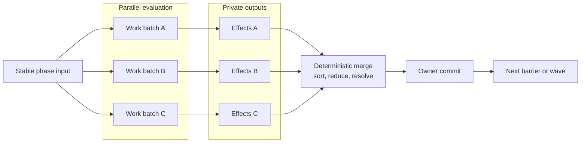
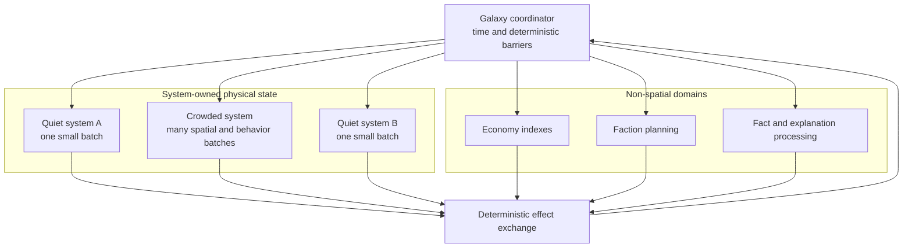

# Concurrency and performance architecture

[Project index](../README.md) · [Simulation architecture](simulation-architecture.md) · [Runtime orchestration](runtime-orchestration.md) · [Navigation and spatial architecture](navigation-architecture.md) · [Moving-ship interactions](moving-ship-interactions.md) · [Actor control and order lifecycle](actor-control-and-orders.md) · [Semantic game facts](semantic-game-facts.md) · [Deterministic randomness](deterministic-randomness.md) · [Scale targets and benchmarks](scale-and-benchmark-targets.md) · [Technical direction](technical-direction.md) · [Project task list](task-list.md)

## Purpose

Galaxy Command aims to support substantially more simulated entities than a
presentation-heavy 3D space game, including scenarios where many ships occupy
one system. Its two-dimensional world removes an axis of spatial work and
avoids much of the cost of detailed 3D rendering and physics, but that
advantage does not make large simulations automatic.

At high entity counts, the dominant costs may instead be:

- Finding nearby actors or potential interactions
- Pathfinding and movement planning
- Combat, avoidance, and sensor evaluation
- Autonomous decisions and faction planning
- Economic searches and logistics matching
- Scheduled-event volume
- Snapshot construction, memory allocation, and cache misses

The architecture must make independent work parallelizable from the beginning.
The implementation should add concurrent execution incrementally, with
benchmarks proving where it helps. Correct outcomes must not depend on thread
count, task scheduling, or which worker finishes first.

## Goals

- Scale across independent systems and across work inside one crowded system.
- Preserve deterministic outcomes for the same initial state and commands.
- Keep a single-thread reference mode using the same domain boundaries.
- Avoid global mutable structures that require pervasive locking.
- Use coarse, measurable work batches rather than one task per entity.
- Allow the runtime to choose worker count and batch size without changing
  gameplay semantics.
- Make performance limits visible through repeatable benchmarks and structured
  timing data.

The goal is useful parallelism, not making every operation concurrent. Ordered
coordination, conflict resolution, and small workloads may remain serial when
that is faster or easier to verify.

## Execution model

Simulation work should follow a deterministic evaluate-and-commit model. During
an evaluation wave, workers read stable state and produce proposed effects in
private buffers. They do not mutate state owned by another worker. A
coordinator then merges those proposals in a defined order, resolves conflicts,
assigns globally meaningful sequence values, and commits the accepted effects.

This model creates parallelism without allowing races to define the result. It
also works in the single-thread runner: the same batches are evaluated
sequentially and pass through the same merge and commit rules.

The existing timestamp and event-phase barriers remain the deterministic spine.
A phase may require more than one evaluation wave when committed work creates
new work for that same phase. The coordinator must drain those waves according
to the documented same-time rules before advancing the phase.

## Ownership and partitioning

### Systems are ownership boundaries, not threads

A system is a natural owner for most physical state because movement, sensors,
collisions, and combat are usually local. Different systems can often evaluate
physical activity independently during the same phase.

One system must not be permanently assigned to one thread. That design scales
across many quiet systems but fails when thousands of ships gather in one
system. Systems instead expose batches of work that a scheduler may distribute
across available workers.

The diagram shows ownership and dataflow, not a required thread layout.
The scheduler may run all boxes on one thread or distribute their batches
across many workers.

### Crowded systems require spatial partitioning

Local spatial queries must use an index appropriate to two-dimensional space
rather than comparing every ship with every other ship. The exact index remains
an implementation and benchmarking choice; candidates include uniform grids,
hierarchical grids, and trees.

Spatial partitions provide candidate batches for proximity, sensors,
avoidance, and combat. An interaction crossing a partition boundary must have
one deterministic owner, derived from stable partition and entity identities,
so it is evaluated exactly once. Workers may read neighboring partition data,
but publish mutations only through effects returned to the owning commit step.

Partition size and work-batch size are runtime tuning parameters, not gameplay
rules. Dense areas may split into more batches; sparse areas may be combined to
avoid scheduling overhead.

Completed `TASK-019` defines the interaction-specific reduction contract.
Candidates use canonical system, timestamp, ship-pair, and interaction-interest
keys, so duplicate discovery through cells or neighboring partitions reduces to
one result. Same-timestamp interaction evaluation reads one stable spatial view;
partition ownership and worker completion order cannot become tie-breakers. See
[Moving-ship interaction architecture](moving-ship-interactions.md).

### Non-spatial systems also expose independent work

System-local physics is only one source of parallelism:

- Navigation requests can read immutable topology and spatial indexes in
  parallel.
- Logistics candidates can be partitioned by region, commodity, or stable
  request ranges before deterministic reduction.
- Factions can evaluate plans independently against a stable world view, then
  submit ordered proposals.
- Production and construction facilities can evaluate independent jobs in
  batches.
- Presentation snapshots can copy independently owned state into ordered
  immutable results.

The owning domain defines which inputs are stable, what output it produces, and
how simultaneous proposals are ordered and resolved.

## Events and cross-boundary effects

Worker code must not schedule directly into one shared mutable event agenda.
Parallel call order is nondeterministic, so using that order to allocate event
creation sequences would make results depend on timing.

Workers instead return scheduled-event proposals containing the semantic
ordering information required by their domain. At the merge barrier, the
coordinator:

1. Orders proposals using explicit stable keys.
2. Resolves conflicting or duplicate proposals according to domain rules.
3. Allocates authoritative creation sequences.
4. Commits accepted events to the agenda or its future partitioned
   replacement.

Cross-system movement follows the same rule. Connector completion produces a
transfer effect. The source system, destination system, and coordinator do not
mutate each other's state concurrently. The effect is validated and committed
at the defined barrier, leaving the ship in exactly one authoritative spatial
state.

A sharded or parallel discrete-event agenda may eventually be useful, but it is
not the first concurrency mechanism. The phase-based evaluate-and-commit model
is simpler to make deterministic and can expose substantial parallel work
before the agenda itself becomes a measured bottleneck.

## Determinism contract

For a fixed initial state, configuration, and command sequence, meaningful
simulation output must be invariant across:

- Worker counts, including one worker
- Work-stealing and task-completion order
- Valid batch sizes and partition layouts
- Repeated execution on the same supported runtime

Achieving that requires:

- Stable identifiers and explicit ordering keys for merges
- Defined conflict-resolution rules instead of lock-acquisition order
- No gameplay decisions based on unordered collection iteration
- No shared random-number stream consumed by parallel workers
- Domain-owned deterministic random streams or derived random values
- Defined numeric reduction rules where operation order could change a result
- Event and fact sequences assigned during deterministic commit
- No gameplay decision based on wall-clock duration, worker availability, or
  whether a parallel batch finishes within a real-time budget

Cross-platform numeric reproducibility remains a separate decision, especially
for spatial calculations. Parallel execution must not make that decision
harder by introducing unspecified reduction order.

Completed `TASK-021` resolves random ownership in
[Deterministic randomness and stream ownership](deterministic-randomness.md).
Independent or parallel decisions use values derived from stable decision and
named sample identities. Genuinely sequential processes use domain-, owner-,
and purpose-scoped stateful streams whose proposed next state advances only at
deterministic owner commit. Workers never share or mutate a stream.

## Data and API design rules

Parallel-ready code should:

- Make authoritative ownership explicit.
- Accept read-only views or immutable inputs for evaluation.
- Return commands, proposals, facts, or effect buffers instead of reaching
  across domain boundaries to mutate state.
- Keep hot iteration data compact and avoid unnecessary allocation.
- Batch similar work so the scheduler operates on useful chunks.
- Separate evaluation from conflict resolution and commit.
- Expose measurement around each domain and phase.

It should avoid:

- A task, actor, or lock per ship
- One global concurrent dictionary as the world model
- Hidden writes through objects presented as read-only
- Holding locks while calling another subsystem
- Depending on concurrent collection iteration order
- Assigning simulation sequence numbers from worker completion order
- Assuming that one system, faction, or subsystem always fits in one work item

These rules do not require adopting an ECS now. Storage should evolve from
measured access patterns, but domain APIs should not require callers to traverse
a deeply shared mutable object graph.

## Measurement and validation

Performance work needs explicit scenarios rather than a single average frame
rate. `TASK-024` defines the proposed counts, scenario contracts, measurements,
and review decisions in
[Scale targets and benchmark architecture](scale-and-benchmark-targets.md).
Initial benchmark shapes should include:

- Many quiet systems with modest populations
- One crowded system containing most active ships
- Several simultaneously crowded systems
- High navigation-request and gate-transfer volume
- High economic and logistics activity with little spatial activity
- Requested high simulation speed without rendering

For each scenario, record:

- Simulated time processed per wall-clock second
- Per-phase and per-domain wall time
- Scaling from one worker through available worker counts
- Event, command, fact, and interaction counts
- Allocation rate, retained memory, and major collection/index sizes
- Deterministic state and event digests

Fast regression tests must compare authoritative outputs across small,
representative worker-count and batch-layout cases. Full reference and stress
scenarios remain in the explicitly selected benchmark suite. A parallel
implementation is not complete if it is merely faster in one configuration; it
must also retain the single-thread result. Timing remains informational in both
paths; correctness disagreement is the enforced failure.

## Implementation sequence

1. Keep the current deterministic single-thread engine as the reference
   behavior.
2. Establish scale targets and benchmark scenarios, including a deliberately
   crowded system.
3. Split runtime orchestration into explicit owners with read, evaluate,
   effect, and commit boundaries.
4. Introduce effect buffers and deterministic merges while still executing on
   one thread.
5. Add a runtime scheduler that can execute independent evaluation batches on
   workers.
6. Partition crowded-system spatial and behavior work after the local movement
   and interaction workloads are measurable.
7. Parallelize other measured hotspots such as navigation, logistics, faction
   planning, or snapshot construction.
8. Reconsider the global event agenda or storage model only if profiling shows
   that they have become limiting serial components.

The concrete single-thread ownership and migration design for steps 3 and 4 is
defined in
[Runtime orchestration and domain ownership](runtime-orchestration.md).

## Decisions and deferred choices

The following are architectural decisions:

- Parallel readiness is a project-wide design constraint.
- Simulation results do not depend on worker count or scheduling.
- Evaluation reads stable state and publishes effects for deterministic commit.
- Systems own physical state but are divisible into multiple work batches.
- Crowded systems use spatial indexing rather than all-pairs interaction.
- Workers do not mutate a shared event agenda.
- The single-thread runtime remains a supported reference path.

The following remain deliberately undefined until benchmarks provide evidence:

- Scheduler and worker-pool implementation
- Default and maximum worker counts
- Spatial index and partition dimensions
- Work-batch sizing and load-balancing heuristics
- Which commits can safely occur in parallel by exclusive owner
- Whether the event agenda should eventually be sharded
- Data-oriented storage or ECS adoption
- Reduced-detail simulation for inactive systems
