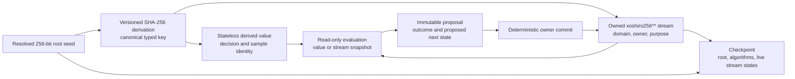

# Deterministic randomness and stream ownership

[Project index](../README.md) · [Simulation architecture](simulation-architecture.md) · [Concurrency and performance](concurrency-and-performance.md) · [Authoritative save boundary](authoritative-save-boundary.md) · [Save format and migration](save-format-and-migration.md) · [Gameplay content](gameplay-content.md) · [Project task list](task-list.md)

## Purpose and decision status

Random outcomes must remain reproducible without coupling unrelated systems,
parallel workers, or future features to one mutable sequence. The production
simulation currently performs no random draws, so the ownership contract can
be established before a subsystem depends on accidental behavior.

This document completes the design work approved by the project owner for
`TASK-021` on 2026-08-17. Completed `TASK-066` provides the shared
implementation and focused proof.

**Decision status:** Accepted by the project owner on 2026-08-17.

## Decisions at a glance

| Question | Decision |
| --- | --- |
| Is there one global stream? | No. Randomness is partitioned by stable scope, domain, owner, and purpose. |
| Are all random values stateful? | No. Use stateless derived values for independent decisions and stateful streams only for genuinely sequential stochastic processes. |
| What seeds a session? | One resolved 256-bit authoritative root seed supplied before session creation. The application may generate it when the player does not. |
| Do world generation and runtime share draws? | No. Procedural generation and runtime use separate domain-derived roots. |
| How are keys derived? | SHA-256 over a versioned canonical binary encoding with explicit domain separation. |
| What is the initial stateful generator? | Version 1 uses `xoshiro256**` with four unsigned 64-bit state words and its published integer transition. |
| When does a stateful draw count? | Only when its owning authoritative transition commits. Rejected or discarded work does not advance state. |
| May workers share a stream? | No. Parallel work uses stable derived values or immutable stream snapshots whose proposed next state commits in stable owner order. |
| What random APIs exist initially? | Raw unsigned 64-bit values, unbiased bounded unsigned integers, and rational probability tests. |
| What is saved? | The root seed, algorithm identities and versions, every live stateful stream key, complete state, and next-draw position. |
| Are random algorithms cryptographic? | No. SHA-256 provides stable derivation and namespace isolation, not secret or adversarial gameplay randomness. |
| Is save-scumming prevention a goal? | No. Reproducibility, debugging, and deterministic continuation take priority. |

## Model and authority

The application resolves a root seed before creating the authoritative session.
Random consumers never receive that seed directly. They request either a
derived value for one stable decision or a capability for one owned stateful
stream.



The resolved root seed, random policy versions, owned stream registry, stream
states, and committed attempt counters are authoritative. A hexadecimal seed
display, debug labels, or visual random effects are presentation state unless
an owning gameplay design explicitly promotes their result.

## Root seed and random scopes

Every new session receives exactly one resolved 256-bit root seed. Session
construction rejects a missing or incorrectly sized value. A caller may supply
the seed for a reproducible scenario. If it does not, the local application may
obtain 256 bits from the operating system's cryptographic random source before
session construction. That entropy source is setup tooling, not a simulation
random algorithm.

The resolved binary value, rather than the way it was typed or displayed, is
authoritative. A future player-facing text seed format must define its own
canonical conversion to 256 bits. Different spellings cannot be treated as
equivalent without that explicit contract.

The root immediately separates at least these scopes:

- **New-game generation:** used by future `TASK-047` work before validated
  scenario composition is published; and
- **Session runtime:** used by authoritative systems after session creation.

Both scopes may derive from the same resolved seed, but their domain labels are
different. Adding generation draws cannot shift runtime results, and adding
runtime draws cannot change generated composition. A generator also carries
its own algorithm and behavior version as required by `TASK-047`.

## Stable ownership and purpose

A stateful stream key contains:

1. the random scope;
2. a stable domain kind;
3. a stable owning identity;
4. a stable purpose ID; and
5. the derivation-policy version.

Examples include a faction principal's planning stream, one script instance's
declared random stream, or one combat engagement's resolution stream. A domain
may own more than one stream when adding draws for one purpose must not alter
another purpose. Purpose IDs are stable technical vocabulary and are never
localized prose.

Stream keys never contain a worker index, thread ID, partition number, batch
number, collection iteration position, CLR type name, runtime hash code, or
filesystem order. Stable numeric identities use their canonical fixed-width
encoding. Stable content identities use their qualified content key.

The owning domain creates and removes stateful streams through deterministic
owner commit. Retirement is proposed against the stream's exact current state
and commits only if that state is still current. The owning aggregate confirms
that no pending work, saved continuation, or future committed decision still
depends on the stream before committing retirement.

Owner identities are not reused to manufacture a fresh sequence after removal.
That non-reuse invariant belongs to the owning gameplay domain. The random
owner retains only live streams and does not persist retired-key tombstones.
This keeps the checkpoint bounded by live state while requiring each domain to
make its own identity lifecycle explicit.

There is no API for requesting an anonymous stream or the next stream from a
global allocator. Duplicate live stream keys are validation faults.

## Canonical derivation

Version 1 derivation uses SHA-256 with a canonical binary message. Every field
is type-tagged and length-delimited. Integers use an explicitly documented
unsigned little-endian width; text identifiers use strict UTF-8 after their
own identity grammar has validated them. Concatenated strings without lengths,
platform encodings, `GetHashCode()`, and serializer-dependent bytes are not
valid inputs.

The message begins with an invariant derivation label and version, followed by
the root seed and the complete typed key. Distinct labels separate:

- generation roots;
- runtime roots;
- stateful stream initialization; and
- stateless decision samples.

The initial algorithm identity is `gc.sha256-derive.v1`. A different encoding,
field set, hash, byte order, or label is a different algorithm version.

SHA-256 is used because its output and byte processing are stable and widely
testable. This design does not promise unpredictability against a player who
can inspect saves or seeds.

## Stateless derived values

Independent and parallel decisions should prefer a stateless derived value. Its
key extends the random scope and domain with:

- stable owner identity;
- stable decision identity;
- stable purpose ID;
- authoritative attempt identity when rerolls are meaningful; and
- a stable named sample ID.

The same complete key always returns the same bits. Retrying evaluation,
changing worker count, repartitioning a batch, or evaluating in another order
does not create a reroll. A genuine new attempt requires the owning system to
commit and persist a new attempt identity.

A raw derived `UInt64` is the first eight bytes of the SHA-256 result decoded
as an unsigned little-endian integer. When a sampling operation needs another
candidate, it re-derives with a typed unsigned sampling-retry counter appended
to the same complete key. That counter belongs to the derivation operation and
is not authoritative session state.

Named sample IDs are preferred to incidental draw ordinals. Adding a new
sample named `secondary-damage` must not change an existing sample named
`hit-check`. An ordinal is valid only when sequence position is itself part of
the approved gameplay meaning.

Derived values have no mutable stream position and therefore add no individual
checkpoint state. Their algorithm version, complete authoritative key inputs,
and root seed must still survive restoration.

## Stateful sequential streams

Use a stateful stream only when later random outcomes intentionally depend on
the exact sequence of earlier committed draws from the same owner and purpose.
Version 1 uses `xoshiro256**`, identified as `gc.xoshiro256ss.v1`.
The transition below matches the algorithm authors'
[public reference implementation](https://prng.di.unimi.it/xoshiro256starstar.c).

Its state is four unsigned 64-bit words. Arithmetic wraps modulo `2^64`. One
draw returns and transitions state as follows, where `rotl` is a 64-bit rotate
left:

```text
result = rotl(s1 * 5, 7) * 9
t = s1 << 17
s2 = s2 xor s0
s3 = s3 xor s1
s1 = s1 xor s2
s0 = s0 xor s3
s2 = s2 xor t
s3 = rotl(s3, 45)
return result
```

The four initial words come from the 256-bit canonical stream derivation in
little-endian word order. The all-zero state is invalid. If derivation ever
produces it, initialization deterministically re-derives with a versioned retry
label and increasing unsigned retry counter until the state is nonzero.

The implementation must use explicit unsigned integer operations and cannot
delegate authoritative output to `System.Random`, `Random.Shared`, a platform
library whose algorithm may change, or a package selected only by version
range.

## Integer sampling contract

The initial public capability is intentionally small:

- `NextUInt64` returns the next raw 64-bit output.
- `NextBelow(exclusiveUpperBound)` returns an unbiased value in
  `[0, exclusiveUpperBound)` and rejects an upper bound of zero.
- `TestRatio(numerator, denominator)` returns true with the exact rational
  probability `numerator / denominator`, requiring `denominator > 0` and
  `numerator <= denominator`.

Bounded sampling uses rejection sampling rather than remainder alone, so a
non-power-of-two bound has no modulo bias. For bound `b`, calculate
`threshold = (0 - b) % b` with unsigned 64-bit wrapping. Reject candidates less
than `threshold`; return the first accepted candidate modulo `b`. A stateful
stream obtains each candidate from `NextUInt64`. A stateless sample obtains
each candidate through its sampling-retry derivation. These rules and their
draw consumption are versioned capability semantics and receive golden-vector
tests.

`TestRatio` always evaluates `NextBelow(denominator) < numerator`, including
zero and certain probabilities, so its candidate consumption does not depend
on a convenience short circuit.

Random selection from a collection first requires an explicitly and stably
ordered input. Random sorting through generated keys is not permitted.

Floating-point uniform values, normal distributions, weighted selection,
shuffle algorithms, and other convenience operations are not part of the
initial contract. An owning task may add one only with exact validation,
mapping, draw-consumption, algorithm-version, and compatibility semantics.
Overall cross-platform numeric outcomes remain with `TASK-060`, while the raw
integer derivation and generator outputs are bit-exact on every supported .NET
runtime.

## Evaluation, commit, and failed work

Random evaluation follows the project-wide read, propose, and deterministic
commit boundary:

- A stateless evaluation receives only its complete immutable derivation key.
- A stateful evaluation receives an immutable stream snapshot.
- Evaluation returns the outcome and, for a stateful stream, its proposed next
  state and draw position.
- The authoritative owner validates and commits the proposal in stable order.

Rejected commands, failed validation, stale events, losing contention
proposals, retries of the same evaluation, and discarded worker results do not
advance a stream. If a gameplay attempt is itself accepted as a meaningful
transition, its owner may commit random consumption even when the sampled
outcome is unfavorable. The distinction is accepted attempt versus rejected
or discarded work, not success versus failure from the player's perspective.

Two evaluations that depend sequentially on the same stateful stream cannot
consume it concurrently. The owner either processes them in stable decision
order or replaces the use case with decision-derived values. Workers never
write stream state or allocate draw positions.

A failed prepared commit follows the aggregate health contract. It does not
publish a partial gameplay transition with an advanced or rolled-back random
stream.

## Scripts and authored content

A future script instance receives a capability scoped to its own approved
domain, instance identity, and declared purposes. It cannot read the root seed,
name another owner's stream, enumerate the stream registry, select an
algorithm, or mutate stream state directly.

Declarative content may select among registered random behaviors and provide
validated parameters only when its owning design permits them. It cannot load
an implementation, provide executable generator code, or invent an
unregistered distribution. Package-qualified identities participate in
canonical keys where authored definitions own the behavior.

Script checkpointing under `TASK-017` includes the script instance and any
owned stateful stream references. Random state itself remains in the random
owner's checkpoint section so there is one authoritative copy.

## Checkpoint and restoration

The authoritative random checkpoint includes:

- the resolved 256-bit session root seed;
- the root-scope and derivation algorithm identities and versions;
- every live stateful stream's complete canonical key;
- each stream's generator identity and version;
- all four state words;
- the next raw-output position or exhausted state; position zero is the first
  output, and drawing at `UInt64.MaxValue` changes the position to exhausted.

The draw position supports validation and diagnostics. It is not sufficient to
recreate stream state from the root seed because doing so would make
continuation depend on the current implementation's historical draw behavior.

Restore validates unique keys, registered algorithm versions, nonzero state,
draw-position bounds, owning-domain references, and cross-owner invariants
before publishing the session. The saved live-key set must exactly equal the
combined live-key declarations supplied by owning domains. An unexpected saved
stream or a declaration without saved state rejects restoration. A session
with no current stateful consumer therefore accepts only an empty live-stream
registry.

Restore applies stream state directly and never replays draws. An unavailable
algorithm version rejects the save unless an explicit migration proves exact
future-output compatibility. A loader cannot silently substitute the newest
registered algorithm.

Stateless samples do not create saved stream entries. Their required owner,
decision, purpose, sample, and attempt identities already belong to the domain
state whose future behavior uses them. The random owner validates those inputs
but does not save a second copy of domain-owned attempt counters.

## Compatibility and observability

Random algorithm and derivation versions are deterministic runtime policies.
Changing an algorithm, canonical key encoding, state transition, mapping,
rejection rule, or draw-consumption rule is a compatibility change even if its
statistical quality improves.

Facts and player-facing explanations record the meaningful sampled outcome and
its typed cause when the owning domain requires it. They do not expose root
seeds, raw generator state, or every internal draw by default. Development
diagnostics may report stable stream keys, versions, and draw positions without
making diagnostic text authoritative.

Random values are not identifiers. Entity, command, event, fact, conversation,
and other identities continue to use their deterministic allocators rather
than random GUIDs.

## Non-goals

This design does not provide:

- cryptographic secrecy or resistance to save inspection;
- save-scumming prevention;
- multiplayer fairness, commit-reveal, or remote authority;
- a general-purpose probability language;
- arbitrary executable random content;
- automatic stability when a system changes the meaning or identity of one of
  its own samples; or
- a cross-version promise that changed gameplay algorithms produce the same
  outcomes.

## Task boundaries

- Completed `TASK-021` owns this random identity, derivation, stream,
  consumption, persistence, and concurrency design.
- Completed `TASK-066` provides the shared implementation, checkpoint
  integration, and focused deterministic proof.
- `TASK-017` owns script behavior and declares the purposes exposed to each
  script instance.
- `TASK-047` owns procedural generation inputs, generator behavior, and
  versioning while using the generation scope defined here.
- `TASK-060` owns the wider compatibility guarantee across platforms and game
  versions. It consumes the bit-exact integer foundation defined here.
- Each gameplay domain owns the semantic decision identities, purpose IDs,
  attempt lifecycle, and random outcomes it introduces.

## Implementation evidence completed by TASK-066

Focused tests prove:

1. SHA-256 canonical-encoding and `xoshiro256**` golden vectors;
2. root, scope, domain, owner, purpose, decision, attempt, and sample isolation;
3. unbiased bounded-integer and exact rational-probability boundary behavior;
4. rejected, stale, retried, and discarded work consumes no state;
5. accepted sequential work advances state exactly once in stable order;
6. adding an unrelated stream or named derived sample leaves existing outputs
   unchanged;
7. checkpoint restore continues every stream at the exact next output without
   replay;
8. invalid, duplicate, all-zero, exhausted, or unsupported-version checkpoint
   state is rejected clearly;
9. identical authoritative results across worker counts, batch sizes, valid
   partition layouts, and repeated runs; and
10. no production authoritative path uses `System.Random`, runtime hash codes,
    random GUIDs, wall-clock entropy, or unordered iteration.
