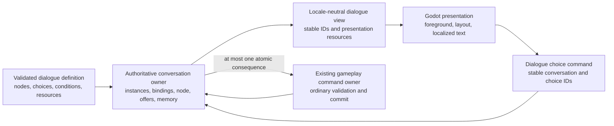

# Dialogue state and presentation

[Project index](../README.md) · [Time and pacing](time-and-pacing.md) · [Gameplay content](gameplay-content.md) · [Gameplay integration](gameplay-integration.md) · [Individual NPC scope](individual-npc-scope.md) · [Semantic game facts](semantic-game-facts.md) · [Internationalization and localization](internationalization-and-localization.md) · [Authoritative save boundary](authoritative-save-boundary.md) · [Project task list](task-list.md)

## Purpose and decision status

Dialogue needs to remain coherent while the galaxy continues to run, survive
save and load, submit ordinary gameplay intent, and present localized authored
text without making Godot or rendered prose authoritative.

This document completes the design work approved by the project owner for
`TASK-016` on 2026-08-17. `TASK-065` owns implementation.

**Decision status:** Accepted by the project owner on 2026-08-17.

## Decisions at a glance

| Question | Decision |
| --- | --- |
| What owns dialogue state? | The authoritative game session owns live conversation identity, participant bindings, current node, offered choices, memory, consequences, and lifecycle. |
| What does Godot own? | Foreground selection, layout, focus, scrolling, animation, resolved localized text, and other disposable interaction state. |
| Who may be a respondent? | A ship, station, or principal through an explicit typed participant reference. |
| Can dialogue appear to come from a named person? | Yes. A segment may carry optional authored speaker-attribution text, but that text does not create a simulated person. |
| How is dialogue authored? | As immutable definitions with stable node, choice, participant-role, memory, condition, transition, and presentation identities. |
| How many conversations may exist? | Multiple conversations may be active or suspended, but Godot presents at most one in the foreground. |
| What happens when many conversations arrive? | Only one may automatically take the foreground when it is empty. Later conversations remain in deterministic pending order until the player opens them. |
| What is response-required dialogue? | A node whose authoritative progress requires a player dialogue command. The classification follows behavior rather than an unconstrained presentation flag. |
| When are conditions checked? | Start and offer conditions are evaluated when their state is entered. A selected choice is revalidated against current authoritative state at command admission. |
| What state may conditions inspect? | Any authoritative data exposed through an approved deterministic condition vocabulary. Initial dialogue is not limited to player-known data. |
| How do effects enter gameplay? | A choice is submitted as a normal command. At most one downstream normal gameplay command is coordinated atomically with the dialogue transition in the initial implementation. |
| How is repeatability represented? | Explicit repeatable, once-per-session, and once-per-participant-binding policies backed by stable structural receipts. |
| Are timed responses included initially? | No. Suspended conversations remain unresolved until acted on or invalidated. Any future timeout uses simulation time. |
| What is saved? | Every active or suspended instance, participant binding, node, offered choice, memory receipt, selected consequence, pending atomic consequence, and dialogue allocator state. |

## Authority model

An immutable dialogue definition describes possible conversation behavior. A
live conversation instance binds that definition to authoritative participants
and records what has actually happened. Godot reads a locale-neutral view and
submits stable identities when the player acts.

The definition, conversation instance, and gameplay state are authoritative.
The rendered sentence, displayed speaker label, foreground window, focus,
scroll position, and animation are not.

## Authored definitions and stable identity

A dialogue definition is immutable resolved content identified by the
qualified content key established in [Gameplay content](gameplay-content.md).
It contains:

- stable participant-role IDs and the participant kinds each role accepts;
- stable node and choice IDs local to the definition;
- start, offer, and choice-admission conditions;
- node transitions and terminal outcomes;
- repeatability and structural memory declarations;
- optional ordinary gameplay-command consequences;
- player-facing presentation resource contracts; and
- validation metadata required to reject incomplete or inconsistent graphs.

Node and choice IDs are technical identities. Display order is explicit and
must not be inferred from JSON property order, file order, localized text, or
condition evaluation completion order. References are completely resolved
before a definition enters the immutable catalog. Content packages remain
declarative and cannot introduce executable scripts or assemblies.

The physical JSON representation remains an adapter concern. It must not leak
into the simulation model or make JSON nodes live authority.

## Starting conversations

The player may request an available conversation through an explicit
interaction submitted as a normal gameplay command. Trusted session command
sources may also request a conversation through the same admission boundary.
Admission validates the definition, participant bindings, repeatability, and
current start conditions before allocating or publishing an instance.

Initial dialogue does not subscribe directly to facts, time, locations, or
threshold changes and does not contain a partial trigger runtime. Deterministic
fact-, time-, location-, and threshold-triggered initiation belongs to
`TASK-017`. That later system may request a conversation through the accepted
command boundary rather than creating dialogue state directly.

## Participants and apparent speakers

A live participant binding is a discriminated stable reference to one of these
kinds:

- **Ship:** an authoritative ship identity;
- **Station:** an authoritative station identity; or
- **Principal:** an authoritative player, organization, or other principal
  identity.

Station is a distinct participant kind. Dialogue must not infer station
identity from a production `FacilityId`. The station identity and lifecycle
contract owned by `TASK-057` supplies the eventual authoritative reference.
Dialogue definitions and runtime validation reject participant
bindings that their owning domain cannot resolve.

The optional apparent speaker is separate from the respondent. A dialogue
segment may provide a localized speaker-attribution resource and invariant
fallback such as a specific person's name or title. This allows a station,
ship, or principal conversation to appear to be voiced by a named person even
though people are not simulated.

Speaker-attribution text:

- does not allocate a person ID or create a participant;
- cannot be targeted by conditions, commands, relationships, or memory scope;
- is not saved as person state or used for deterministic decisions;
- may vary between segments without implying a persistent character; and
- does not weaken the person-level boundary reserved for `TASK-062`.

## Availability and conditions

Start conditions decide whether a new conversation may begin. Node-entry
evaluation records the stable set and authored order of choices offered for
that node. An offered choice does not silently appear later merely because an
unrelated condition changes.

Before accepting a selection, the dialogue owner re-evaluates that choice's
admission conditions against current authoritative state. A failed
revalidation rejects the command with a stable reason, leaves the conversation
at the same node, and refreshes the locale-neutral view. This is necessary
because the player may leave the simulation running while dialogue is open.

The initial condition boundary is intentionally not limited to data the player
currently knows. A designer may use any authoritative state exposed through a
registered deterministic condition kind. Conditions may therefore consult
dialogue memory, participant lifecycle, relationships, inventories, orders,
locations, or later domain state when the corresponding owner provides a safe
read contract.

This access does not permit arbitrary executable content, mutable callbacks,
reflection over the session, direct owner mutation, or presentation text as an
input. Each condition kind has stable typed inputs, explicit validation, and a
deterministic evaluator. Completed `TASK-020` preserves this authoritative
default and permits narrow currently-detected, previously-discovered, and
observation-age predicates when authored availability should respect
fog-of-war. It does not silently reinterpret existing content or introduce a
general knowledge-condition language.

## Conversation lifecycle and continuity

A conversation receives a deterministic session-local ID when its owner
commits creation. The same ID continues across every node and screen until the
conversation reaches an authored terminal outcome or ends for a stable system
reason.

A live conversation may be active or suspended:

- **Active** means its current node is available for presentation and response.
- **Suspended** means presentation has been closed without choosing a response
  or ending the authoritative conversation.

Closing Godot presentation submits no implicit choice and applies no
consequence. Reopening resumes the same instance, node, offered-choice set, and
memory. Multiple screens in the same instance retain one continuous
conversation identity and do not close and reopen pacing between nodes.

If a required participant can no longer be resolved, the conversation ends at
a deterministic boundary with a stable participant-unavailable reason. The
owner emits the corresponding semantic fact and the application releases any
automatic pause still owned by that foreground presentation. No conversation
retains a dangling participant reference.

## Foreground presentation and pending conversations

Multiple authoritative conversations may coexist, but Godot presents at most
one foreground conversation. When no conversation is foregrounded, the first
newly available instance may open automatically. Other instances remain
visible through a pending-conversation surface in deterministic creation
order.

Closing or completing the foreground conversation does not automatically open
every pending conversation in succession. The player chooses when to open the
next one. This prevents one simulation decision or timestamp from producing a
rush of modal interruptions.

Foreground selection is local presentation state. Authoritative creation
order, conversation status, and unresolved response state remain available in
the locale-neutral read model so Godot never orders pending conversations by
arrival timing, translated labels, or control-tree order.

## Response-required classification and pacing

Response-required classification follows authoritative node behavior. A node
is response-required when progress or resolution requires the player to submit
a dialogue command. A continue or acknowledgement action is a response when
the conversation cannot progress without it. Ambient speech, notifications,
and informational content that complete without player input are not
response-required.

Only foreground presentation of response-required dialogue participates in
the automatic-pause preference from [Time and pacing](time-and-pacing.md).
Creating a pending conversation does not acquire a hidden pause. When the
player later opens it, the application evaluates the preference at that
presentation boundary.

The application owns the pause token and remembered speed. Dialogue does not
mutate pacing state, receive a pacing command sequence, interrupt a timestamp
cycle, or prevent manual speed overrides. Moving between nodes in one
continuous foreground conversation retains the same automatic pause.

## Choice commands and atomic consequences

Selecting a choice submits a normal dialogue gameplay command containing the
stable conversation ID and choice ID. Admission validates the conversation,
current node, offered-choice membership, source eligibility, repeatability,
and current choice conditions before mutation.

A gameplay-affecting choice uses the existing ordinary command vocabulary and
the owning domain's validation rather than mutating that domain directly. The
initial implementation permits at most one downstream gameplay command for a
choice. The session coordinates its validation and commit with the dialogue
transition so they succeed or fail together:

- accepted consequence and dialogue transition commit under one admitted
  command sequence;
- rejected consequence leaves the conversation at the same node and records
  no selection memory;
- no reentrant submission allocates another command sequence inside command
  handling; and
- the owning gameplay domain retains its normal typed rejection and fact
  behavior.

This is not a general multi-command transaction or scripting facility.
Choices requiring multiple gameplay commands remain invalid until a separate
atomic command-bundle contract is approved.

Dialogue-only consequences may transition nodes, complete the conversation,
or commit declared structural memory. They do not bypass command admission.

## Repeatability and memory

The initial repeatability policies are:

- **Repeatable:** the definition or choice may be used again whenever its
  conditions allow;
- **Once per session:** one committed receipt prevents another use in that
  session; and
- **Once per participant binding:** one committed receipt prevents reuse for
  the same normalized role-to-participant binding.

Memory uses stable definition-owned identities and structural receipts for
committed choices, completed conversations, and declared terminal outcomes.
It is not an arbitrary string-to-object variable bag. Rejected commands create
no memory. Participant-binding normalization follows stable role order rather
than dictionary or caller order.

Counters, cooldowns, arbitrary local values, and authored mutation of unrelated
memory are outside the initial model. They require a concrete scenario and an
explicit extension of the save, validation, and deterministic evaluation
contracts.

## Timeouts and wake behavior

Initial dialogue has no timed response, wall-clock expiration, or implicit
wake scheduler. A suspended conversation remains unresolved until the player
acts, its definition reaches a terminal outcome, or a participant becomes
unavailable.

Any future timeout or scheduled wake belongs to authoritative simulation time
and the event agenda. Its design must address automatic pause, save and load,
stale events, and deterministic simultaneous ordering before content may use
it. Wall-clock duration never selects a choice or changes dialogue state.

## Semantic facts and presentation views

The dialogue owner emits typed locale-neutral facts for meaningful committed
changes:

- conversation started;
- choice committed;
- conversation suspended;
- conversation resumed; and
- conversation ended, including a stable terminal reason.

A committed choice fact carries the conversation, definition, choice,
participant binding, and resulting node or terminal outcome needed by later
objectives and scripts. It does not contain rendered prose. Rejected selections
use the existing command-rejected fact and add no false dialogue transition.

Dialogue fact proposals follow the stable cause and merge-key rules in
[Semantic game facts](semantic-game-facts.md). Workers never allocate fact or
conversation sequences.

The locale-neutral presentation view exposes:

- conversation and definition identity;
- normalized participant bindings and their current resolvability;
- current node and authored segment order;
- the recorded offered choices and their current admission availability;
- response-required and active or suspended state;
- presentation resource keys, invariant fallbacks, typed arguments, and markup
  contracts; and
- stable terminal or rejection codes needed for explanation.

It does not expose mutable owners, condition evaluators, resolved translated
strings, or Godot control state.

## Localization and apparent-person text

Every player-facing authored field identifies itself explicitly. Dialogue does
not discover localizable text through naming conventions. Lines, choice labels,
speaker attribution, and any authored status text each carry:

- a stable presentation resource key;
- a required invariant fallback;
- a fixed set of named typed arguments;
- an optional non-negative plural selector when applicable; and
- an explicit plain-text or restricted-rich-text contract.

The named-person effect is implemented through the same speaker-attribution
resource contract. It remains presentation text even when the fallback looks
like a proper name. Localization may translate or transliterate it without
changing conversation identity, saves, conditions, ordering, or outcomes.

Choice commands always return the stable choice ID selected by the player.
Rendered labels are never parsed back into simulation input.

## Checkpoint and restoration contract

The authoritative checkpoint includes:

- the next conversation ID or exhausted state;
- every active or suspended conversation ID and definition reference;
- normalized participant bindings;
- current node and recorded offered-choice order;
- active or suspended status;
- committed repeatability and memory receipts;
- selected consequences and any prepared atomic consequence state needed to
  recover without partial replay; and
- any terminal information that remains necessary to enforce memory or
  idempotency.

Restore validates definition compatibility and participant references before
publishing the aggregate. It restores owners directly and does not replay
conversation starts, choices, facts, or gameplay consequences.

Foreground selection and pacing are local application state rather than
authoritative checkpoint state. After load, if Godot foregrounds an unresolved
response-required conversation, that presentation opening is eligible for the
current local automatic-pause preference. Doing so does not mutate the restored
dialogue instance or emit another conversation-started fact.

## Determinism, batching, and failure

Condition evaluation reads immutable inputs and produces immutable results.
Conversation creation, participant invalidation, and any later batched
reevaluation use stable definition, participant, node, choice, and conversation
identities for ordering. Worker count, partition layout, work stealing, and
completion order cannot change which conversations or choices commit.

Owner commit assigns conversation IDs, applies transitions, records memory,
coordinates the optional gameplay consequence, and proposes facts. Failed
prepared commit poisons the session under the existing aggregate-health
contract rather than leaving a partially advanced conversation.

The first implementation retains a single-thread reference path. Concurrent
evaluation requires focused agreement tests before it is enabled.

## Task boundaries

- `TASK-016` owns this dialogue-state and presentation design.
- `TASK-065` owns dialogue implementation, content models and validation,
  authoritative runtime state, commands, facts, checkpoints, and the Godot
  dialogue surface.
- `TASK-038` implements the already accepted automatic-pause mechanics and
  integrates the response-required signal. It does not own dialogue state.
- `TASK-064` owns broader event-responsive pacing beyond the accepted
  response-required behavior.
- Completed `TASK-020` defines narrow fog-of-war predicates for authored
  dialogue conditions and disclosures without changing existing authoritative
  evaluation.
- `TASK-017` owns fact-, time-, threshold-, and location-triggered scripted
  initiation and long-running scripted behavior.
- `TASK-045` and completed `TASK-049` define the shared localization service
  and reusable application presentation behavior. `TASK-077` implements the
  application surfaces.
- `TASK-057` owns authoritative station identity and lifecycle. Dialogue does
  not create a competing station model.
- `TASK-062` owns any future simulated person, captain, crew member, or
  persistent character identity.

Complex narrative campaigns, arbitrary executable dialogue scripts, arbitrary
memory variables, timed choices, multi-command consequence bundles, and
person-level simulation remain outside the initial dialogue implementation.

## Implementation evidence required by TASK-065

Implementation is not complete until focused tests prove:

1. stable content validation and graph/reference rejection;
2. ship, station, and principal participant validation without conflating
   stations with facilities or speaker text with people;
3. start, offer, selection-revalidation, suspension, resumption, completion,
   and participant-loss behavior;
4. deterministic pending order and one-foreground presentation behavior;
5. automatic pause only for foreground response-required dialogue, including
   manual override and continuous multi-node conversations;
6. atomic choice and single gameplay-command consequence success or rejection;
7. repeatability and participant-binding memory across checkpoint restore;
8. locale switching, invariant fallback, named-speaker presentation,
   pseudolocalization, and right-to-left layout without authoritative changes;
9. snapshot, fact, save, and canonical-digest agreement across worker counts
   and valid batch layouts; and
10. unchanged existing simulation digests and a working single-thread reference
    path.
