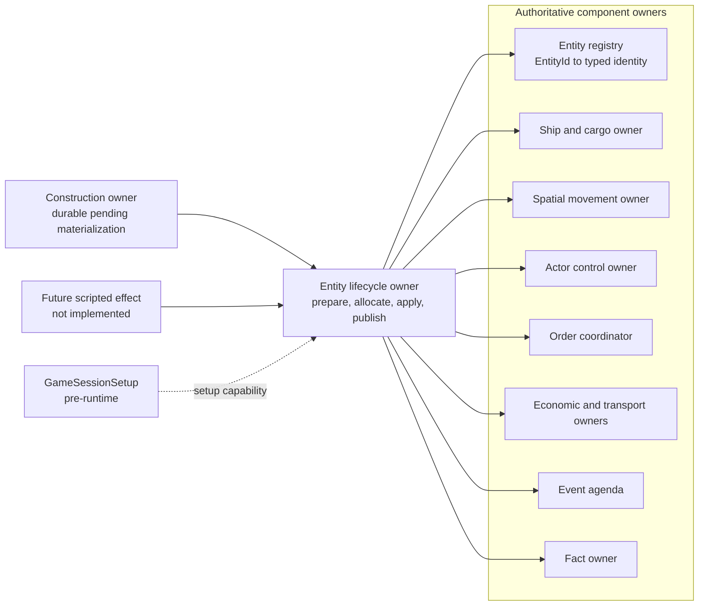
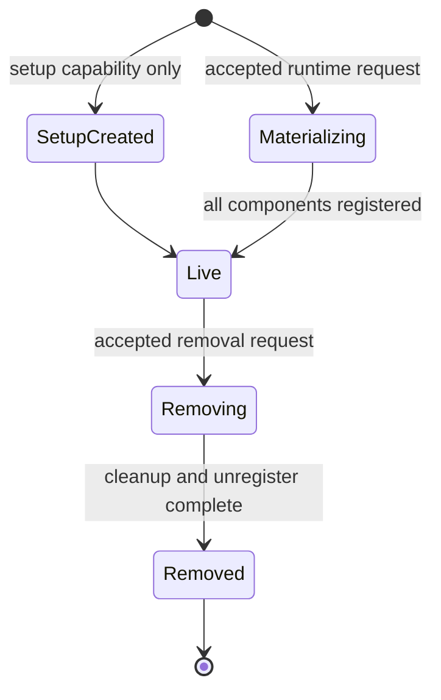

# Entity lifecycle and explicit spawning

[Project index](../README.md) · [Gameplay integration](gameplay-integration.md) · [Runtime orchestration](runtime-orchestration.md) · [Actor control and order lifecycle](actor-control-and-orders.md) · [Navigation and spatial architecture](navigation-architecture.md) · [Semantic game facts](semantic-game-facts.md) · [Project task list](task-list.md)

## Purpose

A constructed ship needs more than a `ShipRegistry` entry. It needs a stable
identity, principal, design, cargo inventory, spatial state, controller,
orders, and a presentation lifetime. Removal requires the inverse operation
across those owners, including scheduled and economic work.

`TASK-011` proposes one narrow lifecycle owner that commits those cross-owner
changes at a deterministic boundary. It distinguishes setup-time creation,
causal construction materialization, and eventual scripted spawning. It does
not expose a mutable world or promote fixture helpers into a public spawn API.

Ships are the only runtime-materializable entity in this task. Other kinds use
the same boundary only after their design and component requirements exist.

**Decision status:** Accepted by the project owner on 2026-08-04.

**Implementation status:** Completed by `TASK-011` on 2026-08-05. The clean
`GameSession` now has
session-wide entity identity, prepared setup registration, explicit setup ID
high-water marks, and complete ship identity in snapshots. Construction now
retains a durable pending materialization until idempotent acknowledgement.
Facility policies drive deterministic runtime ship materialization, including
stable facility-order batching, complete component publication, committed
identity receipts, and rejection atomicity. `PhaseOneShipMaterializer` remains
acceptance-only. Clean-session removal now invalidates active, queued, and
suspended entity-target orders, cancels affected local motion, removes every
live ship owner with entity publication removed last, rejects reserved cargo,
records `EntityRemovedFact`, and leaves scheduled activity as deterministic
missing-reference work. Construction commits now record one idempotent
`EntityMaterializedFact` in stable batch order, preserving the originating
scheduled-event key when present. Integration with future clean-session
economic and transport owners is tracked separately in `TASK-034`.

## Starting point

- `ConstructionSystem` retains a typed `ConstructionMaterializationEffect`
  after physical completion and waits for idempotent acknowledgement; it does
  not create a ship or its components.
- `PhaseOneShipMaterializer` creates a legacy ship at `LocationId`. It remains
  under `Acceptance/` until `TASK-031` has an approved spatial migration.
- `GameSessionSetup` creates initial ships before runtime. It is setup input,
  not a runtime spawn command.
- The actor runtime can clean up movement, orders, and control together, but
  does not own ship records, cargo, transport commitments, or lifecycle facts.
- Presentation resolves an omitted selected ship as locally unresolved and does
  not infer why it disappeared.

## Decision summary

| Question | Proposed decision |
| --- | --- |
| Entity identity | Add a session-wide, never-reused `EntityId` mapped to typed identities such as `ShipId`; do not replace existing typed IDs. |
| First runtime entity | A ship with its record, cargo inventory, stationary spatial actor, base controller, and empty orders. |
| ID allocation | Lifecycle commit allocates IDs only after a complete prepared-commit validation. Setup advances each runtime allocator beyond its explicit high-water mark without treating setup IDs as runtime allocations. |
| Construction source | Construction retains a durable pending materialization keyed by facility and order. Lifecycle joins it to an authoritative facility materialization policy and acknowledges it only after atomic entity commit. |
| Setup and scripts | Setup uses common internal registration with explicit IDs. Future scripts may propose a typed effect, but this task adds no script-spawn command. |
| Initial state | Required principal, design, `SystemPosition`, cargo capacity, non-script base controller, and explicitly no initial order. |
| Removal | Detach economic work, invalidate scheduled activity, then remove cargo, actor, spatial, control, order, and entity registrations deterministically. |
| Initial cargo policy | Removal names a disposition. The first supported policy discards cargo only after reservations and transport commitments are released. |
| Client visibility | Snapshots contain fully live entities or none. Typed lifecycle facts record successful materialization and removal. |

## Ownership model

The lifecycle owner is a commit owner, not a second mutable world aggregate or
an ECS. Component owners retain their own state and expose prepare and apply
operations to lifecycle. Prepare is read-only and validates every owner against
one stable commit view. Apply accepts only a prepared operation and performs no
domain validation that can reject after another owner has mutated.

Lifecycle does not begin mutation until every owner has prepared successfully
and every required identifier sequence has proven sufficient capacity. It then
allocates IDs, applies the prepared owner operations, and publishes the live
entity mapping last. Removal uses the same protocol and removes that mapping
last. The single-thread reference runtime does not interleave commands, events,
reconciliation, or snapshots with this apply interval.

An unexpected exception during apply poisons the session and it cannot continue
or be saved as a valid session. Expected duplicate, missing-reference, capacity,
and stale-request outcomes must be found during prepare and returned as typed
results, not thrown after partial mutation. Focused fault-injection tests must
prove that every expected rejection leaves all owners and ID sequences
unchanged.

## Identity and lifetime

`EntityId` provides a stable session-wide reference independent of concrete
type. Typed IDs remain authoritative for their subsystems. The live registry
records one active mapping, for example `EntityId` to `ShipId`, and rejects a
typed ID already mapped to another live entity.

All entity, typed-entity, and component ID sequences are monotonic and never
reuse a value. The lifecycle owner allocates only in deterministic request order
after the full batch and all owner preparations succeed. Removed entities retain
no mutable tombstone. Semantic facts and later save rules provide history.

`Materializing` and `Removing` are commit-local. Snapshots expose an entity only
when it is fully live.

## Spawn validation and registration

`GameSessionSetup` remains the only initial clean-session creation mechanism.
It follows the lifecycle registration path, supplies explicit `EntityId`,
`ShipId`, and cargo `InventoryId` values, and cannot add an initial order or
scheduled work. Setup validates uniqueness within each ID domain and validates
the one-to-one entity-to-typed-identity mapping before registration.

After all setup entities register, setup advances each allocator to the first
value greater than the greatest explicit value in that domain. This establishes
the runtime high-water mark without allocating an ID or leaving gaps for each
setup record. Empty domains begin at one. Overflow is rejected during setup, not
at the first runtime spawn. Save loading will eventually use the same explicit
registration and high-water-mark rule under `TASK-014`.

### Construction materialization handoff

Each construction facility has an immutable, authoritative
`ShipMaterializationPolicy` configured and validated with the facility. It names:

- The owning `PrincipalId`
- The facility-backed stationary `SystemPosition`
- The non-script base `ActorController`
- The ship designs the facility may materialize
- Explicit `NoInitialOrder`

The policy, rather than construction or the lifecycle coordinator, owns those
initial gameplay choices. Lifecycle resolves the effect's facility against that
policy and resolves its design through the construction design catalog. A
missing or contradictory policy is a setup or configuration error and prevents
the construction order from starting.

Physical completion moves a construction order from `Running` to
`AwaitingMaterialization`. The construction owner stores a durable pending
record containing the facility, order, design, completion time, generation, and
original scheduled-event key. It may promote the next queued construction order,
but it does not mark the completed product `Completed` or forget the pending
record.

At each lifecycle barrier, the construction owner proposes every pending record
in stable facility and order order. The `(FacilityId, ConstructionOrderId)` pair
is the idempotency key. A lifecycle result is one of:

- `Materialized`, carrying the committed `EntityId`, `ShipId`, and cargo
  `InventoryId`
- `Deferred`, carrying a typed, retryable conflict while leaving the pending
  record unchanged
- Fatal configuration failure detected before lifecycle mutation

After `Materialized`, construction acknowledges that exact pending generation,
records the committed identities, transitions the order to `Completed`, and
removes the pending record. Repeated proposals or acknowledgements resolve to
the same identities and never create a second ship. The original completion
event remains the immediate cause of the materialization fact even when commit
occurs at a later lifecycle barrier.

A pending construction record proves only that physical construction work
completed. Its lifecycle request must additionally supply and validate:

- The facility and completed order for one-time linkage
- The `ShipDesign` and derived cargo capacity
- The facility's materialization policy and allowed design
- The policy's owning `PrincipalId`, stationary `SystemPosition`, valid
  non-script base `ActorController`, and `NoInitialOrder`
- The exact pending construction generation and idempotency key

After every owner prepares successfully, lifecycle commit allocates `EntityId`,
`ShipId`, and cargo `InventoryId`, then applies, in order:

1. The ship record and empty cargo inventory
2. Spatial state at the policy position
3. Base control with no override
4. Empty active, queued, and suspended orders
5. The entity-to-ship mapping that publishes the entity as live

The construction owner records the constructed ship only after this succeeds.
The existing Phase 1 `LocationId` materializer remains untouched because its
mapping to `SystemPosition` is not yet approved.

A ship starts at position, not moving, in transit, attached, or carrying a
copied legacy location. A source that wants it to act submits an ordinary,
eligible command after it is live. This preserves command validation and fact
ordering without a hidden spawn-time order shortcut.

## Removal and invalidation

Removal has a typed reason and cargo disposition. Destruction and despawn share
mechanical cleanup but have distinct gameplay reasons. This task defines the
mechanics, not the combat, capture, or narrative policy that chooses a reason.

The deterministic removal sequence is:

1. Validate that the entity is live and the source may request its reason and
   cargo disposition.
2. Resolve all inbound references through owner-provided indexes or stable
   scans. The prepared removal plan captures their expected generations.
3. Cancel economic or transport work referencing the ship or cargo inventory,
   releasing material and capacity reservations before cargo removal.
4. Fail active, queued, or suspended orders on other actors whose stable
   destination is the removed entity, using `TargetRemoved`. Cancel an affected
   actor's current physical plan and allow its order owner to promote ordinary
   queued work using the existing order rules.
5. Invalidate local-motion and connector-transit generations. Later events
   observing the absent actor are deterministic missing-reference no-ops.
6. Remove the departing actor's orders and temporary control without promoting
   queued work or restoring suspended work.
7. Apply cargo disposition. Initial `DiscardCargo` removes unreserved cargo
   with its inventory only after commitments are released.
8. Remove ship, cargo, spatial, control, and order entries, remove the live
   entity mapping last, then emit the lifecycle fact.

Inbound order invalidation is ordered by affected `ShipId` and `ShipOrderId`.
Its order and physical-work facts precede `EntityRemovedFact`, so consumers never
observe an unexplained target disappearance. The first entity-destination
implementation must add this reverse-reference behavior and its active, queued,
and suspended tests rather than leaving cleanup to a later navigation task.

The lifecycle owner sends typed proposals to each owner and applies owner groups
in this order, with stable IDs inside a group. It never relies on locks or
concurrent completion order.

The current clean `GameSession` does not host the legacy economic and transport
runtime, so clean-session ships cannot yet acquire transport jobs or external
inventory commitments. Removal nevertheless rejects a cargo inventory that has
material or capacity reservations. When those owners join the clean session,
their prepare and release operations must be inserted before cargo removal;
`TASK-034` owns that integration without reopening the completed clean-session
lifecycle foundation.

## Facts, snapshots, and commands

Successful transitions propose lifecycle facts after component commit:

- `EntityMaterializedFact`: `EntityId`, kind, typed identity, source kind,
  principal, design, and initial system position.
- `EntityRemovedFact`: former `EntityId`, kind, typed identity, removal reason,
  and cargo disposition.

The construction-completion event, or a future accepted source command or event,
is the immediate cause. The fact owner assigns its sequence after deterministic
lifecycle commit. Economy-specific construction facts remain `TASK-032`.
Direct construction completion without a scheduled event uses the stable
facility, order, and generation tuple as its materialization fact cause.

Before materialization, no typed ID is visible for commands. After removal,
commands reject as missing actors. Snapshots omit the entity, and presentation
clears local selection only through normal snapshot resolution.

## Determinism, implementation, and deferrals

Future evaluation may validate immutable request batches. Lifecycle normalizes
and deduplicates requests, orders materialization by source category, source
identity, and entity kind, and orders removals by kind and `EntityId`. It then
builds the complete prepared commit against one stable view, rejects the whole
conflicting request rather than a subset of its components, proves allocator
capacity, allocates IDs for surviving materializations, applies prepared owner
operations, and merges facts deterministically. The first implementation remains
single-threaded and must prove rejection atomicity and batch-layout invariance
before concurrency.

Implementation sequence:

1. Add `EntityId`, entity kind, lifecycle request/result records, and a narrow
   live registry without replacing `ShipId`.
2. Add prepared owner operations and atomic rejection tests before routing any
   runtime materialization through lifecycle.
3. Route setup through common registration, preserve explicit setup IDs, and
   advance every allocator to its validated high-water mark.
4. Add facility materialization policies and the durable construction
   `AwaitingMaterialization` handoff with idempotent acknowledgement.
5. Add stationary production ship materialization with no initial order.
6. Extend actor cleanup, inbound order invalidation, transport cleanup, and
   inventory ownership for complete removal and stale scheduled-event proof.
7. Add lifecycle facts and presentation-resolution tests after owner commit.
8. Keep the Phase 1 materializer under `Acceptance/` and preserve all accepted
   fingerprints and benchmark digests.

This task does not decide combat, capture, salvage, wrecks, jettison, cargo
transfer, ownership transfer, faction behavior, generic components, ECS,
docking, connector availability, scripts, developer cheats, group orders, save
serialization, replay, or Phase 1 legacy-location migration. Those decisions
remain with `TASK-012`, `TASK-014`, `TASK-017`, `TASK-019`, `TASK-027`,
`TASK-030`, `TASK-031`, `TASK-032`, and `TASK-033` as applicable.
