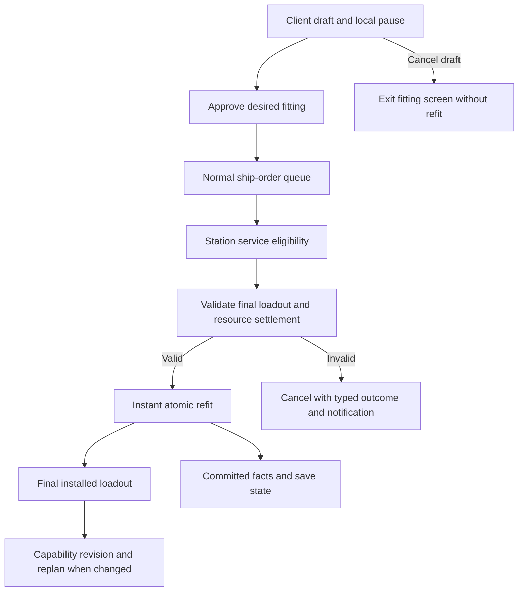

# Equipment and ship slots

[Project index](../README.md) · [Inventory and cargo](inventory-and-cargo.md) ·
[Gameplay content](gameplay-content.md) · [Ship maneuver
kinematics](ship-maneuver-kinematics.md) · [Ship and fleet
balance](ship-and-fleet-balance.md) · [Project task list](task-list.md)

## Purpose and decision status

Equipment makes a ship's physical loadout explain its capabilities. Players
should be able to experiment with roles and builds without losing large amounts
of money or materials each time they refit. Size classes, equipment tiers, and
optional stat modifications provide meaningful choices while keeping fitting
understandable for a player who operates one ship throughout the game.

**Design owner:** `TASK-068`.

**Decision status:** Accepted. The owner approved all remaining recommendations
on 2026-10-06. There are no unresolved in-scope owner decisions in this design.
Station service details, fitting-screen UI, repair execution, and ship-loss
handling retain the downstream owners listed below.

**Implementation status:** `TASK-068` completed this design. `TASK-099` owns
equipment and refit implementation. No implementation is started by this approval.

| Accepted on | Decision record |
| --- | --- |
| 2026-10-06 | Q26, Q30, Q31, and Q32: facts, saved authority, deterministic ownership and contention, and atomic publication. |
| 2026-10-06 | Mandatory-group validation, definition-selected damage behavior, cancellation of later orders after capability failure, and restoration of prior pause/speed state. |
| 2026-10-06 | Q02 and Q15: discrete equipment identity and reservation-free refit admission with atomic execution-time validation. |
| 2026-10-06 | Stable slots and removal policy, exact damage evaluation and fact cadence, bounded modification profiles and typed keys, control-override invalidation, and equipment disclosure. |

The design body states the behavioral contract. The question-and-answer register
retains all 32 review IDs and records the answers behind that contract.

## Scope and terminology

A **hull definition** declares a ship's equipment groups and fixed slot counts.
An **equipment definition** describes a reusable module and its validated
requirements and contributions. An **installed instance** is the live module
whose identity, condition, modifications, and occupancy belong to a ship. A
**loadout** is the complete installed configuration. A **fitting draft** is
client-side experimentation; a **refit order** is accepted authoritative intent
to execute a desired loadout at a station.

Approving a draft submits future intent. It does not mean that equipment has
already changed. **Refit commit** means the later instantaneous, atomic change
to installed state and its component/Credit settlement.

This design covers ship fitting, installed capability contributions, condition
boundaries, domain ownership, facts, observation, checkpoint continuity, and
deterministic execution. Combat outcomes, repair execution, station composition,
docking, prices, content migration, and ship-loss disposition remain with their
named owners. Continued one-ship play and the strictly single-player direction
remain requirements.

## Player experience and balance direction

The station construction and reclamation direction is retained in `TASK-097`:
modules are built directly onto ships and reclaimed into components on removal.
This supports experimentation and reversal within a fitting session when parts
are available, without an overwhelming market of individual finished equipment
items.

Equipment may have straight-upgrade tiers within the same size class and
restrictions to particular hulls, classes, or types. Players can change roles,
including between combat and mining. The [ship and fleet balance
direction](ship-and-fleet-balance.md) guides meaningful specialization without
removing these upgrades or selecting a final ship taxonomy.

Granular modifications support individual playstyles. Minor benefits using
resources alone and larger benefits with category-defined penalties are the
owner's intended direction. The accepted initial balance policy uses a 15%
resource-only benefit limit and a 30% maximum, with category-defined penalties
above 15%. CPU, power, capacitor, and similar simultaneous fitting budgets must
not create EVE-level complexity. Heat remains an example of a possible stat
tradeoff, not an accepted shared-resource simulation.

## Inherited architectural contracts

Equipment composes with the following accepted foundations. Changes to these
contracts require explicit review of the affected design.

| Existing contract | Implication for equipment | Source |
| --- | --- | --- |
| A discrete physical item has a stable, never-reused session identity and a qualified definition key. Inventory transfer preserves that identity. | Installed equipment uses `ItemInstanceId` and one equipment `QualifiedContentKey`. Dismantling retires identity; reconstruction creates a new instance. | [Inventory identity](inventory-and-cargo.md#definitions-holdings-and-identity) |
| Inventory custody comes from its physical owner and controlling principal. Items have no independent legal-title model. | Installation must explain custody without silently introducing item title. | [Custody and capacity](inventory-and-cargo.md#inventory-custody-and-capacity) |
| Cargo uses one integer capacity dimension. Reservations name an exact item, fungible quantity, or incoming capacity and a typed workflow owner. Transfers are atomic. | Slots, fitting resources, and installation work require explicit equipment rules. They are not implicit cargo constraints. | [Reservations and transfers](inventory-and-cargo.md#reservations-and-transfers) |
| Removing an inventory owner requires explicit destruction or transfer to an existing inventory, with commitment cleanup. | Installed-item disposition must coordinate with this lifecycle. Wrecks and salvage are not automatically created. | [Destruction and removal](inventory-and-cargo.md#destruction-and-removal) |
| Content uses immutable resolved definitions, qualified keys, common strict validation, and the same built-in and external package path. | Equipment definitions and starting loadouts must join that path. Runtime content hot reload is not supported. | [Gameplay content](gameplay-content.md) |
| Cargo and damage do not change maneuver mass. Fuel is not modeled. Equipment may change mass and any maneuver property. | Equipment cannot silently add cargo mass, fuel consumption, or a force simulation. | [Maneuver decisions](ship-maneuver-kinematics.md#capability-and-content-model) |
| Maneuver contributions use stable typed capability keys. Flat deltas and basis-point modifiers sum in stable equipment-instance order; the combined modifier applies once and the result is validated. | No generic property bags, callbacks, or chained modifier multiplication. Equipment and modification values must use this composition boundary; Initial maneuver and cargo keys are defined in the accepted capability contract below. | [Maneuver composition](ship-maneuver-kinematics.md) |
| Capability changes materialize position, velocity, and heading at the commit timestamp using the old revision, publish the new revision, invalidate remaining motion work, and replan. Lower speed caps cause braking, not instant velocity loss. | Installation, removal, activation, and deactivation must coordinate with the existing maneuver owner. | [Maneuver replanning](ship-maneuver-kinematics.md) |
| Stable evaluation, buffered effects, deterministic owner commit, and a single-thread reference path are required. | Contention, allocation, facts, and continuation cannot depend on worker completion order. | [Concurrency](concurrency-and-performance.md) |
| Saves capture authoritative state at completed commits and restore privately against compatible definitions. | Equipment needs an exact checkpoint inventory and cross-owner validation. Content-reference migration remains `TASK-037`. | [Save boundary](authoritative-save-boundary.md) |

## Equipment definitions, identity, and custody

use a dedicated equipment content kind that participates in the existing
discrete physical-definition contract. An equipment instance uses ItemInstanceId
and one QualifiedContentKey; do not create a second runtime identity or separate
physical-definition key for the same object. Only equipment definitions declare
fitting metadata, condition, modifications, and typed contributions; ordinary
items do not become equipment through an arbitrary property bag.

The installed owner records the exact ship/slot custody, condition, and
modifications. One instance has exactly one physical custody location: it cannot
simultaneously be cargo and installed. Direct construction allocates a new item
identity at accepted commit without passing through a temporary cargo holding.
If later gameplay permits transferring finished equipment as cargo, that
transfer preserves its identity through the normal inventory contract. It does
not introduce station sales of finished modules.

Dismantling consumes the installed instance and never reuses its ID.
Construction after actual dismantling creates a new instance; reselecting a
removed module within an uncommitted draft changes only desired intent and does
not retire or recreate live identity. Rebuilding modifications requires explicit
authored inputs and rules; do not silently restore old instance state. Component
recovery and construction recipes stay with TASK-097. Dual equipment/deployable
behavior requires a separate owning contract rather than being inferred.

## Equipment, hulls, and slot groups

The initial installed equipment families are engines, thrusters, shields,
weapons, turrets, and internal equipment. Turrets are swivel-capable weapons.
Internal equipment may expand cargo capacity, improve maneuverability, or
strengthen the hull. Consumables are absent from the owner's revised Q01 list;
missile, mine, and beacon consumption remain outside this fitting contract.

Each hull definition declares a fixed number of slots per equipment group.
Internal slots form their own group. Hull variants with different slots are
separate hull definitions; upgrades cannot add slots. Equipment or upgrades may
occupy more than one slot under the accepted identity and allocation rules
below.

Slots inherit the hull's size unless content explicitly overrides a slot's size.
Equipment uses size classes such as S, M, L, and XL, and may restrict
compatibility to a ship hull, class, or type. Better tiers within a size class
may cost more and be straight upgrades. Equipment may exclude other equipment
but cannot require another equipment item. Hull-level mandatory systems are
separate from item-to-item dependencies.

Every hull must provide at least one engine slot and one thruster slot. One
component per mandatory group is sufficient; every slot in the group does not
need to be filled. A destroyed component satisfies starting-loadout validation,
but a fitting commit must leave at least one non-destroyed component in every
mandatory group. A draft that leaves only destroyed equipment in a mandatory
group cannot be committed, but can always be cancelled. Unremovable equipment
uses the explicit fixed removal policy below, independently of hull or class
compatibility restrictions.

Hardpoint placement generally has no gameplay effect. A possible weapon firing
cone can be shared rather than calculated per hardpoint; the actual cone and
weapon targeting rules remain with combat design. Slots provide physical space
for installed equipment, so ordinary installed equipment does not use cargo
capacity merely by being installed. A cargo-expansion module can still change
capacity through its explicit capability contribution. Inactive, damaged, and
destroyed equipment remains physically installed and occupies its slot.

### Slot identity, occupancy, and removal

Give each hull-authored slot a stable local ID within its typed equipment group.
Its identity is the hull definition key, group key, and slot ID; array order, UI
position, and display names do not establish identity. Save installed instances
against those exact slot IDs. Hull variants remain separate definitions.

Declare a positive slot count required by each equipment definition. Initially,
all occupied slots must belong to one group and match the equipment's size
exactly. A larger slot does not automatically accept a smaller module; authors
can expose a smaller slot through the already accepted size override. Slots need
not be adjacent because placement has no general gameplay meaning. Explicit
valid occupancy is retained. For a new automatic allocation, choose the first
compatible free slots by ordinal slot ID, retain those IDs in desired intent,
and validate unique occupancy at commit. If another draft placement would fit,
the UI may offer it; execution must not silently replace the approved occupancy.

Declare a typed removal policy on the equipment definition: removable or fixed.
Fixed equipment may have hull/class restrictions, but those restrictions are
independent of removal policy. Reject removal, replacement, or dismantling of a
fixed instance during refitting even if it is destroyed. Repair may restore it
through `TASK-058`; fitting must not bypass that boundary. Validate that
authored starting loadouts include the fixed equipment required by their hull
bindings.

## Refitting and downstream service boundaries

A refit order names a station provider and the desired final loadout. Station
service definitions, component recipes and reclamation, inventory sourcing,
prices, authorization, docking/proximity eligibility, and station removal are
out of scope here. `TASK-097` retains the owner-provided station requirements
and owns the service contract with `TASK-055`, `TASK-051`, and `TASK-057`.
Equipment consumes that contract during atomic refit preparation; it does not
invent a station-service implementation or infer eligibility from a display
name.

A fitting draft is local experimentation and changes no authoritative loadout,
materials, Credit balance, or order state. Approval submits refit intent to the
normal ship queue; execution applies the desired loadout only after the provider
contract establishes eligibility. Every command source uses the shared actor
control and order boundary.

`TASK-098` owns fitting-screen design, including the immediate screen shown when
the player requests a station refit, reversible draft choices, explicit
approval/cancellation, previews, and an understandable equipment catalog.
Entering the screen captures the prior pause and speed state and applies a local
temporary pause at a completed simulation boundary. Leaving the screen restores
that prior state: a manually paused game remains manually paused, and a
previously running game resumes at its previous speed. This applies to both
approval and draft cancellation. `TASK-038` owns pacing integration; fitting
must not interrupt or reopen an authoritative event phase.

Fitting changes are instantaneous for now and atomic. If any execution condition
fails, the fitting operation does not go through. This covers the loadout and
the associated component and settlement changes together; it does not imply that
the earlier voyage or command admission is rolled back. Fitting orders can be
queued but cannot be paused or resumed as fitting work. If changed circumstances
make fitting ineligible, cancel it and raise a notification. Shared
actor-control suspension behavior and queued-order revalidation timing need an
explicit reconciliation before implementation.

### Control overrides and cancellation timing

Revalidate accepted refits at admission, when the order is promoted/restored,
when it reaches service eligibility, and immediately before commit. Relevant
committed changes, such as provider removal, service loss, permission
revocation, or a mismatched loadout revision, trigger deterministic invalidation
of affected active, queued, or suspended refit intent. Use batched
reference-based checks rather than polling every order each tick. Lack of
station arrival while a ship is still approaching is ordinary incomplete travel,
not lost service eligibility. Provider-specific triggers are supplied by
`TASK-097`.

Retain the existing temporary-controller contract: an override suspends the base
active order and queue, including unexecuted refit intent. That is order
suspension, not partial fitting progress. On restoration, revalidate the saved
intent; execute only if still valid. Fitting itself remains instantaneous and
cannot pause halfway through. Invalidated intent may be cancelled while its
queue is suspended; do not revive it when the override ends.

Keep the owner's two outcomes distinct. Lost fitting eligibility cancels a refit
with a typed reason and notification. Loss of an ability required by an order
fails that order, logs a warning, and cancels every later order in its same
active or retained queue before any promotion. It does not cancel the other
controller's separate queue or another ship's orders. Ordinary explicit
cancellation retains the existing queue policy; only the selected capability
failure rule cancels every later order.

## Refit admission and resource validation

make draft editing and queued refit admission reservation-free. Do not reserve
components, Credits, station service capacity, target equipment, or slots while
the ship is travelling or waiting in its ordinary queue. An approved draft is
desired intent, not a guarantee that supplies or a price will remain available.

When eligible for instantaneous execution, validate the expected ship/loadout
revision and prepare all installed-state, component, destination-capacity, and
settlement effects as one transaction. Respect existing inventory reservations
owned by other workflows; a refit cannot consume their holdings or promised
capacity. Resolve competing executable requests in the accepted Q31 order and
revalidate after earlier commits. Allocate and consume only during accepted
atomic commit; preparation buffers confer no gameplay reservation.

If any condition fails, cancel the fitting order with a typed reason and the
required notification; change no equipment, components, Credits, or allocator
state for that rejected transaction. Cancellation of an unexecuted refit has no
refit reservation to release. Station price, recipe, availability, and
settlement validation are supplied by TASK-097 and TASK-055. If the later
station contract requires advance commitments, return to owner review rather
than adding them implicitly.

## Operating condition, modifications, and capabilities

Installed equipment is always active for now. There are no player activation or
deactivation states in the initial fitting model. This does not make damaged or
destroyed equipment fully functional: damage changes functionality, and
zero-function equipment remains installed. Both breakpoint and continuous
functionality scaling are supported. Each equipment definition chooses exactly
one of those models and declares how its own functionality changes with damage.
The declared model and parameters participate in content validation,
fingerprinting, deterministic evaluation, and compatible restore using the
accepted representation and rounding contract below. Destroyed equipment is
marked nonfunctional and keeps its slot occupied. Installed runtime instances
retain stable identity, definition reference, condition, modifications, and
ship/slot linkage using the accepted discrete physical-item contract and exact
authored slot IDs.

Equipment supports granular modifications through one enhancement profile per
instance. The resource-only benefit limit is 15%; the maximum is 30%. Benefits
above 15% require category-defined penalties as specified below. These are
versioned initial balance values. Combat and industrial outcomes remain with
their owning domains.

Invalid effective loadouts are rejected. Typed maneuver contributions follow
existing deterministic composition and mass-scaling rules. Before a maneuver
capability change commits, materialize the ship with its old capability at the
commit timestamp, publish the new capability revision, invalidate remaining
motion work, and replan. A lower cap causes braking rather than an instant
velocity clamp. If an order loses an ability needed to complete, fail it and log
a warning for now, and cancel every later order in the affected queue. Commit
failure and the later-order cancellations before normal queue promotion so an
order that must be cancelled never starts. Publish the ordinary typed order
transitions for those cancellations. This does not change unrelated ships'
queues or the accepted exact-state maneuver materialization contract.

Combat owns damage causes and subsystem targeting. Repair must not require the
same component recipe as construction; the owner allows either Credits or one
unified repair resource, with the selection left to review. Station domains
reuse the equipment vocabulary, while slots remain ship-specific. Further
station composition stays with `TASK-057`, with refit service design in
`TASK-097`. Installed-equipment disposition on ship destruction is deferred to
`TASK-096` after ship destruction is implemented.

### Damage representation and fact cadence

Use positive integer maximum durability and integer current durability from zero
to that maximum. Zero means destroyed. Derive condition as the exact ratio of
current to maximum durability; do not store a second authoritative percentage.
Author thresholds and performance factors in basis points, where 10,000 is 100%.
Use checked wide arithmetic and reject malformed or overflowing definitions.

A breakpoint model declares strictly increasing condition thresholds and the
performance factors applied at each threshold. Include endpoints for zero and
full condition. At an exact threshold, use that threshold's row: select the
highest threshold no greater than current condition. A continuous model declares
strictly increasing condition control points with piecewise-linear interpolation
between them and the same endpoint requirement. Compare condition to thresholds
using exact ratios, retain exact interpolation until publishing a factor, and
round nonnegative published factors to nearest basis point with half ties
upward. Factors are bounded from zero to 10,000 and cannot improve as condition
worsens. Full condition has a 10,000 functional factor; destroyed equipment has
zero.

Use typed performance outputs rather than blindly scaling every raw stat. For
example, damage may reduce firing rate, not make cooldown duration shorter. Each
equipment definition chooses which functional contributions degrade; physical
mass, slot occupancy, and custody do not scale with durability. Apply damage to
that item's functional contributions before stable ship-wide composition.
Operational availability remains separate from positive maneuver-number
validity: a ship missing a non-destroyed required movement component cannot
execute an order requiring it, even if its hull's base numerical maneuver values
remain positive. Do not publish invalid zero-rate maneuver capabilities or
invent a fallback rate.

For breakpoint definitions, emit one functionality-change fact when the selected
row changes. For continuous definitions, emit one fact when any published
performance factor crosses a five-percentage-point band, becomes nonfunctional,
or becomes fully restored. Compare old and new bands from committed state; a
large jump emits one fact with all changed outputs, not one per crossed band.
Durability snapshots update on every committed damage/repair change. Functional
capabilities and motion revisions update whenever their effective values change;
coarser fact cadence must never delay gameplay effects. Cadence is a versioned
policy, and all facts still pass the observer disclosure boundary.

### Modification parameters and capability vocabulary

For an initial balance policy, make the resource-only benefit limit 15% and the
absolute benefit cap 30%, in whole-percentage-point steps. Benefits above 15%
require a category-defined penalty that grows by one percentage point for each
additional percentage point of benefit. Thus a 25% benefit carries a 10%
penalty. Treat these as explicit versioned starting values, not a claim of
proven balance.

Allow one selected enhancement profile per installed instance initially. A
profile names the improved typed property, its benefit direction, the penalty
property and direction, and its authored resource costs. Changing profiles
replaces the old profile; profiles do not stack. Beneficial reductions, such as
cooldown reduction, remain typed reductions rather than arbitrary negative
property values. Define profile and category identities in immutable content,
not display strings. A profile cannot target physical mass as a damage-dependent
functional output or bypass positive maneuver/capacity validation.

Start maneuver contributions with typed keys for mass, base acceleration,
custom/passive deceleration, sub-cruise speed cap, cruise speed cap, turn rate,
and moving cruise-spool duration. Keep precision acceleration derived from the
existing directional policy. Cargo-capacity changes use a separate typed
inventory-capability key. Weapon, shield, hull-strength, and mining vocabulary
is supplied by each gameplay owner; naming those domains here does not invent
their outcome algorithms. Unsupported keys reject content rather than silently
doing nothing. Existing flat-delta and basis-point composition remains
unchanged.

Preserve modifications on retained live instances. After actual dismantling, a
rebuilt instance receives a modification only if the desired fitting explicitly
requests that profile and its authored inputs are supplied. Restoring the same
profile creates the same configured values on a new instance, not the retired
identity or durability. `TASK-097` owns resource recovery and settlement; do not
promise refunds or free restoration of modifications here.

## Observation and starting content

Equipment fields follow the accepted owner/observer projection below. External
equipment visibility does not reveal ships outside the existing observation
boundary, and neither facts nor diagnostics may bypass that projection.

Static scenarios may start with any valid equipment and ship configuration,
including empty slots and destroyed equipment. They cannot start with pending
fitting work. Optional slots may be empty; each mandatory group needs one
installed component. For starting-loadout validation that component may be
destroyed. Fitting validation instead requires a non-destroyed component in each
mandatory group. The owner's minimum example is a small hull with two weapon
slots, one fitted thruster slot, one fitted engine slot, and one shield slot.
Weapon and shield equipment are not specified in that example.

Size classes and flexible role changes coexist with the [ship and fleet balance
direction](ship-and-fleet-balance.md). That reference encourages specialization
without removing straight equipment-tier upgrades or committing this design to
its example ship classes.

### Equipment disclosure

For player-owned ships, expose the full loadout, slot occupancy, definition
keys, condition, modifications, effective contributions, and accepted refit
intent. For an observable non-owned ship, expose external engines as well as
weapons, thrusters, shields, and turrets. Show equipment family, resolved
definition/display identity, size, tier, occupied external slots, and a coarse
functional/damaged/ nonfunctional condition. Treat zero durability or zero
functional output as nonfunctional; otherwise use damaged for reduced durability
and functional for full durability. Do not reveal exact durability,
modifications, private effective values, internal slots, reservations, or
pending refits merely because the ship is in sensor range.

Do not add a scanning workflow or infer internal equipment from observed
behavior. An exact scan, if wanted later, requires its own domain design.
Definitions may provide already-public descriptive baseline stats; current
private modified stats are not inferred from those descriptions. Both snapshot
fields and fact payloads must use the same equipment disclosure rule.

Follow the existing ship/structure observation distinction. A non-owned ship
leaving all coverage disappears; equipment adds no persistent ship ghost or
current loadout query. Prior disclosed local activity may remain historical,
with its original observation time. For persistent structures, retain only
fields approved for disclosure at their last observation, never hidden current
state. Station-specific equipment fields remain with `TASK-097`/`TASK-057` and
`TASK-073`; this recommendation does not expose ship-style station slots.

## Semantic facts and failure explanations

The following fact contract was accepted through Q26.

Use the existing command-outcome and order-transition facts for refit command
admission, queueing, cancellation, failure, and completion. Add one typed
loadout-change fact for a successful atomic refit, carrying ship, station,
order, old and new loadout revisions, and an ordered list of the equipment
changes. Existing inventory and settlement owners retain their state; the refit
fact should not duplicate unrelated low-level transfer facts.

For later damage integration, emit an equipment-functionality-change fact at
meaningful damage breakpoints or when equipment becomes nonfunctional or is
restored. Continuous definitions use the accepted five-percentage-point band
cadence and nonfunctional/full-restoration boundaries, rather than a fact for
every numerical adjustment. Include stable equipment identity, previous and new
condition/functionality, and the typed immediate cause. No activation facts are
needed in the initial always active model.

Use typed rejection or cancellation reasons for missing ship/station, wrong
control authority, unavailable refit service, incompatible equipment, missing
mandatory equipment, exclusion conflict, invalid capability, unavailable
components, insufficient Credits, and stale loadout. Exact codes depend on
accepted eligibility and settlement rules. Draft validation errors stay local;
stale internal work stays diagnostic. Send disclosed cancellation/failure
outcomes to `TASK-094` for the requested notification, without exposing hidden
station or equipment state.

## Authoritative state, checkpoint, and restore

The following save contract was accepted through Q30.

Save each installed equipment instance's stable identity, qualified definition
reference, ship and occupied-slot links, exact durability and modification
state, and loadout/capability revision. Save any allocator state and accepted
transaction receipts needed to prevent identity reuse or repeated settlement.
Use the accepted ItemInstanceId and equipment QualifiedContentKey contract. Save
the exact hull-definition, group, and slot IDs selected by the accepted
occupancy contract.

A queued refit is authoritative future intent: save its normal order identity,
source/controller linkage, target station, desired fitting including requested
modifications, expected loadout revision, and any accepted pricing or resource
commitments from participating domains. Refit admission itself creates no
resource reservation under Q15. Save other owners' existing commitments through
their inventory and trade sections, without manufacturing refit reservations.
Instant execution needs no fictitious partial fitting progress. Real pending
movement and order events remain in the existing agenda and maneuver sections.

Do not save the fitting screen, local pause, or unapproved draft as
authoritative session state. Any later draft persistence would be a separate
client feature. Rebuild derived compatibility, totals, effective capability
values, and views from compatible content, installed state, and accepted
policies; validate them against saved revision and motion linkage. Validate
unique custody, occupancy, mandatory rules appropriate to damaged live ships,
order/provider references, and commitments before publishing a restored session.
Reject inconsistent or incompatible saves atomically; do not replace missing
equipment, rerun fitting, or replay the new-game scenario. Content migration
stays with `TASK-037`.

## Commit ownership and deterministic contention

The following ownership and priority contract was accepted through Q31.

Let the normal order coordinator own refit queue/lifecycle state and an
installed-equipment owner own the live loadout. Use a refit transaction
coordinator inside `GameSession` to prepare the inventory, equipment, trade, and
maneuver changes through their owners, revalidate the combined operation, and
apply one atomic commit. No equipment worker directly mutates another owner's
state.

At each permitted evaluation boundary, evaluate candidates from immutable inputs
into private buffered proposals. For queued refits becoming executable together,
use a stable priority based on original command sequence with ship and order
identity as explicit tie-breakers. Reject duplicate operation keys. Existing
phase and causal command/event ordering still come first; do not collect
different phases into one artificial refit batch. Revalidate each candidate
against changes made by earlier accepted operations. Allocate new identities and
assign fact/agenda sequences only in deterministic commit order.

Under this priority, a later request that loses resource contention gets a typed
outcome under the accepted cancellation policy. Q15 requires execution-time
resource validation without advance reservation. Prove equal state, resources,
receipts, IDs, order outcomes, motion, and facts across the single-thread path
and supported worker/partition/batch layouts. Benchmark substantial workloads
before enabling concurrent evaluation.

## Atomic publication and same-timestamp ordering

The following publication and phase contract was accepted through Q32.

Publish one final loadout for each accepted atomic fitting operation. Evaluate
all additions, removals, replacements, and modifications as one candidate;
publish one loadout revision and, when effective maneuver values change, one
capability revision and one replan for that transaction. Do not replan once per
slot edit or emit facts for draft edits.

Do not merge independent commands merely because their timestamps match. Each
operation still has its own deterministic ordering and outcome. Whether several
independent changes may be deliberately bundled is a separate API contract, not
an incidental timestamp optimization.

Preserve the existing phase spine: due physical completions materialize first,
state updates establish the stable view, then decision work evaluates eligible
refits and commits validated transactions in stable causal order. Facts commit
after authoritative effects. Input accepted at an already completed timestamp
uses the existing quiescent command boundary without reopening earlier phases.
Revalidate ship/station existence and revisions at commit. A removal already
committed invalidates a later refit; a refit already committed precedes a later
removal. Do not give removal a new hidden priority or pull future events into an
earlier phase. Installed-equipment cleanup on ship destruction remains
`TASK-096`; activation scheduling is absent from the current always-active
model.

## Ownership and fitting flow

Content defines hull groups and equipment. Inventory and trade provide the
component and Credit boundaries. The refit transaction coordinates those owners
with installed state and maneuver capability. The accepted Q31 boundary keeps
order lifecycle, installed state, resources, and maneuver mutation with their
respective owners behind `GameSession`.

## Review examples and validation criteria

These cases are acceptance criteria for the approved equipment contract.
Station, UI, combat, and repair-specific assertions use their owning task's
contract when those domains are implemented.

| Example | Expected behavior or decision needed |
| --- | --- |
| Edit a draft repeatedly, then cancel it. | No authoritative equipment, components, Credits, or orders change from draft editing. The fitting screen always permits exit. Restore the exact pre-screen manual pause and running-speed state on exit. |
| Approve a station refit for a distant ship. | Add ordinary queued refit intent; actual fitting waits for station eligibility. Station eligibility belongs to TASK-097; Q15 requires reservation-free admission and execution-time validation. |
| Replace several modules and modify a stat. | Instant execution commits all final loadout and settlement changes atomically, or none. One final loadout is published per atomic refit. |
| Remove a module and select it again in the same session. | Uncommitted draft edits preserve live identity. Actual dismantling retires identity; reconstruction creates a new instance. Permit reversal when parts are available. Modification rebuilding, recovery quantities, and settlement remain with `TASK-097`. |
| Leave optional weapon/shield slots empty on the example small hull. | Empty optional slots are valid. One component per mandatory group is sufficient; destroyed mandatory components are allowed only for starting-loadout validation. |
| Install a multi-slot item or fixed hull-specific module. | Preserve exact slot IDs; require same-group, exact-size occupancy; allocate automatic placements in ordinal ID order; reject removal/replacement/dismantling of fixed equipment. |
| Destroy installed equipment. | It remains installed and nonfunctional. Definitions choose breakpoint or continuous damage behavior. A destroyed component can satisfy initial mandatory occupancy but not a final fitting. |
| Reduce maneuver capability during a refit or damage change. | Materialize with the old capability, publish the changed capability, invalidate motion work, and legally replan/brake. An order missing a required ability fails with a warning, and every later queued order is cancelled before promotion. |
| Two refits compete for the last components. | Stable priority from Q31, atomic loser outcome, and no dependence on worker completion. Apply the accepted reservation-free Q15 contract. |
| Save while a refit is queued, restore, then execute or cancel it. | Preserve exact future intent and any accepted commitments; no partial fitting duration exists. The accepted Q30 contract defines the save inventory. |
| Observe external equipment, lose contact, and have the ship refit unseen. | Non-owned ships disappear outside coverage. Persistent structures retain only approved last-observed fields. No hidden current loadout, modifications, or pending refit leaks through snapshots or facts. |
| Remove a ship at the timestamp of a refit. | Respect established causal phase/commit order; ship-destruction equipment disposition is deferred to `TASK-096`. |

Deterministic validation must compare installed state, component/Credit
settlement, commitments, allocator states, revisions, order outcomes, motion,
facts, and restore continuation across supported execution layouts. Performance
claims require measured workload evidence. Presentation styling is not an
acceptance-test assertion.

## Downstream design ownership

These topics remain outside this document's detailed design. The named task
retains the existing direction and owns the remaining decisions.

| Topic | Owning task | Retained direction |
| --- | --- | --- |
| Station refit and reclamation services | `TASK-097`, with `TASK-055`, `TASK-051`, and `TASK-057` | Component construction and recovery, affordability, atomic settlement, service eligibility, and reservation-free queued intent. |
| Fitting-screen UI | `TASK-098`, with `TASK-038` | Reversible local drafts, approval, unconditional exit, understandable previews/catalog, and exact restoration of pre-screen pause/speed state. |
| Repair execution and input | `TASK-058` | Credits or one unified repair resource, rather than the equipment's construction recipe; the input choice remains open. |

## Task boundaries and completion criteria

`TASK-068` completed the accepted equipment design. `TASK-099` owns its
implementation, using the documented domain boundaries and acceptance criteria.

- `TASK-055` owns prices, Credit settlement, and trade commitments.
- `TASK-051` owns docking/access; `TASK-057` owns station composition.
  `TASK-097` owns the station refit/reclamation service and its module contract.
- `TASK-098` owns fitting-screen UI design, including draft presentation and
  prior-state pause/speed restoration integrated with `TASK-038`.
- `TASK-046` owns damage causes and subsystem targeting; `TASK-058` owns repair
  execution and its input policy.
- `TASK-038` owns application pause integration; `TASK-094` owns player-facing
  fitting cancellation/failure notifications.
- `TASK-073` owns observer-safe disclosure; `TASK-037` owns saved-reference
  compatibility and migration.
- `TASK-096` owns installed-equipment disposition on ship destruction once
  ship-destruction implementation exists.

The design's in-scope decisions are resolved. Detailed content examples, balance
values within authored profiles, schema encoding, and concrete implementation
remain with `TASK-099` and the owning downstream tasks. These may not change the
accepted contract without owner review. Station service design, UI design,
repair, and ship-loss disposition do not reopen `TASK-068`.

## Question and answer register

All 32 question IDs are retained. Answers reflect the owner's vision, direct
responses, and accepted recommendations. In-scope choices are resolved; explicit
downstream references describe work owned by other tasks.

### Equipment scope and identity

#### Q01. Initial equipment families

**Question:** Which kinds must the first equipment design support? Possibilities
include drives, maneuver modules, weapons, defenses, sensors, cargo expansion,
and industrial or service equipment. Which are examples for future domains
rather than capabilities to include now?

**Answer:** The initial families are engines, thrusters, shields, weapons,
turrets (swivel-capable weapons), and internal equipment. Internal examples
include cargo expansion, maneuverability improvements, and hull strengthening.

#### Q02. Item eligibility

**Question:** Must every installable item be a discrete physical instance? Can
an ordinary discrete item gain equipment metadata, or should equipment have its
own definition kind referencing the physical item? Can an item serve a cargo or
deployable purpose as well as being installable?

**Answer:** Accepted on 2026-10-06: use a dedicated equipment content kind that
follows the existing discrete physical-item contract, with one ItemInstanceId
and one QualifiedContentKey. Installed instances have unique custody and retain
their condition and modifications. Dismantling retires identity; subsequent
construction creates a new instance. Uncommitted draft edits do not change live
identity. See [Equipment definitions, identity, and
custody](#equipment-definitions-identity-and-custody) for the complete contract,
including future cargo transfer and rebuilding rules.

#### Q03. Built-in systems

**Question:** Which abilities come from the hull's base design and which require
removable equipment? Are any components integral, mandatory, irremovable, or
replaceable only through ship upgrades?

**Answer:** Hull definitions provide fixed slot counts/groups and at least one
engine and thruster slot. One component per mandatory group is sufficient.
Destroyed components satisfy starting validation, but each final fitting needs a
non-destroyed component in every mandatory group. Equipment definitions declare
removable or fixed policy independently of hull/class restrictions. Fixed
instances cannot be removed, replaced, or dismantled during fitting.

#### Q04. Instance variation

**Question:** Are two instances of the same definition interchangeable, or can
equipment retain condition, quality, tuning, or other individual state? Which
variation belongs now and which should await damage, repair, or progression
design?

**Answer:** Equipment retains durability and granular modifications. Initially
allow one enhancement profile per instance, with 1% steps, a 15% resource-only
benefit limit, and a 30% benefit cap. Above 15%, each extra benefit point
requires one penalty point in a category-defined stat. Profiles replace rather
than stack. These are versioned initial balance values; exact profile inputs and
properties are authored.

### Ship slots and compatibility

#### Q05. Slot model

**Question:** Should ships have named individual slots, interchangeable slot
groups, a fitting capacity pool, or a combination? What distinguishes an
internal slot from an external hardpoint? Does hardpoint placement matter to
gameplay, or only its identity and compatibility?

**Answer:** Use grouped slots, with a count per equipment group. Internal slots
are a separate group. Hardpoint placement generally does not affect gameplay.
Weapons may use a shared firing cone relative to heading rather than individual
hardpoint geometry; combat owns the exact firing rules.

#### Q06. Stable slot identity

**Question:** What does a slot identify within a ship design? Can variants or
upgrades add, remove, or change slots? Describe the player meaning of those
changes; compatible saved references and migration remain with `TASK-037` and
ship progression with `TASK-056`.

**Answer:** Hull slots have stable local IDs within typed groups. Occupancy
identity is the hull definition key, group key, and slot ID, never array order
or display text. Variants remain separate hull definitions; upgrades cannot add
slots. Multi-slot equipment stays within one group with exact-size matching and
no adjacency rule. Preserve explicit occupancy; automatic placement uses ordinal
free compatible slot IDs and commits the exact approved allocation.

#### Q07. Compatibility and limits

**Question:** Which authored constraints decide whether an item fits: equipment
family, size, hull class, specific slot, quantity, uniqueness, or other limits?
Can one item occupy multiple slots? Can a slot hold multiple items?

**Answer:** Use size classes such as S, M, L, and XL with hull/class/type
restrictions and straight-upgrade tiers. Multi-slot equipment occupies
exact-size slots in a single group. A larger slot does not automatically accept
a smaller item; content can explicitly override slot size. Runtime validation
enforces unique occupancy, positive slot requirements, mandatory groups, and
removal policy. Players can change roles such as combat and mining.

#### Q08. Dependencies and required equipment

**Question:** Can equipment require or exclude other installed equipment? May a
ship have empty essential slots? What happens when removing a required item
leaves it unable to move or perform a role?

**Answer:** Equipment may exclude other equipment but cannot require another
item. A fitting commit requires one non-destroyed component per mandatory group,
not every slot in that group to be filled. A destroyed component may satisfy
starting-loadout validation under Q03. The fitting screen must always allow
cancellation and exit even when the draft is invalid.

#### Q09. Shared fitting resources

**Question:** Do you want power, heat, fitting mass, computing, crew, or another
budget? For each included constraint, is it a static fitting limit or a live
operational resource? These are undecided and must not be introduced merely to
make slots work.

**Answer:** Avoid the complexity of managing CPU, power, capacitor, and similar
fitting budgets at EVE Online's level of granularity. Optional complexity is
welcome. Heat gain is a possible modification tradeoff, not a selected shared
fitting budget.

### Installation, removal, and replacement

#### Q10. Installed custody and cargo cost

**Question:** Where does an installed instance physically reside? Does it leave
cargo storage and stop consuming cargo capacity? Should inactive or damaged
installed equipment still occupy its slot and retain its physical mass?

**Answer:** Slots provide equipment's physical space. Ordinary installed
equipment does not consume cargo capacity merely by being fitted. Inactive and
damaged equipment remains in its slot. Explicit cargo-expansion capability is
separate from that accounting rule. Detailed custody and mass contribution rules
remain subject to the existing inventory and maneuver contracts.

#### Q11. Source and authority

**Question:** Can fitting use only the ship's own cargo, or also a station or
another ship's inventory? Who may request and perform it: the asset owner, its
current controller, an authorized service provider, or another explicitly
granted actor? How does ship ownership transfer affect installed items and
pending fitting work?

**Answer:** The owner-provided station construction, reclamation, and sale
requirements are retained in TASK-097. Station details, including source
inventory, authorization, service capability, and ownership transfer, are out of
scope for this document. Equipment participates in the accepted atomic service
transaction through its installed-state owner.

#### Q12. Eligibility and location

**Question:** Can a ship refit anywhere, only while stationary, while docked, or
when supported by a facility or field service? Can fitting proceed while moving,
in connector transit, or during another activity? Docking access and station
services have separate owning tasks.

**Answer:** Ships refit only at stations with the requisite service module.
TASK-097 owns the station module and exact eligibility contract, coordinated
with docking in TASK-051. This equipment design consumes that contract without
choosing docking, proximity, or other station rules.

#### Q13. Time and inputs

**Question:** Are operations instantaneous or scheduled work? What determines
duration, required materials, and service capacity? Should cost and payment
merely be coordinated with `TASK-055`, or is a purchase and installation
combined workflow needed later?

**Answer:** Fitting execution is instantaneous for now and must support
affordable experimentation. Component construction and recovery requirements are
retained in TASK-097; recipes, recovery proportions, station resources, and
prices are out of scope here and coordinate with TASK-055.

#### Q14. Replacement semantics

**Question:** Is swapping equipment one atomic operation or a removal followed
by installation? Where must the old item go? What should happen if the cargo bay
is full, the replacement no longer exists, or a constraint fails? May a failed
swap leave the original equipment removed?

**Answer:** Treat the entire fitting change as one atomic operation. If any
condition fails, the operation does not go through. Removed modules are
reclaimed into parts sold to the station. A player can select equipment removed
earlier in the same fitting session when enough parts are available. Draft edits
make no actual changes before approval.

#### Q15. Reservations

**Question:** For work that takes time, what is committed at acceptance: the
exact incoming item, target slots, old equipment, return cargo capacity,
materials, or service capacity? When are these released or consumed, and which
actions may still move or use a committed item?

**Answer:** Accepted on 2026-10-06: draft editing and queued refit admission
create no advance reservations. At execution, prepare and revalidate the entire
loadout, resource, capacity, and settlement transaction; respect other
workflows' reservations and resolve contention in Q31's stable order. Commit
everything atomically or cancel with a typed reason and notification, changing
no rejected transaction state. See [Refit admission and resource
validation](#refit-admission-and-resource-validation).

#### Q16. Interruption and cancellation

**Question:** Can fitting be queued, cancelled, paused, resumed, or replaced?
What happens when the ship moves, the provider disappears, control changes, an
item is lost, or the ship is removed? What physical state and consumed inputs
remain after interrupted work?

**Answer:** Fitting can be queued but is instantaneous, with no partial progress
to pause or resume. Revalidate at admission, promotion/restoration, service
eligibility, and commit. Relevant committed eligibility changes invalidate
affected active, queued, or suspended intent through deterministic batched
checks. Temporary controller overrides may suspend unexecuted base-queue intent
under the existing actor contract; restore and revalidate it later. Cancel
invalid fitting intent with a typed reason and notification, including while
suspended. Provider-specific triggers belong to TASK-097.

### Operating condition and capabilities

#### Q17. Operating state

**Question:** Is installed equipment always active, manually toggled,
automatically enabled by a domain, or controlled by a priority policy? Are
activation delays, cooldowns, mutually exclusive modes, or unavailable states
needed? Which state should a newly installed item start in?

**Answer:** Installed equipment is always active for now; no additional
activation modes or toggles are needed. Damage-driven loss of functionality
remains supported under Q22 and Q23.

#### Q18. Contribution conditions

**Question:** Which contributions apply while merely installed, and which
require activation or working condition? In particular, does physical equipment
mass persist when the item is deactivated? Can an item contribute benefits and
penalties together?

**Answer:** Profiles combine typed benefits and category-defined penalties.
Damage degrades only definition-selected functional contributions, never mass,
custody, or occupancy. Apply definition-authored performance factors to that
instance's contributions before stable ship-wide composition. Keep operational
availability separate from positive numerical maneuver validity; do not invent
fallback rates for nonfunctional movement components.

#### Q19. Capability vocabulary

**Question:** Which maneuver properties need initial typed equipment
contributions, and which non-maneuver capabilities need a declared handoff now?
Sensor outcome changes remain coordinated with `TASK-073`; combat, industrial,
station, and repair behavior remain with their domain owners. Merely naming a
capability does not define its outcome policy.

**Answer:** Initial typed maneuver keys cover mass, base acceleration,
custom/passive deceleration, sub-cruise and cruise caps, turn rate, and moving
cruise-spool duration. Precision acceleration remains derived. Cargo capacity
uses a separate typed inventory-capability key. Combat, shield, hull-strength,
and mining keys and outcomes are supplied by their owning domains; reject
unsupported authored keys. Keep the existing flat-delta and basis-point
composition contract.

#### Q20. Invalid effective loadouts

**Question:** What should happen when an otherwise compatible loadout produces
an invalid or unsupported capability value? Reject fitting or activation,
require a different loadout, or allow a domain-defined unavailable state?
Validation cannot silently clamp invalid maneuver values or bypass existing
positive-capability requirements.

**Answer:** Reject fitting whenever the resulting loadout is invalid. Do not
silently clamp unsupported capabilities or invent a valid substitute.

#### Q21. Replanning experience

**Question:** After an accepted capability change, should the ship retain the
current maneuver objective and order queue? When an ability needed by an order
becomes unavailable, should the order wait, fail, or require a replacement
command? The existing exact-state materialization and legal-braking contract
still applies.

**Answer:** If an order loses an ability required to complete, fail it and log a
warning. Cancel every later order in the affected queue before queue promotion;
no later order may begin after that failure. Record ordinary typed failure and
cancellation transitions. Preserve the existing exact-state materialization,
replanning, and legal-braking contract.

### Damage, loss, and neighboring domains

#### Q22. Damage boundary

**Question:** Does this design need only a contract for later equipment
disablement and destruction, or actual equipment condition states? Can damage
disable capability without removing the item? Combat decides damage causes and
repair decides restoration; neither is defined here.

**Answer:** Use positive integer maximum durability and integer current
durability in its inclusive range. Derive exact condition. Definitions choose
strictly ordered breakpoint rows or piecewise-linear continuous control points,
with zero/full endpoints and factors from 0 to 10,000 basis points. Exact
threshold ties select that row; continuous factors round to nearest basis point,
half ties upward. Factors cannot improve as condition worsens. Functional
updates apply whenever effective values change. Repair input and execution
remain TASK-058.

#### Q23. Destruction disposition

**Question:** When equipment or its ship is destroyed, what happens to the
installed item, fitting work, and commitments? Is an explicit destruction or
transfer disposition sufficient for now? Any desired wreck or salvage gameplay
requires separate owner-approved scope.

**Answer:** Destroyed equipment becomes nonfunctional but remains installed and
occupies its slot. Ship-destruction equipment disposition is deferred to
TASK-096 after ship destruction is implemented.

#### Q24. Ship and station boundary

**Question:** Should the equipment vocabulary be usable by stations later, with
ship slots remaining ship-specific, or are the domains deliberately different?
What must `TASK-057` be able to consume without designing station composition
inside this task?

**Answer:** Stations reuse the equipment vocabulary, while slots remain
ship-specific. Station details are out of scope here. TASK-057 owns general
station composition; TASK-097 owns the refit/reclamation service requirements
retained from this review.

### Commands, explanation, and disclosure

#### Q25. Command and order model

**Question:** Which operations are direct commands and which are actor orders?
Are fitting orders in the normal ship queue, or is there a distinct service
workflow? How should player, autonomous, script, and dialogue requests use the
same rules without bypassing actor control?

**Answer:** Use local draft experimentation, explicit approval, and a refit
order in the normal ship queue. The fitting screen opens immediately when the
player requests a station refit; actual fitting executes when eligible. TASK-098
owns the UI flow. Capture the pre-screen pause/speed state and restore it on
approval, cancellation, or exit: manual pause stays manual pause, and a
previously running game returns to its former speed. Station details remain with
TASK-097.

#### Q26. Facts and failure reasons

**Question:** Which changes need semantic facts: installation requested,
started, completed, cancelled, failed, equipment removed, replaced, activated,
disabled, or destroyed? Which outcomes need typed explanations, and which are
internal diagnostics? Player notification policy must coordinate with `TASK-094`
rather than be inferred from facts.

**Answer:** Use existing command/order facts and one typed loadout-change fact
per atomic refit. Breakpoint definitions emit functionality facts when their
selected row changes. Continuous definitions emit one fact for changed 5% bands
or nonfunctional/full-restoration transitions, irrespective of how many bands
were crossed. Facts use typed causes and disclosure-safe payloads; local drafts
and stale internal work are not gameplay facts. Notifications remain TASK-094.

#### Q27. Player review surface

**Question:** What should the player see before accepting a refit: slot
compatibility, old and new capability values, mass impact, duration, inputs,
return capacity, dependencies, and failure reasons? What should remain visible
while work is pending or interrupted?

**Answer:** TASK-098 owns fitting-screen UI design. Retain reversible draft
experimentation, explicit approval and cancellation, the ability to restore a
prior equipment choice when parts are available, an understandable catalog, and
size/tier organization without excessive granularity. Restore pre-screen
manual-pause or running-speed state when leaving the screen. Exact preview
fields remain for that task's owner review.

#### Q28. Observation boundary

**Question:** What can the player know about another ship's equipment: exact
loadout, broad role, visible hardpoints, active effects, or nothing beyond an
observed capability? What stays in a stale observation? This must respect
`TASK-020` and its implementation in `TASK-073`.

**Answer:** Owned ships expose complete equipment state and refit intent.
Observable non-owned ships expose external engines, weapons, thrusters, shields,
and turrets with family, public definition identity, size, tier, occupancy, and
coarse condition. Hide exact durability, modifications, private effective
values, internals, commitments, and pending refits. Non-owned ships disappear
outside coverage; persistent structures retain only approved last-observed
fields. No new scanning or persistent ship-ghost feature is introduced.

### Authoring, persistence, and commit

#### Q29. Authored definitions and starting loadouts

**Question:** Which fields belong on equipment definitions, ship slot
definitions, and static starting instances? Can a scenario start with empty
slots, fitted items, damaged items, or pending fitting work? What minimum
example loadouts should prove the approved model? Do not choose numerical
balance values until the intended roles are clear.

**Answer:** Slots inherit hull size unless content overrides a slot size.
Scenarios may start with any valid configuration, including empty optional slots
and destroyed equipment, but never pending fitting work. Each mandatory group
needs one installed component; it may be destroyed at scenario start. Fitting
instead requires a non-destroyed component in every mandatory group. The minimum
example is a small hull with two weapon slots, one fitted thruster slot, one
fitted engine slot, and one shield slot.

#### Q30. Saved authority

**Question:** What exact state must survive saving: instance and slot links,
operating and condition state, fitting progress, reservations, provider links,
consumed inputs, capability revisions, pending event keys, and receipts for
repeat requests? Which values are derived on restore, and what mismatches must
reject restoration rather than invent replacements?

**Answer:** Accepted on 2026-10-06: save installed identity, definition,
occupancy, durability, modifications, revisions, allocators/receipts, queued
refit intent, and any policy-approved commitments. Restore privately against
compatible definitions and validate all owner links. Drafts and local pause are
not authoritative save state, and instantaneous fitting has no partial work
progress. See [Authoritative state, checkpoint, and
restore](#authoritative-state-checkpoint-and-restore).

#### Q31. Contention and commit ownership

**Question:** When requests compete for an item, slot, return capacity, or
provider, what stable priority should decide the winner? Which owner coordinates
the atomic inventory, equipment, workflow, and maneuver changes? Existing
command and agenda order may be used where appropriate, but worker completion
order may never select a winner.

**Answer:** Accepted on 2026-10-06: order lifecycle belongs to the order
coordinator, installed state to its owner, and atomic refit coordination to
GameSession. Evaluate immutable inputs into private proposals. Order
simultaneous eligible refits by original command sequence, then ship and order
identity, within existing phase and causal order. Revalidate and allocate only
during deterministic commit. Q15 requires reservation-free admission and
execution-time validation. See [Commit ownership and deterministic
contention](#commit-ownership-and-deterministic-contention).

#### Q32. Same-timestamp changes

**Question:** Should several accepted changes to one ship at one timestamp each
publish a capability revision and replan, or should a defined atomic fitting
operation publish one final loadout? How should fitting completion, activation,
cancellation, and ship removal at that timestamp be ordered within the
established event phases?

**Answer:** Accepted on 2026-10-06: publish one final loadout per atomic refit,
with one loadout revision and one capability revision/replan when maneuver
values change. Independent commands are not merged solely because their
timestamps match. Preserve existing physical-completion, state-update, decision,
and quiescent-input boundaries. See [Atomic publication and same-timestamp
ordering](#atomic-publication-and-same-timestamp-ordering).
