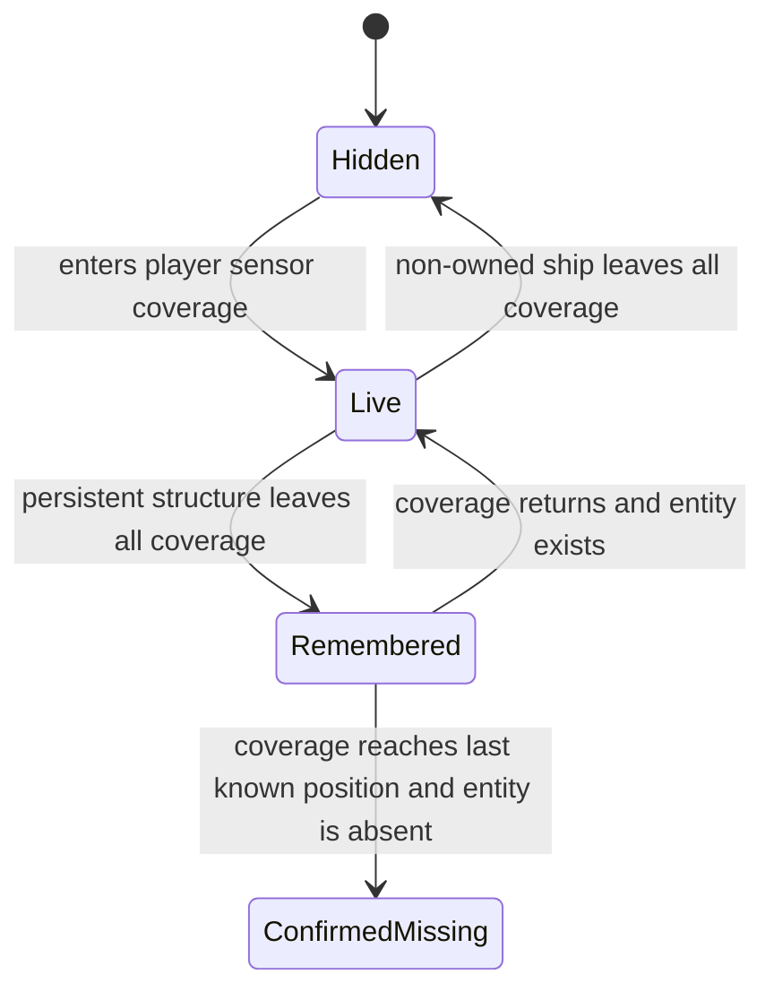

# Fog-of-war and scouting

[Project index](../README.md) · [Player experience](player-experience.md) · [Moving-ship interactions](moving-ship-interactions.md) · [Dialogue](dialogue.md) · [Presentation snapshots](presentation-snapshots.md) · [Authoritative save boundary](authoritative-save-boundary.md) · [Project task list](task-list.md)

## Purpose and decision status

The player needs scouting to reveal useful information without requiring a
general simulation of beliefs, reports, confidence, and knowledge propagation
for every power. This design establishes spatial fog-of-war around player-owned
sensor sources. Current coverage exposes live authoritative information,
transient contacts disappear outside coverage, and discovered permanent
structures retain a stale last-observed view until sensors return.

This document completes the design work approved by the project owner for
`TASK-020` on 2026-08-20. `TASK-073` owns implementation.

**Decision status:** Accepted by the project owner on 2026-08-20.

## Decisions at a glance

| Question | Decision |
| --- | --- |
| Who receives fog-of-war? | The initial model is player-facing. NPC planning continues to read approved authoritative state; bounded NPC decision quality remains `TASK-042`. |
| What creates coverage? | Every player-owned ship, station, and deployable with a sensor radius contributes system-local circular coverage. |
| Are owned assets visible? | Yes. The player always receives current information about owned ships, stations, and deployables. |
| What is visible inside coverage? | The latest completed authoritative state exposed by each entity's presentation contract. |
| What happens to ships outside coverage? | Non-owned ships disappear immediately and leave no last-known map contact. |
| What remains after discovery? | Non-owned stations and stationary persistent deployables retain their last observed presentation state and observation time. |
| How is destruction discovered? | If coverage later includes a persistent entity's last known position and the entity is absent, it becomes confirmed missing without revealing how or when it disappeared. |
| Does coverage change simulation outcomes? | No. Observation changes player information and presentation only. |
| Are sensors shared? | Not initially. Diplomacy or standing does not silently share coverage. |
| What is saved? | Persistent discovery records and their last observed views. Current coverage and spatial indexes are derived after restore. |

## Player-facing boundary

Fog-of-war belongs to the player's command experience. It is not a general
belief model for every principal. Autonomous ships and faction planners may
read the stable authoritative views approved for their owning systems. Their
bounded competence, priorities, and decision quality remain separate from
player visibility.

This boundary avoids duplicating discovery state for every faction while still
giving the player a reason to scout, place sensor deployables, and maintain
coverage. A later gameplay design may introduce information sharing or
observer-scoped NPC knowledge only after demonstrating a concrete need.

Owned ships, stations, and deployables are always current in the player view.
Their continued visibility does not depend on another owned sensor source.
Removal of an owned asset is therefore known when it commits through its owning
gameplay and lifecycle contracts.

## Sensor coverage

Each eligible ship, station, or deployable definition supplies a system-local
sensor radius. Initially the area is an unobstructed circle centered on the
entity's authoritative position. A player-owned source contributes its area to
the union of current player coverage.

Coverage has these initial rules:

- overlapping sensor areas provide one visible result rather than duplicate
  observations;
- a source in connector transit contributes no system-local coverage because
  it has no system-local position;
- emergence into a system begins coverage from the committed emergence
  position;
- line-of-sight, occlusion, directional sensors, stealth, detection strength,
  scanning duration, interference, and cross-system sensing are absent; and
- equipment may modify sensor capability only after `TASK-068` defines the
  relevant installed-equipment contract.

The sensor design consumes the deterministic spatial boundaries established by
[Moving-ship interactions](moving-ship-interactions.md), but it owns the meaning
of entering, remaining within, and leaving sensor range. The accepted
ship-to-ship substrate does not by itself cover moving sources against
stationary structures, stationary sources against moving ships, newly created
entities inside existing coverage, or overlapping sensor sources. `TASK-073`
must implement those cases without silently widening `TASK-071`.

Station participation depends on the station identity and lifecycle owned by
`TASK-057`. `TASK-074` has established that a deployable is a portable
inventory item that materializes into a deployed entity, including its identity,
placement, ownership, pickup, facts, presentation, persistence, and committed
sensor-source handoff in [Sensor deployables](sensor-deployables.md). `TASK-075`
retains only the deferred numeric deployment and pickup range policy. `TASK-073`
consumes the completed deployable contract.

## Live contacts and retained discoveries

While an entity is covered, presentation reads its latest completed
authoritative state. The simulation does not continually copy that state into a
knowledge ledger. "Realtime" means that each presentation capture after a
completed commit boundary receives the current permitted values.

When a non-owned ship leaves all player coverage, it is no longer a map
contact. The initial design does not retain, extrapolate, or render a ghost
position. Prior player-visible notifications may remain in the local activity
surface, but they do not authorize a current target or inferred location.

When a non-owned station or stationary persistent deployable leaves all player
coverage, the session retains its last player-visible observation. The record
contains stable entity identity, last known position, observation simulation
time, and the typed presentation fields that the entity's owning domain had
approved for observation. It is not a copy of complete mutable authority.

Later station, market, inventory, production, and other gameplay designs own
the fields they expose. Adding an observable field also requires its owner to
define how it is captured, saved, restored, refreshed, and displayed as stale.
`TASK-020` does not predefine those future domain models.

## Refresh and confirmed absence

Returning coverage replaces a retained observation with the entity's current
player-visible state. The view shows the observation time so presentation can
make stale information understandable without inventing a confidence score.
There is no periodic stale timer and no automatic forgetting.

If current coverage includes the last known position of a remembered
persistent entity and that stable entity can no longer be resolved there, the
record becomes confirmed missing. This confirms absence only. It does not infer
destruction, capture, relocation, cause, responsible party, or exact time unless
another observed gameplay fact establishes one of those meanings.

An entity category that may legitimately move after becoming remembered must
define different loss behavior before using this contract. The initial
persistent category is limited to stations and stationary deployables.

Resources, wrecks, hazards, connector discovery, and later entity kinds do not
inherit persistence automatically. Their owning designs must choose whether
they behave as transient contacts, persistent discoveries, public information,
or something else.

## Facts, notifications, and offscreen events

Authoritative semantic facts remain complete and are not changed by
fog-of-war. Disclosure to player presentation is narrower. An event may reach
the player's presentation when at least one of these is true at its commit
boundary:

- the event is explicitly public;
- it concerns a player-owned asset; or
- its owning domain declares it observable within current player sensor
  coverage.

Visibility is determined from committed simulation state in stable order, not
from render timing or a later presentation query. Entering coverage later
reveals current state but does not replay every unseen event that occurred in
the area. Domains that need a newly observed historical consequence must expose
it through the current observed state or an explicit discovery outcome.

Disclosure means the application is authorized to receive the typed event
notice. It does not assert that a notification was rendered or that the player
saw, opened, or acknowledged it. This boundary allows `TASK-064` to react only
to disclosed offscreen event notices. Hidden combat or other activity cannot
request a player-facing pacing change merely because the authoritative
simulation processed it.

## Dialogue conditions and disclosure

Existing dialogue conditions retain their approved authoritative evaluation
scope. `TASK-020` does not silently reinterpret authored content or introduce a
general knowledge-condition language.

The dialogue condition vocabulary may add narrow deterministic predicates for:

- whether a participant is currently detected;
- whether a persistent participant has been discovered; and
- the age of a retained observation when a concrete authored scenario requires
  it.

Authors use these predicates when conversation or choice availability should
respect fog-of-war. Other authoritative conditions may intentionally hint at
hidden state, but that disclosure remains an explicit content decision. Choice
admission still revalidates authoritative conditions so a stale station view
cannot guarantee that a gameplay consequence remains possible.

## Deterministic ownership and concurrency

One session-owned player-observation component owns persistent discovery
records. Sensor sources and target domains provide stable immutable inputs.
Coverage and observation work follows the project-wide read, propose, and
deterministic commit boundary:

1. read one committed system-local spatial view;
2. evaluate coverage and observation candidates in batchable read-only work;
3. normalize candidates by stable system, entity, and sensor-source identities;
4. reduce overlapping sources without depending on worker completion order;
5. commit discovery, refresh, or confirmed-missing changes in stable entity
   order; and
6. publish presentation and fact-disclosure results only after the owner commit
   joins.

The implementation retains a single-thread reference path. Worker count,
partition layout, source overlap, and candidate discovery order cannot change
which contacts are live, which persistent observations are refreshed, or which
events are disclosed.

## Persistence and restore

The authoritative checkpoint and save boundary includes every persistent
discovery record required to reproduce later player-visible information:

- stable entity identity and category;
- last known system-local position;
- last observation simulation time;
- typed last-observed presentation state;
- confirmed-missing state when retained; and
- any allocator, policy identity, or receipt state introduced by the
  implementation.

Current sensor coverage, spatial indexes, candidate sets, and crossing
forecasts are derived. Restore rebuilds them from restored sensor-source
identity, ownership, position, and radius, then must reproduce the same next
coverage transitions and observation results as uninterrupted execution.

## Implementation proof

`TASK-073`, together with the entity owners it consumes, must provide focused
evidence for:

- ship, station, and deployable sensor sources;
- moving-to-moving, moving-to-stationary, and stationary-to-moving crossings;
- overlapping coverage and loss of only one contributing source;
- connector transit and emergence;
- transient ship disappearance without a ghost contact;
- persistent discovery, stale display, refresh, and confirmed absence;
- entity creation and removal inside existing coverage;
- owned-asset visibility and removal;
- event disclosure at the commit-time visibility boundary;
- exact checkpoint restore and continued observation equivalence; and
- agreement across supported worker, batch, and partition layouts.

## Deferred choices

The accepted initial design excludes:

- fog-of-war state for NPC principals;
- allied, granted, purchased, or intercepted sensor sharing;
- deliberate misinformation, conflicting reports, and confidence values;
- line-of-sight, occlusion, stealth, scanning, and sensor interference;
- equipment-based sensor modifiers before `TASK-068`;
- extrapolated or last-known moving-ship contacts;
- communications networks or information propagation delays;
- automatic forgetting or an unbounded observation history;
- undiscovered topology and connector discovery, which are separately owned by
  `TASK-076`; resources, wrecks, hazards, and unspecified future entity
  categories; and
- reduced-detail simulation for unobserved systems.

Each deferred feature requires a concrete gameplay need and an owning task. It
must not weaken the rule that observation changes player information rather
than authoritative causal outcomes.
