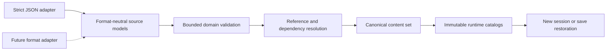

# Gameplay content and static new-game composition

[Project index](../README.md) · [Gameplay integration](gameplay-integration.md) · [Initial roadmap](roadmap.md) · [Save format and migration](save-format-and-migration.md) · [Authoritative save boundary](authoritative-save-boundary.md) · [Project task list](task-list.md)

## Purpose

Galaxy Command needs authored definitions and static starting worlds without
making JSON, Godot resources, CLR types, display text, or filesystem order part
of simulation authority. The same production path must support built-in content
and possible future externally supplied content, while keeping general modding
and executable scripts deferred.

This document defines the content categories, initial physical format,
format-neutral loading boundary, stable authored identity, deterministic
package composition, validation behavior, and trust boundary selected by
`TASK-023`.

**Decision status:** Accepted by the project owner on 2026-08-13.

**Implementation status:** `TASK-023` completed the design. `TASK-063` completed
the format-neutral loading pipeline, JSON adapter, common production
validation, immutable catalogs, and headless validator. `TASK-048` owns built-in
content and static new-game integration, and `TASK-037` owns save compatibility
and saved-reference migration. Existing C# setup objects and embedded
save-policy definitions have not yet migrated to this content boundary.

## Decisions at a glance

| Question | Decision |
| --- | --- |
| Do built-in and external packages use different paths? | No. Production built-in content uses the same adapters, validation, resolution, canonicalization, and catalog construction as any future external package. |
| What is the initial physical format? | Strict UTF-8 JSON in ordinary package directories. Parsing and writing remain behind a replaceable format adapter. |
| What becomes simulation input? | Format-neutral validated content models and immutable resolved catalogs, never JSON nodes, JSON property order, file order, or paths. |
| What is declarative content? | Reusable immutable definitions such as ship designs, principals, standing policies, materials, and later item or equipment definitions. |
| What is static scenario composition? | A new-game description that selects definitions and declares concrete starting systems, topology, facilities, inventories, principals, ships, relationships, and policy configuration. |
| How are definitions identified? | By a qualified key containing package ID, content kind, and local ID. Runtime numeric IDs remain separate. |
| Are definition values copied into saves? | No. A save keeps qualified references and compatibility metadata. Definitions are resolved from packages on disk before restoration. |
| Can packages implicitly override one another? | No. Duplicate qualified keys are errors. Load order never grants replacement rights. |
| Can content change inside a running session? | No. Resolution publishes one immutable catalog before session creation or restoration. There is no authoritative hot reload. |
| Is external executable content supported initially? | No. Packages cannot load scripts or assemblies. Compiled behavior is limited to registered trusted kinds and behavior versions. |
| How is content validated? | Headlessly, with bounded strict parsing followed by common format-neutral validation and complete reference resolution. No failure publishes a partial catalog or session. |

## Content categories

### Compiled behavior

Compiled behavior implements algorithms and authoritative workflows. Current
examples include navigation planners, travel-time estimators, orchestration,
validation, and deterministic policy implementations.

Compiled behavior is not authored data. A content package may select a
registered behavior kind and supply validated configuration, but it cannot name
a CLR type, load an assembly, or introduce executable code. Any behavior that
can affect future authoritative results retains a stable kind and behavior
version as required by the save boundary.

### Declarative authored definitions

A declarative definition describes a reusable kind of thing. Current and
already planned examples include:

- ship and construction designs;
- material definitions;
- principal definitions;
- standing policies;
- later item and equipment definitions owned by `TASK-041`;
- later dialogue, objective, and other authored definitions after their owning
  tasks establish the corresponding domain contracts.

Definitions are immutable after catalog resolution. They may reference other
definitions by qualified content key. They do not contain live entity IDs,
current quantities, pending work, allocator state, or other session authority.

### Static new-game scenario composition

A static scenario describes one starting world. It selects reusable definitions
and declares concrete initial instances and relationships, including:

- systems, connector topology, and starting positions;
- the player principal and other starting principals;
- starting ships, facilities, inventories, and stored quantities;
- production and construction capabilities;
- initial relationships and construction orders;
- selected registered policy kinds and their initial configuration.

The distinction is that a ship-design definition states what a kind of ship is,
while a scenario states that a particular owner begins with one instance of
that design at a particular position.

Scenario composition is input to new-session creation, not continuing runtime
authority. Once validation creates a session, authoritative owners hold the
resulting mutable state. Loading a save restores those owners directly and does
not rerun the starting scenario.

Procedural new-game generation is separate `TASK-047` work. A future generator
must produce the same format-neutral new-game composition and pass the same
validation and session-creation boundary as a static scenario.

### Presentation and localization resources

Player-visible wording, icons, and layout are not content identity or
simulation authority. Declarative definitions may refer to stable presentation
resource keys.

Each player-visible definition should also carry a required invariant fallback
string in the format-neutral definition model. Headless runners, validators,
tests, and diagnostics can use that string without loading Godot or localized
presentation resources. A presentation client prefers the selected localized
resource and falls back to the invariant string when necessary.

The fallback string is diagnostic and presentational data. It is not used for
identity, ordering, equality, deterministic decisions, compatibility, or saved
state. [Internationalization and localization](internationalization-and-localization.md)
defines locale selection, resource layout, formatting, pluralization, font
coverage, and other localization behavior under completed `TASK-045`.

### Executable scripts

External executable content is not supported by the initial package format.
The JSON adapter rejects executable entries, and the loader never loads package
assemblies or invokes package-supplied code.

`TASK-017` may later select a constrained declarative language or sandboxed
runtime. That work must define triggers, approved effects, scheduling,
persistence, deterministic randomness, capability limits, and save continuity
without weakening this package-validation boundary.

## Package and physical format

The initial package is an ordinary directory with one required manifest,
explicitly listed content documents, and optional presentation assets. The
loader does not discover authoritative documents through directory enumeration.
Archive distribution, dependency downloading, a mod manager, and a complete
mod SDK are deferred.

The initial adapter reads and writes strict UTF-8 JSON. Its reader rejects:

- invalid UTF-8;
- duplicate properties;
- comments and trailing commas;
- unknown current-schema properties;
- invalid numeric representations;
- documents, strings, collections, or nesting beyond configured bounds.

The writer emits stable human-readable JSON for authoring and tooling, but its
property order is presentation only. Accepted reader input may reorder
properties without changing the resulting neutral model or canonical catalog.

JSON is not the content architecture. JSON tokens and document nodes exist only
inside the adapter. A future physical format may replace JSON or coexist with
it by producing and consuming the same format-neutral source models. It must
then use the same validation, resolution, canonicalization, catalog
construction, and session-creation path.



Source locations may accompany neutral models for diagnostics, but they do not
participate in equality, ordering, canonical fingerprints, catalogs, or
simulation authority.

## Stable authored identity

Every authored definition has a qualified content key with three components:

```text
package-id / content-kind / local-id
```

For example:

```text
galaxy-command.core / ship-design / freighter-mk1
```

The components use a documented constrained lowercase ASCII syntax and cannot
contain the separator. `content-kind` is a stable registered domain token, not
a CLR type name. The logical key remains three typed components even when a
physical adapter serializes it as one string.

Display names, fallback strings, file paths, array positions, runtime numeric
IDs, load order, and assembly names are never definition identity. Runtime
owners may use compact typed numeric IDs after scenario composition resolves
content keys deterministically, but retain the qualified definition reference
where later save restoration must resolve the authored definition.

## Loading and deterministic composition

Content is loaded from disk whenever the application resolves packages for a
new game or attempts to load a saved session. Resolution then publishes an
immutable in-memory content set for that session. Runtime catalog lookups do not
repeatedly read files, and packages cannot change the authority of an already
running session through hot reload.

The production pipeline performs these stages:

1. Read the explicitly selected package manifests.
2. Parse each declared document through its physical-format adapter.
3. Apply bounded structural and domain validation to neutral source models.
4. Resolve the complete dependency graph and every cross-document reference.
5. Reject missing dependencies, cycles where forbidden, and all qualified-key
   collisions, reporting every relevant source.
6. Canonicalize definitions and scenarios by stable domain keys, never input
   or worker completion order.
7. Construct immutable catalogs and validate the selected static scenario
   against them.
8. Publish the complete resolved content set once, or publish nothing.

Packages may add definitions and reference declared dependencies. They cannot
implicitly replace or patch another definition. Dependency order does not grant
override priority. Explicit replacements and saved-reference migrations remain
`TASK-037` decisions.

Read-only parsing and validation may be batched, but diagnostic order,
canonical models, fingerprints, and catalogs must be identical across worker
counts, partitioning, document order, and completion order. A single-thread
reference path remains required.

## Save and compatibility boundary

Declarative definition bodies are not copied into save state. On load, the
application first resolves the required packages from disk, then uses the save's
qualified references and compatibility inventory to resolve the exact
definitions needed by authoritative owners. Missing, changed, or incompatible
content rejects the load before any owner is constructed or session published.

The running session stores mutable authoritative state and references to
immutable definitions. A save stores that mutable state, the necessary
qualified definition references, and compatibility metadata. It does not store
ship-design recipes, principal display metadata, standing-policy thresholds,
or other declarative values merely to avoid loading their packages.

The current runtime-policy checkpoint embeds complete allowed `ShipDesign`
values. Content integration must replace those embedded declarative copies with
qualified references resolved through the immutable catalog. Registered
compiled policy kinds, behavior versions, and authoritative configuration that
is not an authored definition remain subject to the runtime-policy manifest.

Three version concepts remain separate:

- the content-format schema version used by an adapter to interpret document
  structure;
- the package or catalog version used for authored-content compatibility;
- the compiled behavior version identifying an authoritative algorithm.

The loader computes a deterministic fingerprint from the canonical
format-neutral content set. Authors do not need to increment a manual version
merely for the loader to notice a local edit. Declared package versions remain
useful release and dependency metadata, while `TASK-037` defines how versions,
fingerprints, provenance, compatibility, and migrations interact for saves.

## Headless validation and authoring workflow

The implementation must include a headless package-validation command. It uses
the production adapters and the complete production pipeline rather than a
weaker schema-only check. Given an explicitly selected package set and optional
static scenario, it must:

- validate manifests and every declared document;
- resolve dependencies and all content references;
- detect collisions and report both or all conflicting sources;
- construct the same immutable catalogs used by the application;
- validate the selected new-game composition when supplied;
- report bounded diagnostics in stable package, document, and neutral-model
  path order;
- optionally emit the resolved package order, qualified-key inventory, and
  canonical fingerprints for inspection.

The command performs no session mutation and does not require Godot. Its normal
workflow must support rapid edit, validate, and rerun cycles without archive
packaging, installation, or manual compatibility-version updates. Watch mode,
editor integration, and richer authoring tools may be added later without
creating a second validator.

Headless simulation runners also consume the resolved content catalogs and may
render invariant fallback strings for inspection. They do not need localized
presentation resources to explain the scenario or current state.

## Validation and failure behavior

All input is untrusted, including built-in packages. Validation distinguishes
physical-format errors from neutral-model structural errors, invalid domain
values, dependency failures, unresolved references, identity collisions,
unsupported executable content, and catalog or scenario invariant failures.

Diagnostics identify the package, declared document, and stable neutral-model
path when safe. They do not depend on exception text, JSON property order,
filesystem enumeration, hash iteration, or worker completion order. No failure
publishes a partial catalog, creates a partial session, advances an allocator,
emits a fact, or changes a running session.

## Implementation sequence

`TASK-063` completed slices 1 through 4. `TASK-048` owns slice 5. `TASK-037`
owns slice 6.

1. Define the format-neutral package, definition, scenario, reference, and
   diagnostic models without depending on JSON libraries or simulation-owner
   types.
2. Add the strict JSON adapter and stable writer for those models.
3. Implement common bounded validation, dependency and reference resolution,
   canonicalization, fingerprints, and immutable catalog construction.
4. Add the production headless validation command and focused malformed,
   collision, ordering, and cross-worker determinism tests.
5. Move built-in definitions and the minimal static new-game scenario through
   the production pipeline while retaining typed builders for focused tests.
6. Integrate qualified definition references with save compatibility and
   migration under `TASK-037`, removing embedded declarative definition bodies
   from saved policy state.

Each slice must preserve a single production loading path. A test builder may
construct neutral models directly, but it cannot bypass validation, reference
resolution, catalog construction, or session invariants when claiming package
or scenario coverage.

## Deliberate exclusions

This decision does not define:

- generalized item, stack, cargo, or equipment semantics from `TASK-041`;
- procedural new-game generation from `TASK-047`;
- script triggers, effects, persistence, or scheduling from `TASK-017`;
- localization mechanics from `TASK-045` beyond the recommended headless
  fallback-string boundary;
- content-version compatibility and saved-reference migration from `TASK-037`;
- archive distribution, remote repositories, dependency downloading, signing,
  a mod manager, or a complete mod SDK;
- authoritative content hot reload or mutation of a running session;
- conversion of every focused unit-test fixture into a disk package.
