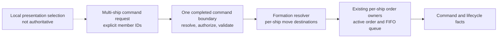

# Group and fleet commands

[Project index](../README.md) · [Player experience](player-experience.md) · [Actor control and order lifecycle](actor-control-and-orders.md) · [Presentation snapshots](presentation-snapshots.md) · [Entity lifecycle and explicit spawning](entity-lifecycle.md) · [Semantic game facts](semantic-game-facts.md) · [Concurrency and performance](concurrency-and-performance.md) · [Project task list](task-list.md)

## Purpose

The player experience anticipates directing more than one ship as ownership
grows. The current client can already select several ships, but that selection
is presentation-local. It has no authoritative lifetime and it cannot submit a
multi-ship command. `TASK-033` defines the boundary needed before either a
one-shot group command or a durable fleet can exist.

This document records the accepted initial one-shot command contract. It makes
no persistent group or fleet behavior authoritative.

**Decision status:** Accepted by the project owner on 2026-09-03.

**Implementation status:** Completed by `TASK-033` on 2026-09-03. The
authoritative one-shot group move and current-order cancellation commands use
the initial formation resolver. Godot snapshots its local multi-selection for
replacement move and current-order cancellation, while Shift-append remains
focused-ship-only. `TASK-086` owns any future persistent group or fleet.

## Inherited boundaries

- `TASK-010` owns a client-local, ascending `ShipId` selection set and optional
  focused member. Selection, focus, camera state, and interpolation are not
  simulation authority and cannot be retained as authoritative fleet state.
- `TASK-006` gives each actor one active controller, one active order, and a
  FIFO queue. It owns the durable order states, per-actor replacement and
  cancellation, waiting, and failure behavior.
- `TASK-011` supplies stable live entity and ship identities. A command must
  resolve every requested member against one completed authoritative boundary;
  removed or stale IDs cannot gain implicit membership.
- `TASK-008` already defines command outcome facts and per-ship order
  transition facts. A group-level fact, if accepted, must complement rather
  than replace the per-ship lifecycle facts.
- The simulation remains single-player. This task does not introduce
  networking, replication, remote authority, prediction, or a shared UI
  selection.

## Decision map

The dotted edge is a client convenience: the client serializes the current
selection into an explicit command payload. The authoritative command never
retains a reference to mutable presentation state.

## Accepted project-owner decisions

### One-shot selection snapshot

The initial group-move and group-cancel commands contain an explicit,
canonicalized selection snapshot. No authoritative group, fleet, membership
record, group identity, or group-order identity exists before or after command
admission.

The command resolves the supplied ship IDs against one completed authoritative
boundary. It does not observe later selection changes. A later persistent
group or fleet is separate work with its own identity, membership, snapshot,
checkpoint, and save contract.

### Initial command vocabulary

The first increment supports only:

- A group move command that derives one move intent per selected ship.
- A group cancel command that cancels each selected ship's current order at
  command admission.

Group cancellation is a new explicit snapshot command, not a reference to the
last command submitted for a previous selection. There is no durable group
history or group-scoped cancellation handle. Queued-order cancellation,
append, docking, trade, combat, patrol, and other domain-specific group
commands remain outside this increment.

### Formation resolver seam

The group move command uses a formation resolver interface. It receives the
canonical selected ship identities and the selected destination, then returns
one destination for each selected ship in the same canonical membership order.
It does not control ships, own orders, plan paths, allocate IDs, or mutate
state.

The initial basic resolver has these exact rules:

- One member receives the selected destination exactly.
- Two or more members receive points on a circle with radius `100` abstract
  `SpatialCoordinate` units around the selected destination.
- Ascending `ShipId` order starts at east and continues clockwise with equal
  angular spacing. Each offset component rounds to the nearest integer away
  from zero before it is added to the selected destination.

Later formation behavior may replace this resolver without changing command
admission or per-ship order ownership. The initial rule does not imply
collision avoidance, cohesion, formation maintenance, or new movement
authority. Those remain separate work.

### Independent per-ship orders

An accepted group move creates independent ordinary per-ship move orders.
`TASK-006` continues to own their identities, replacement, state transitions,
waiting, failure, and cancellation. One ship finishing, waiting, or failing
does not create group state or alter another member's order.

### Controller eligibility

The submitting source must exactly match every selected ship's active
controller at the completed command boundary. Principal ownership alone is not
enough. A controller change after acceptance affects only the existing
per-ship order and control lifecycle defined by `TASK-006`.

## Accepted transaction rules

### Move and cancellation transaction rules

**Accepted group-move rule: all-or-nothing admission.** Treat the
selection snapshot and formation assignment as one player intent. Resolve every
selected ship, verify every active controller, derive every formation
destination, and evaluate every per-ship move before any order, motion, or fact
mutation. If any member is stale, ineligible, or invalid, reject the one group
command and leave every selected ship unchanged.

This matches the existing command boundary's one accepted-or-rejected result
and makes a formation legible: the player never receives a silently degraded
subset. Partial acceptance would require a new per-member outcome contract,
including how the formation rebalances and which existing member orders commit.

**Accepted group-cancel rule: atomically validate membership and
eligibility, then cancel each current order that exists.** Every selected ship
must be live and have the submitting source as its active controller. If either
check fails for any member, reject the command and leave every selected ship
unchanged. After that successful preflight, a selected ship with no current
order is a deliberate no-op; it does not refer to any historical group command
or make the cancellation partial. Every current order that exists is cancelled
through the ordinary per-ship lifecycle.

## Non-negotiable implementation constraints

Once the owner accepts the above choices, implementation must:

- Canonicalize explicit member identities in a documented stable order before
  validation and commit.
- Evaluate the full request against one stable authoritative view, then buffer
  proposed per-ship effects and commit them in a documented deterministic
  order.
- Preserve the single-thread reference path and prove the same outcomes across
  supported worker counts, partitions, and batch layouts before concurrent
  execution is introduced.
- Keep command acceptance distinct from later per-ship waiting and failure.
- Retain the existing individual order IDs, state transitions, and facts unless
  an accepted group-level contract explicitly adds related records.
- Keep local selection, focus, camera, notifications, and interpolation outside
  authoritative simulation state.

## Command and fact results

`MoveShipGroupCommand` and `CancelShipGroupCommand` carry only the explicit
canonical ship snapshot, with the group move also carrying the selected
system-local destination. An accepted group move creates ordinary per-ship
replacement move orders in ascending `ShipId` order. An accepted group cancel
cancels only current orders in that same order; idle members add no order
transition or physical fact.

The existing semantic-fact vocabulary remains sufficient:

- Each submission emits the ordinary `CommandAcceptedFact` or
  `CommandRejectedFact` with its group command kind.
- Each affected ship emits its existing order-transition and physical-motion
  facts in deterministic owner order.
- No group fact, group order, correlation identity, or history is introduced.

Persistent-group storage, if accepted later, must coordinate with the save and
checkpoint owners through `TASK-086` rather than silently extending this task's
one-shot command contract.
