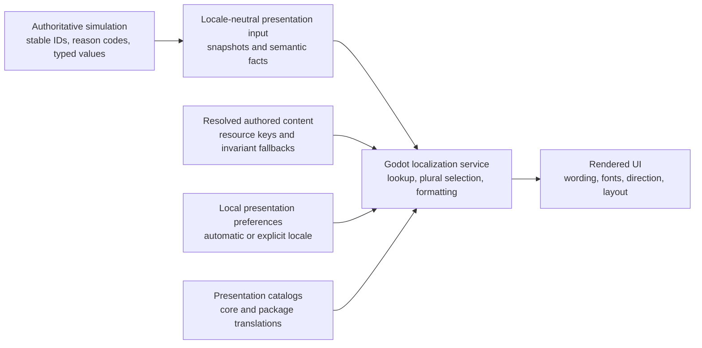

# Internationalization and localization

[Project index](../README.md) · [Gameplay content](gameplay-content.md) · [Semantic game facts](semantic-game-facts.md) · [Presentation snapshots](presentation-snapshots.md) · [Authoritative save boundary](authoritative-save-boundary.md) · [Project task list](task-list.md)

## Purpose and scope

Player-facing text will eventually appear across the application shell,
semantic facts, dialogue, objectives, items, equipment, and authored content.
Those systems need a shared localization contract before their public models
accidentally make English prose, a locale, or a particular layout part of game
authority.

This document completes the design work in `TASK-045`. It defines locale and
resource ownership, fallback, message formatting, authored-content
localization, text layout, font coverage, and the localization-related
accessibility baseline. It does not add translations or implement the Godot
application service. Completed `TASK-063`, completed `TASK-049`, and future
`TASK-048`, `TASK-077`, and `TASK-050` consume these decisions for content
validation, built-in content loading, the application shell, and local
preference storage.

Comprehensive accessibility design is separately owned by `TASK-061`.
`TASK-045` establishes only the accessibility constraints inseparable from
localized text and layout.

## Decisions

| Question | Decision |
| --- | --- |
| What is initially supported? | English is the initial shipped locale. The architecture accepts additional Godot-supported locales, but a locale is declared supported only after its catalog, font, layout, and translation checks pass. |
| Who chooses the locale? | The local application chooses it from a development override, an explicit local preference, the operating-system locale, or English, in that order. |
| Does locale affect simulation or saves? | No. Locale, translated strings, presentation formatting, font choices, and layout direction are not simulation state, deterministic snapshots, content identity, or authoritative save data. |
| What resource format is used? | Godot gettext PO catalogs are the editable source. Stable semantic keys, rather than English sentences, are message identifiers. |
| How are messages formatted? | Presentation resolves complete templates using a plural selector when required and a validated set of typed semantic arguments. Sentence fragments are not concatenated. |
| How is authored content localized? | A player-visible authored field has a stable resource key and the required invariant fallback string accepted by the gameplay-content design. |
| How are missing resources handled? | Resolution follows the locale chain, then English. Authored fields then use their invariant fallback. A missing application-owned English key renders its key and emits a deduplicated diagnostic. It never becomes an empty string. |
| How are right-to-left layouts handled? | Reusable UI uses logical layout direction and Godot containers. Directional UI affordances may mirror, while galaxy coordinates, maps, and physical direction do not. |
| How are fonts selected? | The application owns licensed fallback stacks by writing system. A locale cannot be supported until its required glyphs, shaping, and line breaking are verified. |

## Authority boundary

The simulation communicates meaning, not sentences. Stable identifiers,
reason codes, content references, counts, quantities, durations, and other
typed values may cross into presentation. The presentation layer chooses the
locale, resolves resources, formats values, and arranges controls.

Translated text must never be read back as a command parameter, identity,
ordering key, reason, compatibility value, or simulation decision input. A
presentation action submits the original stable identifier or typed value that
produced the label. The displayed label is disposable.

Changing locale at runtime invalidates localized presentation caches and
rebuilds visible text from the same locale-neutral inputs. It does not restart,
reload, or mutate the active session. Headless runners, validators,
benchmarks, and simulation tests remain able to operate without Godot or any
translation catalog.

## Locale selection and fallback

The application exposes two user choices:

- `Automatic`, which follows the operating-system locale.
- An explicit locale from the set the installed application declares
  supported.

`TASK-050` stores that choice as a local preference outside authoritative save
slots. A development or test override may temporarily supersede it without
rewriting the preference. Locale identifiers use Godot's canonical
`language_Script_COUNTRY_VARIANT` form at the application boundary.

Lookup starts with the most specific requested locale and progressively removes
unsupported variant, country, and script qualifiers. For example,
`zh_Hant_TW` may resolve through `zh_Hant`, then `zh`, before English. Only
installed and validated catalogs participate. English is the required project
fallback even when the operating system reports another unsupported locale.

Resource resolution then follows this order:

1. The most specific available translation in the requested locale chain.
2. The English catalog entry when present. It is required for application-owned
   keys and optional for authored fields that have an invariant fallback.
3. For authored content only, the definition's invariant fallback string.
4. For an application-owned key defect, the stable key itself plus one
   deduplicated diagnostic for that key and locale.

Fallback is a presentation concern. It does not change content fingerprints,
save compatibility, deterministic results, or which definitions are admitted
to a session.

## Catalogs, keys, and package ownership

Godot gettext PO files are the editable catalog source. They keep each locale
independently reviewable, support plural rules and translation context, and can
be consumed by ordinary translation tooling. Imported or compiled Godot
resources are build outputs rather than the canonical authored form.

Keys are opaque, stable semantic identifiers. They describe meaning and do not
embed the current English wording. Core keys use domain namespaces such as:

- `ui.session.new_game`
- `fact.order.rejected.missing_actor`
- `dialogue.choice.accept`
- `objective.state.completed`

Changing punctuation or English wording does not change a key. A key is retired
rather than reused for a different meaning. Translation context may clarify a
term for translators, but it is not a substitute for a stable key.

Authored content uses its qualified `package-id / content-kind / local-id`
identity as the namespace root and appends the visible field, such as a name or
description. A content package may provide translations for its own namespace.
It may not override core resources or another package's resources.

A presentation-only translation extension may translate another package when
its manifest explicitly names the target package and compatible version. It
does not add or alter definitions, cannot satisfy an authoritative content
dependency, and does not enter content fingerprints or saves. Duplicate
locale-and-key contributions are rejected from the presentation catalog
rather than resolved by filesystem or load order. An invalid optional
translation extension is diagnosed and excluded without changing an otherwise
valid session.

Completed `TASK-063` keeps the format-neutral definition catalog and its
authoritative compatibility data separate from these presentation catalogs.
Built-in and external definitions still follow the one strict validation and
admission path established by the gameplay-content design.

## Localized assets and icons

Icons and other presentation assets use stable presentation keys and remain
outside simulation and save authority. Prefer text-free assets shared by every
locale. When an image genuinely contains language-specific content, the
application may resolve a locale-specific remap through the same fallback
chain as text. Missing optional remaps fall back to the locale-neutral asset.

A content package may provide assets only within its own namespace. A
translation extension may provide a locale-specific remap for its declared
target package under the same collision rules as catalogs. These resources do
not enter authoritative content fingerprints or saves.

An icon cannot be the only carrier of gameplay meaning. Icon-only controls
require a localized accessible label, and status icons require equivalent text
or another non-visual semantic description. Directional navigation icons may
mirror with layout direction; physical map symbols and world direction do not.

## Message and value formatting

The Godot client owns a small application localization service around
`TranslationServer`. UI code asks that service to resolve a stable key and a
declared argument contract instead of scattering direct translation calls
through controls. The service may use Godot's singular and plural lookup, but
its application-facing contract remains independent of a particular scene.

A localizable message consists of:

- one stable key;
- an optional non-negative integer plural selector;
- a fixed set of named semantic arguments declared for that key; and
- an indication of whether plain text or restricted rich text is allowed.

Catalog validation requires every locale variant to preserve the argument set
and permitted markup contract. Translators may reorder arguments. They may not
introduce undeclared placeholders or active behavior. Rich text is disabled by
default; when a surface explicitly permits it, the formatter escapes dynamic
values and accepts only the approved presentation markup vocabulary.

Arguments remain typed until presentation formatting. Expected categories
include literal player-authored names, localized authored-content references,
integer counts, quantities, durations, percentages, and stable diagnostic
identifiers. Formatting rules are:

- Use locale plural rules instead of testing whether a count equals one.
- Translate complete messages, not fragments assembled in English word order.
- Format grouping, decimal separators, digits, percentages, and unit labels for
  the selected locale without changing the underlying simulation value.
- Resolve referenced content names through their own resource key and fallback.
- Keep player-authored names literal and disable automatic translation for the
  controls that display them.
- Render stable IDs in an unambiguous diagnostic form and use structured
  bidirectional handling when they appear inside right-to-left text.

Gender, grammatical case, and other future variants must be represented by a
complete message variant with a documented semantic selector. Presentation may
select that variant from locale-neutral facts already exposed by the owning
gameplay design. It may not infer new authoritative state from translated
prose. The initial design does not require a separate ICU-style message
runtime.

## Authored content

Every authored field intended for player display carries both a stable
presentation resource key and a required invariant fallback string in the
format-neutral definition. The fallback allows headless inspection and useful
diagnostics when a translation catalog is absent. It remains display-only data
and never participates in identity, equality, ordering, policy, deterministic
decisions, or save compatibility.

Not every string is localizable. Package IDs, content kinds, local IDs, enum
codes, reason codes, command names used by tooling, filenames, and schema
property names remain stable technical vocabulary. Player-authored names are
literal data. A design for dialogue, objectives, items, or equipment must mark
which fields are player-facing resources rather than relying on naming
conventions or scanning arbitrary strings.

## Layout direction, expansion, and fonts

Reusable UI is built from Godot `Control` containers, anchors, wrapping, and
minimum-size behavior rather than fixed coordinates sized to English text.
Controls use logical start and end relationships and inherit automatic text and
layout direction unless a bounded exception is documented.

For right-to-left locales:

- Standard control order, text alignment, and navigation affordances follow
  the locale direction.
- Back and forward icons mirror when they communicate logical navigation.
- World maps, galaxy coordinates, physical rotation, charts, and simulation
  direction remain unchanged.
- File-like paths, IDs, coordinates, and other structured strings use an
  appropriate bidirectional override instead of relying on natural-text
  ordering.

Pseudolocalization uses accented replacement, placeholder preservation, at
least 30 percent expansion, and fake bidirectional text during development.
These checks expose hard-coded text and fragile layouts, but they do not prove
real shaping or glyph coverage. At least one real right-to-left fixture is
therefore required before the reusable UI foundation is accepted.

The application uses project-owned licensed fonts and explicit fallback stacks
by writing system. It does not rely on the engine fallback font as the shipped
coverage contract. A declared supported locale requires:

- coverage for every character used by its catalog and representative dynamic
  content;
- correct shaping and bidirectional behavior;
- verified word and line breaking, including required exported text-server
  data; and
- acceptable rendering at supported UI scales.

Per-script fallback bundles are preferred to an unconditional universal font
bundle. The exact font assets remain an application implementation choice, but
their licenses and coverage evidence must be recorded.

## Localization-related accessibility baseline

Localized presentation must remain usable under text expansion and user text
scaling. Reusable controls therefore must:

- reflow or wrap meaningful text instead of clipping it;
- preserve a logical focus order when layout direction changes;
- provide accessible labels for icon-only actions;
- retain meaning without relying only on color, an icon, or untranslated
  typography; and
- allow essential status and action wording to remain visible at the supported
  text scales.

This baseline does not settle comprehensive accessibility behavior. Input
remapping, keyboard and controller equivalence, assistive-technology and
screen-reader behavior, contrast modes, reduced motion and flashing, captions,
audio cues, preference interactions, and their platform acceptance criteria
belong to `TASK-061`. Their local preferences will coordinate with `TASK-050`
and remain outside authoritative session state unless a later gameplay design
demonstrates that a setting changes simulation semantics.

## Validation and acceptance evidence

Future implementation is not complete until it provides focused evidence for
the boundary defined here:

1. Validate PO syntax, unique keys, required English coverage, placeholder
   contracts, and permitted markup.
2. Validate every player-visible authored field has a stable key and invariant
   fallback, and reject duplicate package-local keys.
3. Prove locale switching redraws the same presentation inputs without session
   mutation or restart.
4. Run representative UI flows with expansion and fake bidirectional
   pseudolocalization, including application shell, facts, dialogue,
   objectives, and item or equipment surfaces as they are introduced.
5. Run a real right-to-left fixture that covers shaping, mirrored controls,
   structured IDs, navigation icons, and an unchanged world map.
6. Validate catalog glyph coverage and exported line-breaking support for every
   declared locale.
7. Prove the same commands and authoritative state produce identical snapshots,
   checkpoints, save bytes, and canonical simulation digests across locale
   choices. Presentation pixels and localized strings are intentionally outside
   that equality.
8. Keep the production headless content validator useful without Godot or
   translation resources by rendering invariant authored fallbacks.

## Deferred choices and task boundaries

- Completed `TASK-063` implements content catalogs and preserves the separation
  between authoritative definitions and optional presentation translations.
- Completed `TASK-049` defines the application localization boundary and
  reusable user-interface behavior. `TASK-077` implements those surfaces.
- `TASK-050` owns persistence, reset, and discovery of local locale, text-scale,
  and other presentation preferences.
- `TASK-016`, `TASK-018`, `TASK-041`, and `TASK-068` define the semantic fields
  and argument contracts needed by dialogue, objectives, items, and equipment.
  They do not invent separate localization systems.
- `TASK-061` owns comprehensive accessibility modes and acceptance criteria.
- The exact additional shipped locales, font files, translator platform,
  translation staffing, and release schedule remain product decisions. Adding
  a locale does not require a simulation or save-format migration.
