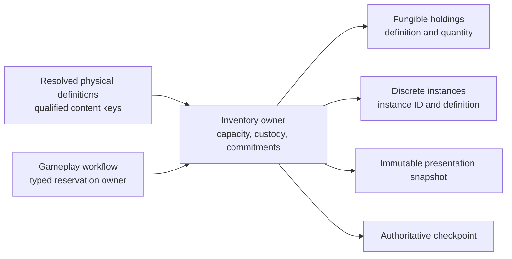

# Generalized inventory and cargo

[Project index](../README.md) · [Economy](economy.md) · [Gameplay content](gameplay-content.md) · [Entity lifecycle](entity-lifecycle.md) · [Authoritative save boundary](authoritative-save-boundary.md) · [Save format and migration](save-format-and-migration.md) · [Concurrency and performance](concurrency-and-performance.md) · [Project task list](task-list.md)

## Purpose and decision status

Ships and other physical owners need to carry more than the material quantities
supported by the Phase 1 ledger. Generalization must add ordinary cargo and
discrete physical items without turning every item into a material unit or
breaking production and transport behavior before its callers can migrate.

This document completes the design approved by the project owner for
`TASK-041` on 2026-08-19. `TASK-069` owns implementation.

**Decision status:** Accepted by the project owner on 2026-08-19.

## Decisions at a glance

| Question | Decision |
| --- | --- |
| What may inventory hold? | Fungible materials, fungible ordinary cargo, and discrete physical items. Physical mission objects use the same ordinary item model. |
| What is not inventory? | Credits, permissions, objectives, nonphysical mission state, people, and passenger simulation. |
| How are definitions identified? | Every generalized physical definition uses its immutable `QualifiedContentKey`. |
| Do stacks have runtime identity? | No. A fungible holding is one aggregate quantity per definition within an inventory. A displayed stack is a projection of that holding. |
| What has runtime identity? | Each discrete physical item has one stable, session-scoped `ItemInstanceId` that survives transfer. |
| How is cargo capacity measured? | One integer capacity dimension. Each physical definition declares a positive number of capacity units consumed per held unit; existing materials consume one. |
| How is custody represented? | Every inventory names its stable physical owner and controlling principal. Contents inherit that custody rather than carrying separate legal title. |
| How do reservations work? | They reserve a fungible quantity, an exact discrete instance, or incoming capacity for one typed workflow owner. |
| Are transfers partial? | No. Transfer validates source, destination, reservations, ownership, and capacity before one atomic commit. |
| What happens on destruction? | The caller must explicitly destroy contents or transfer them to an existing destination. Jettison, wreck creation, and salvage are separate gameplay work. |
| What is exposed and saved? | Presentation receives immutable ordered holdings and reservation summaries. Checkpoints retain exact owners, holdings, instances, commitments, allocators, and content references. |
| How is the material ledger preserved? | Existing material behavior remains available through a compatibility facade until an explicit, tested migration updates every caller and save reference. |

## Scope and exclusions

The generalized inventory model covers physical custody and storage. Its first
approved categories are:

- fungible materials and commodities;
- fungible ordinary cargo, including a consumable when another domain defines
  what consuming it means; and
- discrete durable physical items.

A mission may refer to an ordinary fungible holding or discrete instance when
the object is physically present. Objective progress, access rights, licenses,
knowledge, and other nonphysical mission state remain with their own owners.
People and passengers remain deferred to `TASK-062`.

Credits are the single unified currency used by trade. Credits are not a
material or item, do not occupy cargo capacity, and cannot be transferred
through inventory operations. `TASK-055` owns Credit balances, conservation,
pricing, and settlement.

Equipment definitions, ship slots or hardpoints, installation, removal, and
installed capability contributions are not part of this model. They belong to
`TASK-068`, which builds on discrete item identity and physical transfer.

## Definitions, holdings, and identity

An immutable physical definition supplies:

- its `QualifiedContentKey`;
- whether holdings are fungible or discrete;
- a positive integer cargo-capacity cost per unit; and
- semantic presentation fields required by the localization contract.

The definition does not contain live quantities, runtime IDs, reservations,
ownership, condition, installation state, or behavior code. Consumable effects,
durability, equipment compatibility, and other domain behavior require their
own owning design.

A fungible holding is the inventory-local pair of definition key and positive
quantity. At most one authoritative holding exists for the same definition in
one inventory. Adding, removing, or transferring quantities changes that
aggregate. There is no authoritative stack ID, merge order, or split history.
The presentation layer may render the holding as one or more stacks without
changing simulation state.

A discrete item instance contains a never-reused `ItemInstanceId` and one
definition key. Its identity does not change when it moves between inventories.
Later owning domains may add explicitly designed state, but TASK-041 does not
invent condition, quality, provenance, or equipment fields.

## Inventory custody and capacity

Each production inventory has one `InventoryId`, one stable typed physical-owner
reference, one controlling `PrincipalId`, and one nonnegative integer capacity.
The owner reference must identify a real domain object such as a ship or
facility through that domain's accepted identity. It cannot be a display name,
filesystem path, or untyped numeric value. When another aggregate also records
the owner's principal or inventory reference, setup, checkpoint restoration,
and cross-owner commits validate that the links agree.

Containment establishes physical custody. Holdings and instances do not carry
independent legal-title records. Moving contents changes custody, but does not
by itself exchange Credits or prove a purchase. `TASK-055` may atomically
compose inventory transfer with its Credit settlement and contract state.

Used capacity is the checked integer sum of each fungible quantity multiplied
by its definition's per-unit cost plus the cost of each discrete instance.
Reserved incoming capacity is included when calculating remaining capacity.
Zero-cost or negative-cost physical definitions are invalid. Overflow is a
validation failure, never wraparound or saturation.

The initial model has one cargo-capacity dimension. Mass, volume, hazardous
storage, temperature, compartments, and equipment slots are not implicit
secondary dimensions. A later requirement must promote and design any such
constraint explicitly.

## Reservations and transfers

Every reservation has a stable reservation ID, its inventory, a typed workflow
owner, and exactly one reserved subject:

- a positive quantity of one fungible definition;
- one exact discrete item instance; or
- a positive amount of incoming cargo capacity.

Reserved holdings remain physically present but unavailable to unrelated work.
An instance cannot have more than one live reservation. Fungible reservations
for one definition cannot exceed its stored quantity. Capacity reservations,
used capacity, and any incoming commit cannot exceed inventory capacity.

A transfer is one cross-inventory transaction. Before mutation, it validates:

- distinct source and destination inventories;
- both inventories and their custody links;
- the exact quantity or instance at the source;
- the requesting workflow's reservation authority, when reserved;
- destination capacity, including existing commitments; and
- checked capacity arithmetic using the resolved immutable definition.

Rejection changes no holding, reservation, capacity total, allocator, or fact.
Commit removes the source holding, consumes the exact applicable reservation,
adds the destination holding, and consumes reserved destination capacity as one
operation. A gameplay domain that needs partial fulfillment submits explicitly
sized transactions rather than receiving an implicit partial result.

## Destruction and removal

Removing an inventory owner requires an explicit disposition for its contents:

- destroy the specified contents; or
- transfer them atomically to an already existing inventory.

Destruction cannot silently cancel another workflow's reservation. The causal
owner must first release or consume every affected commitment through its
normal cleanup contract. A disposition that cannot transfer all selected
contents is rejected without mutation.

The initial contract does not spawn a floating container, wreck, salvage,
replacement item, or Credit value. Combat in `TASK-046` decides when damage or
destruction occurs. Any later salvage design decides whether that event creates
ordinary holdings or discrete instances through the same inventory boundary.

## Commands, facts, and presentation

Inventory is an authoritative physical-state owner, not a second gameplay
command system. Trade, logistics, construction, resource acquisition, scripts,
and later domains admit their own commands or scheduled work, then request a
typed inventory transaction during deterministic commit.

Inventory returns stable typed outcomes such as missing holding, insufficient
available quantity, insufficient capacity, reservation mismatch, custody
mismatch, or stale request. It does not return localized sentences. The causal
gameplay owner publishes the semantic fact for a successful or rejected
gameplay action so a low-level transfer does not create duplicate facts.

An immutable presentation snapshot lists inventories and their owner references
in stable identity order. Within each inventory it lists fungible holdings by
qualified key and discrete instances by instance ID, with stored, reserved, and
available values where applicable. Presentation may group or filter these
records, but it cannot reconstruct authoritative state from rendered stacks.
Player-knowledge filtering remains `TASK-020`.

## Checkpoints, saves, and compatibility

The authoritative checkpoint retains:

- inventory identity, physical owner, controlling principal, and capacity;
- every fungible definition key and exact quantity;
- every discrete instance ID and definition key;
- every holding, instance, and incoming-capacity reservation with its owner;
- the next item-instance and reservation allocator states, including
  exhaustion; and
- any committed idempotency receipt needed to prevent a repeated transaction.

Derived used, reserved, and available totals are validated from this state and
need not be separate authority. Restore resolves every qualified key against
the compatible content set, validates all cross-owner links and commitments,
constructs the inventory owner privately, and publishes it only with the whole
restored session.

The current material ledger remains valid until `TASK-069` supplies a tested
replacement and updates its callers. Its compatibility facade preserves
existing `MaterialId` and `Quantity` behavior, including one capacity unit per
material unit. It must not assign hidden item definitions or change production
and transport behavior.

A save migration converts a material holding to the corresponding fungible
physical definition only when the compatible content input supplies an exact,
validated `MaterialId` to `QualifiedContentKey` mapping. Missing, duplicate, or
incompatible mappings reject the migration. No filename, display name, current
catalog order, or built-in default may guess the reference. Structural schema
migration remains under `TASK-022`; content-reference compatibility and
migration remain under `TASK-037`.

## Deterministic batching and concurrency

Read-only inventory evaluation may be batched or parallelized from an immutable
completed-boundary view. Every proposed mutation carries a stable operation key
established by its authoritative caller before parallel evaluation. Commit
orders proposals only by documented stable domain data and rejects duplicate
keys. It never allocates order from worker completion, collection enumeration,
thread identity, or partition layout.

Conflicting proposals resolve in that stable commit order. A proposal that
loses capacity or availability contention returns a typed rejection without
mutation. Discrete instance IDs and reservation IDs are allocated only for
accepted commits in stable order. The single-thread reference path and focused
tests must prove identical holdings, commitments, allocator states, outcomes,
and facts across supported worker and batch layouts.

## Task boundaries

- Completed `TASK-041` owns this generalized inventory and cargo design.
- `TASK-069` implements definitions, holdings, custody, capacity, reservations,
  transfer, destruction disposition, snapshots, checkpoints, compatibility,
  and deterministic proof.
- `TASK-068` defines equipment, ship slots, installation, and removal.
- `TASK-055` defines Credit balances, prices, contracts, and atomic settlement
  with physical transfer.
- `TASK-037` owns content-reference compatibility and saved-reference
  migration; `TASK-023` and completed `TASK-063` own the shared content path.
- `TASK-046` owns combat damage and destruction causes. Salvage and wreck
  recovery remain deferred until promoted.
- `TASK-054`, `TASK-056`, `TASK-057`, and `TASK-058` consume the inventory
  boundary for resource acquisition, ship progression, stations, and repair.
