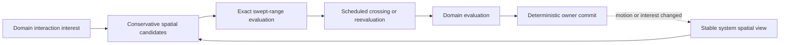

# Moving-ship interaction architecture

[Project index](../README.md) · [Navigation and spatial architecture](navigation-architecture.md) · [Actor control and order lifecycle](actor-control-and-orders.md) · [Simulation architecture](simulation-architecture.md) · [Concurrency and performance](concurrency-and-performance.md) · [Project task list](task-list.md)

## Decision status

**Decision status:** Accepted by the project owner on 2026-08-20.

`TASK-019` defines the shared physical substrate for discovering and timing
interactions while ships remain on authoritative local-motion segments. It does
not define combat, sensor, collision-response, inspection, assistance, or
docking outcomes. Those domains retain their own eligibility, range, duration,
effects, and order-completion policies.

## Purpose and boundary

Normal local travel remains scheduled from departure to arrival. Ships do not
stop at artificial waypoints or enter a global movement tick merely so the
simulation can discover that their paths cross. Instead, the interaction
substrate compares authoritative motion over a bounded interval, calculates
when a requested range is crossed, and schedules reevaluation at that time.

The spatial-interaction owner is responsible for:

- Conservative candidate discovery within one system
- Exact narrow-phase range and swept-path evaluation
- Stable interaction-interest and ship-pair correlation
- Forecast invalidation and triggered reevaluation
- Deterministic proposal ordering and agenda requests

The consuming gameplay domain is responsible for:

- Declaring why an interaction is relevant and the range or geometry it needs
- Deciding whether contact is eligible and what it means
- Proposing any order, movement, damage, knowledge, or other gameplay effect
- Defining any fixed-step activity required after initial contact
- Emitting semantic facts and presentation state for its outcome

Candidate discovery and crossing forecasts are derived data. They do not grant
knowledge to the player, prove that an action is permitted, or change either
ship's motion.

## Interaction model at a glance

The diagram describes authority and data flow. It does not prescribe a spatial
index, public interface hierarchy, or scheduler implementation.

## Queries and durable interests

The shared substrate supports two related forms of work:

- An **instant proximity query** returns candidates satisfying a requested
  system-local range at one authoritative `SimulationTime`.
- A **swept interaction query** examines a bounded interval and returns whether
  two trajectories are already in range, enter range, touch the boundary, or
  pass through range during that interval.

A one-time caller may issue either query against a stable read view. A domain
that needs future notification registers a stable **interaction interest**.
The interest identifies the owning domain, its stable purpose, the participating
roles or candidate scope, and the requested range or geometry. The specific
payload remains domain-owned rather than becoming one universal interaction
record.

Directed gameplay meaning is preserved. For example, an inspector and an
inspected ship retain those roles even though discovery uses a canonical
unordered ship-pair key. A domain must not use spatial partition identity,
collection order, or worker completion order as gameplay meaning.

The substrate does not automatically register every possible ship pair for
every possible domain. Spatial indexes restrict broad-phase candidates, and
explicit interests determine which narrow-phase questions are meaningful.

## Exact crossing time on the millisecond timeline

An authoritative local-motion segment defines linear movement from its origin
to destination over a closed interval of integer simulation milliseconds.
During the time overlap of two segments, their relative position is also
linear. A stationary ship is treated as a constant position for the bounded
interval supplied by the moving participant or query.

For a requested interaction range, narrow-phase evaluation determines the
continuous interval during which the distance predicate is satisfied. It then
schedules the entry at the first representable `SimulationTime` that is not
earlier than the mathematical entry time. In other words, fractional entry is
rounded upward to an integer simulated millisecond.

This rounding rule has two important consequences:

- An interaction is never reported before the paths mathematically reach the
  requested range.
- A very fast pass that enters and exits between adjacent milliseconds is still
  reported at the later millisecond as a swept crossing. The event records that
  contact occurred within the preceding interval; it does not falsely claim
  that the ships remain in range at the event timestamp.

Implementations must reach the same entry timestamp on every supported worker
layout. Floating-point approximation, iteration order, or platform-dependent
rounding must not choose the result. The exact overflow-safe integer or rational
algorithm remains an implementation choice and must be covered by boundary,
tangent, brief-crossing, and large-coordinate tests.

Queries are bounded by the overlap of known authoritative segments and any
explicit caller horizon. The substrate does not extrapolate beyond a segment's
arrival, assume a future course, or create an unbounded forecast for two
stationary ships.

## Scheduling, invalidation, and reevaluation

A crossing forecast records enough stable correlation to determine which
system, interaction interest, ship pair, motion states, range, and bounded
interval produced it. Evaluation workers return an event proposal; only the
agenda owner assigns creation sequence and commits the scheduled event.

Committed changes to any of the following invalidate an affected forecast and
trigger reevaluation from the new stable state:

- Either ship's local-motion segment, position, or system membership
- The interaction interest, including its range or participating roles
- Removal of either ship or cancellation of the owning gameplay intent
- Entry into or emergence from connector transit

Stale scheduled events validate their correlation and become defined no-ops.
Invalidation must not require removing arbitrary entries by scanning the event
agenda. Repeated triggers for the same interest, pair, and timestamp are
deduplicated before event commit.

Due interaction work enters the state-update portion of the timestamp cycle,
after physical completions at that timestamp establish the stable spatial
view. All due interactions at the same timestamp evaluate against that same
view. Their resulting effects commit only through their authoritative domain
owners and cannot reopen an earlier phase.

## Motion and order effects

Discovering proximity or a swept crossing never changes authoritative motion
by itself. A consuming domain may propose one of the existing explicit
outcomes:

- Preserve both current motion segments
- Materialize a ship at the interaction timestamp and interrupt, cancel, or
  replace its current leg through the movement owner
- Replan an order while retaining its stable destination or target intent
- Place an order into a defined waiting, suspended, failed, or completed state

Any motion change advances the affected generation, invalidates old completion
and interaction forecasts, and produces a new stable view before later
evaluation. A gameplay domain may not mutate another ship, movement state, or
order directly from candidate evaluation.

## Following and interception

Following and interception are persistent target intents, not special physical
states and not permanent links between two motion segments.

A following order retains its target identity and domain-owned desired
relationship, such as a preferred distance. An interception order retains its
target identity and completion condition. Navigation may plan against the
target's current authoritative position and finite motion segment, but it must
not extrapolate an unwritten future course.

Committed motion changes by the follower, interceptor, or target trigger
reevaluation. The owning order then preserves its current leg, replaces it with
a newly planned leg, waits, fails, or completes according to its own policy.
The shared substrate supplies proximity, swept crossing, and forecast
invalidation; it does not choose pursuit cadence, lead behavior, acceptable
following error, or the outcome when a target cannot be reached.

This keeps later combat, escort, inspection, and assistance orders on the same
movement and interaction model without placing their policy in navigation.

## Fixed-step participation

There is no universal ship-movement tick. Scheduled range crossings and
triggered reevaluation remain the normal interaction path.

After contact begins, a gameplay domain may create an explicit active
interaction that requires fixed steps, such as later combat or collision
resolution. That domain owns:

- The positive integer-millisecond step duration
- Entry and exit conditions
- Stable participant and interaction identities
- Read-only evaluation inputs and buffered effect outputs
- Checkpoint, save, fact, and presentation requirements

Fixed-step work is scheduled only while the active interaction requires it. It
uses the same timestamp barriers and deterministic evaluate-and-commit path as
other simulation work. A domain cannot change the global time resolution,
derive results from rendered frames, or make outcomes depend on whether the
computer sustains the selected player-facing speed.

## Connector transit

A ship in `ConnectorTransit` has no ordinary system-local position and is not
present in a system spatial index. It therefore cannot participate in
system-local proximity, swept-path, following, interception, combat, collision,
inspection, or assistance interactions while in transit.

A persistent target intent may continue to identify the ship, but its owning
order must wait, fail, or pursue another policy until authoritative emergence.
Emergence inserts the ship into the destination system's stable spatial view
and triggers affected interaction reevaluation.

Connector lifecycle and future connector-specific hazards remain separate from
this substrate. They must not fabricate an in-transit local position or treat
two ships using the same connection as physically colocated.

## Deterministic discovery and simultaneous interactions

Broad-phase indexing may use grids, trees, or another measured two-dimensional
structure. A moving participant contributes a conservative swept bound over the
query interval so that the broad phase may return extra candidates but may not
omit a possible crossing. Narrow-phase evaluation decides the actual result.

Each candidate is normalized to a stable key containing, in order:

1. System identity
2. Interaction timestamp
3. Lower ship identity
4. Higher ship identity
5. Stable interaction-interest identity

This key deduplicates candidates found through multiple cells or neighboring
partitions and orders simultaneous proposals. Directed participant roles remain
in the proposal payload. Partition shape and batch size may alter where a
candidate is discovered, but never its key or outcome.

Every due interaction at one timestamp reads the same committed spatial view
and returns typed immutable proposals. Domain owners then apply explicit
conflict rules in stable proposal order. A domain that can produce conflicting
effects must define those rules before its interaction kind is admitted; the
shared substrate does not invent combat, collision, or sensor precedence.

## Persistence, facts, and presentation

Authoritative interaction interests and active fixed-step interactions must be
included in their owning domain's checkpoint and save state. Spatial indexes,
broad-phase candidates, and crossing forecasts are derived and may be rebuilt
from authoritative motion and interest state. Restore must reproduce the same
future crossing timestamps and deterministic ordering.

The substrate may expose bounded diagnostics for candidate counts,
invalidations, and scheduled crossings. It does not emit semantic gameplay
facts merely because two paths were candidates. The consuming domain emits
facts only when its authoritative policy recognizes an interaction or commits
an outcome.

Presentation snapshots may expose domain-owned active interactions and the
existing authoritative motion segments. They do not expose mutable spatial
indexes, speculative candidates, or rendered interpolation as simulation state.

## Decisions and deferred choices

The following are architectural decisions:

- Constant local-motion segments use analytic swept evaluation rather than
  repeated polling.
- Fractional first contact rounds upward to the millisecond timeline, and brief
  between-millisecond crossings are retained as swept crossings.
- Motion and interest changes trigger forecast invalidation and reevaluation.
- Candidate discovery alone never changes motion or grants gameplay meaning.
- Following and interception retain target intent and replan from committed
  authoritative changes without extrapolating an unwritten target course.
- Fixed steps are opt-in, domain-owned active interaction work rather than a
  global movement tick.
- Connector-transit ships cannot participate in system-local interactions.
- Simultaneous candidates evaluate from one stable view and use canonical
  pair-and-interest ordering independent of worker and partition layout.

The following remain with later gameplay or measured implementation work:

- Concrete combat, sensor, inspection, assistance, and docking eligibility or
  outcome policy
- Authoritative ship geometry, physical collision, and avoidance, retained by
  `TASK-072`
- Pursuit cadence, lead behavior, following tolerance, and unreachable-target
  policy
- Fixed-step durations and active-interaction state for each consuming domain
- Spatial index type, partition dimensions, batch sizes, and forecast caching
- Cross-platform numeric guarantees beyond the deterministic contract owned by
  `TASK-060`

## Implementation evidence required

Implementation is tracked separately from this design. It must retain the
single-thread reference path and prove:

- Moving-versus-moving, moving-versus-stationary, tangent, already-in-range,
  no-contact, endpoint, and between-millisecond crossings
- Replanning, cancellation, arrival, removal, and connector-emergence
  invalidation
- Duplicate discovery across spatial partitions with exactly one normalized
  candidate
- Same-timestamp interactions evaluated from one stable view
- Equal authoritative results across worker counts, batch layouts, partition
  shapes, and evaluation completion orders
- Checkpoint and save restoration of authoritative interests and active
  interactions without persisting derived index internals
