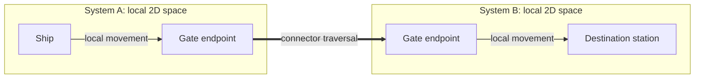
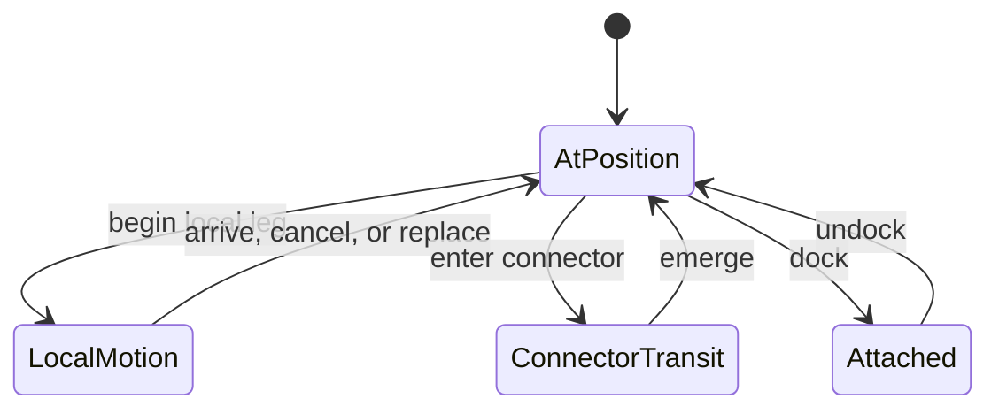
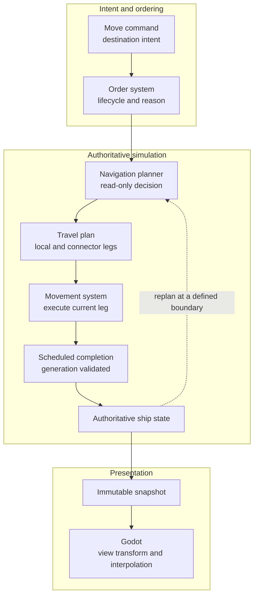
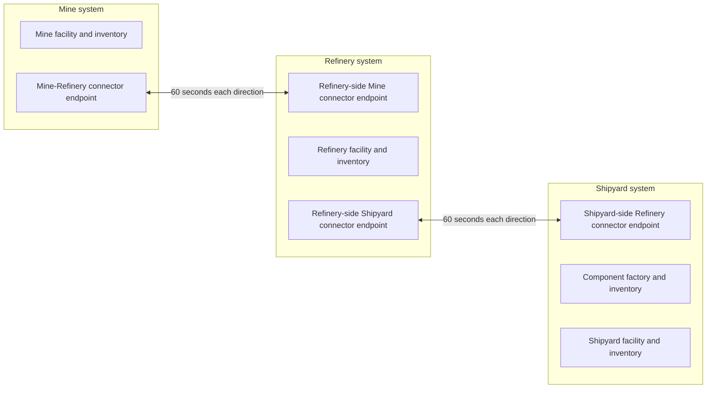

# Navigation and spatial architecture

[Project index](../README.md) · [Simulation architecture](simulation-architecture.md) · [Moving-ship interactions](moving-ship-interactions.md) · [Actor control and order lifecycle](actor-control-and-orders.md) · [Concurrency and performance](concurrency-and-performance.md) · [Player experience](player-experience.md) · [Gameplay integration](gameplay-integration.md) · [Project task list](task-list.md)

## Purpose

Each star system is its own navigable space. Ships can move to positions and
entities within that space. Gates and other transit mechanisms connect distinct
systems without turning the galaxy into one continuous coordinate plane.

The Phase 1 location-and-route graph remains a useful deterministic acceptance
backend, but it is not the target world model. Its graph nodes combine ideas
that the game needs to keep separate: a system, a position, an entity at that
position, and a place where an activity occurs.

This document defines the navigation and spatial boundaries used by the
interactive ship-order runtime. It does not select a final local pathfinding
algorithm, collision model, physical coordinate unit, or scale target.

## Implementation status

The implemented `TASK-028` slices now provide:

- Typed system and motion identities
- Dedicated connector-endpoint, directional-connection, and connector-transit
  identities
- Signed 64-bit system-local coordinates with deliberately unspecified unit
  scale
- Position and system destination intent with `RouteId`-free local and
  hierarchical planners
- Immutable, always-enabled connector topology and deterministic hierarchical
  planning by total local-plus-transit duration with connection-ID tie-breaking
- Actor-specific travel-time estimation outside the planning contract
- Authoritative `AtPosition`, local-motion, and connector-transit ship states
- Scheduled arrival with identity, generation, state, and time validation
- Cancellation and replacement that materialize the current position before
  invalidating prior completion
- Non-interruptible connector traversal: cancellation ends order intent without
  fabricating an in-transit position, while replacement waits for emergence
- Immutable discriminated snapshots containing position, motion, or transit
  state without nullable combinations that can contradict each other

The subsystem is now wired into the clean application-facing `GameSession` and
Godot through `TASK-005`. A move command retains its destination intent while
the planner produces local and connector legs; the movement owner schedules
each completion and the `TASK-006` order coordinator tracks active, queued,
suspended, and terminal state. Replacement materializes local motion before
starting the new leg.

The Phase 1 acceptance fixture now maps its logistics locations to these
contracts and requests opaque hierarchical reachability and duration estimates.
Its legacy graph remains only for compatibility presentation. Runtime connector
availability and access remain in `TASK-030`. Docking and attachment remain
later spatial-state work described below.

## Design at a glance

The player or an autonomous actor chooses a destination. The simulation decides
how to reach it and executes that decision as authoritative movement. A local
journey stays within one system; a longer journey composes local movement with
one or more connector traversals.

The ship, station, and gate endpoints have positions within their systems, but
do not become nodes in one galaxy-wide movement graph. The line between the
gate endpoints represents transit topology, not physical distance between the
two system maps.

The most important boundary is that an order says **where to go**, while
navigation decides **how to get there**. The chosen path may change without
changing the order's meaning.

### Terms used in this document

| Term | Meaning |
| --- | --- |
| System | One authoritative two-dimensional local space |
| Spatial entity | A ship, station, gate, resource site, or other physical object located in a system |
| Connector | The general transit mechanism, initially a gate |
| Connector endpoint | A physical entry or exit entity positioned within a system |
| Transit connection | A directional topology link from one connector endpoint to another |
| Destination | The position, entity, or system named by movement intent |
| Travel plan | A replaceable internal sequence of local and connector legs |
| Motion segment | Authoritative scheduled movement between two positions in one system |

## Core model

### Systems are spatial containers

A system owns a two-dimensional local coordinate space and the spatial entities
currently within it. Ships, stations, gates, resource sites, hazards, and other
physical objects have system-relative spatial state.

There is no authoritative galaxy-wide position that places every system in one
shared travel space. A galaxy-map layout may assign systems display positions,
but those positions are presentation data and do not determine local travel.

An entity that participates in physical activity must be locatable through its
authoritative spatial state. Economic records should refer to the inventory,
facility, or other owning entity rather than copying a second location value
that can disagree with it.

### Connectors join systems

A gate endpoint is a physical entity positioned in a system. A transit
connection leads from that endpoint to an endpoint in another system and
defines direction, availability, traversal duration, and access requirements.

Connector is the general concept covering the endpoints and transit behavior,
so future mechanisms do not have to pretend to be gates. The first
implementation can support gates only. A bidirectional gate pair may be
represented by two directional connections when their rules or state can
differ.

Entering a connector and travelling through it are different from moving
through ordinary local space. A ship must first reach the source endpoint,
satisfy the connector's traversal rules, complete the transition, and emerge at
the destination endpoint.

### Ships have authoritative spatial and motion state

Every ship must be in exactly one physical state:

- `AtPosition` at a definite position within a system
- Following a local motion segment within a system
- Traversing a connector between systems
- Attached to another entity through a state such as docking

`AtPosition` includes a system and local position. It does not imply that the
ship is idle or lacks an active order: a ship may be waiting at a gate, paused
between legs, or stationary under an active order. `LocalMotion` contains
enough information to derive position at any time during the segment.
`ConnectorTransit` records the source, destination, and timing even though the
ship does not occupy ordinary local space during the transition. `Attached`
locates the ship through the entity to which it is attached.

The exact data types remain an implementation decision, but these states must
not be represented by a nullable collection of unrelated fields that can form
invalid combinations.

A local motion segment records enough authoritative information to determine
where the ship is at a simulation time, including its start, destination,
departure, and expected arrival. Normal travel can therefore use scheduled
completion events without mutating every ship at rendering frequency.

Godot may interpolate from that authoritative segment for smooth display.
Rendered frame positions are not written back into the simulation. Activities
that need intermediate physical interaction use the analytic crossing,
triggered reevaluation, and domain-owned opt-in fixed-step boundaries defined
by completed `TASK-019` in
[Moving-ship interaction architecture](moving-ship-interactions.md).

## Navigation contracts

Navigation is divided into intent, planning, and execution. These boundaries
are semantic; the first implementation does not need a general plugin system
or a hierarchy of public interfaces for each paragraph below.

The planner reads authoritative state and returns a decision; it does not move
the ship. Godot reads an immutable result and does not feed rendered positions
back into the simulation.

### Destination intent

A movement order describes where the actor should end up, not the path chosen
to get there. Initial destination forms should cover:

- A position within a particular system
- A physical entity, resolved through that entity's current spatial state
- A system when arrival anywhere through a valid connector is sufficient

Position and system destinations are implemented. A system destination
completes immediately when the actor is already in that system; otherwise it
completes when connector emergence first places the actor at a valid position
inside the requested system. It does not invent a preferred coordinate or add
a final local leg.

Docking, following, patrolling, and attacking may use movement internally, but
they remain distinct gameplay orders with their own completion rules. A move
order must not contain Phase 1 `RouteId` values or a preselected list of gates.

The destination remains stable while planning details may change. If a target
entity moves, the owning order system decides when to refresh the resolved
destination rather than silently changing the meaning of all navigation
requests.

### Planning

A navigation request combines:

- The actor and its current authoritative spatial state
- The destination intent
- Relevant movement capabilities and connector access
- The authoritative simulation time and topology state

A successful result is an ordered travel plan whose legs have explicit
semantics. The required initial leg categories are local movement and connector
traversal. Later planning may add approach corridors, jump behavior, or other
mechanisms without changing the movement-order payload.

Planning is hierarchical:

1. If the destination is in the current system, plan only local movement.
2. Otherwise, choose a deterministic sequence of inter-system connectors.
3. For each connector, plan local movement to its source endpoint.
4. Traverse it and continue planning from the destination endpoint.
5. For a position destination, plan the final local movement. For a system
   destination, complete at the emergence endpoint.

The inter-system topology graph and a system's local spatial navigation are
separate indexes. A single galaxy-wide graph should not contain every arbitrary
position, station, gate, and local waypoint.

The initial hierarchical planner minimizes total estimated local travel plus
connector traversal duration. Equal-duration paths compare their ordered
connection IDs lexicographically. Later cost policy can include access, risk,
or actor policy when those models become authoritative without making worker
completion order a tie-breaker. An unreachable result includes a stable reason
suitable for order state and player-facing explanation.

### Scaling navigation within a crowded system

A system is an authoritative spatial container, not an indivisible work item.
Local navigation and interaction queries must be batchable so one crowded
system can use multiple workers rather than being limited to one thread.

Two-dimensional spatial indexes should restrict proximity and path queries to
relevant candidates instead of comparing every ship with every other ship.
Workers read stable topology and spatial views, then return plan or movement
proposals for deterministic commit. They do not mutate shared ship state or the
event agenda while evaluating.

The spatial index, partition dimensions, and batch sizes remain benchmarking
choices. They must not affect gameplay results. The broader ownership, effect
buffer, merge, and worker-count rules are defined in
[Concurrency and performance architecture](concurrency-and-performance.md).

### Execution

The order system owns the actor's requested destination and lifecycle. The
movement system owns the currently executing travel leg and its scheduled work.
The navigation planner does not mutate the ship.

Beginning a leg validates that its start state and required topology still
match. Completion validates the leg identity, generation, actor state, and
expected completion time before applying movement. Cancellation and replacement
invalidate pending completion through the generation contract. Destruction
cancels its exact pending movement completion before actor removal, as
implemented by `TASK-039`. Cancelling or replacing local motion first derives and
materializes the ship's authoritative position at the command timestamp, so it
does not snap back to the segment's origin or forward to its destination.

An accepted move command means that the order was valid and could begin or
enter a defined waiting state. It does not promise that all future legs will
remain reachable.

Plans may be refreshed:

- Before the first leg
- At a connector or local-leg boundary
- When an order is resumed from a defined waiting state
- When an authoritative topology or target change explicitly invalidates the
  remaining plan

Disabling a connector or invalidating a local path does not silently teleport
or rewind a ship already executing a valid leg. The movement mechanism defines
whether an active leg is allowed to finish, interrupted into a valid spatial
state, or failed. `TASK-030` must define and cover that behavior when runtime
connector availability becomes authoritative.

Connector traversal is physically non-interruptible in the initial runtime.
Cancelling the owning order during transit cancels its intent immediately, but
the ship remains in `ConnectorTransit`, emerges at the recorded destination
endpoint, and becomes idle. Replacing the order during transit cancels the old
intent, creates the new order in `Waiting` with a stable
`WaitingForConnectorTransitCompletion` reason, and replans it from the
emergence point at the completion timestamp.

## Example: moving to another system

Suppose a ship in System A receives an order to move to a station in System B:

1. The order retains the station as its destination. It does not name a gate.
2. Navigation resolves the station's spatial state and selects an accessible
   connector path using deterministic rules.
3. The movement system executes a local segment from the ship's current
   position to the selected gate endpoint in System A.
4. At the endpoint, traversal rules are validated and connector transit begins.
5. The ship emerges at the paired endpoint in System B.
6. Navigation plans the final local segment to the station.
7. The move order completes only when the ship satisfies the destination's
   movement completion rule. Docking is a separate gameplay order with its own
   completion rule.

If the selected gate becomes unavailable before traversal begins, the order
still means “move to that station.” Navigation may choose another connector or
place the order in a defined unreachable or waiting state. If traversal has
already begun, the connector's active-transit rule determines the outcome; the
initial behavior may allow it to finish.

## Authority and presentation

The authoritative simulation owns:

- System membership and system-local spatial state
- Connector endpoints, topology, enabled state, and access rules
- Active orders, travel plans, motion legs, generations, and timing
- The state required to reproduce a ship's position and future completion

Presentation snapshots expose immutable views of those concepts. The Godot
client decides how to lay out systems on a galaxy map and how to transform
system-local coordinates into the current view. It may interpolate an active
motion segment but may not invent authoritative routes, positions, arrivals, or
gate transitions.

Selecting a ship should make the distinction visible: requested destination,
current leg, later planned legs, expected arrival, and any waiting or failure
reason are separate pieces of information.

## Interaction with logistics

Logistics chooses economic endpoints such as a source inventory and destination
inventory. It should not perform pathfinding itself or store graph edges in the
transport job.

Before assignment, logistics requests deterministic reachability and travel
estimates from navigation using the entities that own those inventories. After
assignment, the ship's order and movement systems execute travel to the source
and destination. Loading and unloading begin only when the ship satisfies the
relevant proximity or attachment requirement.

This separation allows a station to move, a gate to become inaccessible, or a
different movement capability to alter the journey without changing the
material reservation and delivery commitments.

## Initial decisions and deferred choices

The following are architectural decisions:

- Systems are distinct local spaces connected by explicit transit mechanisms.
- Connector endpoints and directional transit connections have dedicated
  stable identities; bidirectional gates are two directional connections.
- The first topology is immutable, always enabled, and universally accessible.
- Local movement and inter-system traversal are different travel-leg kinds.
- Orders contain destination intent and never contain a graph-selected path.
- System-relative spatial and motion state is authoritative.
- Normal travel remains compatible with scheduled events and deterministic
  interpolation.
- Inter-system and local planning are separate but compose into one travel
  plan.
- The Phase 1 graph remains a compatibility backend, not the future domain
  model.

The following remain deliberately undefined until a concrete gameplay need or
scale target exists:

- Coordinate unit scale, precision requirements, and world bounds; the initial
  implementation uses signed 64-bit integer units
- Ship acceleration, turning, and formation movement; `TASK-072` separately
  owns ship geometry, physical collision, and avoidance
- Local obstacle representation and pathfinding algorithm
- Gate queueing, congestion, animation, and failure while in transit
- Runtime connector enablement, disablement, access policy, and the authority
  allowed to change topology
- Whether inactive systems use reduced-detail movement
- Sensor knowledge and whether a planner may use undiscovered topology
- Travel-cost policy beyond deterministic duration and availability

## Migration sequence

1. Introduce system identity, system-local positions, and valid ship spatial
   states without removing the Phase 1 graph.
2. Define destination intent and travel-plan results that do not expose
   `RouteId`.
3. Add scheduled local motion between two positions in one system, including
   cancellation, replacement, snapshots, and headless determinism.
4. Implement the first interactive ship move order against that local-motion
   boundary. **Implemented by `TASK-005`.**
5. Add connector endpoints and deterministic directional traversal, then prove
   a multi-system move composed from local and connector legs.
   **Implemented by `TASK-028` after the `TASK-006` order foundation.**
6. Adapt Phase 1 logistics to request reachability and estimates without
   selecting graph legs itself. The approved fixture migration now uses opaque
   hierarchical estimates and revised acceptance fingerprints.
   **Completed by `TASK-031` after `TASK-009` and `TASK-011`.**
7. Replace Phase 1-specific location and route presentation with general
   system, spatial-entity, plan, and motion snapshots.

The compatibility layer should be removed only after the economic scenario and
interactive movement both use the new contracts with focused regression
coverage.

## Approved Phase 1 acceptance mapping

**Decision status:** Accepted by the project owner on 2026-08-10.

`TASK-031` migrates the bounded Phase 1 acceptance fixture without treating a
legacy `LocationId` as a future gameplay identity. The fixture maps each legacy
location to one system and maps each facility and inventory to an explicit
anchored spatial entity. This preserves the existing economic topology while
making the distinctions that the location graph previously collapsed visible to
the migration.

| Legacy location | System | Anchored entities and inventories | Initial ships |
| --- | --- | --- | --- |
| Mine | Mine system | Mine facility entity and mine inventory | One freighter at the mine facility anchor |
| Refinery | Refinery system | Refinery facility entity and refinery inventory | One freighter at the refinery facility anchor |
| Shipyard | Shipyard system | Component-factory entity and inventory; separate shipyard entity and inventory | Constructed freighters appear at the shipyard facility anchor |

Every facility anchor in this fixture uses the same system-local coordinate.
The component factory and shipyard are distinct entities despite being
co-located. The initial local travel-time policy therefore assigns zero duration
between anchors in the same system. This is a compatibility choice, not a
claim that future facilities share a physical position or that local movement
is generally instantaneous.

Each ship cargo inventory remains attached to its owning ship entity. The
fixture's legacy `OrganizationId` continues to identify ownership within the
acceptance composition. It does not create a parallel `GameSession` entity or
principal model; `TASK-034` completed that production integration separately.

The two legacy bidirectional links become directional connector transit pairs:

Each endpoint has its own stable identity. The Mine-Refinery pair and the
Refinery-Shipyard pair each define one connection in each direction. Logistics
may request reachability and estimated travel duration between mapped anchors,
but it must not inspect connector identities, select legs, or retain a
`RouteId`. The test-only fixture has no mutable connector availability. When
`TASK-030` adds authoritative availability, it owns the renewed disruption
coverage and its replan and wake behavior.
