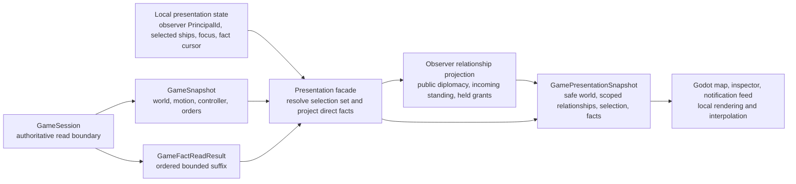

# Presentation snapshots

[Project index](../README.md) · [Gameplay integration](gameplay-integration.md) · [Actor control and order lifecycle](actor-control-and-orders.md) · [Semantic game facts](semantic-game-facts.md) · [Navigation and spatial architecture](navigation-architecture.md) · [Project task list](task-list.md)

## Purpose

`GameSession` already exposes an immutable, rendering-independent `GameSnapshot`.
It contains the authoritative time, topology, ship spatial state, controller,
and order state needed by the current Godot client. It intentionally does not
contain local UI state or a copied fact history.

`TASK-010` makes that boundary pleasant and safe for presentation clients
without making the simulation depend on Godot, a particular layout, or a
fixture. It introduces a read-only presentation composition that resolves a
client's selected ship set and focus, then supplies an incremental fact batch
alongside the world snapshot.

This is a single-player local presentation contract. It is not a replication
protocol, a multiplayer authority model, an event log, or a save format.

**Decision status:** Accepted by the project owner on 2026-07-31.

**Implementation status:** Completed by `TASK-010` on 2026-07-31.
`GamePresentationRequest` canonicalizes client selection and cursor input;
`GameSession.CapturePresentation` returns the immutable presentation-safe world,
selection resolution, cursor-based fact read, and selected-ship fact subset.
Godot retains local selection, focus, and fact-cursor state while using that
read result for map rendering and inspector status.

`TASK-012` later required an observing `PrincipalId` on each presentation
request. The facade now returns a relationship-free presentation world plus a
separate observer-scoped relationship projection. Public principal identity and
diplomacy remain visible; only incoming standing and issued grants held by the
observer cross the private boundary. Relationship facts use the same filter,
and `NextFactCursor` advances past inspected hidden facts without exposing
their payloads.

## Starting point

The clean `GameSession` runtime, rather than `PhaseOneScenario`, already
provides these authoritative read models:

- `GameSnapshot`, including sorted systems, connector topology, and ships.
- `GameShipSnapshot`, including discriminated spatial state, controller,
  current order, queued orders, and suspended orders.
- `GameFactReadResult`, an ordered bounded fact suffix with its consumer
  cursor-gap signal.

Godot currently owns a `SelectedShipId` inside `GalaxyMap`, captures a world
snapshot, and separately formats selected-ship details in `Main`. That proves
the data is available, but spreads presentation composition across controls and
does not yet expose recent facts.

## Decision summary

| # | Question | Recommended answer |
| --- | --- | --- |
| 1 | What remains the canonical world read model? | `GameSnapshot`; do not replace it with a UI-specific aggregate. |
| 2 | Who owns selection? | The presentation client owns a deterministic set of `ShipId` values and one optional focused member; selection is not simulation state and does not submit a command. |
| 3 | How is selected-ship detail represented? | Resolve the requested set against one captured `GameSnapshot`, reusing immutable `GameShipSnapshot` values for controller, spatial state, and order detail. |
| 4 | How are recent facts supplied? | Request a bounded suffix through the existing cursor query, preserve its order and `CursorGap`, filter private relationship payloads, and return the last inspected sequence as `NextFactCursor`. |
| 5 | Which facts are relevant to selected ships? | Provide a pure direct-reference projection for fact payloads that explicitly carry one of the selected `ShipId` values; never infer relevance from time, event order, or a command's proximity. |
| 6 | Does presentation interpolate simulation state? | No. The snapshot supplies authoritative current position or motion segment. Rendering may interpolate locally from that segment and must discard the result each refresh. |
| 7 | What happens when a selection member disappears? | The refresh reports the unresolved requested ID. The client removes or changes its local selection; it does not invent a destruction reason. |
| 8 | What fact history is retained for UI? | The simulation keeps its configured bounded window. Each client separately chooses its cursor, request limit, and bounded visible feed. |

## Accepted model at a glance



The facade is a read-only convenience at the application boundary. It neither
owns the world nor accepts commands. `GameSession` remains the only simulation
facade for advancing time and submitting gameplay commands.

## Read contract

The implementation should add a rendering-independent presentation type near
the existing snapshot records. The exact type names remain implementation
details, but the contract has these inputs and outputs:

```text
Input
  observerPrincipalId: registered PrincipalId defining the information boundary
  selectedShipIds: unique ShipId values in ascending ShipId order
  focusedShipId: optional member of selectedShipIds
  factCursor: optional GameFactSequence
  maximumFactCount: positive bounded count

Output
  world: presentation-safe world without complete relationship diagnostics
  relationships: public identity and diplomacy, incoming standing, and grants
                 issued to the observer
  selection: requested IDs, resolved GameShipSnapshot values, unresolved IDs,
             and optional resolved focus
  facts: observer-visible GameFactReadResult preserving source order and gap semantics
  selectedShipFacts: ordered direct-reference subset for the selected set
  nextFactCursor: last source fact inspected, including withheld private facts
```

The facade captures the world after the current command or advancement call has
completed, then reads the fact suffix at that same public read boundary. The
current runtime is single-threaded. When evaluation becomes concurrent, this
operation must occur only after deterministic owner commits have joined, so it
never observes a partially committed domain or fact batch.

The client retains its own cursor. It advances the cursor to `NextFactCursor`
after processing the response. That cursor may pass relationship facts withheld
by the observer filter, but never skips an uninspected source fact. It does not
advance directly to `NewestCommittedSequence`; a request limit may leave later
retained facts unread. If `CursorGap` is true, the
client must visibly treat its prior feed as incomplete, may clear its local
notification history, and may continue from the delivered suffix. It must not
claim it reconstructed the lost facts.

The selected-ship input is a set, not a command target. Its public ordering is
ascending `ShipId`, independent of click order or rendering order, and a focus
must either name a selected ship or be absent. The focus is the one member whose
details appear in the inspector; the full selected set may receive map
highlighting and summary presentation. An absent selected ship is a normal
resolution result, not an error. This allows the current UI to remove a stale
member and gives `TASK-011` a clean future integration point for destruction
and despawn. This task does not add a generic entity-selection identifier before
that lifecycle contract exists.

## Selected details and fact relevance

Each resolved selection member reuses its `GameShipSnapshot`; the focused
member supplies inspector detail without creating a competing copy of controller
or order truth. The inspector can therefore show:

- Base and active controller identity, plus any active override already
  represented by `ActorControlSnapshot`.
- Current order destination, status, and reason, plus existing queued and
  suspended orders when the UI chooses to expose them.
- Authoritative at-position, local-motion, or connector-transit state.

The initial selected-ship fact subset is the union of facts whose payload has
an explicit `ShipId` in the selected set: order transitions, local-motion start
and end, and connector-transit start and completion. It preserves the source
fact sequence rather than grouping by ship. Command accepted and rejected facts
remain in the session activity batch because their current payloads identify a
command and source, not a ship. Presentation must not guess that a nearby
command outcome caused a particular selected ship change.

Multi-selection does not authorize group commands. Current gameplay commands
remain explicitly single-ship commands, and only the focused ship can drive the
existing Godot move or cancel interaction. `TASK-033` owns the later decision
about issuing one intent to a selected set or a persistent fleet, including
eligibility, atomicity, and order lifecycle.

The facade returns semantic envelopes, not localized strings, icons, colors, or
notification priorities. Godot owns wording and local layout. A later fact
type gains selected-ship relevance only by explicitly carrying a stable ship
identifier in its own authoritative contract.

## Authority and interpolation

`GameSnapshot` remains authoritative only as a read model. A renderer may
interpolate between the supplied local-motion segment endpoints using local
real time, but that value is disposable visual state. It cannot be fed back to
planning, collision, command validation, event timing, or a later snapshot.
Connector transit intentionally has no fabricated system-local position, so
the presentation must render it as transit rather than interpolate a location.

Selection set membership, focus, expanded inspector sections, notification
dismissal, camera state, and local fact-feed retention belong to the client.
They are not part of
`GameSession`, semantic facts, deterministic snapshots, or the authoritative
save inventory in `TASK-014`.

## Implementation sequence and proof

1. Add immutable presentation request and result records in the simulation
   assembly without a Godot dependency.
2. Add one `GameSession` read method that composes `CaptureSnapshot` and
   `ReadFactsAfter` after a completed public mutation boundary.
3. Implement selected-set resolution, focus validation, and direct-reference
   fact projection as pure code.
4. Move Godot's refresh path to consume the composed result while retaining
   local selection and cursor state.
5. Add headless tests for no selection, one or many resolved members, stable
   `ShipId` ordering, invalid or stale focus, unresolved members, controller
   and order detail, ordered fact delivery, request limits, cursor-gap
   propagation, and selected-set fact filtering.
6. Build Godot and run the simulation suite. Preserve the existing Phase 1
   acceptance fingerprints and canonical benchmark digests.

## Deferred choices

This task does not decide:

- Generic selection across future non-ship entities, including destroyed or
  despawned entity history. `TASK-011` first defines those entity identities
  and lifecycle semantics.
- Group or fleet command submission, including whether an intent succeeds
  atomically, permits partial acceptance, or targets a persistent group rather
  than a transient presentation selection. `TASK-033` owns that contract.
- Faction, relationship, dialogue, objective, knowledge, combat, production,
  construction, or logistics presentation fields.
- Player-facing notification wording, accessibility behavior, localization,
  grouping, priorities, or cross-save history.
- Camera controls, map scaling, visual effects, or a physical coordinate unit.
- Runtime connector availability, access, or Phase 1 navigation migration.
- Save serialization, replay, telemetry, disk-backed fact archives, or any
  multiplayer or replication behavior.

Those decisions remain with their owning tasks. In particular, `TASK-011`
defines lifecycle and later generic entity selection, `TASK-032` defines
economy facts, and `TASK-014` defines the authoritative save boundary.
