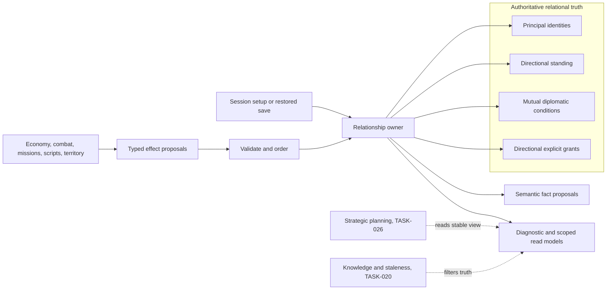
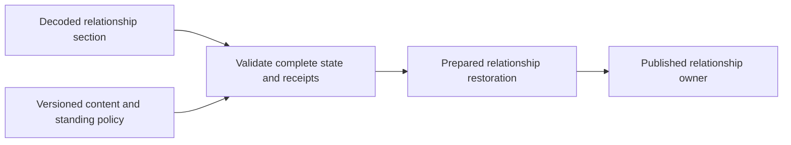

# Relational simulation architecture

[Project index](../README.md) · [Relational gameplay model](factions.md) · [Simulation architecture](simulation-architecture.md) · [Semantic game facts](semantic-game-facts.md) · [Concurrency and performance](concurrency-and-performance.md) · [Project task list](task-list.md)

## Purpose

The accepted relational gameplay model defines powers, directional standing,
explicit diplomatic conditions, standing-dependent grants, and practical
territorial authority. This document translates that model into authoritative
simulation boundaries without adding faction strategy, diplomacy policy,
territorial claiming, or a detailed knowledge system.

The first implementation must answer four questions consistently:

- Which participant owns an asset and receives relationship consequences?
- What relationship truth does the simulation own between two participants?
- How do independent systems propose changes without mutating that truth?
- Which state, facts, and read models are required for deterministic play and
  eventual save restoration?

**Decision status:** Accepted by the project owner on 2026-08-06.

**Implementation status:** Completed by `TASK-012` on 2026-08-06.
The implementation provides principal identity and definitions, standing policy
and setup validation, a session relationship owner, complete diagnostic
standing snapshots, and clean-session asset ownership through `PrincipalId`.
It adds source-scoped idempotent standing batches, stable
contribution reduction, rejection-atomic prepared commit, and semantic standing
facts. It also adds canonical mutual diplomacy, explicit issued and
revoked grant state, standing-dependent effectiveness queries, rejection-atomic
policy batches, and typed diplomacy and grant facts. Presentation requires
an observing `PrincipalId`, removes complete relationship diagnostics from the
presentation world, and returns a separate scoped relationship projection and
fact feed. The authoritative save inventory and restoration contract are now
recorded for `TASK-014`.

## Decision summary

| Question | Decision |
| --- | --- |
| What is the initial participant concept called? | Use `Principal` and `PrincipalId` internally for the one accountable party that can own assets and hold relationships. Player-facing content may call a principal a power, faction, company, or another fitting term. Replace the clean session's provisional `OrganizationId`; do not add a second faction hierarchy. |
| Who owns relational truth? | One session-level relationship owner holds principal identity, directional standing, mutual diplomatic condition, and explicit grants. |
| How is asset control represented? | Asset ownership names a `PrincipalId`. Existing actor-control state separately names who may issue orders. Neither field is derived from the other. |
| Is affiliation modeled now? | No. Formal membership and organization hierarchies remain deferred. The initial principal is already the accountable relationship participant. |
| How is standing represented? | Store a bounded deterministic integer value. Derive the five accepted bands through validated session policy thresholds. |
| How is diplomacy represented? | Store one mutual condition for a canonical unordered principal pair. The initial vocabulary is `Peace` and `War`. |
| How are important permissions represented? | Store explicit directional grants from issuer to holder. A grant is effective only while issued and while its standing requirement is satisfied. |
| How do other domains change relationships? | They submit typed immutable proposals with explicit subjects, reasons, and stable ordering keys. Only the relationship owner validates and commits them. |
| What does presentation receive? | Full diagnostic snapshots remain separate from observer-scoped relationship views. Public truth may be shown directly; private or discoverable truth requires the knowledge boundary from `TASK-020`. |
| What must a save eventually preserve? | Principal identity, standing values, diplomatic conditions, issued grants, policy identity, and owner ordering state. Facts are not the source of truth. |

## Terminology and identity

### Principal is the internal accountable participant

A `Principal` is the internal form of the initial shared participant concept
that the gameplay model provisionally calls a power. It may represent the
player's independent operation or a larger non-player polity, company, or
faction. Presentation and content may use the term appropriate to that fiction;
the simulation does not infer internal structure from the label.

Every principal has:

- A stable non-zero `PrincipalId`
- A stable content-facing definition identity
- A display name supplied by content

The content identity allows save loading to resolve authored principals without
using display text as identity. Whether that identity is a code, catalog key,
or another value belongs to the later content and save-format work. Runtime
state uses `PrincipalId` exclusively.

The clean `GameSession` currently uses `OrganizationId` as ship ownership
identity. The first implementation should migrate that field to `PrincipalId`
rather than preserve two names for the same concept. Acceptance-only Phase 1
types may migrate separately when their owning task moves them into the clean
runtime.

`PrincipalId` does not mean government, legal organization, citizenship, or
formal membership. Those concepts are absent until an accepted gameplay
scenario requires them.

### Ownership, control, and affiliation remain separate

An asset stores its owning `PrincipalId`. Ownership answers who possesses the
asset and normally receives its benefits or losses.

Actor control continues to answer who may issue and replace orders. The
existing base controller and temporary override lifecycle remains authoritative
for that question. A controller does not become an owner merely by controlling
an asset, and ownership transfer must not silently rewrite active control.

Affiliation is not an alias for either field. The first version has no formal
membership state. A future membership model may associate a principal,
controller, or character with a larger participant, but it must be added by a
task with a concrete gameplay need.

Relationship changes name the affected `PrincipalId` explicitly. A trade, combat,
mission, or piracy subsystem must not ask the relationship owner to guess an
accountable principal from current control. The originating domain captures the
relevant owner and controller identities when its outcome commits, then its own
policy decides which principal receives a proposed consequence. `TASK-036` owns
the piracy-specific version of that attribution decision.

## Authoritative ownership model

One session-level `RelationshipOwner` owns all shared relational truth. It is
not owned by either participant in a relationship, because diplomacy and grants
must commit once and be observed consistently by both sides.



The relationship owner exposes stable immutable reads for evaluation. Workers
and other domain owners never mutate its dictionaries or allocate relationship
sequences directly. A deterministic commit barrier applies accepted proposals.

The owner stores entries in stable `PrincipalId` order. Collection implementation
is not gameplay policy, but public snapshots and commit traversal must never
depend on hash iteration or worker completion order.

## Authoritative state

### Principal registry

The principal registry contains every live relationship participant. Session
setup registers authored principals before registering assets that reference them.
Setup rejects duplicate identifiers, duplicate content identities, blank names,
and assets or relationship entries that reference an unknown principal.

Mod loading must preserve this rejection behavior after base and mod content are
combined. A mod may not silently replace a principal because its runtime or
content identity collides with another source. Diagnostics should identify both
content sources so the player or mod author can resolve the conflict. Content
catalog versioning, provenance, and migration of saved references belong to
`TASK-037` rather than weakening setup validation for compatibility.

The player begins as one registered principal representing the independent
trading operation, presented to the player as a power when that term is useful.
Player control is not inferred from a special numeric identifier. Session setup
explicitly identifies the player principal so presentation and player-specific
relationship queries can name their observer.

Runtime creation or removal of principals is outside the initial implementation.
Entity lifecycle operations create and remove assets, not relationship
participants. A later task must define what happens to assets, relationships,
grants, diplomacy, and history before principal removal can be supported.

### Directional standing

Standing is keyed by an ordered pair:

```text
(assessingPrincipalId, subjectPrincipalId)
```

The value answers how the assessing principal currently regards the subject. The
reverse direction is a separate value. Self-standing is invalid and is never
stored.

The authoritative value is a bounded signed integer. Integer arithmetic avoids
floating-point reduction differences and allows exact save restoration. A
validated `StandingPolicy` supplies:

- The inclusive minimum and maximum values
- Strictly increasing thresholds for Adversarial, Neutral, Favorable, and
  Allied
- The initial value for an omitted relationship

Values below the first threshold are Hostile. The remaining thresholds produce
the accepted Adversarial, Neutral, Favorable, and Allied bands in order.
Thresholds and initial values are configuration, not embedded constants. The
policy must include or resolve through a stable content version so a save does
not silently reinterpret a stored standing value under different thresholds.

A standing change proposal supplies a signed delta and a typed reason. Commit
groups proposals by directional pair, orders their reason contributions by
stable key, sums the deltas with checked arithmetic, and clamps the combined
result once to the configured range. This produces the same value across valid
batch layouts. The prepared change records the prior and resulting value and
band plus the ordered contributions. No time-based reconciliation changes
standing.

Routine trade caps, mission rewards, combat penalties, restitution, and
temporary incidents belong to the domains that understand those outcomes.
They may propose a standing delta only after their own accepted policy exists.
The relationship owner enforces value and ordering rules but does not invent a
consequence from raw economic or combat activity.

### Mutual diplomatic condition

Diplomatic condition is keyed once for an unordered pair, canonicalized by
ascending `PrincipalId`. Self-diplomacy is invalid. The initial vocabulary is:

- `Peace`
- `War`

Standing never derives diplomatic condition, and diplomatic condition never
rewrites standing. A change requires an explicit typed proposal from authored
setup, a major gameplay outcome, or a script using an approved effect. Fully
autonomous diplomatic decisions remain deferred.

If setup omits a pair, its initial diplomatic condition is `Peace`. The owner
may store only non-default values internally, but snapshots and queries must
return the same result regardless of that storage choice.

### Explicit grants

An important permission is a directional grant from one issuer principal to
one holder principal. Every grant contains:

- A stable `RelationshipGrantId`
- Issuer and holder `PrincipalId` values
- A content-defined grant kind
- The minimum standing band required for use
- Issued or revoked state

The initial shared model does not predeclare a catalog of military procurement,
construction, policing, information, or restricted-space grant kinds. The
system that introduces one must define its stable kind and the behavior that
checks it.

A gameplay issue effect can commit only when the issuer's standing toward the
holder meets its minimum band. Initial setup may declare an already-issued
grant below that threshold, representing a permission that begins suspended.
An issued grant is effective only while its standing condition holds. Falling
below the threshold suspends its use without rewriting its issued state;
explicit revocation remains distinguishable. This keeps standing-dependent
access deterministic and makes revocation explainable.

Grant checks use one stable relationship view captured for the evaluation
wave. A worker does not observe a standing change committed midway through its
own evaluation. Any newly enabled or disabled use takes effect at the next
defined barrier unless the command and relationship change are part of one
explicitly prepared cross-owner transaction.

Grant scope beyond issuer, holder, and kind is deferred until a concrete right
needs an asset, territory, or time scope. Do not add nullable generic scope
fields before that requirement exists.

### Territory and published rules

Territorial control is public relational input, but the accepted gameplay
model intentionally defers the rule that awards control. The existing runtime
also has no material territory or restricted-boundary entity.

`TASK-012` therefore defines the integration boundary without creating
territory state:

- The future territory owner determines the controlling `PrincipalId` from
  material presence and its accepted claiming rule.
- It publishes that controller and the rules enforced in the territory.
- Permission checks query relationship grants and current treatment but do not
  transfer ownership of assets inside the territory.
- Violations produce explicit domain outcomes that may later propose
  relationship changes.

System ownership must not be added as a nullable field merely to stand in for
territory. A star system, claimed region, restricted boundary, and station
jurisdiction may not be the same gameplay object.

### Strategic goals

Strategic goals are principal-owned state, but not relationship state.
Player-facing descriptions may still call them a power's goals. `TASK-026`
will define their identity, selection, evaluation cadence, and conversion into
requirements and orders. That planner may read an immutable relationship view
and submit ordinary work proposals. It may not mutate standing, diplomacy,
grants, assets, or economic inventories directly.

## Effects and deterministic commit

### Proposal boundary

Relationship changes enter through closed typed effects rather than a generic
property bag. The initial effect vocabulary is:

- Adjust directional standing
- Set mutual diplomatic condition
- Issue a grant
- Revoke a grant

Each effect names all affected principals, its typed semantic reason, and a stable
domain correlation identity. Human-readable explanation text is presentation
state, not authoritative input.

Standing changes use a source-scoped batch identity so independent domain
owners do not share an allocator. Contribution identities are stable within one
directional pair and batch. Repeated delivery of the same canonical batch
returns its prior receipt; different content under the same identity rejects
without mutation.

Gameplay commands do not initially expose a raw "change standing" or "declare
war" operation to the player. A command addresses a concrete gameplay action.
The domain that commits its outcome may produce relationship effects according
to approved policy. Authored scripts may request the same typed effects through
their restricted effect vocabulary once `TASK-017` defines it.

### Prepare and apply

One relationship commit follows the project-wide evaluate-and-commit model:

1. Read one stable relationship view during domain evaluation.
2. Produce immutable effects with stable merge keys.
3. Sort by cause, assessing or lower pair principal, subject or upper pair
   principal, effect kind, correlation identity, and domain ordinal.
4. Validate all references, enum values, standing arithmetic, grant identity,
   grant thresholds, and incompatible duplicate assignments without mutation.
5. Build a prepared commit containing exact prior and resulting values.
6. Apply the prepared commit through operations that cannot reject.
7. Publish semantic fact proposals in the same defined order.

Two assignments to the same diplomatic pair with different resulting
conditions in one commit are an implementation fault unless their originating
domain has already reduced them to one result. The relationship owner does not
resolve policy conflicts by whichever proposal arrived last.

Standing deltas for the same direction combine into one prepared change because
integer addition is defined. Their individual deltas, reasons, and correlations
remain ordered contributions to that change. Grant issue or revoke proposals
for the same grant must instead be reduced by their originating domain before
commit.

Unexpected exceptions during apply poison the session. They must not be
reported as ordinary command rejection after another authoritative owner may
already have committed. Cross-owner commands use read-only preparation across
all participating owners followed by non-rejecting apply, matching the entity
lifecycle atomicity contract.

### Relationship checks during commands

A command or order that depends on relationship state names the required
condition explicitly, such as a diplomatic condition, minimum treatment band,
or effective grant. Its owning domain validates that requirement during command
preparation.

The relationship owner provides queries; it does not accept or reject movement,
trade, docking, construction, or combat commands itself. This keeps the rule
and its consequence with the domain that can explain the attempted action.

If a long-running order loses required permission, the owning domain defines
whether it completes, waits, replans, or fails and which relationship change
wakes it. `TASK-030` owns this contract for connector access. No generic
relationship invalidation should cancel unrelated orders.

## Semantic facts and explanation

Every committed relational change emits a typed fact containing stable
identifiers and prior and resulting state:

- `StandingChangedFact`, including direction, prior and resulting value and
  band, combined delta, and ordered typed reason contributions
- `DiplomaticConditionChangedFact`, including the canonical pair, prior and
  resulting condition, and typed reason
- `RelationshipGrantIssuedFact`, including grant identity, parties, kind, and
  standing requirement
- `RelationshipGrantRevokedFact`, including grant identity and typed reason

A standing change that clamps at a configured bound still emits a fact only if
the authoritative value changes. A no-op diplomatic assignment or repeated
grant delivery returns its prior result and emits no duplicate fact.

Fact proposal keys use the relationship commit's stable ordering fields.
Workers never allocate `GameFactSequence`. The fact owner assigns sequences at
the deterministic barrier after relational state commits.

Facts carry reason codes, not localized prose. The reason vocabulary belongs
to the domain whose outcome caused the change. The first implementation may
include setup and explicit test reasons; economic, combat, mission, territorial,
and piracy reasons arrive with their owning tasks.

The bounded semantic fact window is not sufficient to promise a persistent
player-facing cause history. `TASK-025` decides which explanations survive
fact-window eviction and save/load. Until then, relational facts provide the
causal integration point without pretending to be an unlimited ledger.

## Snapshots and information boundaries

### Authoritative diagnostic snapshot

The complete `GameSnapshot` may include immutable relationship diagnostics for
tests, save-inventory audits, and development tools:

- Principals ordered by `PrincipalId`
- The stable standing policy identity
- The complete resolved directional standing matrix, ordered by assessing then
  subject `PrincipalId`
- Mutual diplomatic entries ordered by lower then upper `PrincipalId`
- Grants ordered by `RelationshipGrantId`

Snapshots contain both standing value and derived band so tests can verify
policy application. They identify whether a grant is issued and currently
effective. Collections are immutable and captured only after owner commits
join.

This complete snapshot is authoritative truth, not automatically a safe
player-facing view.

### Observer-scoped presentation

Relationship presentation requires an observer `PrincipalId`. The initial safe
view may expose:

- Public power identity and display name projected from the principal
- Public diplomatic conditions
- The observer's treatment by another power
- Grants issued to the observer and their effective state
- Warnings and published territorial rules once their owning domains exist

The reverse private assessment, unobserved incidents, private agreements, and
strategic goals must not enter the player view merely because they exist in the
diagnostic snapshot. `TASK-020` defines confirmed, reported, and stale knowledge
and will expand the scoped projection.

`GamePresentationSnapshot` no longer wraps the complete `GameSnapshot`. Its
request identifies the observing principal, its presentation-safe world omits
complete relationship diagnostics, and it returns the scoped relationship view
separately. Relationship facts are filtered at the same boundary. Godot never
receives private reverse standing to filter locally.

## Setup, persistence, and restoration

Initial `GameSessionSetup` additions are:

- Registered principal definitions
- The player `PrincipalId`
- Initial directional standing overrides
- Initial non-peace diplomatic conditions
- Initial issued grants
- The standing policy or stable reference to it

Setup canonicalizes all collections and rejects invalid cross-references before
constructing any runtime owner. Omitted directional relationships use the
standing policy's initial value. Omitted diplomacy uses peace. Setup does not
silently create principals referenced only by an asset or relationship. An
initial issued grant may begin below its minimum standing band; setup retains
the issued state and derives it as ineffective.

### Authoritative relationship save inventory

`TASK-012` contributes the following exact inventory to `TASK-014`. The save
format may encode it differently, but it must be sufficient to reconstruct the
same authoritative state and idempotency behavior:

| Owner state | Required information |
| --- | --- |
| Principal registry | Every `PrincipalId`, stable `PrincipalContentId`, and the content reference needed to reconstruct its authored display metadata; the player `PrincipalId` must remain registered. |
| Standing policy | `StandingPolicyId`, minimum, maximum, initial value, and all four ordered band thresholds, or a versioned content reference proven to resolve to exactly those values. |
| Directional standing | The exact `StandingValue` for every non-self assessing and subject pair. Bands are derived from the restored policy and are not independent save authority. An encoding may omit policy-default values only if omission reconstructs the identical matrix. |
| Mutual diplomacy | The `DiplomaticCondition` for every canonical unordered pair. An encoding may omit `Peace` only when omission has that exact default meaning. |
| Explicit grants | Every `RelationshipGrantId`, issuer, holder, content-defined kind, minimum standing band, and issued or revoked state. Effectiveness is derived from issued state and current issuer-to-holder standing. |
| Standing delivery receipts | Every committed source-scoped `StandingChangeBatchId`, its canonical directional proposals and ordered contributions, and the applied receipt needed to return the same prior and resulting values on repeated delivery. |
| Diplomacy and grant delivery receipts | Every committed source-scoped `RelationshipPolicyChangeBatchId`, its canonical closed proposal values, and the applied diplomatic and grant outcomes needed for identical repeated delivery. |

Rejected deliveries are not committed owner state and are not retained.
Committed no-op deliveries are retained because their identities must remain
idempotent after load. Receipt encodings may omit derived bands and combined
standing deltas only when restore recomputes and validates the identical
values.

The relationship owner has no internal identity allocator, random state,
scheduled work, or simulation clock. Grant IDs and both batch ID families are
supplied by their source domains. Any future source-domain allocator belongs to
that domain's `TASK-014` inventory rather than this owner.

### Restoration contract

New-session setup and restoration both permit an issued grant below its minimum
standing band and derive `IsEffective` as false. Restoration still requires a
separate owner-level path because setup does not contain committed idempotency
receipts or the complete cross-owner state needed for atomic publication.



Before publishing a session, the restore path must:

1. Resolve the required content and standing policy compatibility through the
   boundaries owned by `TASK-037` and `TASK-022`.
2. Validate principal and content identities, the player reference, policy
   ordering, standing ranges, canonical diplomacy pairs, grant identities and
   references, enum values, and non-blank grant kinds.
3. Validate committed batch uniqueness, canonical proposal ordering,
   contribution uniqueness and checked sums, receipt outcomes, and consistency
   with the restored policy.
4. Construct the complete relationship state and committed-receipt maps without
   mutating a live owner.
5. Publish the prepared owner only after every relationship and cross-owner
   reference validates.

Restore assigns authoritative state directly. It does not replay relational
effects or semantic facts. `RelationshipSnapshot`, observer projections,
derived bands, grant effectiveness, selection, fact cursors, and presentation
facts are read models rather than relationship save authority. The retained
fact window may be preserved separately for presentation or explanation, but it
cannot reconstruct relationship truth or idempotency receipts.

The current diagnostic snapshot does not expose committed delivery receipts.
`TASK-014` therefore needs an owner-level save capture taken at a completed
commit boundary rather than treating `GameSnapshot` as a serialization model.

Save encoding and schema migration remain `TASK-022`. Versioned content
catalogs, mod provenance, and migration of saved content references remain
`TASK-037`. This document defines the state those formats must preserve.

## Initial implementation slices

Implementation proceeds in dependency order:

1. Add `PrincipalId`, principal definitions, standing policy, setup validation,
   and an immutable relationship owner with query and diagnostic snapshot
   coverage.
2. Migrate clean-session asset ownership from `OrganizationId` to `PrincipalId`
   while preserving the existing actor-control boundary and canonical
   fingerprints.
3. Add prepared standing effects, deterministic commit, structured facts, and
   idempotency tests.
4. Add mutual diplomacy and explicit grant state, effects, facts, and effective
   permission queries.
5. Add the observer-scoped relationship presentation boundary without exposing
   private reverse standing.
6. Record the authoritative save inventory for `TASK-014`; do not implement a
   serialization format inside `TASK-012`.

Slices 1 through 6 are implemented. The accepted `TASK-012` architecture and
implementation are complete.

Each slice needs focused tests for setup rejection atomicity, directional
asymmetry, stable ordering, immutable snapshots, worker and batch-order
invariance at the proposal boundary, no-op delivery, fact ordering, and
unchanged unrelated owner state. The completed task must also pass the full
simulation tests, Release build, format verification, Godot headless build,
and canonical benchmark digests.

## Representative acceptance boundaries

The gameplay scenarios in the accepted relational model constrain later
vertical tests as follows:

| Scenario | `TASK-012` foundation | Later owning work |
| --- | --- | --- |
| Independent trader | Player principal, directional standing, band and grant queries | Economic causes and contracts |
| Border incident | Effective restricted-access grant query and relationship effects | Territory boundary, warning, movement, and combat policy |
| Profiting from conflict | Explicit war state with no automatic trade penalty | Economic facts and mission consequences |
| Material assistance | Typed standing effect and reason correlation | Scarcity, escort, and mission outcome evaluation |
| Growing into a territorial power | Principal identity works for player and non-player participants | Stations and material claiming rule |
| Relationship conflict | Directional standing and explicit mutual diplomacy remain independent | Mission preview and knowledge projection |

`TASK-012` proves the shared state can express these outcomes. It does not
manufacture the domain events needed to play every scenario.

## Explicitly deferred

This architecture does not define or implement:

- Formal membership, subsidiaries, citizenship, or internal organizations
- Ownership transfer, capture, surrender, or control reassignment policy
- Autonomous strategy, goal selection, or diplomacy
- Territory identities, claiming algorithms, boundaries, or law enforcement
- Docking, trade, procurement, construction, policing, or information grant
  catalogs before those systems consume them
- Reputation consequences for economy, combat, missions, or piracy
- Temporary incident duration and expiry behavior
- Detailed observation, attribution, secrecy, or staleness
- Persistent explanation retention beyond relational truth
- Player negotiation, treaty drafting, or alliance proposals
- Save serialization, schema migration, or replay

These omissions preserve the accepted task boundaries. They are not licenses
to infer policy inside the relationship owner.
