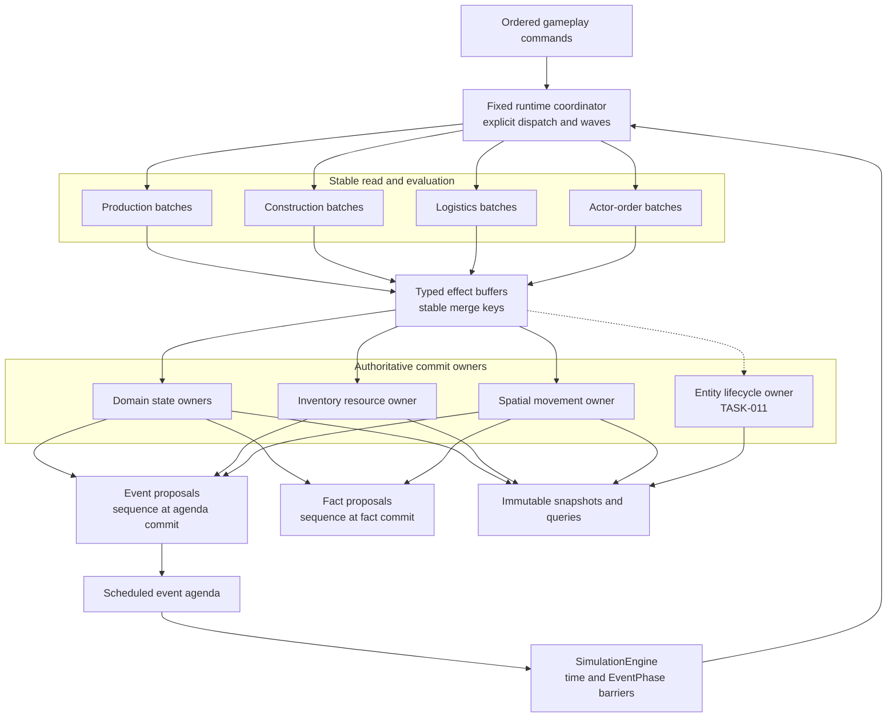
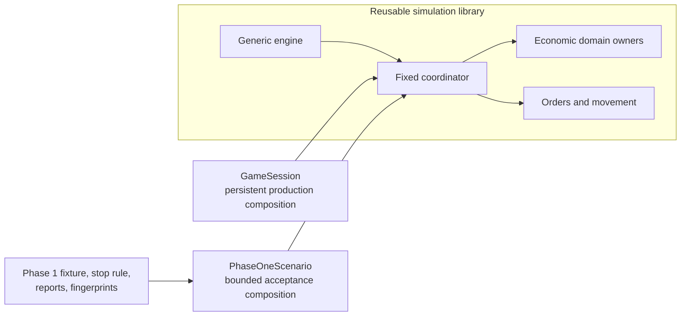

# Runtime orchestration and domain ownership

[Project index](../README.md) · [Simulation architecture](simulation-architecture.md) · [Gameplay integration](gameplay-integration.md) · [Concurrency and performance](concurrency-and-performance.md) · [Scale targets and benchmarks](scale-and-benchmark-targets.md) · [Semantic game facts](semantic-game-facts.md) · [Project task list](task-list.md)

## Purpose

The production runtime needs to combine economic activity, actor orders,
movement, and later gameplay domains without growing one class that owns every
event, decision, state transition, and report.

The current Phase 1 acceptance loop proves that production, transport, and
construction can form a deterministic causal chain. Its combined
`PhaseOneRuntime` is useful evidence, but it is not a production abstraction.
Roadmap-stage names, fixture controls, the first-ship stopping condition, and
acceptance fingerprints must not become permanent gameplay architecture.

This document defines the `TASK-009` production orchestration boundary and the
migration that removes `PhaseOneRuntime`. It defines domain and resource
ownership, deterministic evaluation waves, buffered effects, event and fact
commit, measurement boundaries, and the continuing role of the Phase 1
acceptance harness.

**Decision status:** Accepted by the project owner on 2026-07-29.

**Implementation status:** Complete. Production and construction readiness
now use immutable ordered facility batches, typed reservation proposals,
deterministic facility/material commit, and typed completion-event proposals
on the single-thread path. Construction completion emits a typed
materialization effect consumed by an acceptance-only ship materializer.
Logistics publication and assignment use typed proposals and a complete
candidate reducer ordered by `ShipId`. A fixed `EconomicRuntimeCoordinator`
now owns the production, construction, publication, and assignment wave order
and aggregates their measurement boundaries. Decision-wave transport
advancement now evaluates immutable assigned-job reads, revalidates shared
destination capacity during `ShipId`-ordered commit, and emits typed event
proposals. Production, construction, and decision-wave transport proposals use
one agenda commit owner with stable merge keys and commit-time creation
sequences. Production completion emits a typed stored-output effect, and
transport completion handlers commit their physical transition before
returning typed follow-on advancement and event proposals through the same
owners. Actor-driven local motion and connector traversal now return typed
movement commits with future event proposals, and the persistent runtime routes
those proposals through the shared agenda owner without changing actor facts.
`ActorOrderRuntimeCoordinator` now owns fixed actor command and event dispatch,
and `EconomicRuntimeSystem` owns reusable economic reconciliation and event
dispatch. `PhaseOneScenario` composes the economic system directly and retains
only its acceptance fixture, adapters, stopping, metrics, reports, and
fingerprints; the former combined `PhaseOneRuntime` has been removed.

**Implemented direction:** The Phase 1 economy is behind reusable production
systems. `PhaseOneScenario` remains a bounded acceptance harness and the former
combined runtime is not a production base class or compatibility layer.

## Starting problem

Before this migration there were two runtime compositions:

- `GameRuntime` is the persistent application runtime. It owns actor control,
  ship orders, spatial movement, command handling, scheduled movement events,
  and semantic fact publication.
- `PhaseOneRuntime` is an acceptance-only economic runtime. It owns production,
  construction, logistics, the legacy route graph, fixture disruptions,
  metrics, shortages, diagnostic records, snapshots, and its stopping rule.

The Phase 1 decision callback directly performs these operations in order:

1. Prepare production.
2. Prepare construction.
3. Publish material demand.
4. Publish material supply.
5. Assign or retry freighters.

Those calls mutate jobs, inventories, reservations, transport state, metrics,
identifier sequences, and the shared event agenda. The order is deterministic,
but the ownership and commit boundaries are implicit. A future worker could not
evaluate one facility range independently without also receiving broad
mutation authority.

The persistent runtime had a similar concentration around actor orders:
command evaluation, order mutation, planning, spatial mutation, event
scheduling, and fact proposal creation were coordinated in `GameRuntime`.
Existing proposal objects proved the desired direction, but the boundary was
not yet a reusable orchestration model.

## Goals

- Remove roadmap-stage concepts from production runtime composition.
- Make production, construction, logistics, actor orders, spatial movement,
  inventory, event scheduling, and facts have explicit commit owners.
- Preserve the current deterministic timestamp and event-phase contract.
- Preserve the accepted single-thread behavior and benchmark digests.
- Give every behavioral system a stable read/evaluate boundary and typed
  buffered outputs.
- Allocate identifiers, event creation sequences, and fact sequences only
  during deterministic commit.
- Make ordered ranges of facilities, demands, supplies, freighters, and actors
  available as future work batches.
- Expose per-domain evaluation and commit measurements without making timing
  authoritative.
- Keep the initial implementation single-threaded and use the same boundaries
  later worker execution will use.
- Keep Phase 1 setup, disruption controls, stopping conditions, reports, and
  exact fingerprints inside the acceptance harness.

## Non-goals

- Add concurrent execution, a worker pool, work stealing, or locks.
- Create a dynamic plugin framework, dependency-injection container, or general
  event bus.
- Replace the event agenda, timestamp barriers, or single-thread reference
  path.
- Adopt ECS or another new entity-storage model.
- Migrate Phase 1 logistics from `LocationId` routes to hierarchical navigation;
  that remains `TASK-031`.
- Define production entity spawning or destruction before `TASK-011`.
- Turn internal event, proposal, or benchmark records into semantic facts.
- Define faction, script, objective, combat, or save-state systems.
- Preserve `PhaseOneRuntime` as a compatibility layer after its harness has
  migrated.

## Terminology

The word “system” has two meanings in this project. This document uses:

- **Star system** for a spatial `SystemId` and its local coordinate space.
- **Simulation system** or **domain owner** for production, construction,
  logistics, actor orders, and similar runtime behavior.
- **Resource owner** for a narrow authoritative mutation boundary such as the
  inventory ledger, event agenda, or fact store.
- **Evaluation wave** for work that reads one stable committed view.
- **Effect proposal** for an immutable requested change produced by evaluation.
- **Commit** for validation, deterministic ordering, authoritative mutation,
  sequence allocation, and required fact creation.

“Phase 1” continues to name the acceptance fixture and its specification.
`EventPhase` is different: physical completion, state update, and decision are
production ordering semantics and remain part of the deterministic engine.

## Accepted model at a glance

The generic engine continues to own time and timestamp barriers. A fixed
production coordinator routes work to explicit systems. Systems evaluate
stable inputs and return typed effects; authoritative owners commit those
effects in a documented order.

The diagram describes authority and data flow. It does not require one common
system interface or one thread per box.

## Decision summary

| # | Question | Accepted decision |
| --- | --- | --- |
| 1 | What replaces `PhaseOneRuntime` in production? | The persistent game composition uses a fixed coordinator and reusable domain owners; Phase 1 remains only an acceptance composition |
| 2 | Does the generic engine change purpose? | No; it continues to own time, event-phase barriers, and deterministic agenda draining |
| 3 | How are systems registered? | Explicit constructor composition and fixed dispatch, not runtime discovery or plugins |
| 4 | What does a system own? | Its workflow state and rules; shared resources have separate narrow commit owners |
| 5 | How does evaluation work? | Ordered ID ranges read stable views and produce typed immutable effect buffers |
| 6 | How are simultaneous effects ordered? | Domain-specific stable merge keys, conflict rules, and sequence allocation during commit |
| 7 | Can systems schedule directly? | No evaluation path schedules into the agenda; it returns event proposals for deterministic agenda commit |
| 8 | How are facts emitted? | Existing semantic facts remain commit outputs; economic fact vocabulary is defined separately rather than inferred from internal effects |
| 9 | How is construction materialization handled? | Construction emits a typed product-completion effect; the entity lifecycle owner eventually materializes ships |
| 10 | What remains acceptance-only? | Phase 1 fixture data, legacy navigation mapping, disruption controls, stop rule, reports, diagnostic fingerprints, and temporary product materialization |
| 11 | When is concurrency added? | After the single-thread coordinator, effect paths, deterministic tests, and measurements are established |
| 12 | How is success measured? | Unchanged authoritative digests and counts, explicit ownership tests, deterministic permutation tests, and per-domain informational measurements |

## 1. Production and acceptance compositions

Production gameplay uses one persistent runtime composition beneath
`GameSession`. That composition contains the generic engine, fixed coordinator,
domain owners, resource owners, command processor, fact owner, and snapshot
queries required by the configured game.

No production type may depend on:

- `PhaseOneConfig`
- `PhaseOneFixture`
- `PhaseOneScenario`
- `PhaseOneSnapshot`
- `PhaseOneReport`
- Phase 1 disruption controls or milestone stopping rules

The Phase 1 acceptance harness composes the same reusable economic systems with
fixture-specific setup and adapters. Its public facade may continue to expose
the approved snapshot, report, disruption, and run-until-first-ship behavior.
It must not reimplement production, construction, logistics, scheduling, or
conflict rules.

`PhaseOneRuntime` is removed after `PhaseOneScenario` delegates all behavioral
work to the reusable composition. A renamed scenario runtime that retains the
same monolithic responsibilities would not satisfy this decision.

## 2. Engine and coordinator responsibilities

`SimulationEngine<TEvent>` remains domain-agnostic. It owns:

- Authoritative simulation time
- Physical-completion, state-update, and decision barriers
- Draining all same-time work according to the accepted phase rules
- Calling the production coordinator at defined hooks
- Honoring an optional harness stop condition only after a timestamp completes

The fixed runtime coordinator owns:

- Exhaustive command and event dispatch
- The documented evaluation-wave order
- Creation of stable read views and batch descriptors
- Collection and deterministic merge of effect proposals
- Invocation of authoritative commit owners
- Agenda and fact commit after accepted state changes
- Structured measurement scopes

The coordinator has explicit fields or constructor arguments for the systems
it uses. A common `ISimulationSystem` interface is not required. Heterogeneous
systems have different inputs and effect types; forcing them through one
generic callback would hide those contracts.

Unsupported commands and event payloads fail or reject through exhaustive
typed dispatch. They are not broadcast until a handler claims them.

## 3. Authoritative ownership

Behavioral ownership and resource ownership are related but not identical. A
production system decides that a job may start, but it must not receive
unrestricted authority over a shared inventory ledger or event agenda.

| State or sequence | Authoritative commit owner | Other systems may |
| --- | --- | --- |
| Production lines, jobs, queues, and generations | Production owner | Read stable facility/job views and propose transitions |
| Construction processes, orders, queues, and generations | Construction owner | Read stable construction views and propose transitions |
| Supply offers, demand requests, transport jobs, and assignments | Logistics owner | Read stable market and job views |
| Actor controllers and order lifecycles | Actor-order owner | Submit commands or read immutable order views |
| Ship position, local motion, and connector transit | Spatial-movement owner | Propose movement starts, cancellation, or transfer |
| Stored material, material reservations, and capacity reservations | Inventory resource owner | Propose reserve, consume, release, or transfer effects |
| Pending scheduled events and creation sequence | Agenda owner through the coordinator | Propose events with semantic ordering keys |
| Semantic fact window and fact sequence | Fact owner | Propose typed facts with stable merge keys |
| Domain identifiers | Owning domain during commit | Refer to committed IDs; evaluation does not allocate them |
| Entity existence and cross-owner cleanup | Entity-lifecycle owner from `TASK-011` | Propose spawn or destruction after that contract exists |

`SimulationWorld` may continue to store multiple registries during migration,
but storage location does not grant mutation authority. Public or internal APIs
must make the owner boundary enforceable: evaluation receives read-only views,
and mutations occur only in the relevant commit path.

The inventory owner is a resource boundary, not necessarily an independently
scheduled behavioral system. It exists because production, construction, and
logistics all currently mutate inventories and reservations. Centralizing those
commits prevents hidden cross-domain writes while retaining deterministic
conservation rules.

## 4. Stable reads and work batches

An evaluation wave observes one committed state. A read view exposes only the
fields needed for the decision and no mutation methods. It may reference
stable internal data without deep-copying the world when the coordinator
guarantees no commit occurs during that wave.

Initial work units follow the accepted benchmark design:

| Domain | Ordered evaluation unit | Initial batching rule |
| --- | --- | --- |
| Production | Facility range ordered by `FacilityId` | One range in the reference path; splittable into contiguous ranges |
| Construction | Construction-facility range ordered by `FacilityId` | One range initially |
| Logistics publication | Demand or supply source range ordered by stable owner and material IDs | Separate demand and supply buffers |
| Logistics assignment | Freighter range ordered by `ShipId` against a stable market view | Conflicts resolved during merge and commit |
| Actor orders | Actor range ordered by `ShipId` within a star system or spatial partition | Command-driven single-actor work uses the same proposal path |

Batch descriptors contain stable IDs or stable index ranges, not mutable entity
objects. Changing batch size must not change proposal keys, conflict winners,
identifier allocation, or committed results.

The first implementation evaluates every batch sequentially. It must still use
the read, effect, merge, and commit paths so the single-thread result remains
the reference for later worker-count comparisons.

## 5. Deterministic evaluation waves

The timestamp and `EventPhase` order remains the outer deterministic spine.
Inside the decision barrier, the coordinator uses explicit waves with a commit
between waves when later work depends on earlier effects.

| Order | Wave | Stable input | Commit visible to |
| --- | --- | --- | --- |
| 1 | Physical completions | State at the event key plus earlier committed same-phase events | Later physical events and phases |
| 2 | State and index updates | All committed physical completions | Later state updates and decisions |
| 3 | Production readiness | Post-update inventories and production jobs | Construction and logistics publication |
| 4 | Construction readiness | Post-production reservations and construction orders | Logistics publication |
| 5 | Demand and supply publication | Committed facility, construction, and inventory state | Logistics assignment |
| 6 | Logistics assignment and retry | Committed market, inventories, navigation, and freighters | Later assignments in deterministic commit order |
| 7 | Autonomous actor-order evaluation, when present | Committed control, order, spatial, and relevant world views | Order and movement commit |

This ordering initially preserves the observable Phase 1 reconciliation
contract. It does not claim that every wave must remain serial forever.
Production and construction may eventually evaluate together only after their
inventory conflicts are expressed as effects and deterministic conflict rules
prove the same accepted outcomes.

Command handling is an ordered transaction path rather than an implicit extra
decision wave:

1. The command processor assigns its deterministic command sequence.
2. Fixed dispatch selects one domain handler.
3. The handler evaluates stable state and returns a result plus effects.
4. Owners commit accepted effects in deterministic order.
5. The command-outcome fact and domain facts commit as one ordered batch.
6. Consumers observe the result only after the transaction completes.

## 6. Typed effects and stable merge keys

Each domain defines closed effect records for its own decisions. Effects carry
stable identifiers, values, and reason enums. They do not carry mutation
delegates, live domain objects, arbitrary dictionaries, or callbacks into
another owner.

Representative effect categories include:

- Reserve, consume, release, add, or transfer inventory
- Start, complete, cancel, or promote production work
- Start, complete, cancel, or promote construction work
- Publish or reduce supply and demand
- Assign, advance, wait, complete, cancel, or fail transport work
- Create, transition, cancel, or complete an actor order
- Start, finish, cancel, or transfer spatial work
- Schedule a typed future event
- Emit a typed semantic fact

Exact C# payload shapes belong to implementation and should be derived from
the current invariants. The common contract is that every proposal has enough
information to validate without re-running the original search or planner.

A stable merge key is derived from:

1. Evaluation wave
2. Domain-defined primary owner ID
3. Secondary activity or resource ID
4. Effect kind
5. Domain-defined local ordinal

Worker number, batch number, list append order, object hash, wall-clock time,
and task completion order are forbidden merge inputs.

Commit sorts effects, validates the complete conflict set, resolves conflicts
using documented domain rules, allocates identifiers and sequences, and then
applies mutations. A rejected proposal produces a diagnostic result when
useful; it does not partially mutate state.

### Initial conflict rules

The current runtime contains order-sensitive behavior that must become explicit
rather than disappear during extraction.

**Production and construction inventory claims**

Evaluators request missing input reservations without allocating reservation
IDs. The inventory owner orders requests by:

1. Evaluation-wave precedence
2. `InventoryId`
3. `FacilityId`
4. Production job or construction order ID
5. `MaterialId`

Production readiness precedes construction readiness initially, matching the
accepted reconciliation order. Within one domain, lower stable facility and
activity IDs win a limited shared quantity first. The commit owner grants up to
the remaining available quantity, allocates reservation IDs in that order, and
returns committed grants to the workflow owner. A job starts only when its
previous reservations plus committed grants satisfy every required input.

This preserves incremental reservation behavior while making contention
independent of evaluator or batch completion order.

**Logistics matching**

Two freighters may independently prefer the same supply and demand. Returning
only one winning candidate per freighter is insufficient: when an earlier
freighter consumes that match, a later freighter may need its next eligible
candidate.

Each logistics evaluation batch therefore returns ordered candidate data with
the stable score inputs needed by the existing comparison contract. The
deterministic reducer processes freighters by `ShipId`, applies the accepted
priority, age, journey, quantity, demand-ID, and supply-ID ordering, and reduces
remaining supply, demand, source inventory, and cargo capacity after each
accepted assignment. Job and reservation IDs are allocated only for committed
assignments.

The reducer may later use a more compact index or matching algorithm, but it
must produce the same winners and quantities as the single-thread reference
for the same stable inputs.

**Actor orders and movement**

Command sequence orders separate submitted transactions. Inside one
transaction, existing active work transitions before queued work; FIFO order
and the accepted semantic-fact precedence remain unchanged. Autonomous
proposals sharing one actor are ordered by stable actor and proposal keys and
must pass the same command-authority and order-placement rules before commit.

## 7. Events and fact commit

Evaluation and domain commit do not schedule directly into the shared agenda.
They return event proposals containing:

- Target simulation time
- `EventPhase`
- Activity generation
- Typed event payload
- Stable source and ordering key

The agenda owner sorts proposals and allocates creation sequences during
commit. The existing rule still forbids scheduling into an earlier completed
phase at the current timestamp.

Semantic facts follow the accepted fact contract:

- Facts describe meaningful committed outcomes, not every effect.
- Domain owners return immutable fact proposals.
- The fact owner assigns the session-wide sequence during deterministic commit.
- Ignored events, rejected internal effects, batch diagnostics, and timing
  records do not become facts.

Actor orders and movement retain their implemented facts. TASK-009 must make
their proposal path fit the coordinator without changing the public fact
meaning or ordering.

Production, construction, and logistics do not gain semantic facts merely
because their internal effects are separated. Their gameplay-facing fact
vocabulary needs explicit lifecycle meanings, causes, and entity-lifecycle
integration. `TASK-032` tracks that vocabulary separately so this migration
does not turn Phase 1 diagnostic records into an accidental public contract.

## 8. Construction and entity lifecycle

The shared `ConstructionProcess` is product-neutral, but its current completion
callback can perform arbitrary product-specific mutation inside construction
commit. That callback must become a typed product-completion effect.

Construction commit owns:

- Validating the construction order and generation
- Committing the order transition
- Promoting the next queued order
- Producing a typed request to materialize the completed design

It does not own:

- Allocating a ship or other world entity
- Registering actor control or order state
- Adding spatial state
- Choosing destruction or cleanup semantics

`TASK-011` defines the production entity-lifecycle owner that accepts and
commits materialization effects atomically with the required entity state.
Until then, the Phase 1 acceptance composition may use an explicit
acceptance-only ship materializer to preserve its construction proof and
fingerprints. Production setup must not enqueue a ship-producing construction
order whose completion has no lifecycle owner.

This boundary allows `PhaseOneRuntime` to disappear without smuggling a
fixture-specific spawn path into `GameSession`.

## 9. Measurement and observability

The coordinator measures each domain at boundaries that already exist for
correctness:

- Read-view and batch preparation
- Evaluation
- Merge and conflict resolution
- Authoritative commit
- Event and fact commit

Measurements contain a structured domain and stage, elapsed wall time, batch
count, proposal count, accepted-effect count, and rejected-effect count where
applicable. They are returned or reported separately from authoritative state.

Measurement rules:

- Timing never changes evaluation order or stops work early.
- Missing measurements are labeled unavailable, not recorded as zero.
- Stopwatch values, allocation counts, and worker information are not hashed,
  saved as gameplay state, or exposed as semantic facts.
- The benchmark report may add optional per-domain measurements without
  changing scenario correctness digests.
- Timing remains informational and cannot fail CI.

Phase 1 metrics, shortages, event records, and decision records remain
acceptance diagnostics. Reusable systems expose enough committed data for the
harness to calculate those outputs without owning domain behavior.

## 10. Migration sequence

### Step 1: Establish contracts on the single-thread path

- Add typed read views, batch descriptors, effects, and deterministic merge
  keys for one domain at a time.
- Add fixed coordinator entry points and measurement scopes.
- Keep current public behavior and acceptance fingerprints unchanged.
- Prove evaluation does not mutate state before commit.

### Step 2: Extract shared resource commits

- Route inventory and reservation mutation through one resource owner.
- Route scheduled-event proposals through agenda commit.
- Keep identifier allocation in deterministic owner commit.
- Preserve the current event keys and diagnostic record order.

### Step 3: Move economic systems into reusable production composition

- Move production readiness and completion behind the production owner.
- Move product-neutral construction readiness and completion behind the
  construction owner.
- Move publication, assignment, retry, and transport events behind the
  logistics owner.
- Compose those owners beneath the persistent production runtime without
  importing Phase 1 configuration or stopping behavior.

### Step 4: Align actor orders and movement

- Route current command and event evaluation through the same fixed
  coordinator model.
- Preserve command results, order transitions, movement behavior, and fact
  order.
- Do not broaden command authority or add periodic autonomous planning.

### Step 5: Migrate the acceptance harness

- Make `PhaseOneScenario` configure the reusable systems and its legacy
  navigation adapter.
- Keep fixture disruption, stopping, reporting, snapshots, and digest
  calculation in acceptance code.
- Use the temporary acceptance product materializer until `TASK-011` supplies
  the production entity-lifecycle owner.
- Delete `PhaseOneRuntime` once the harness contains no domain behavior.

Each step must leave the single-thread reference tests passing. A temporary
adapter may bridge one domain during migration, but it must be narrow, remain
internal, and have an explicit deletion point in the same task.

## 11. Verification and completion criteria

TASK-009 implementation is complete when:

- Production code contains no dependency on `PhaseOne*` types.
- `PhaseOneRuntime` has been removed.
- `PhaseOneScenario` remains a bounded acceptance harness over reusable systems.
- Production, construction, logistics, actor orders, spatial movement,
  inventory, agenda, and facts have documented commit owners.
- Each current behavioral domain evaluates stable inputs and returns typed
  effects before mutation.
- The single-thread path uses deterministic merge and commit even for one
  batch.
- Event and fact sequences are allocated only during their owner commits.
- Tests permuting batch enumeration or proposal completion order produce the
  same authoritative results.
- The Phase 1 event-log and final-state digests remain exactly accepted unless
  the owner explicitly approves a fixture-contract change.
- Existing command, order, movement, navigation, cancellation, and fact tests
  remain unchanged in meaning.
- Benchmark correctness digests and semantic counts remain accepted.
- Benchmark output exposes per-domain measurements or explicitly reports them
  unavailable; timing remains informational.
- No worker pool, dynamic plugin system, ECS migration, or Phase 1 logistics
  navigation migration is included.

## Accepted implementation decisions

The project owner approved these implementation-shaping decisions on
2026-07-29:

1. Use a fixed coordinator with domain-specific contracts rather than one
   general simulation-system interface.
2. Treat inventory, agenda, facts, and later entity lifecycle as narrow
   resource commit owners shared by behavioral systems.
3. Preserve the current production-before-construction-before-logistics
   decision waves as the initial reference behavior.
4. Make logistics evaluation return enough ordered candidate data for a
   deterministic `ShipId`-ordered reducer rather than one tentative winner.
5. Replace construction’s product callback with a typed materialization effect,
   using an acceptance-only ship materializer until `TASK-011`.
6. Defer new production, construction, and logistics semantic fact payloads to
   `TASK-032` while retaining the existing actor-order and movement facts.

## Deferred choices

The following remain outside TASK-009:

- Worker-pool and scheduler implementation
- Worker count and batch-size configuration
- Concurrent commit between disjoint owners
- Spatial partition implementation
- Runtime connector availability and access
- Production entity spawn and destruction semantics
- Economic semantic fact payloads
- Economic presentation snapshots
- Faction planning, scripts, objectives, and combat systems
- Save serialization and migration
- Final storage model or ECS adoption

The implementation may reveal that one proposed effect cannot be validated
without a missing domain rule. That is a scope gap, not permission to add an
architectural workaround. Record the missing work in the canonical task list
and stop that slice for owner direction.
