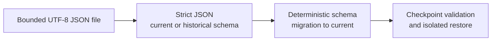

# Save format, versioning, and migration

[Project index](../README.md) · [Authoritative save boundary](authoritative-save-boundary.md) · [Concurrency and performance architecture](concurrency-and-performance.md) · [Project task list](task-list.md)

## Purpose

A Galaxy Command save must preserve one completed authoritative checkpoint and
either restore that checkpoint exactly or reject it without publishing a
session. This document selects the encoded format, version boundaries,
migration rules, corruption handling, and filesystem commit protocol for
`TASK-022`.

The authoritative values and cross-owner invariants come from
[the save boundary](authoritative-save-boundary.md). This document does not
turn presentation snapshots or semantic facts into save authority, and it does
not select content catalog identity, source provenance, or content-reference
migration. Those remain `TASK-037` work.

**Decision status:** Accepted. External editing is a supported use of the save
format, subject to the same complete validation as a game-written save.

## Decisions at a glance

| Question | Decision |
| --- | --- |
| What is stored? | One immutable whole-session checkpoint, never a sequence of commands or owner-specific partial saves. |
| What is the physical format? | One ordinary UTF-8 JSON document without a byte-order mark, written with a `.json` extension. |
| Why plain JSON? | Users can inspect and intentionally edit saves with standard text and JSON tools, and tests can define scenarios directly in the production format. |
| What is versioned? | The checkpoint schema has one monotonically increasing version. Runtime policy and content identities retain their own versions. |
| How are old saves loaded? | A contiguous chain of deterministic, one-way schema migrations converts inert decoded data to the current schema before any runtime owner is constructed. |
| What happens to unknown future versions? | The load is rejected without attempting a best-effort interpretation. |
| How is a save committed? | Encode to a sibling temporary file, flush it, atomically replace the destination, then synchronize the containing directory where the platform supports it. |
| Is recovery automatic? | A previously committed backup may be offered explicitly, but the loader never silently substitutes, repairs, or partially restores corrupt data. |

## Layered format

The save has four boundaries. Each boundary must succeed before the next can
run.

This order distinguishes invalid text or JSON from an unsupported schema, an
invalid historical schema, a migration failure, and a validly encoded but
inconsistent checkpoint. All failures occur before a `GameSession` is
published.

The file has no checksum, signature, compressed wrapper, or binary framing. A
checksum would make an intentional edit look corrupt unless the user also
recomputed hidden format metadata. The loader instead treats every save as
untrusted input and decides only whether its complete structure and domain
state are valid. A syntactically valid edit that still satisfies every
invariant is a valid save.

## Checkpoint JSON schema

The document root is one object with these required members in this emitted
order:

1. `format`, the exact string `galaxy-command-save`.
2. `schemaVersion`, a positive integer identifying the checkpoint schema.
3. `saveId`, a lowercase canonical UUID that identifies this save operation.
4. `capturedAtUtc`, an RFC 3339 UTC timestamp used only for display and support.
5. `producer`, diagnostic build identity that never decides compatibility.
6. `compatibility`, the runtime policy manifest plus the content compatibility
   inventory supplied through the later `TASK-037` contract.
7. `checkpoint`, the complete authoritative owner sections defined by
   `TASK-014`.

`saveId`, `capturedAtUtc`, and `producer` are envelope metadata. They must not
change continued simulation behavior. Compatibility is decided only by the
versioned policy and content identities inside `compatibility`, never by a
display version or CLR assembly version in `producer`.

The `checkpoint` object contains explicit named owner sections. The first
supported schema must cover engine progress, agenda, topology, lifecycle and
allocators, entities and inventories, spatial movement, actor control and
orders, relationships, command admission, fact continuity, construction,
economy, and transport. A runtime owner cannot participate in a supported save
until its authoritative section and direct restoration contract exist. Reserved
future owners are absent, not represented by guessed empty sections.

### Encoding rules

- Property names and discriminant tokens are case-sensitive ASCII.
- The reader accepts standard JSON whitespace and any property order. Duplicate
  properties, comments, trailing commas, invalid UTF-8, and non-JSON numeric
  tokens are rejected so the same file has one meaning in standard JSON tools.
- IDs, allocator positions, times, durations, quantities, coordinates, and
  other 64-bit integral domain values are base-10 strings in their full valid
  range. This avoids precision loss in common JSON tools.
- Enumeration values and union discriminants use stable lowercase tokens, not
  CLR type or member names. A discriminated value is an object with a required
  `kind` property and the fields defined for that kind.
- Authoritative floating-point values, if a future owner introduces any, must
  encode their exact IEEE 754 bits rather than a rounded decimal rendering.
- Collections whose order affects future behavior preserve that order.
  Logically unordered collections emit in their documented stable domain
  order. JSON object member order is never used as domain authority.
- The writer emits stable, human-readable JSON with two-space indentation,
  fixed property order, and one trailing newline. Reader acceptance never
  depends on matching that presentation.
- The current-schema reader rejects unknown properties. Historical readers
  recognize only the fields defined for their exact source version. This keeps
  misspellings and accidental partial upgrades from becoming silent defaults.

The production writer writes only the current schema. It never emits a legacy
version or an intentionally partial checkpoint. Loading an externally edited
save does not rewrite it automatically.

## External editing and scenario fixtures

External editing is an intentional part of the format. A technically capable
user may change authoritative values, identifiers, pending work, or policy
configuration. The edit is accepted only when the complete file passes the
same schema, compatibility, owner, allocator, and cross-owner validation as a
game-written save. There is no edit-only bypass, relaxed invariant mode, or
automatic repair.

Validation errors should identify a stable schema path and explain the violated
constraint without requiring a debugger. This is useful both to users repairing
an edit and to developers authoring a scenario. Documentation may describe
common fields, but the save schema remains versioned and is not promised to stay
source-compatible across releases. Deterministic migrations are the supported
upgrade path.

Tests may keep hand-authored or externally edited save fixtures for states that
are impractical to reach through gameplay. Such fixtures use the exact
production schema and loader. They do not gain fixture-only fields, privileged
constructors, skipped compatibility checks, or acceptance-only runtime owners.
Each fixture states the behavior it is intended to exercise and keeps only the
minimum authoritative state needed for that valid scenario.

## Schema versions and migrations

Checkpoint schema versions are positive integers with no compatibility meaning
outside this format. A version changes whenever the encoded structure or the
meaning needed to reconstruct authority changes. Merely changing derived views
or diagnostics does not change the schema.

Load follows one exact path:

1. Parse only enough of the strict JSON root to obtain `schemaVersion`.
2. Reject zero, malformed, or newer-than-supported versions.
3. Decode the complete payload with the reader for that exact version.
4. Validate the source schema's structural requirements.
5. Apply every registered migration in order until the current schema is
   reached.
6. Validate the complete current schema and its content-independent reference
   structure.
7. Resolve compatible policies and content, validate every owner and
   cross-owner invariant, prepare isolated owners, and publish the restored
   session as specified by `TASK-014`.

Each migration is a pure function from one immutable inert schema model to the
next. It cannot read the clock, generate an ID, use randomness, enumerate an
unordered collection without sorting it, inspect machine configuration, access
the filesystem, call gameplay APIs, or mutate a live session. The migration
registry contains exactly one step from version `N` to `N + 1`; gaps and
branches are startup errors in the loader implementation.

A migration may add a value only when the old schema determines that value
unambiguously. If a new authoritative value cannot be derived without guessing,
the migration rejects the save with a stable incompatibility reason. Content
renames, replacements, removals, provenance, and semantic compatibility are
not schema guesses. They are delegated to the `TASK-037` content migration
stage after structural schema migration.

Migration tests keep checked-in historical save fixtures. For each fixture
they assert the migrated current model, stable current writer output, rejection
of malformed variants, and continuation equivalence against an uninterrupted
session. Applying migrations on different worker counts or machines must
produce byte-identical current documents.

## Validation and failure reporting

Decode and restore return typed results. User-facing text is mapped at the
application boundary and does not expose internal exceptions or arbitrary save
content. At minimum, failures distinguish:

- file missing or storage access denied;
- file too large, incomplete, or unreadable;
- wrong `format` discriminator;
- invalid UTF-8 or invalid strict JSON;
- unsupported checkpoint schema version;
- structurally invalid source schema or failed deterministic migration;
- unavailable or incompatible runtime policy;
- unresolved or incompatible content reference;
- invalid owner section or cross-owner invariant;
- unexpected internal decode, migration, or restore failure.

Errors identify a bounded schema path or stable owner/key when safe, but do not
echo arbitrary strings from the save. There is no salvage mode. No failure
publishes a partial session, advances an allocator, emits a fact, dispatches an
event, or mutates the currently running session.

Resource limits are checked before allocation where possible. The application
provides a maximum total file size, maximum JSON depth, maximum string length,
and bounded collection counts appropriate to the supported simulation scale.
Owner validation remains responsible for domain limits and reference
integrity.

## Filesystem storage mechanics

Encoding and checkpoint restoration operate on bounded streams and do not own
save-slot policy. The application-level file store commits one slot as follows:

1. Capture one immutable checkpoint at a completed healthy commit boundary.
2. Encode and validate the complete JSON document in memory or in an isolated
   temporary stream.
3. Create a uniquely named temporary file in the destination directory with
   exclusive access. Never follow a caller-supplied temporary-file path.
4. Write the complete bytes, flush application buffers, and request durable
   file synchronization.
5. If the destination exists, atomically replace it while retaining at most one
   previously committed sibling backup. Otherwise atomically rename the
   temporary file to the destination.
6. Synchronize the containing directory where supported, then report success.

The temporary file must be on the same filesystem as the destination so rename
or replacement is atomic. A failed commit leaves the prior committed save
intact and removes its own temporary file when safe. Startup may report stale
temporary files, but never promotes one automatically. Backup load is an
explicit user choice after the primary save fails validation.

Slot names are application data, not paths. The store maps a validated slot ID
to a configured save directory, rejects path separators and traversal, does
not follow symbolic links for final or temporary files, and never accepts an
absolute destination from decoded save content.

## Concurrency and determinism

Capture freezes admission and observes one completed aggregate boundary. The
codec may process already immutable owner sections in parallel only when final
section ordering and bytes are independent of worker completion order. The
single-thread reference writer and migrator remain mandatory.

Load performs decode, migration, content resolution, and owner preparation in
isolation. Parallel section validation is permitted only for read-only work;
diagnostics are sorted by stable schema path before return, and publication is
one deterministic commit after every section succeeds.

## Implementation slices

1. Implement and test the bounded strict JSON reader and writer, typed
   failures, and contiguous migration registry against an inert test schema.
2. Add internal immutable capture models and direct restore constructors for
   each currently admitted owner, validating each section independently.
3. Compose whole-session capture, cross-owner validation, isolated restore,
   and uninterrupted-versus-restored continuation tests.
4. Add the application-level atomic file store and failure-injection tests for
   short writes, failed flushes, interrupted replacement, corrupt primary
   files, and explicit backup selection.
5. Complete content compatibility and saved content-reference migration with
   `TASK-037` before declaring general saves supported.

The first slice establishes editable format mechanics without pretending that
an encoded presentation snapshot is a save. Later slices remain blocked on an
owner if that owner cannot yet provide its complete authoritative capture and
direct restoration contract.

## Deferred choices

- Compression is not used for primary save files because it would obstruct
  direct external editing. An optional export or transport artifact would be a
  separate format and would require bounded decompression limits.
- Encryption and signing are not part of local single-player saves because
  they would obstruct intentional editing. If introduced for a separate
  artifact, they require an explicit threat model and key ownership.
- Cloud synchronization, save-slot UI, autosave cadence, retention count, and
  cross-device conflict policy belong to the application experience.
- Content catalog versions, mod provenance, collision handling, and migration
  of saved content references remain `TASK-037`.
- Reserved runtime owners from `TASK-016` through `TASK-021`, `TASK-025`, and
  `TASK-038` must define their authoritative state before joining a supported
  saved session.
