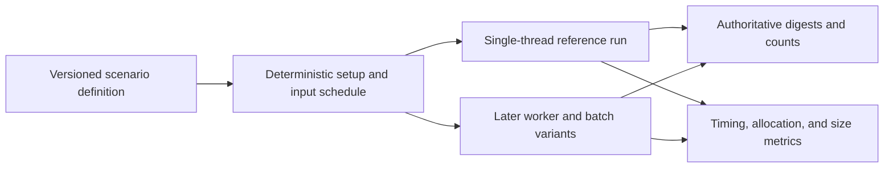

# Scale targets and benchmark architecture

[Project index](../README.md) · [Concurrency and performance](concurrency-and-performance.md) · [Simulation architecture](simulation-architecture.md) · [Time and pacing](time-and-pacing.md) · [Project task list](task-list.md)

## Status

This document is the accepted `TASK-024` architecture. The project owner
accepted the initial scale envelope and informational simulation-speed goals on
2026-07-28.

Implementation now includes a dedicated headless runner, explicit smoke and
full-suite gating, versioned JSON scenario files, validated numeric overrides,
machine-readable results, fast configuration coverage in the normal unit-test
suite, and the four remaining initial single-thread scenario shapes. The canonical
Release full suite passed all committed digests across repeated iterations on
2026-07-28, completing `TASK-024`.

The benchmark execution and enforcement policy is accepted:

- Normal unit-test runs contain only fast deterministic correctness coverage.
- Computationally heavy benchmark scenarios require explicit opt-in.
- Benchmark timing is informational and never an enforced correctness gate.
- No reference-hardware selection is required.

Accepting this architecture does not itself begin implementation of the
benchmark runner, concurrent runtime, scheduler, or spatial index.

## Purpose

Galaxy Command needs a concrete scale envelope before `TASK-009` divides the
Phase 1 runtime into independently batchable systems. Without target workloads,
ownership and batching boundaries would be based on guesses: a design that
works for many quiet systems might fail in one crowded system, while a design
optimized only for ship movement might make economic work unnecessarily
expensive.

`TASK-024` therefore establishes:

- The entity and activity counts the architecture should be able to represent
- The workload shapes that must be measured independently
- The simulation-throughput expectations used to judge those workloads
- A reproducible single-thread reference benchmark
- The measurements and deterministic evidence required before later
  concurrency work is accepted

These targets are engineering budgets, not promises that every maximum occurs
simultaneously. Mixed scenarios define the combinations that must run together.

## Terms and boundaries

### Scale envelope

A scale envelope is a capacity goal for one dimension, such as total ships or
retained facts. It guides identifier, storage, iteration, and allocation
choices. It does not require a benchmark to maximize every other dimension at
the same time.

### Benchmark shape

A benchmark shape is a fixed scenario intended to isolate one kind of work,
such as connector planning or economic matching. Shapes use deterministic
setup, seeds, commands, and simulated durations.

### Performance target

A performance target states how quickly a defined scenario should advance on
the machine that ran it. Under the accepted policy, timing is diagnostic rather
than an acceptance result and does not require designated reference hardware.

### Correctness target

A correctness target is invariant across machines and execution layouts. For
the same supported runtime, initial state, configuration, and command sequence,
the benchmark must produce the expected authoritative digest and counts.

## Accepted initial scale envelope

The accepted values are deliberately divided into a reference envelope and a
stress envelope. The reference envelope is the scale the normal architecture
should serve without special-case degradation. The stress envelope reveals
nonlinear behavior and capacity cliffs; it is not an initial release
requirement.

| Dimension | Reference envelope | Stress envelope | Why it is separate |
| --- | ---: | ---: | --- |
| Systems | 128 | 512 | Exercises broad ownership and many mostly quiet spaces |
| Directional transit connections | 512 | 4,096 | Exercises topology reads, route alternatives, and connector-event volume |
| Ships galaxy-wide | 10,000 | 50,000 | Exercises persistent actor, order, event, and snapshot storage |
| Active ships in one crowded system | 2,500 | 10,000 | Prevents a one-system-per-thread architecture |
| Facilities | 2,000 | 10,000 | Exercises production, construction, inventory, and logistics indexes |
| Factions | 16 | 64 | Bounds strategic owners without assuming one worker per faction |
| Active persistent scripts | 500 | 2,500 | Reserves future scheduling and checkpoint state without implementing scripts now |
| Pending scheduled events | 250,000 | 1,000,000 | Exercises agenda memory, ordering, and timestamp density |
| Retained semantic facts | 50,000 | 250,000 | Exercises bounded retention and lagging cursor reads |

The architecture intentionally does not assign an NPC count. `TASK-015` must first
decide whether an NPC is a ship, a person, a crew member, or more than one of
those.

Counts for factions and scripts are capacity budgets only until those models
exist. `TASK-024` must not introduce placeholder gameplay systems merely to
make every table row benchmarkable.

## Accepted informational throughput goals

Two distinct player-facing goals are accepted:

1. **Crowded real-time:** the reference crowded-system scenario sustains at
   least `1x` simulation speed without rendering.
2. **Representative acceleration:** the reference mixed-galaxy scenario
   sustains at least `30x` simulation speed without rendering.

These multipliers are product goals, not conclusions drawn from current
measurements. The mixed goal becomes applicable after its included gameplay
domains and activity proportions are defined; it does not become an automated
pass/fail threshold.

If the machine cannot sustain a selected speed, simulation time must advance
more slowly without changing results. The benchmark runner should report
achieved simulated-time-per-wall-time ratios, machine metadata, and scenario
sizes instead of reducing timing to pass or fail.

The stress envelope has no initial real-time requirement. Its purpose is to
finish deterministically, expose memory use, and reveal where work becomes
nonlinear.

## Benchmark matrix

The benchmark suite should grow by implemented domain rather than fabricate
future behavior.

| ID | Shape | Primary pressure | Initial availability |
| --- | --- | --- | --- |
| `spatial.many-quiet` | Many systems with modest independent ship populations | Broad iteration, scheduled movement, snapshots | Available with a benchmark fixture |
| `spatial.one-crowded` | Most active ships moving and receiving orders in one system | Dense owner workload and order churn | Available with a benchmark fixture |
| `spatial.several-crowded` | Several systems with concentrated activity | Cross-owner batching without assuming one thread per system | Available with a benchmark fixture |
| `navigation.connector-volume` | Repeated deterministic multi-system plans and transits | Planner, topology reads, agenda volume | Available with a benchmark fixture |
| `facts.retention-and-read` | Sustained fact production with current and lagging cursors | Bounded storage, allocation, cursor gaps | Available with a benchmark fixture |
| `economy.logistics-volume` | Many facilities, inventories, offers, demands, and freighters | Matching, reservation, and retry work | Requires a scalable Phase 1 fixture and benefits from `TASK-009` boundaries |
| `mixed.reference` | Accepted reference combination of spatial, economic, faction, and script work | Player-facing whole-galaxy throughput | Added incrementally as those systems become authoritative |

The former `baseline.phase-one` fixture is now a test-only whole-simulation
acceptance proof. Its three locations, four facilities, and initial two
freighters were too small to justify performance architecture, so it is no
longer part of the benchmark runner.

## Benchmark execution contract

Each scenario definition must contain:

- A stable scenario ID and schema version
- Explicit, named entity counts and simulated duration
- All configuration values and deterministic seeds
- A deterministic command or input schedule
- A declared fact-retention capacity
- The expected authoritative digest and semantic counts for the single-thread
  reference path

### Numerically tunable scenarios

Scenario scale and activity should be tunable through validated numeric
configuration rather than source edits. A scenario definition should group
parameters by purpose, including:

- Topology counts and connection density
- Entity and facility counts
- Active, idle, moving, and queued-work proportions
- Command, navigation-request, event, and fact production rates
- Simulated duration, warm-up duration, and measurement duration
- Fact-retention capacity and cursor-consumption lag
- Deterministic seed and iteration count

Each parameter requires a stable name, unit, valid range, and default. Counts
must use integer values; proportions and rates must state their denominator and
rounding rule. Invalid combinations fail validation with a specific diagnostic
instead of being silently clamped.

The runner should support:

1. Versioned named presets for canonical correctness and benchmark baselines.
2. A versioned scenario file for repeatable custom configurations.
3. Visible command-line overrides for convenient local exploration.

Command-line overrides take precedence over the selected scenario file, which
takes precedence over the preset defaults. The resolved configuration is
printed and included in JSON output so a result can be reproduced.

Changing a canonical preset changes its expected digest and requires an
intentional baseline review. An ad hoc override produces a non-canonical run:
it still enforces internal invariants, and repeated iterations with the same
resolved configuration must agree. It does not compare against a different
preset's committed digest.

Measurement and correctness are separate outputs:

The initial runner should be a dedicated headless executable rather than
benchmark logic embedded in unit tests or the Godot client. It should:

- Build and run in `Release`
- Require an explicit option such as `--suite full` before running heavy
  benchmark scenarios
- Warm the runtime before measured iterations
- Execute multiple measured iterations and report the median and range
- Record runtime, operating-system, architecture, processor-count, and memory
  metadata
- Emit both readable console output and machine-readable JSON
- Print and record the fully resolved numeric scenario configuration
- Avoid rendering, sleeps, network access, and wall-clock-dependent gameplay
- Return a failure when authoritative digests or counts disagree

A lightweight scenario runner is preferred initially because the important
unit is a deterministic simulation workload, not an isolated method call.
BenchmarkDotNet or another microbenchmark tool can be added later for measured
hot methods without becoming the scenario contract.

### Normal test and opt-in benchmark boundary

The normal unit-test suite may reuse benchmark scenario builders only for
small, bounded correctness cases. Those tests should verify deterministic
ordering, digests, invariants, and failure behavior without using the reference
or stress scale envelopes.

Full benchmark shapes do not run through `dotnet test` by default. They run
through the dedicated benchmark executable only when a developer, scheduled
workflow, or manually dispatched CI job supplies the explicit full-suite
option. A benchmark process must not infer permission to run heavy scenarios
from `Release` configuration alone.

The exact CLI spelling remains an implementation detail, but the opt-in must be
visible in commands and automation. Environment-only activation is discouraged
because inherited process state can trigger expensive work unexpectedly.

## Required measurements

Every measured scenario records:

- Simulated milliseconds advanced
- Wall-clock duration and achieved simulation-speed multiplier
- Events, commands, facts, navigation plans, and domain evaluations processed
- Total allocated bytes and garbage-collection counts by generation
- Peak managed-memory estimate when the runtime can expose one consistently
- Agenda size, retained-fact count, and major domain collection sizes
- Per-domain and per-phase wall time after `TASK-009` introduces those
  boundaries
- Authoritative state, event, command, and fact digests applicable to the
  scenario

Metrics must be labeled unavailable rather than synthesized when the current
runtime does not expose them. Instrumentation must not alter authoritative
ordering or become required gameplay state.

## Baselines and regression policy

Correctness baselines are committed with each scenario. Fast correctness cases
run with the normal unit-test suite. Heavy scenario correctness runs only when
the benchmark suite is explicitly selected, but digest or invariant
disagreement still fails that selected run.

All timing is informational:

- Pull requests may report before-and-after measurements for affected scenarios
- Scheduled or manually dispatched benchmark jobs retain timing history
- Results include enough machine and runtime metadata to make comparisons
  understandable
- CI may enforce scenario completion, digests, semantic counts, and invariants
- CI must not fail because a benchmark missed a wall-clock duration,
  throughput, simulation-speed, allocation, or memory-usage goal

Timing trends can motivate investigation but cannot by themselves accept or
reject a change.

## Relationship to TASK-009 and later concurrency

`TASK-024` precedes the `TASK-009` implementation. Its benchmark shapes tell
`TASK-009` which owners need batch boundaries and which measurements those
boundaries must expose.

`TASK-009` should preserve the single-thread benchmark results while separating
stable reads, evaluation, effect buffers, deterministic merge, and commit. It
must not add parallel execution.

The initial ownership pass should be able to expose at least these stable work
units without assigning any of them permanently to a thread:

| Owner | Stable evaluation unit | Buffered output |
| --- | --- | --- |
| Production | Ordered facility range | Reservations, consumption, output, and completion-event proposals |
| Construction | Ordered construction-facility range | Reservations, state transitions, materialization, and completion-event proposals |
| Logistics | Ordered demand, supply, or freighter candidate range | Match, reservation, assignment, and movement proposals |
| Actor orders | Ordered actor range within a system or spatial partition | Order transitions, movement requests, and fact proposals |

This table defines architectural seams, not one general simulation-system
interface. `TASK-009` implemented the current effect payloads, ownership,
deterministic-wave, measurement, and acceptance-runtime migration contract
described in
[Runtime orchestration and domain ownership](runtime-orchestration.md).

Later worker-count and batch-layout variants reuse the same scenario
definitions. They are accepted only when they produce the single-thread
authoritative digests and counts. Performance comparisons that change gameplay
results are invalid.

## Delivery sequence and completion

The delivery sequence is:

1. Add the headless benchmark runner and versioned scenario-definition
   contract, with fast correctness coverage in normal tests and explicit
   opt-in for heavy scenarios.
2. Capture `spatial.many-quiet`, `spatial.one-crowded`,
   `navigation.connector-volume`, and `facts.retention-and-read` single-thread
   baselines. Keep the small Phase 1 economy scenario in the normal
   whole-simulation acceptance suite instead.
3. Record the first measurements and identify nonlinear behavior without
   changing architecture to hide it.
4. Begin `TASK-009` using the accepted shapes and measurements.
5. Add economic volume and mixed benchmarks as scalable fixtures and
   authoritative gameplay domains become available.

The architecture and initial implementation are complete. Later worker-count
comparisons use this contract when concurrent execution exists; they remain in
the orchestration and long-running performance work rather than reopening
`TASK-024`.

## Accepted decisions

1. **Execution gating:** normal unit tests contain only fast deterministic
   correctness cases; heavy benchmarks require an explicit runner option.
2. **Enforcement:** deterministic correctness may fail tests or selected
   benchmark runs; timing and throughput remain informational.
3. **Hardware:** no reference machine is selected or required. Results record
   machine metadata so humans can interpret comparisons.
4. **Initial implementation:** use a dedicated deterministic scenario runner
   with versioned presets, validated numeric configuration, visible overrides,
   and JSON output; defer microbenchmark tooling until a measured hotspot
   requires it.
5. **Future domains:** treat faction and script counts as capacity budgets,
   adding their benchmark work only when their authoritative models exist.
6. **Scale envelope:** use the reference and stress counts defined above as the
   initial engineering budgets.
7. **Simulation speed goals:** use `1x` crowded real-time and `30x`
   representative acceleration as informational goals, never automated timing
   gates.

## Deferred choices

The following remain outside `TASK-024`:

- Worker-pool and scheduler implementation
- Worker-count defaults
- Batch sizes and spatial partition dimensions
- Spatial-index selection
- Event-agenda sharding
- ECS or other broad storage replacement
- Reduced-detail simulation for inactive systems
- Final pause and speed-selection behavior
- Final save serialization for benchmark scenarios

Those decisions require benchmark evidence or later gameplay contracts.
