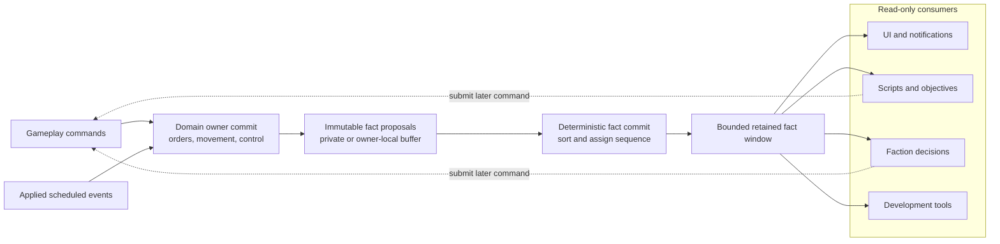
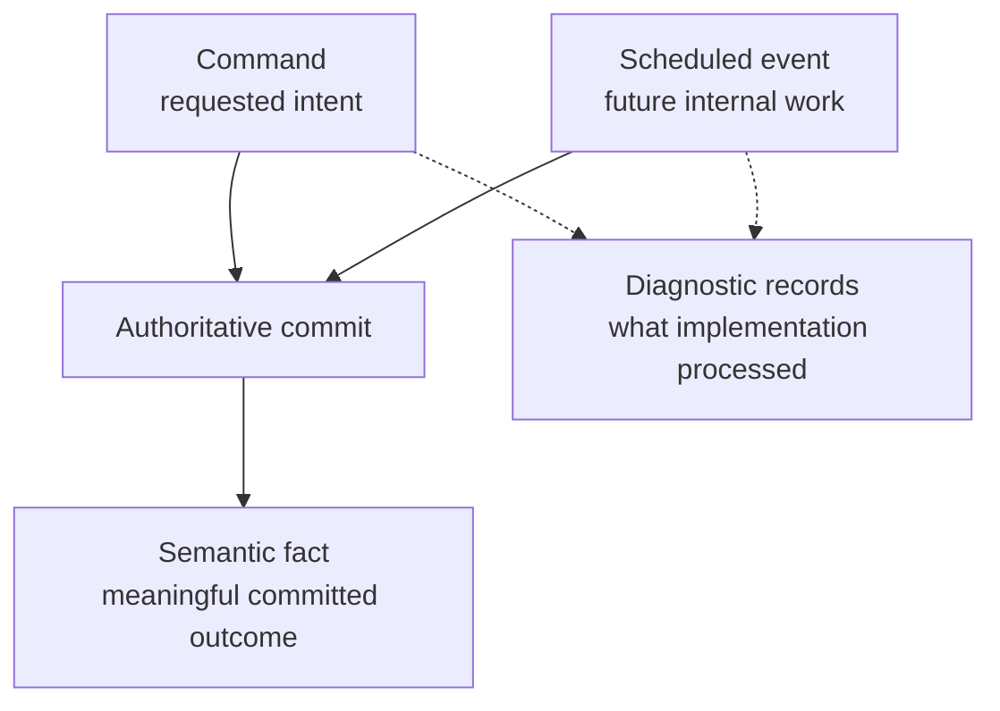
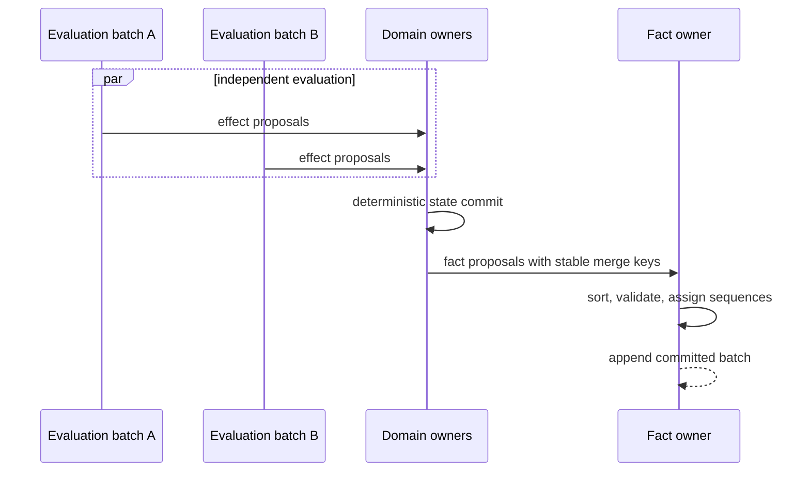
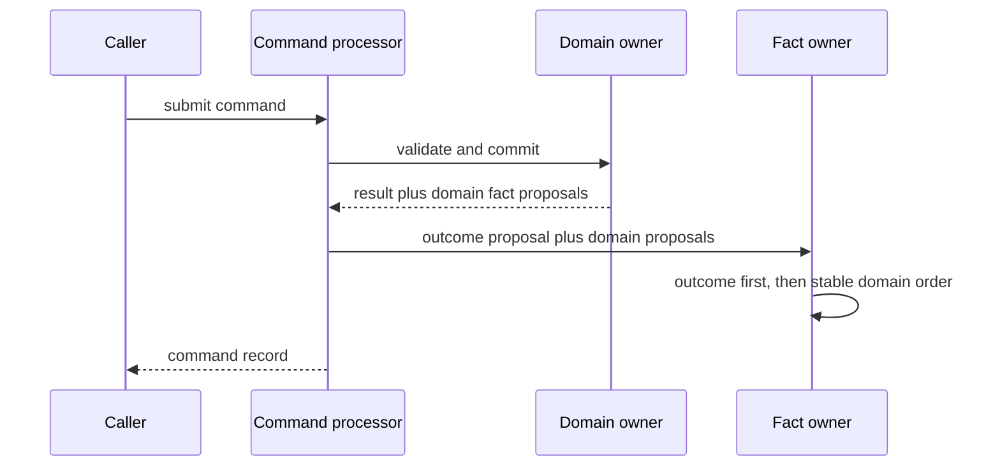

# Semantic game facts

[Project index](../README.md) · [Gameplay integration](gameplay-integration.md) · [Actor control and order lifecycle](actor-control-and-orders.md) · [Navigation and spatial architecture](navigation-architecture.md) · [Concurrency and performance](concurrency-and-performance.md) · [Project task list](task-list.md)

## Purpose

The simulation already records submitted commands and processed scheduled
events. Those records are valuable diagnostics, but they expose implementation
mechanics rather than a stable account of meaningful gameplay changes.

Semantic game facts provide that gameplay-facing account. UI notifications,
objectives, scripts, faction behavior, development tools, and later explanation
systems should be able to observe that an order was cancelled, a ship entered a
system, or a command was rejected without interpreting event payloads or
inspecting mutable subsystem state.

A concise mental model is:

> Facts are receipts, not tasks. Scripts may use those receipts to decide which commands to submit next.

This document defines the accepted initial `TASK-008` contract. It is written
for human review and deliberately distinguishes committed decisions from
deferred choices.

The design remains strictly local and single-player. Facts are not network
messages, replication records, remote events, or an event-sourcing replacement
for authoritative world state.

**Decision status:** Accepted by the project owner on 2026-07-28.

## Accepted model at a glance

Domain owners produce immutable fact proposals while committing meaningful
changes. A session-level fact owner deterministically orders those proposals,
assigns one global sequence, and appends them to a bounded retained window.
Consumers read facts using cursors and react later by submitting ordinary
gameplay commands.



Facts are outputs of authoritative commit. Consumers never mutate the world
through fact callbacks.

## Decision summary

| # | Question | Recommended answer |
| --- | --- | --- |
| 1 | What is a semantic fact? | A meaningful committed gameplay outcome, separate from commands, scheduled events, and diagnostics |
| 2 | What identifies and orders facts? | One session-wide monotonic `GameFactSequence` plus authoritative simulation time |
| 3 | How are payloads represented? | Closed typed records with stable identifiers and enums; no arbitrary property dictionaries |
| 4 | How is cause recorded? | A discriminated immediate cause referencing a command sequence or applied event key; add other typed causes only with their owning subsystem |
| 5 | How is parallel determinism preserved? | Owners emit proposals with stable merge keys; the fact owner assigns sequences only during deterministic commit |
| 6 | When are facts committed? | Atomically with the accepted state transition, never before validation or after partial mutation |
| 7 | Are command outcomes facts? | Yes; accepted and rejected submissions produce correlated outcome facts without replacing command records |
| 8 | How are order changes represented? | One typed order-transition fact containing previous state, next state, reason, order ID, actor, source, and destination |
| 9 | Which movement facts are initially emitted? | Local motion started/ended and connector transit started/completed, correlated to actor and order when applicable |
| 10 | Do ignored events and internal decisions emit facts? | No; stale events and implementation diagnostics remain in diagnostic records |
| 11 | How do consumers react? | Pull ordered batches after commit and submit commands in a later permitted wave; no reentrant callbacks |
| 12 | How is history retained? | A configurable bounded window with never-reused sequences and explicit cursor-gap reporting |
| 13 | How does presentation access facts? | Through a separate cursor-based session query, not by copying the fact window into every world snapshot |
| 14 | Are facts authoritative save or replay state? | No; save required cursors and next sequence, while world state remains authoritative |
| 15 | What is the first implementation vocabulary? | Command outcome, order transition, local motion, and connector transit facts only |

## 1. Semantic boundary

### Question

What belongs in the fact stream, and how does it differ from commands,
scheduled events, and diagnostic records?

### Recommendation

A semantic fact states that a meaningful gameplay outcome has committed.
Examples include:

- A submitted command was accepted or rejected
- An order changed from active to cancelled
- A ship began connector transit
- A ship emerged into another system

A fact is not:

- A request to change state; that is a gameplay command
- Future work waiting on the agenda; that is a scheduled event
- Proof that an event handler ran; that is an event record
- An implementation choice such as a planner heap operation
- A mutable callback or unrestricted subsystem notification



Facts describe committed meaning. They do not become a second copy of all
authoritative state.

## 2. Fact identity and envelope

### Question

What metadata does every fact carry, and which value defines fact order?

### Recommendation

Every committed fact has a `GameFactEnvelope` containing:

- A session-wide `GameFactSequence`
- The authoritative `SimulationTime` at commit
- A typed immediate cause
- A typed fact payload

`GameFactSequence` begins at one, increases monotonically, and is never reused
within a session. Sequence is the only total ordering contract for consumers.
Timestamp groups facts in simulation time but does not order facts sharing that
time.

Do not add wall-clock timestamps, random GUIDs, or worker-local counters to the
authoritative ordering contract.

## 3. Typed payloads

### Question

Should facts use a flexible property bag, string names, or closed domain types?

### Recommendation

Use a closed discriminated C# record hierarchy. Each payload contains stable
typed identifiers, enums, and immutable value objects. Add a new payload type
when a new gameplay meaning becomes authoritative.

Do not use:

- `Dictionary<string, object>`
- JSON fragments inside the simulation
- Human-readable prose as an authoritative reason
- A single generic fact record with many nullable fields

Stable reason enums and codes belong in payloads. Localization and player-facing
sentences belong in presentation.

## 4. Cause and correlation

### Question

How can a consumer tell why a fact occurred without coupling to internal call
stacks?

### Recommendation

Give the envelope one discriminated immediate cause:

- `CommandFactCause(CommandSequence)`
- `ScheduledEventFactCause(EventKey)`

These cover the initial vocabulary. When a later subsystem commits meaningful
changes outside command or scheduled-event handling, add a typed cause with
that subsystem rather than using null or a generic string.

The cause identifies the immediate authoritative trigger, not an unlimited
causal chain. Payload identifiers provide durable domain correlation: an order
fact carries its `ShipOrderId`, and movement facts carry the relevant `ShipId`,
physical-work identity, and optional order ID.

Do not store object references or exception stack traces in a fact.

## 5. Deterministic ordering and parallel readiness

### Question

How are simultaneous facts ordered without making worker completion order
authoritative?

### Recommendation

Evaluation workers and domain owners produce immutable `GameFactProposal`
values. Each proposal contains a stable internal merge key derived from:

1. The command sequence or scheduled event key that caused the commit
2. A stable domain kind
3. The primary entity or activity identity
4. A domain-defined transition ordinal

The fact owner sorts proposals, resolves accidental duplicate proposals as an
implementation fault, and assigns `GameFactSequence` values during commit.
Workers never allocate fact sequences.

Within one causal commit, initial facts use semantic precedence:

1. Command outcome, when the cause is a command
2. Completed or ended physical work
3. Order lifecycle transitions
4. Newly started physical work

The domain transition ordinal then resolves multiple facts in one category.
For example, connector emergence records transit completion before order
completion or resumption, and records a newly started local leg last.

The single-thread reference runtime uses the same proposal and merge path, even
when a batch currently contains only one proposal.



Fact results must be identical across valid worker counts, work-stealing order,
and batch layouts.

## 6. Atomic emission

### Question

Can state change successfully while its required fact is missing, or can a fact
appear for a rejected transition?

### Recommendation

Treat state mutation and its required fact proposals as one owner-commit
operation:

1. Validate the proposed transition.
2. Construct the state effect and required fact proposals.
3. Commit the state effect.
4. Commit the fact batch through operations that cannot fail under validated
   input.

Unexpected duplicate keys, sequence overflow, or invalid fact payloads are
implementation faults. Do not catch them and leave a partially explained
world.

Rejected state transitions emit no domain transition facts. A rejected command
still emits its command-outcome fact because rejection is itself the committed
result of command submission.

## 7. Command outcome facts

### Question

Should command acceptance and rejection remain only in command records?

### Recommendation

Keep `GameplayCommandRecord` as the complete diagnostic submission record and
also emit a smaller semantic command-outcome fact for unified consumers.

- `CommandAcceptedFact` carries command sequence, source identity, and stable
  command kind.
- `CommandRejectedFact` additionally carries the stable rejection code.

Diagnostic prose remains on the command record and is not copied into the fact.

For one command transaction, commit the command-outcome fact before domain
facts caused synchronously by that command. The handler should buffer its
domain fact proposals so the command processor can commit one deterministically
ordered batch:



This ordering is logical fact order; it does not imply that consumers can
observe the outcome between state mutations inside the transaction.

## 8. Order lifecycle facts

### Question

Should each order status have a separate fact type, or should one transition
type cover the lifecycle?

### Recommendation

Use one `ShipOrderTransitionFact` with:

- `ShipId`
- `ShipOrderId`
- Command source
- Destination intent
- Nullable previous status for initial creation
- Next status
- Stable `ShipOrderReason`

This covers creation, queueing, activation, waiting, waking, suspension,
restoration, completion, cancellation, and failure without a growing set of
nearly identical fact types.

Emit one fact for every durable lifecycle transition. Do not emit facts for
internal plan replacement or local leg-index advancement when the order status
and meaning do not change.

Within one actor's commit:

- Existing active work transitions before queued work.
- Queued work retains FIFO order.
- Replacement cancellations precede creation of the replacement order.
- A terminal active-order transition precedes promotion of the next queued
  order.

## 9. Physical movement facts

### Question

Which movement changes are meaningful facts rather than hidden execution
details?

### Recommendation

The initial vocabulary includes:

- `ShipLocalMotionStartedFact`
- `ShipLocalMotionEndedFact`
- `ShipConnectorTransitStartedFact`
- `ShipConnectorTransitCompletedFact`

These payloads carry the ship, physical-work identity, relevant positions or
connection identity, timing, and optional active order ID.

`ShipLocalMotionEndedFact` contains the authoritative final materialized
position and a stable end reason such as arrived, command cancellation,
replacement, or scripted suspension. Arrival at an intermediate waypoint is
meaningful because the ship has authoritatively reached a position and other
systems may later react to that location.

Zero-duration local legs do not emit started/ended facts; they are plan
normalization rather than scheduled physical activity. Combat- and
hazard-specific interruption reasons remain deferred until those systems own
their semantics.

## 10. Diagnostics stay separate

### Question

Should ignored scheduled events, planner decisions, and rejected internal
proposals appear in the fact stream?

### Recommendation

No. Keep these in diagnostic records:

- Ignored stale-generation events
- Missing-reference or state-mismatch events
- Planner candidates and tie-break decisions
- Worker batches and rejected effect proposals
- Internal event creation and handling

An applied scheduled event may cause semantic facts. An ignored event does not,
because it committed no gameplay change.

## 11. Consumer execution and reentrancy

### Question

Do consumers receive synchronous callbacks while a fact is being committed?

### Recommendation

Consumers pull immutable committed batches after a command transaction or
simulation commit barrier. They never execute inside a domain owner's mutation
stack.

Scripts, objectives, and factions react by submitting ordinary gameplay
commands in a later permitted command or evaluation wave. They may react at the
same `SimulationTime` when phase rules allow it, but never reentrantly.

This preserves deterministic ownership and makes consumer work batchable and
parallelizable.

## 12. Bounded retention and cursors

### Question

How can facts remain useful without retaining an unlimited history?

### Recommendation

Retain a configurable bounded window in `GameSession`. `GameSessionSetup`
supplies a positive capacity explicitly so the simulation library does not hide
a production retention default. Sequence values continue increasing when old
facts are evicted.

Expose a cursor query conceptually equivalent to:

```text
ReadFactsAfter(sequence, maximumCount)
  -> facts
  -> oldestRetainedSequence
  -> newestCommittedSequence
  -> cursorGap
```

`cursorGap` is explicit when the requested next sequence has already been
evicted. Consumers must never mistake an incomplete suffix for complete
history.

Each consumer owns its last processed sequence. Consumers that require every
fact, such as future persistent scripts, must be scheduled and checkpointed so
they cannot silently fall behind the retention window.

The production composition chooses its capacity after measurement; it is not a
gameplay rule.

## 13. Presentation access

### Question

Should every `GameSnapshot` copy the retained fact window?

### Recommendation

No. Keep authoritative world snapshots and fact-window queries separate.
Copying the entire retained window into each frame snapshot would create
avoidable allocation and make cursor handling unclear.

Godot and other presentation callers keep a cursor, request new facts after
refreshing world state, and build their own bounded notification views.
`TASK-010` may add a presentation facade that composes a world snapshot with a
fact batch without changing the underlying boundaries.

## 14. Save, load, and replay

### Question

Are retained facts authoritative state, a replay log, or mandatory save data?

### Recommendation

The retained fact window is not the source of truth for rebuilding the world.
Save/load restores authoritative domain state directly.

The save boundary eventually includes:

- The next `GameFactSequence`
- Required persistent consumer cursors
- Enough recent facts only when a UI or explanation feature explicitly needs
  them across load

Do not claim deterministic replay from facts. Replay, if desired, should use
initial state plus ordered gameplay commands and verified simulation rules.
`TASK-014` owns the save inventory, `TASK-022` owns format/version migration,
and `TASK-025` owns player-facing explanation retention.

## 15. Initial vocabulary and implementation boundary

### Question

How much should the first implementation include?

### Recommendation

Implement only facts supported by current authoritative models:

- Command accepted
- Command rejected
- Ship order transitioned
- Local motion started
- Local motion ended
- Connector transit started
- Connector transit completed

Do not predefine facts for combat, factions, relationships, dialogue,
objectives, construction in the clean `GameSession`, entity destruction, or
long-running scripts. Add those with the subsystem that owns their meaning.

Phase 1 diagnostic event and decision fingerprints remain unchanged. Migrating
the acceptance fixture to semantic facts is separate from proving the clean
session fact boundary.

## Implementation sequence

Implement the accepted decisions in this order:

1. Add the typed fact envelope, causes, payload hierarchy, sequence, proposal,
   and bounded window.
2. Change command handling to return buffered domain fact proposals so command
   outcome and synchronous domain facts commit as one ordered batch.
3. Emit order-transition facts from the order coordinator's owner-commit
   boundary.
4. Emit local-motion and connector-transit facts from physical commit and
   applied completion boundaries.
5. Expose cursor-based reads from `GameSession`, including explicit retention
   gaps.
6. Add deterministic tests for same-time ordering, rejected commands, stale
   events, cancellation, connector transit, incremental advancement, retention,
   and worker/batch-layout invariance where batching exists.
7. Let `TASK-010` consume the new fact query for presentation rather than
   embedding fact history in every world snapshot.

## Deferred choices

The initial `TASK-008` implementation should not decide:

- Player-facing notification wording or localization
- Long-term analytics or telemetry transport
- Disk-backed fact archives
- Full deterministic replay
- Cross-save explanation-history policy
- Mod-facing serialization formats
- Network replication or remote consumers
- Combat-, dialogue-, objective-, faction-, or relationship-specific facts
- The default production retention capacity before measurement

Promote these only when their owning gameplay or performance task requires
them.
