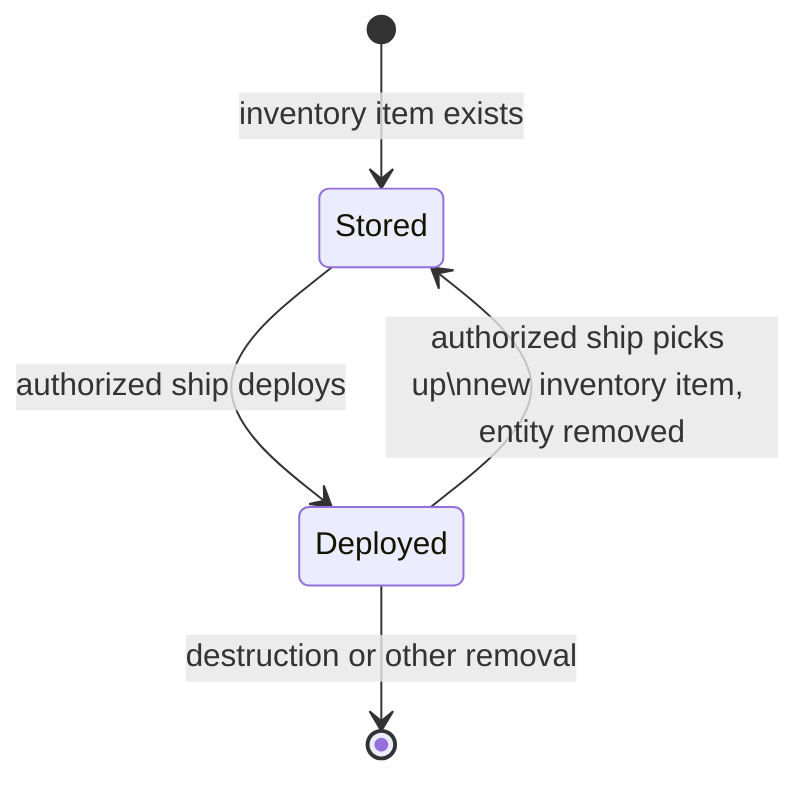

# Sensor deployables and placement lifecycle

[Project index](../README.md) · [Project task list](task-list.md) · [Fog-of-war and scouting](fog-of-war-and-scouting.md) · [Entity lifecycle and explicit spawning](entity-lifecycle.md) · [Inventory and cargo](inventory-and-cargo.md) · [Gameplay content](gameplay-content.md)

## Purpose

`TASK-074` defines the entity and lifecycle boundary for the initial stationary
sensor deployable before `TASK-073` consumes it as a sensor source. It does not
define sensor observation outcomes, construction assets, equipment, combat, or
general placement mechanics. `TASK-075` retains the deferred numeric deployment
and pickup range policy.

## Accepted boundary

A deployable is its own category of portable inventory item. A successful
deployment materializes that item into a deployed entity. The deployed entity
is not a construction asset, and distinct construction assets are outside the
scope of `TASK-074`.

This establishes a physical transition between custody in an inventory and a
live deployed entity. Every successful deployment creates a new entity. Pickup
removes that entity, so no deployed-entity identity persists through pickup or
redeployment. The deployable is a discrete physical-item definition with its
qualified content key, capacity cost, presentation fields, and fixed sensor
radius. Each stored deployable is a discrete instance. Deployment consumes that
instance; pickup creates a new instance with the same definition and
properties. The initial item has no durability, charge, condition, or
per-instance configuration.

All operations preserve the atomic, deterministic inventory and entity-lifecycle
boundaries established by `TASK-041` and `TASK-011`.

The deployed entity belongs to the controlling principal of the source
inventory. Principals always control their own inventories, so deployment does
not introduce a separate ownership transfer or authorization source.

## Approved interactions

Player-visible deployable information follows the existing `TASK-020`
sensor-range and presentation boundary. NPC planners read their approved
authoritative views and do not gain a persistent discovery ledger or a
principal-scoped fog-of-war model from deployables.

Every principal may shoot a deployable when that principal is capable of
shooting and all other relevant conditions admit the action. Shooting is an
interaction permission, not a combat contract. `TASK-046` defines targeting,
range, damage, destruction, and their outcomes.

Only a ship owned by the deployed entity's owning principal and acting through
its valid current controller may deploy, pick up, or redeploy it. That principal
is the controller of the source inventory at deployment. These permissions do
not grant those commands to stations, deployables, facilities, or other entity
kinds. The initial model has no delegated authorization, capture, or use of
another principal's ships.

Successful pickup produces a new inventory item with the same definition and
properties as the item that created the deployable. It removes the deployed
entity and does not restore its identity. A later deployment therefore creates
a new entity.

`TASK-075` owns the numeric deployment and pickup ranges. `TASK-046` owns
shooting range, destruction behavior, and resulting disposition.

## Placement contract

An authorized ship submits an explicit deployment command that names one
eligible inventory item and a target `SystemPosition` in that ship's current
system. The command is admitted only when the ship is live and not in connector
transit, the source inventory is controlled by the owning principal, the item
is available, the target is valid system-local position data, and the command
satisfies the bounded-range policy defined below.

The initial contract adds no occupancy, minimum-separation, collision,
avoidance, terrain, or other physical-placement rule. Independent deployables
may occupy the same position. A later geometry task must define any restriction
before it becomes an admission condition.

Deployment atomically consumes the eligible inventory item and materializes the
fresh deployed entity at the target position. Pickup atomically removes the
target deployed entity and restores the equivalent inventory item. A rejected
operation changes neither inventory nor entity state.

Each command carries a stable identity. Commands contend in that stable commit
order. Conflicts for the same inventory item or the same deployed entity have
one deterministic winner. Independent items targeting the same position do not
conflict under the initial no-occupancy contract. A ship admits at most one
deploy or pickup command at one commit boundary.

### Deferred range policy

Deployment and pickup must ultimately require a bounded system-local range
relative to the interacting principal. The authorized ship's committed
system-local position is that principal's interaction origin. `TASK-075` must
define the numeric range and policy source. Until it does, this document does
not authorize an unbounded interaction rule, including within one system.

## Facts, presentation, persistence, and sensor handoff

Successful deployment emits a deployable-deployed fact. Successful pickup emits
a deployable-picked-up fact. Each fact identifies the deployed entity, its
definition key, owning principal, acting ship, system-local position, and source
command identity. The pickup fact refers to the entity that was removed.

An observed live deployable exposes its stable entity identity, definition,
owning principal, system-local position, and observation time. It does not
expose its source inventory, authorization state, or combat details. This is
the typed view retained by the `TASK-020` persistent-discovery contract when a
non-owned stationary deployable leaves coverage.

The checkpoint and save boundary retains each live deployable's entity identity,
definition key, owning principal, and position, together with the applicable
entity and item allocator states and required command idempotency receipts.
It does not retain derived spatial indexes or sensor coverage. Restore resolves
the definition and ownership links, validates them, then publishes only fully
live deployed entities.

After a successful deployment commit, the deployable owner publishes an
immutable sensor-source record containing entity identity, owning principal,
system, position, and sensor radius. `TASK-073` reads only this committed record
to calculate coverage, and stops reading it after removal commits. It does not
own placement, inventory, command, or lifecycle transitions.

## Deferred work

`TASK-075` owns the numeric deployment and pickup range policy. `TASK-046`
owns combat targeting, shooting range, damage, destruction, and its resulting
disposition.

The approved interactions do not imply capture, transfer between principals,
repair, resupply, refuelling, hacking, deactivation, recovery after damage, or
salvage. A later task may introduce any of these only with an owning contract.

`TASK-069` implements the generalized inventory side after this design defines
the necessary transaction boundary. `TASK-073` consumes the deployed entity as
a stationary sensor source only after its lifecycle contract is accepted.
