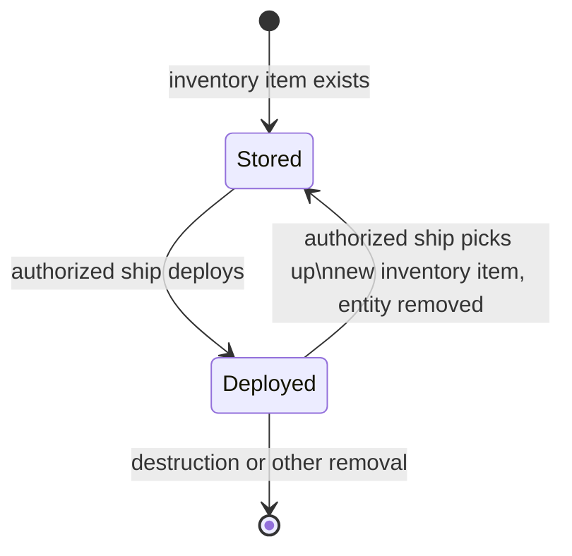
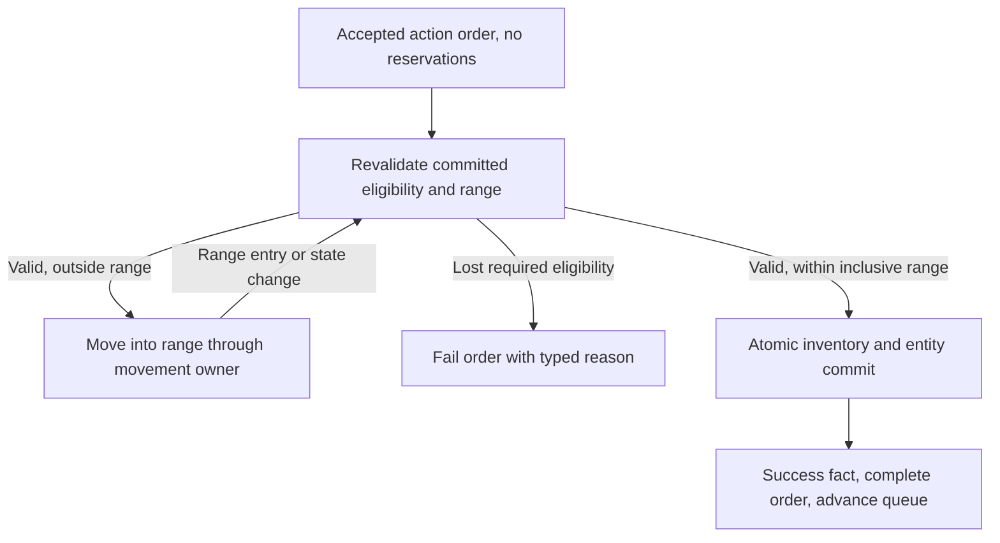

# Sensor deployables and placement lifecycle

[Project index](../README.md) · [Project task list](task-list.md) · [Fog-of-war and scouting](fog-of-war-and-scouting.md) · [Entity lifecycle and explicit spawning](entity-lifecycle.md) · [Inventory and cargo](inventory-and-cargo.md) · [Gameplay content](gameplay-content.md)

## Purpose

`TASK-074` defines the entity and lifecycle boundary for the initial stationary
sensor deployable before `TASK-073` consumes it as a sensor source. It does not
define sensor observation outcomes, construction assets, equipment, combat, or
general placement mechanics. Completed `TASK-075` defines deployment and pickup
range policy and the orders that move an acting ship into range.

## Accepted boundary

A deployable is its own category of portable inventory item. A successful
deployment materializes that item into a deployed entity. The deployed entity
is not a construction asset, and distinct construction assets are outside the
scope of `TASK-074`.

This establishes a physical transition between custody in an inventory and a
live deployed entity. Every successful deployment creates a new entity. Pickup
removes that entity, so no deployed-entity identity persists through pickup or
redeployment. The deployable is a discrete physical-item definition with its
qualified content key, capacity cost, presentation fields, and fixed sensor
radius. Each stored deployable is a discrete instance. Deployment consumes that
instance; pickup creates a new instance with the same definition and
properties. The initial item has no durability, charge, condition, or
per-instance configuration.

All operations preserve the atomic, deterministic inventory and entity-lifecycle
boundaries established by `TASK-041` and `TASK-011`.

The deployed entity belongs to the controlling principal of the source
inventory. Principals always control their own inventories, so deployment does
not introduce a separate ownership transfer or authorization source.

```mermaid
stateDiagram-v2
    [*] --> Stored: inventory item exists
    Stored --> Deployed: authorized ship deploys
    Deployed --> Stored: authorized ship picks up\nnew inventory item, entity removed
    Deployed --> [*]: destruction or other removal
```

## Approved interactions

Player-visible deployable information follows the existing `TASK-020`
sensor-range and presentation boundary. NPC planners read their approved
authoritative views and do not gain a persistent discovery ledger or a
principal-scoped fog-of-war model from deployables.

Every principal may shoot a deployable when that principal is capable of
shooting and all other relevant conditions admit the action. Shooting is an
interaction permission, not a combat contract. `TASK-046` defines targeting,
range, damage, destruction, and their outcomes.

Only a ship owned by the deployed entity's owning principal and acting through
its valid current controller may deploy, pick up, or redeploy it. That principal
is the controller of the source inventory at deployment. These permissions do
not grant those commands to stations, deployables, facilities, or other entity
kinds. The initial model has no delegated authorization, capture, or use of
another principal's ships.

Successful pickup produces a new inventory item with the same definition and
properties as the item that created the deployable. It removes the deployed
entity and does not restore its identity. A later deployment therefore creates
a new entity.

`TASK-075` owns the numeric deployment and pickup ranges. `TASK-046` owns
shooting range, destruction behavior, and resulting disposition.

## Placement contract

An authorized ship submits an explicit deployment command that names one
eligible inventory item and a target `SystemPosition` in that ship's current
system. The command is admitted only when the ship is live and not in connector
transit, the source inventory is controlled by the owning principal, the item
is available, and the target is valid system-local position data. The owner
confirmed under `TASK-075` that an out-of-range command creates an order to move
into range and then act. Command admission and execution of the inventory and
entity transition are therefore distinct checks, as defined below.

The initial contract adds no occupancy, minimum-separation, collision,
avoidance, terrain, or other physical-placement rule. Independent deployables
may occupy the same position. A later geometry task must define any restriction
before it becomes an admission condition.

Deployment atomically consumes the eligible inventory item and materializes the
fresh deployed entity at the target position. Pickup atomically removes the
target deployed entity and restores the equivalent inventory item. A rejected
operation changes neither inventory nor entity state.

Each command carries a stable identity. Commands contend in that stable commit
order. Conflicts for the same inventory item or the same deployed entity have
one deterministic winner. Independent items targeting the same position do not
conflict under the initial no-occupancy contract. A ship admits at most one
deploy or pickup command at one commit boundary.

### Deployment and pickup range design (TASK-075)

**Decision status:** Confirmed by the project owner on 2026-10-01. The
completed `TASK-075` design establishes the range values, definition owners,
move-into-range behavior, execution while
moving, no reservations, inclusive boundaries, and terminal failure on lost
eligibility. Successful execution immediately advances the order queue.

The completed lifecycle contract establishes who may act and which inventory
and entity changes commit together. This design establishes how close the
acting ship must be, where that policy comes from, and what happens when the
ship is outside the permitted range.

Completed `TASK-087` supplies the measurement contract: one coordinate unit is
one meter, positions represent points, and ordinary range uses Euclidean
distance. Authoritative comparisons use squared distances with wide checked
arithmetic inside the common coordinate envelope. See [Authoritative
system-local coordinate scale](system-local-coordinate-scale.md).

#### Confirmed range and order decisions

| Operation | Initial range | Policy source | Out-of-range behavior |
| --- | --- | --- | --- |
| Deploy | 2,500 meters | Deployable item definition | Create an order that moves into range, then deploys at the commanded position |
| Pick up | 5,000 meters | Acting ship definition | Create an order that moves into range, then picks up the named deployed entity |

Deployment and pickup use independently defined ranges. The authorized ship's
committed system-local position is the interaction origin. The deployment
target remains the explicit commanded position; pickup names the live deployed
entity. Moving the ship does not move the deployment target or the stationary
deployable. Sensor radius and shooting range retain their separate owners.
The ship-defined interaction/pickup range does not by itself define outcomes
for other interaction domains.

The order retains its action intent through movement rather than requiring the
caller to submit a second deploy or pickup command. It must participate in the
existing actor-control and order lifecycle, including cancellation, suspension,
target invalidation, and deterministic commit. These confirmed decisions do not
select a new navigation algorithm or create a second movement owner.

#### Execution and failure

Deployment and pickup may execute while the acting ship is moving. Neither
action requires zero speed. Both ranges include their exact boundary:
deployment permits a distance of exactly 2,500 meters and pickup permits
exactly 5,000 meters. Compare squared distance with squared applicable range
using the shared wide-arithmetic contract.

Approach orders reserve neither the deployment item nor pickup inventory
capacity or the target deployable. Accepting an order does not prevent another
eligible operation from consuming that item, filling the inventory, or picking
up that target first. Execution revalidates live actor and target state,
current controller and ownership authorization, system membership, applicable
range, item availability, and destination inventory capacity before the atomic
inventory and entity transition. A ship in connector transit cannot execute
either action because it has no system-local position.

An invalid initial submission is a rejected command under the existing command
contract. An accepted order that subsequently loses its required item,
capacity, authorization, target, or another required eligibility condition
fails with a typed reason. It does not wait for the item or capacity to return,
reserve resources retroactively, or retry after failure. Outside range during
a valid approach is expected progress, not itself a failure.

Range-entry work uses `TASK-071` and the authoritative motion schedule. Due
reevaluation reads the committed spatial view after physical completions at
that timestamp. A forecast or a crossing in the preceding interval triggers
reevaluation; it does not authorize execution if the ship is already outside
range at the representable timestamp. Committed changes to motion, target,
inventory, authorization, or applicable policy invalidate affected evaluations.
Stale scheduled work cannot execute a cancelled, failed, or completed order.

Evaluation reads stable inputs and returns buffered proposals. Deterministic
owner commit revalidates contended resources in the existing stable command
order, so two unreserved orders cannot both consume one item or pick up one
entity. A losing accepted order fails without a partial inventory or entity
transition. Only a successful action emits the deployment or pickup success
fact. Failure uses the existing semantic order-transition fact and terminal
order reason; the accepted command receipt remains distinct from its later
order outcome.

The player must eventually be notified when an order fails. The notification
system and its presentation are explicitly deferred to `TASK-094`. Recording
the authoritative failure and its reason is required even before that surface
exists. This design does not add a temporary notification mechanism.

```mermaid
flowchart TD
    accepted["Accepted action order, no reservations"]
    evaluate["Revalidate committed eligibility and range"]
    approach["Move into range through movement owner"]
    failed["Fail order with typed reason"]
    commit["Atomic inventory and entity commit"]
    fact["Success fact, complete order, advance queue"]
    accepted --> evaluate
    evaluate -->|"Valid, outside range"| approach
    approach -->|"Range entry or state change"| evaluate
    evaluate -->|"Lost required eligibility"| failed
    evaluate -->|"Valid, within inclusive range"| commit
    commit --> fact
```

#### Successful execution and order progression

Successful deployment or pickup completes the action order and immediately
advances the order queue through the existing order coordinator. It does not
wait for the ship to stop or finish the remaining approach movement. Movement
handoff uses the committed position and velocity and the existing movement and
order lifecycle; success does not introduce an instantaneous stop. Any
replacement or invalidation of approach work goes through the movement owner.
Stale approach events cannot execute the completed action again.

#### Verification criteria

Implementation must prove exact-boundary, just-inside, just-outside, diagonal,
and large-coordinate comparisons for both independently sourced ranges. It
must cover moving execution, brief swept crossings that end outside range,
connector transit, cancellation and stale events, same-time contention without
reservations, item or capacity loss, authorization loss, and target removal.
Failed execution must leave inventory and entity state unchanged while exposing
the terminal reason through the order lifecycle. Checkpoint continuation must
produce the same outcomes as uninterrupted execution. Any batched evaluation
must preserve the single-thread result across worker counts, partition layouts,
and batch sizes.

Neither operation may execute outside its applicable bounded range, even when
the actor and target are in the same system. Accepting an approach order does
not authorize its later inventory or entity mutation without execution-time
eligibility.

## Facts, presentation, persistence, and sensor handoff

Successful deployment emits a deployable-deployed fact. Successful pickup emits
a deployable-picked-up fact. Each fact identifies the deployed entity, its
definition key, owning principal, acting ship, system-local position, and source
command identity. The pickup fact refers to the entity that was removed.

An observed live deployable exposes its stable entity identity, definition,
owning principal, system-local position, and observation time. It does not
expose its source inventory, authorization state, or combat details. This is
the typed view retained by the `TASK-020` persistent-discovery contract when a
non-owned stationary deployable leaves coverage.

The checkpoint and save boundary retains each live deployable's entity identity,
definition key, owning principal, and position, together with the applicable
entity and item allocator states and required command idempotency receipts.
It does not retain derived spatial indexes or sensor coverage. Restore resolves
the definition and ownership links, validates them, then publishes only fully
live deployed entities.

Pending deploy and pickup orders retain their stable order and source-command
identities, acting ship, action kind, source or destination inventory references,
deployment item and position or pickup entity target, lifecycle state, and
movement correlation through the existing authoritative order and movement
checkpoint boundaries. There is no reservation state to save. The resolved
item-defined deployment range and ship-defined pickup range must retain their
authoritative meaning through versioned definition references or saved policy,
following the existing content and save compatibility contracts. Restore must
not silently substitute changed range values or execute a pending action twice.
Spatial candidates and range forecasts remain derived data and rebuild from
restored committed state.

After a successful deployment commit, the deployable owner publishes an
immutable sensor-source record containing entity identity, owning principal,
system, position, and sensor radius. `TASK-073` reads only this committed record
to calculate coverage, and stops reading it after removal commits. It does not
own placement, inventory, command, or lifecycle transitions.

## Deferred work

`TASK-095` implements the accepted deployable lifecycle and range-order
contracts. `TASK-094` owns deferred player notification of order failure. `TASK-046`
owns combat targeting, shooting range, damage, destruction, and its resulting
disposition.

The approved interactions do not imply capture, transfer between principals,
repair, resupply, refuelling, hacking, deactivation, recovery after damage, or
salvage. A later task may introduce any of these only with an owning contract.

Completed `TASK-069` supplies generalized inventory. `TASK-095` implements the
deployable transactions over that foundation. `TASK-073` consumes committed
deployed entities as stationary sensor sources.
