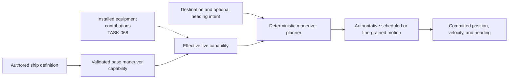

# Ship thrust, maneuver kinematics, and short moves

[Project index](../README.md) · [Authoritative system-local coordinate scale](system-local-coordinate-scale.md) · [Navigation and spatial architecture](navigation-architecture.md) · [Moving-ship interactions](moving-ship-interactions.md) · [Gameplay content](gameplay-content.md) · [Concurrency and performance](concurrency-and-performance.md) · [Project task list](task-list.md)

## Decision status

**Decision status:** Confirmed by the project owner on 2026-09-16.

`TASK-089` is a completed design task. This document establishes the ship
maneuver contract. It does not itself authorize implementation changes to
ship definitions, content schemas, movement, checkpoints, saves, or
presentation.

## Purpose and boundary

Completed `TASK-087` established the physical scale and the high-level motion
model, but it deliberately left ship-specific maneuver behavior to this task.
`TASK-089` defines how an authored ship design becomes authoritative movement
capability and how that capability governs turning, thrust, braking,
destination approach, zero-distance heading changes, and very short moves.

This task must define:

- the authored and derived capability values associated with a ship design;
- the relationship among mass, thrust, acceleration, deceleration, maximum
  sub-cruise speed, and turn rate;
- the directional limits of primary and precision thrust;
- deterministic turning and translation profiles;
- the boundary between scheduled maneuver segments and fine-grained movement;
- integration with moving spool, cruise entry, and cruise dropout;
- interruption, replanning, destination arrival, facts, snapshots,
  checkpoints, and saves; and
- stable evaluation and commit rules that do not depend on worker count or
  completion order.

This task does not define ship geometry, collision response, or avoidance
policy owned by `TASK-072`; combat policy owned by `TASK-046`; docking access,
berths, or attachment owned by `TASK-051`; or equipment installation and
capability-contribution rules owned by `TASK-068`.

## Inputs from TASK-087

This design builds on the following constraints from completed `TASK-087`:

- One authoritative system-local coordinate unit is one meter, positions use
  integer meters, and ordinary range uses Euclidean distance.
- Ships have distinct cruise and maneuver speeds. The initial defaults are 1
  kilometer per simulated second for cruise, 300 meters per simulated second
  for maximum sub-cruise speed, and 10 simulated seconds for moving spool,
  subject to ship-specific capability design here.
- Ordinary cruise remains an analytic scheduled segment. Only ships involved
  in an active interaction enter bounded fine-grained movement.
- A ship aligns to its outbound course and then spools while moving straight
  at maneuver speed. A committed course change or attack hit resets the spool.
- Cruise is selected only when the complete spool-and-cruise plan arrives
  sooner than the applicable sub-cruise plan.
- Cruise dropout is instantaneous. At dropout, the ship retains its current
  heading and begins sub-cruise movement at its maximum sub-cruise speed.
- A zero-distance move may change heading without translating the ship.
- Existing coordinate-envelope, checked-arithmetic, and rounding ownership
  remain in force.

## Design direction

These choices form the design baseline.

### Authored ship capability

Ship mass, thrust, acceleration, deceleration, maximum sub-cruise speed, turn
rate, and other ship-specific movement properties are defined or derived, as
appropriate, from authored ship content. The ship-definition content schema
will expose the fields needed to establish those properties. Runtime policy
must not invent hidden per-design movement values or derive them from display
names, entity identifiers, scenario order, or presentation assets.

Content authors directly specify player-comprehensible acceleration and turn
limits. Maximum speeds are also authored caps. Other values may be derived from
authored inputs where this design explicitly defines the calculation. The
resolved content catalog should publish a validated, immutable base capability
definition. A live ship's effective capability may later include
installed-equipment contributions through the boundary owned by `TASK-068`.

Cargo does not contribute to maneuver mass. A ship therefore has the same
maneuver mass with an empty or full cargo bay. Fuel is not modeled, and damage
does not change mass. Equipment may change mass. Greater effective mass causes
the ship to change velocity more slowly. Equipment may eventually modify any
maneuver capability, so this design must not close the capability-composition
boundary around a fixed subset of properties.

### Primary and precision thrust

A ship's primary drive is at its rear and provides its principal acceleration
along the ship's forward heading. Ships also retain minimal translational
thrust in every direction. This precision thrust allows short movements such
as docking approaches without requiring a complete rotation merely to produce
a small lateral or backward displacement.

Content authors provide one base acceleration value rather than separate
forward, reverse, and lateral acceleration values. Directional acceleration
limits are derived from that value through deterministic policy. The exact
derivation ratios remain to be selected.

All-direction precision thrust does not remove heading as authoritative state
and does not imply arcade-style direct piloting. Movement remains the result of
orders and deterministic authoritative planning.

### Simplified kinematics and passive drag

The game uses simplified space kinematics rather than inertial motion that
continues unchanged until an opposing force is applied. When no thrust is
applied, passive drag decelerates a moving ship. The default passive
deceleration rate is related to the ship's maneuver mass, while authored ship
content may supply a custom deceleration rate. The exact mass relationship and
override rule remain to be defined.

Acceleration and braking use deterministic piecewise-constant thrust profiles.
A ship may apply its rear primary thrust while turning. Turn rate is a directly
authored limit rather than a value derived from rotational thrust, mass, or
moment of inertia. Speed does not alter the available turn rate. Rotation
changes heading but does not rotate or otherwise change the current velocity
vector. Only thrust, passive drag, or another explicit gameplay effect changes
velocity.

### Maneuver planning policy

The planner abstracts the objective used to select among valid maneuvers.
Fastest arrival and shortest path are both supported policy choices. Neither
objective is embedded into the movement order or hard-coded as the only valid
planner. The initial default and the authority that selects a policy remain to
be decided.

### Heading and arrival

Authoritative heading is expressed in degrees on a 0-to-360-degree circle. A
new ship with no authored or scenario-provided heading starts at 0 degrees.
Precision thrust may translate a ship while preserving its heading, and a
maneuver order may request a final heading.

Arrival evaluates bounded velocity and heading tolerances rather than requiring
exact equality. An intermediate location in a queued route does not
automatically require the ship to reach 0 meters per second before beginning
the next segment. A terminal destination normally ends at or near zero
velocity.

Arrival uses these initial constants:

- `ArrivalPositionToleranceMeters = 1`
- `ArrivalSpeedToleranceMetersPerSecond = 1`
- `ArrivalHeadingToleranceDegrees = 1`

These values align with the one-meter coordinate scale, permit deterministic
integer-friendly checks, and are small relative to the initial ship-size
anchors. Heading tolerance applies only when the order requests a final
heading. Docking may define a separate capture envelope under `TASK-051`.

### Braking model

Braking uses the following model:

1. Plan terminal braking as another piecewise-constant maneuver phase. Compute
   the latest safe braking point from current velocity, target terminal
   velocity, effective directional deceleration, turn time, and the applicable
   arrival tolerance. For a constant active braking phase aligned against the
   velocity vector, use the ordinary stopping-distance relation
   `distance = (currentSpeed^2 - targetSpeed^2) / (2 * deceleration)`. Compose
   any turn or precision-thrust phases separately rather than hiding them in
   that calculation.
2. Apply commanded acceleration opposite the velocity vector during active
   braking. The chosen maneuver policy may rotate to use primary thrust or use
   weaker precision thrust while preserving or approaching the requested final
   heading.
3. Apply passive drag during no-thrust phases, but do not add it to active
   braking acceleration. This keeps the simplified model explainable and
   avoids counting two deceleration systems at once.
4. When every terminal-arrival tolerance is satisfied, commit velocity to
   exactly zero so passive drag cannot leave an indefinitely shrinking drift.
5. Plan cruise dropout early enough to fit the complete turn and braking
   maneuver after dropout. An unplanned interaction dropout retains maximum
   sub-cruise speed and begins the strongest currently valid braking maneuver;
   it never removes velocity instantaneously.

## Decision register

The numbered statements below define the complete design contract. They do not
authorize implementation.

### Capability and content model

1. Content authors directly specify player-comprehensible base acceleration and
   turn-rate limits. Maximum-speed caps are also authored. Directional
   acceleration and default passive deceleration derive from those values as
   described below.
2. The initial ship-design maneuver fields are base mass, base
   acceleration, optional custom passive deceleration, maximum sub-cruise
   speed, cruise speed, turn rate, and moving-spool duration. Heading is live
   ship state and an optional scenario or materialization input, not a property
   shared by every instance of a design. Physical thrust and torque are not
   authored because the simplified model consumes acceleration limits directly.
3. Author mass as positive whole kilograms and durations as
   positive whole milliseconds. Author speeds in meters per second,
   accelerations in meters per second squared, and angular values in degrees or
   degrees per second using invariant decimal strings with at most three
   fractional digits. Resolve them without binary floating point into integer
   millimeters-per-second, millimeters-per-second-squared, and millidegrees.
   Validation rejects zero or negative capabilities, non-exact conversion, and
   any value whose worst-case checked `Int128` calculations can exceed the
   established coordinate or time envelopes.
4. Cargo and damage do not change maneuver mass, and fuel is not modeled.
   Equipment may change mass. Greater effective mass causes slower velocity
   change. An equipment installation, removal, activation, or
   deactivation first materializes the ship at the commit timestamp, then
   publishes the new effective capability revision, invalidates its remaining
   maneuver schedule, and replans. A reduced speed cap never clamps velocity;
   the ship enters a legal braking phase.
5. A ship passively decelerates when no thrust is applied, and content may
   specify a custom rate. Treat authored acceleration and custom
   deceleration as the unmodified ship's rates at its authored base mass. Use
   25 percent of base acceleration when custom deceleration is absent. Scale
   both acceleration and deceleration by `baseMass / effectiveMass` after
   equipment contributions. A custom deceleration replaces the 25-percent
   default before mass scaling.
6. Maximum speeds are authored caps that equipment may modify.
   Retain exactly two magnitude caps: cruise speed and maximum sub-cruise speed.
   The sub-cruise cap applies to the complete velocity vector in every
   direction. Capability changes above the new cap trigger braking rather than
   instantaneous velocity loss.
7. Content authors provide one base acceleration value. Forward
   primary acceleration uses 100 percent of the effective value. Reverse and
   lateral precision acceleration use 10 percent. Treat 10 percent as a
   versioned maneuver-policy constant rather than a per-design field.
8. Rotation does not consume translational acceleration budget.
   Simultaneous forward and precision translation share one elliptical budget:
   normalized forward use squared plus normalized precision use squared may not
   exceed one. The precision vector itself has one magnitude limit, preventing
   diagonal thrust from receiving a free increase.
9. Equipment may modify any maneuver property, including mass.
   `TASK-068` supplies typed contributions addressed by stable maneuver
   capability keys. For each key, sum flat deltas and basis-point modifiers in
   stable equipment-instance order, then apply the combined modifier once and
   validate the result. Do not use a generic string property bag, arbitrary
   callbacks, or order-dependent chained multiplication. New typed capability
   keys may be added without changing this composition contract.
10. Increment the content-document schema when ship-definition
    structure changes, the maneuver behavior version when formulas or profile
    rules change, and the checkpoint schema when encoded live maneuver state
    changes. Canonical content fingerprints automatically cover every new
    field. Built-in content migrates with the schema. Saves retain qualified
    design references and compatibility metadata; incompatible historical
    references migrate through `TASK-037` or reject before session publication.

### Heading, turning, and translation

11. Store heading as integer millidegrees in the canonical range
    `[0, 360000)`. Zero degrees points along positive system X, or east, matching
    the existing formation convention. Positive rotation is clockwise. Accept
    an authored 360 degrees as equivalent input but canonicalize it to zero.
    Use shortest-arc turning; an exact 180-degree tie turns clockwise.
12. A newly created ship with no specified heading defaults to 0 degrees.
    Static-scenario ship instances and runtime materialization
    requests may provide the optional heading. The ship design does not.
    Validation uses question 11, and a save restores the exact canonical live
    heading rather than applying the creation default again.
13. A zero-distance maneuver with a requested final heading turns
    in place and completes within the one-degree heading tolerance. Without a
    requested heading it completes immediately only when the ship already meets
    terminal velocity tolerance. Otherwise it brakes first. Any unavoidable
    translation caused by existing velocity remains authoritative; the command
    does not teleport the ship back to its starting point.
14. Turn rate is directly authored, independent of speed, mass, and moment of
    inertia. Turning changes heading without changing velocity. No
    thrust state further constrains turn rate. A ship may turn at its effective
    cap while applying any valid translational thrust.
15. A ship may use primary thrust while turning. Rotation and
    translation evaluate independently. Translation uses the shared envelope
    from question 8 relative to the heading at that instant; the piecewise
    planner splits a segment whenever changing heading changes the selected
    acceleration vector.
16. A maneuver consists of a deterministic sequence selected from
    turn, accelerate, capped-speed travel, coast under passive drag, active
    brake, and terminal settle phases. Each phase has constant acceleration and
    angular rate and an exact scheduled boundary. Interruption materializes
    position, velocity, and heading at the interruption timestamp, invalidates
    all later phases by generation, and replans rather than resuming a stale
    phase list.
17. Passive drag reduces speed when no thrust is applied. It acts
    directly opposite velocity at the effective constant deceleration rate,
    never changes heading, never reverses velocity, and becomes exact zero at
    the scheduled stop time. It does not apply while commanded translational
    thrust is active and therefore does not stack with active braking.
18. Fastest arrival and shortest path are both supported maneuver objectives.
    Fastest arrival is the default for ordinary move orders. The
    order or controller supplies an explicit policy identity when choosing
    otherwise, and that choice remains with the replaceable plan. Fastest ties
    prefer shorter path; shortest-path ties prefer earlier arrival; remaining
    ties prefer fewer phases and then a stable maneuver-profile key.
19. Precision thrust may preserve heading, and an order may request a final
    heading. When no final heading is requested, heading is
    unconstrained. The selected plan retains whatever heading its final phase
    produces rather than adding a turn that does not advance the chosen
    objective.

### Arrival, short moves, and cruise transitions

20. Arrival uses tolerances of 1 meter, 1 meter per second, and 1 degree when a
    final heading is requested. A terminal destination
    targets zero velocity and has no heading constraint unless one is supplied.
    A queued intermediate waypoint is a fly-through transition: when the next
    destination is known, the combined plan passes within 1 meter and continues
    without applying terminal velocity or heading tests. If no admitted next
    destination exists at planning time, the destination is terminal. Queue
    changes invalidate and replan from the committed state.
21. Very short terminal moves use a triangular profile that omits
    capped-speed travel: accelerate only until the deterministic switch point,
    then brake. If current velocity already places the ship beyond that switch
    point, brake immediately. The terminal settle rule commits exact zero only
    after all applicable arrival tolerances pass, so the planner never toggles
    repeatedly around the destination.
22. Cruise-versus-sub-cruise comparison includes turning, acceleration,
    braking, and final heading. Build both candidates under the
    currently selected maneuver objective, then compare their complete arrival
    timestamps. Cruise is eligible only when its candidate arrives strictly
    earlier. A tie stays sub-cruise and avoids unnecessary spool state.
23. The braking model calculates the latest safe braking point from
    velocity, effective deceleration, turn time, and arrival tolerance. It
    applies acceleration opposite velocity, does not stack passive drag with
    active braking, commits zero velocity after terminal tolerances are met, and
    retains full speed on unplanned cruise dropout while beginning the strongest
    valid braking maneuver.
24. Replanning first materializes exact position, velocity, and
    heading from the active phase at the commit timestamp. It retains the
    current effective-capability revision for that materialization, then applies
    any committed capability change, advances the motion generation, and
    invalidates remaining phase and arrival events. Applied thrust is a phase
    instruction rather than independent momentum state, so the new plan chooses
    the next thrust vector from the materialized kinematic state.
25. General movement owns reaching a requested position, velocity,
    and optional heading with ordinary precision thrust. `TASK-051` owns docking
    access, approach corridors, reservation and queueing, capture envelopes,
    attachment, cancellation, and failure. Docking requests ordinary maneuver
    goals through the same planner and does not create a second movement engine.

### Scheduling, deterministic execution, and persistence

26. Ordinary turns, acceleration, passive deceleration, braking, and short moves
    remain analytically scheduled. A domain-owned interaction
    activates fine-grained movement only through the swept-entry contract from
    completed `TASK-019`. Entry materializes state and invalidates the schedule;
    exit commits one stable kinematic state and builds a new analytic schedule.
    Observation and rendering never activate fine-grained movement.
27. `TASK-089` defines no global movement timestep. Each consuming
    interaction domain owns a positive integer-millisecond, behavior-versioned
    step as required by `TASK-019`. It applies the same fixed-point kinematic
    equations and phase-boundary rounding used by analytic movement. A
    single-thread reference result must match every supported worker count,
    partition, batch layout, and evaluation completion order.
28. Preserve the existing event-phase spine. Physical maneuver
    boundaries materialize first; state and spatial indexes update second; all
    due interactions evaluate from that stable view; validated interruption,
    capability, order, and replan effects commit in stable owner-defined key
    order; new event proposals then receive agenda sequences; semantic facts
    commit last. Stale generations are defined no-ops and never reopen an
    earlier phase.
29. Save each ship's system and position, velocity vector, heading,
    active motion mode, maneuver objective, motion identity and generation,
    capability revision, current phase with its start state and timestamps,
    remaining canonical phase plan, order linkage, and pending event keys.
    Restore base definitions and installed equipment by compatible reference and
    validate that they reproduce the saved capability revision. Spatial indexes,
    stopping forecasts, cruise comparisons, and presentation interpolation are
    derived and rebuilt.
30. Emit semantic facts for maneuver start or replacement,
    interruption with typed reason, cruise entry and dropout, and destination or
    waypoint arrival. Do not emit facts for every internal phase boundary.
    Diagnostic snapshots expose exact position, velocity, heading, motion mode,
    objective, current phase, capability revision, and expected next boundary.
    Presentation receives exact details for player-controlled ships and only the
    observer-safe movement projection permitted by completed `TASK-020` for
    other ships.
31. Implementation increments the content-document schema,
    maneuver behavior version, runtime-policy manifest, checkpoint/save schema,
    and affected scenario and benchmark digests. Increment only the boundaries
    whose encoded or authoritative meaning changes. Disposable built-in content
    migrates directly; supported historical saves use deterministic migrations
    or fail compatibility validation before any owner is constructed.
32. Required evidence covers strict content validation and
    canonicalization; mass and equipment scaling; directional thrust envelopes;
    heading normalization and shortest-arc ties; every maneuver phase; short
    triangular moves; fly-through waypoints and terminal arrival; planned and
    forced cruise dropout; interruption and stale-generation no-ops;
    checkpoint/restore continuity; numeric envelope boundaries; and equal
    authoritative results across worker, partition, and batch layouts.
    Benchmarks cover many independently scheduled ships, one crowded system,
    repeated replanning, and bounded promotion into active interactions while
    retaining the single-thread reference path.

## Implementation handoff

This design is ready for the separately tracked `TASK-090`
implementation when the project owner promotes it. That work may:

1. extend the format-neutral ship-definition model and strict content adapter;
2. validate and resolve immutable base maneuver capabilities;
3. add authoritative live maneuver state and deterministic planning;
4. integrate sub-cruise movement with spool, cruise, interactions, commands,
   facts, snapshots, checkpoints, and saves;
5. migrate built-in content and compatibility versions; and
6. prove the single-thread reference path and supported parallel layouts with
   focused tests and benchmark evidence.
