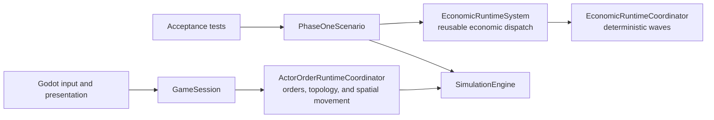

# Simulation architecture

[Project index](../README.md) · [Runtime orchestration](runtime-orchestration.md) · [Navigation and spatial architecture](navigation-architecture.md) · [Actor control and order lifecycle](actor-control-and-orders.md) · [Concurrency and performance](concurrency-and-performance.md) · [Technical direction](technical-direction.md) · [Time and pacing](time-and-pacing.md)

## Goals

The simulation should be persistent, inspectable, reproducible, and able to run without rendering. It should support large numbers of individually identifiable ships without updating every behavior at rendering frequency.

## Major layers

### World state

The world contains systems, connections, ships, stations, inventories, ownership, relationships, and other durable state. Each system is a distinct local navigable space. Explicit connectors such as gates provide transit between systems.

Phase 1 represents movement as a graph of locations and routes. That graph is a
deterministic acceptance backend rather than the target world model. General
movement separates destination intent, hierarchical planning, and execution;
ships have authoritative system-relative spatial and motion state, while gates
and other connectors form the inter-system topology. See
[Navigation and spatial architecture](navigation-architecture.md).

Internal `SimulationWorld` is the concrete owner of the Phase 1 economic
acceptance state. It holds the navigation graph, inventories, production
facilities, construction sites, design catalog, ships, transport board, and
identifier sequences. The Phase 1 fixture populates it through a one-use setup
capability that is consumed before runtime advancement.

The application-facing runtime separately owns general system-local spatial
state and current ship orders. `GameSessionSetup` provides explicit initial
systems and ship positions. Application callers never receive either mutable
aggregate.

### Event runner, sessions, and acceptance harnesses

`SimulationEngine<TEvent>` owns deterministic event ordering and clock
advancement. A scenario supplies an `ISimulationRuntime<TEvent>` that
reconciles systems, handles its event vocabulary, accrues time-based metrics,
and declares its stopping condition. The engine has no knowledge of Phase 1
materials, facilities, routes, or victory conditions.

`GameSession` is the persistent application-facing facade. It composes
`ActorOrderRuntimeCoordinator`, command sequencing, a general game event
vocabulary, immutable connector topology, hierarchical navigation, spatial
movement, actor control, and active, queued, or suspended ship orders. It
exposes immutable `GameSnapshot` and diagnostic records without exposing
mutable state.

The test-only `PhaseOneFixture` builds the proof-of-concept economic world.
`tests/GalaxyCommand.Simulation.Tests/Acceptance/PhaseOneScenario` is a
separate bounded regression harness that
directly composes `EconomicRuntimeSystem`. It retains the first-constructed-ship
stopping condition, temporary materialization adapter, and exact event and
state fingerprints used by headless acceptance tests. It is
intentionally not used by `GameSession`, Godot, the CLI, or benchmarks.

Additional bounded fixtures belong under the test project's `Acceptance/`
directory; they do not define the lifecycle or API of a normal game session.

`TASK-009` replaced the combined acceptance runtime with reusable production
domain owners beneath fixed coordinators. The Phase 1 scenario keeps only its
fixture and acceptance responsibilities. See
[Runtime orchestration and domain ownership](runtime-orchestration.md) for the
accepted target and migration sequence.

### Physical and logistical activity

Ships travel, carry cargo, mine resources, dock, fight, and perform assigned work. Stations store materials and perform production according to their capabilities.

### Economic coordination

Offers, contracts, shortages, and production demand connect otherwise independent actors. Economic indexes should prevent every ship from repeatedly searching the entire galaxy.

### Strategic planning

Factions evaluate threats and opportunities at a lower frequency than ship movement. Plans create concrete objectives and orders that the physical simulation must carry out.

### Presentation

The application renders a view of the simulation and converts player input into commands. Rendering should not own authoritative simulation state.

## Update model

Different activities should use the update model appropriate to them:

- Fixed steps for activity that requires frequent interaction, such as active combat
- Scheduled events for arrivals, production completion, and other known future changes
- Triggered evaluation when inventories, orders, or threats materially change
- Low-frequency planning for faction strategy and diplomacy
- Visual interpolation between authoritative simulation changes

An entity remains individually simulated even when it is represented by scheduled events rather than continuous polling.

Parallel evaluation must preserve this update model and its deterministic phase
barriers. Systems read stable phase state and publish buffered effects;
authoritative mutation, cross-system transfer, event sequencing, and conflict
resolution occur through defined commits rather than worker timing. Systems are
natural ownership boundaries but may expose many work batches when one system
is crowded. See
[Concurrency and performance architecture](concurrency-and-performance.md).

## Reproducibility

The simulation should use explicit seeds and controlled time advancement. Given the same initial state and commands, it should reproduce the same meaningful outcomes wherever practical.

This supports:

- Save and load reliability
- Automated balancing experiments
- Replaying difficult bugs
- Headless long-duration tests
- Comparing changes to simulation behavior

## Observability

Important decisions should produce structured reasons or events that the UI and development tools can inspect. The design should avoid retaining unlimited history, but it should preserve enough recent context to explain behavior.

The economic model is described in [Economy and production](economy.md), while faction-generated objectives are described in [Factions and strategic behavior](factions.md).

Concrete event ordering and initial invariants are defined in the [Phase 1 simulation specification](phase-1-simulation-spec.md).
