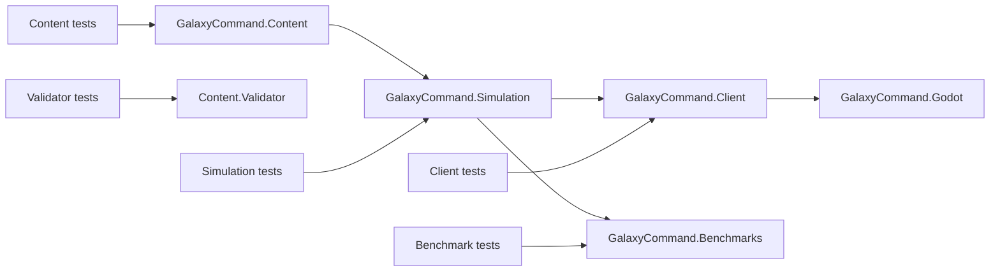

# Source-code organization

[Project index](../README.md) · [Task list](task-list.md) · [Simulation architecture](simulation-architecture.md) · [Runtime orchestration](runtime-orchestration.md) · [Concurrency and performance](concurrency-and-performance.md)

## Decision status

This document records the completed implementation of `TASK-091`. The first
migration preserves behavior, public types, and the
`GalaxyCommand.Simulation` namespace while reorganizing files around existing
ownership boundaries.

The simulation production and test trees now mirror the approved domains. The
framework-independent client behavior lives in `GalaxyCommand.Client`, Godot
contains only its rendering and input adapters, and validator and benchmark
tests have dedicated projects. The original large fact, relationship,
navigation, checkpoint, and runtime-coordinator files are split along the
responsibilities described below.

## Problem

The solution has clear runtime ownership in its architecture, but its source
layout does not expose that structure. The simulation project currently keeps
almost every source file at its root. Models, planners, authoritative owners,
orchestration, checkpoints, presentation records, and persistence code are
therefore interleaved.

The same problem appears in the flat simulation test project. In addition,
framework-independent client behavior remains under the Godot project and is
compiled into its test project through linked source files. Simulation tests
also reference the benchmark executable, and content tests cover both the
content library and validator executable.

The organization should make these boundaries visible without turning each
directory into an assembly or changing runtime authority.

## Organization principles

- Organize simulation code first by authoritative domain or architectural
  responsibility, then by role within a large domain.
- Keep related model, evaluation, effect, commit, and checkpoint code close
  enough that the complete ownership boundary can be found without searching
  the entire solution.
- Separate read-only planning from authoritative runtime mutation, especially
  for spatial maneuvers and future parallel evaluation.
- Mirror production organization in tests. Keep cross-domain behavior in an
  explicit `Integration` directory and bounded scenario harnesses in
  `Acceptance`.
- Preserve the `GalaxyCommand.Simulation` namespace during the first migration.
  Directory structure does not establish a new public API boundary.
- Do not split the simulation into additional assemblies until measured
  coupling and stable ownership justify the dependency cost.
- Make Godot an adapter over framework-independent client behavior and the
  immutable simulation presentation boundary.

## Target solution boundaries



`GalaxyCommand.Client` is the approved name for the new client project that is
independent of the rendering framework. It owns pacing, input buffering, client-local
preferences, map transforms, and command construction. It must not become a
second simulation authority. `GameSession` remains the sole command and
advancement facade, and Godot continues to consume immutable presentation
snapshots and semantic facts.

## Target simulation layout

```text
GalaxyCommand.Simulation/
├── Kernel/
│   ├── Identity/
│   ├── Time/
│   ├── Scheduling/
│   └── Determinism/
├── Session/
│   ├── Commands/
│   ├── Facts/
│   └── Runtime/
├── Actors/
│   ├── Control/
│   ├── Orders/
│   └── Ships/
├── Spatial/
│   ├── Topology/
│   ├── Navigation/
│   ├── Movement/
│   └── Maneuvers/
│       ├── Capabilities/
│       ├── Kinematics/
│       ├── Planning/
│       ├── Plans/
│       └── Runtime/
├── Economy/
│   ├── Inventory/
│   ├── Production/
│   ├── Construction/
│   ├── Logistics/
│   └── Transport/
├── Entities/
├── Relationships/
├── Persistence/
│   ├── Checkpoints/
│   └── Saves/
├── Loading/
├── Presentation/
└── Diagnostics/
```

This is an ownership map, not a requirement to create an empty directory for
every listed leaf. Directories should be introduced when files are moved into
them.

### Maneuver organization

The completed unblocked portion of `TASK-090` makes maneuvers the clearest
first slice:

- `Capabilities` contains authored and effective capability values and the
  ship-relative thrust envelope.
- `Kinematics` contains checked fixed-point projection, motion evaluation,
  arrival, braking, and deceleration primitives.
- `Planning` contains profiles, selectors, ranking, and planners. Planning is
  read-only and publishes immutable outcomes.
- `Plans` contains executable plan values grouped by short-move, sub-cruise,
  cruise, directional, and waypoint behavior.
- `Runtime` contains phase schedules, generation-bound scheduled execution,
  interruption, and authoritative boundary handling.

## Large-file decomposition

File moves and file splits are separate changes. After the directory migration
is stable, split large files along existing responsibilities:

- `Relationships.cs`: definitions, standing, diplomacy, grants, setup and
  snapshots, and the authoritative owner.
- `SimulationCheckpoints.cs`: shared checkpoint validation and root envelopes
  remain under persistence; domain checkpoint records move beside their owner.
- `GameFacts.cs`: fact infrastructure and store remain together while entity,
  relationship, command, order, and movement fact vocabularies separate.
- `SpatialNavigation.cs`: spatial values, topology, request and leg contracts,
  and planner implementations separate.
- `ActorOrderRuntimeCoordinator.cs`: event vocabulary, command admission,
  event dispatch, and reconciliation separate without creating another owner.

Splits must preserve behavior and type identity. A line limit alone is not a
reason to split a cohesive implementation.

## Test organization

`GalaxyCommand.Simulation.Tests` mirrors the production directories. Tests
covering more than one owner live under `Integration`; the Phase 1 bounded
harness remains under `Acceptance`.

Create dedicated `GalaxyCommand.Client.Tests`,
`GalaxyCommand.Content.Validator.Tests`, and
`GalaxyCommand.Benchmarks.Tests` projects. Remove linked Godot source
compilation and remove the benchmark executable reference from simulation
tests. Each test project should reference the production project it validates.

## Migration sequence

1. Move maneuver production and test files into matching directories without
   changing namespaces or behavior.
2. Move the remaining simulation domains one ownership boundary at a time,
   validating the affected tests and then the full solution after each slice.
3. Split oversized files in behavior-neutral follow-up commits.
4. Extract framework-independent client code into `GalaxyCommand.Client`, add
   its dedicated tests, and leave only Godot adapters and nodes in the Godot
   project.
5. Separate validator and benchmark tests from content and simulation tests.
6. Reassess namespaces and assembly boundaries only after the physical layout
   and dependency direction have been stable long enough to measure.

Use `git mv` for file relocation so history remains traceable. Do not combine
directory changes with gameplay behavior, save-schema changes, or public API
renaming.

## Completion criteria

- Production and test trees expose the same domain boundaries.
- The simulation project has no domain implementation files at its root beyond
  project-wide assembly metadata.
- Godot tests do not compile production files through linked source entries.
- Simulation tests do not reference the benchmark executable.
- Content-library tests and validator-application tests have distinct project
  ownership.
- The existing simulation namespace and public type identities remain intact
  through the first migration.
- Build, unit tests, deterministic digests, benchmark configuration tests, and
  Godot headless startup retain their pre-migration results.
