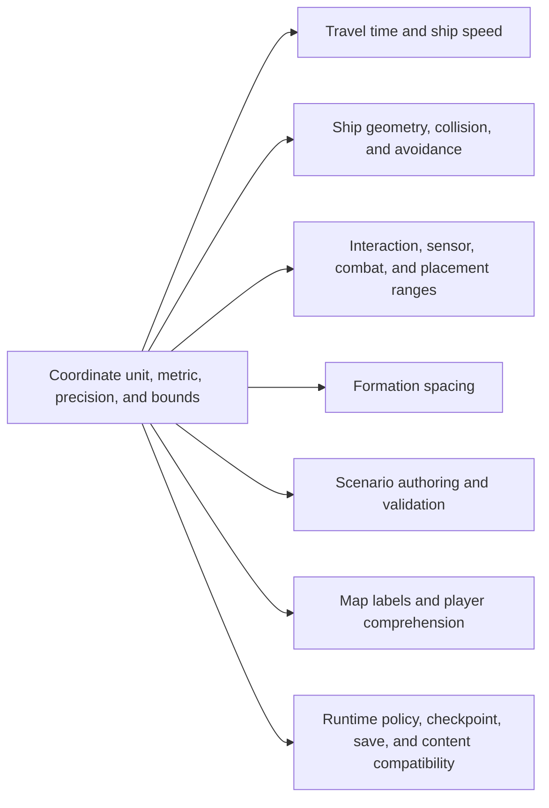
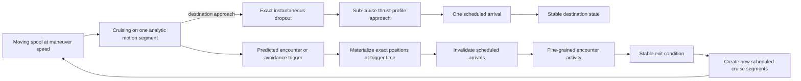

# Authoritative system-local coordinate scale

[Project index](../README.md) · [Navigation and spatial architecture](navigation-architecture.md) · [Moving-ship interactions](moving-ship-interactions.md) · [Group and fleet commands](group-and-fleet-commands.md) · [Scale targets and benchmarks](scale-and-benchmark-targets.md) · [Concurrency and performance](concurrency-and-performance.md) · [Project task list](task-list.md)

## Decision status

**Decision status:** Confirmed by the project owner on 2026-09-15.

`TASK-087` is a completed design task. This document establishes the accepted
system-local coordinate-scale contract. It does not itself implement or
authorize changes to coordinates, movement timing, formation spacing, authored
content, checkpoints, or saves. Those changes remain with their tracked owning
tasks.

## Purpose and boundary

Every authoritative position inside a star system is expressed with integer
`SpatialCoordinate` values. The project deliberately left the meaning of one
unit undefined while establishing navigation, movement, group commands, static
scenario composition, and presentation. That ambiguity now blocks coherent
choices for ship geometry, travel speed, interaction ranges, sensors,
collision and avoidance, and content authoring.

This design defines:

- what one authoritative system-local coordinate unit means;
- how coordinate distance relates to simulated travel time and ship speed;
- the distance and rounding rules shared by spatial consumers;
- the useful precision and valid extent of one system-local space;
- how ship size, interaction ranges, sensor ranges, collision, avoidance, and
  formation spacing relate to the scale without transferring policy ownership;
- how authors specify positions and how players see distances or coordinates;
  and
- how an accepted scale affects existing content, runtime policies,
  checkpoints, and saves.

This task does not select concrete sensor, deployment, pickup, combat,
collision-response, or avoidance values. Their owning tasks consume the scale
contract and retain their own gameplay policy. It also does not give physical
meaning to the presentation-only galaxy layout or to connector traversal
duration between distinct system spaces.

## Current constraints and provisional behavior

The following describe the repository today. They are inputs to the design,
not decisions made by this draft.

- A star system is an independent two-dimensional authoritative space.
  Systems are joined by connector topology, not by a galaxy-wide physical
  coordinate plane.
- `SpatialCoordinate` stores a signed 64-bit integer. Authoritative local
  movement interpolates integer positions over integer simulated
  milliseconds.
- Static scenarios author ship and connector-endpoint positions as exact
  integer `x` and `y` values. The current schema does not name a physical unit
  in those fields.
- The registered local travel-time policy uses Chebyshev map distance and a
  positive `millisecondsPerMapUnit` value. That policy and value are retained
  in checkpoints because they affect future authoritative results.
- The current Godot demonstration constructs its travel policy with 10
  simulated milliseconds per map unit. This is application setup, not an
  accepted physical scale or ship-speed contract.
- The initial group-move resolver assigns two or more ships to a 100-unit ring.
  Its documentation explicitly calls that radius abstract and provisional.
- The moving-interaction design requires exact, deterministic range and
  swept-path evaluation, but it has not selected the distance norm or a
  coordinate-scale interpretation.
- The system map currently renders authoritative coordinates through a local
  camera transform and rounds pointer-selected destinations back to integers.
  It does not provide a player-facing physical unit label.
- Checked-in built-in content places its starter ship at the origin. The
  development visual-preview scenario uses local values in the low hundreds.
  These examples demonstrate current behavior but do not establish intended
  world size.

## Relationships this design must make coherent

The scale contract is shared vocabulary. It constrains downstream systems
without taking ownership of their individual rules.



## Motion-resolution design

Galaxy Command uses a hybrid
event-driven and locally stepped simulation. Ordinary travel remains analytic
and scheduled. A gameplay event may promote only the affected ships into a
temporary high-resolution activity. Ships have distinct cruise and encounter
maneuver speeds. Cruise entry uses the moving-spool transition defined below;
the initial defaults are 1 kilometer per second cruise speed, 300 meters per
second maximum sub-cruise speed, and a 10-second ship-specific spool.



Fine-grained cost applies only to ships currently participating in an active
encounter. A system does not enter high-resolution simulation merely because
the player observes it or because the application renders it.

### Activation and transition

- A ship first aligns with its outbound course, then enters an authoritative
  moving-spool state. It continues straight at encounter maneuver speed while
  the spool progresses.
- The initial spool-entry heading tolerance is 5 degrees. Once spooling begins,
  a committed course change is not tolerated and resets the spool completely.
  The numeric tolerance is versioned tuning and may change without weakening
  the stable rule.
- Spool duration is ship-specific authoritative capability state. Future
  equipment may modify it through the installed-capability boundary owned by
  `TASK-068`; no equipment modifier is required by this task.
- Spool completion is scheduled at an exact simulation timestamp. At that
  timestamp, movement materializes the ship's position, validates the spool
  generation and eligibility, and begins the analytic cruise segment.
- Any committed change that makes the ship ineligible for its current spool
  invalidates the scheduled completion and resets spool progress completely.
  Partial progress is not retained. A committed attack hit is one explicit
  interruption that cancels the spool.
- There is no fixed minimum journey distance for cruise. Before spooling, the
  planner compares the deterministic arrival time of the complete
  spool-and-cruise plan with the applicable sub-cruise thrust profile and uses
  cruise only when it arrives sooner. With the initial constant-speed defaults,
  the ship covers 3 kilometers during the 10-second moving spool, but that
  derived distance is not a permanent eligibility threshold.
- Authoritative proximity, combat, or avoidance conditions activate
  fine-grained participation. Presentation state and player attention never do.
- Swept-path prediction identifies the exact encounter-entry time. The
  movement owner materializes every participant at that timestamp before the
  motion mode changes.
- Transition invalidates the affected scheduled arrivals through the existing
  movement-generation boundary. It does not leave cruise and encounter motion
  active for the same ship.
- A cruising ship whose scheduled segment will enter an active encounter must
  be forecast as an outside participant and added at the exact applicable time.
- Cruise dropout is instantaneous at its exact authoritative trigger. The ship
  materializes there with its current heading and defaults to its maximum
  sub-cruise speed. `TASK-089` defines the later thrust profile, destination
  approach, and any resulting acceleration or deceleration behavior.
- A departing participant returns to scheduled motion only with a safe new
  course that remains eligible for ordinary encounter prediction. Leaving an
  activity cannot cause a following interaction to be skipped.

### Authority and ownership

Fine-grained participation is a temporary domain-owned activity layered over
the same authoritative movement owner. It is not a separate combat movement
engine or a second representation of ship position.

- Navigation owns destination intent and ordinary travel planning.
- Movement owns authoritative position, velocity or analytic segments, and
  transitions between scheduled and fine-grained motion modes.
- Completed `TASK-019` supplies encounter discovery, swept-path timing, and
  fixed-step participation boundaries.
- `TASK-072` owns collision and avoidance activation, stepping, continuous
  collision needs, and exit policy.
- `TASK-046` owns combat decisions and effects without creating a separate
  combat-only position or motion model.
- `TASK-087` supplies the shared units, Euclidean range-distance rule,
  precision, and numerical bounds consumed by those owners.

Ships that can physically affect one another participate in the same
deterministic encounter or interaction island. Later domain design must define
stable membership, addition, removal, merge, and split behavior without making
the result depend on spatial partitioning or worker completion order.

### Stepping and deterministic execution

- Each active domain uses a bounded positive timestep. The step duration and
  any substep rules are versioned deterministic configuration.
- Fixed steps do not replace continuous checks where tunneling remains
  possible. Fast objects may still require swept collision evaluation within a
  step.
- Physical integration and tactical decisions have separate cadences. A
  frequent collision step does not require complete combat or AI
  decision-making on every step.
- Participant evaluation may run in parallel against a stable read view.
  Effects commit in stable owner-defined order, independent of worker count,
  partitioning, batching, work stealing, or completion order.
- Simulation fidelity never depends on wall-clock performance. Overload may
  slow simulation-time advancement, but cannot enlarge the timestep or
  simplify authoritative outcomes.

### Exit and restoration

Combat ending, sufficient separation, stable non-intersecting courses, or a
completed avoidance maneuver may allow an activity to exit. The owning domain
must define its exact stable exit predicates before implementation. Exit
materializes final authoritative state and creates new scheduled cruise
segments through the movement owner.

Checkpoints and saves must preserve enough domain-owned state to restore an
active activity without changing its future results. This includes encounter
identity and membership, authoritative velocities or maneuver state, step
phase, and pending domain actions. The precise state shapes remain with their
owning domain designs. An active moving spool is likewise authoritative and
must restore its ship-specific duration, progress, generation, course, and
scheduled completion without treating load as an interruption or reset.

This choice becomes unsafe if fine-grained participation spreads to an entire
system, lacks bounded and explicit exit rules, creates a second movement
authority, or causes every AI and spatial consumer to run on every physics
step. Those outcomes are outside the chosen design.

## Questions for the project owner

These questions must be answered before the design can move from draft to an
approval-ready proposal. Decisions in progress are recorded inline but are not
an accepted design baseline. Later questions may depend on the earlier answers.
Question numbers remain stable as decisions are recorded or questions are
removed.

### Meaning and player mental model

1. One `SpatialCoordinate` unit is exactly one meter.
   Signed 64-bit storage has a theoretical magnitude of about 975 light-years,
   but the smaller validated coordinate envelope in question 21 is the
   authoritative limit.
2. Store authoritative distances as integer meters
   and present them using the standard conversion appropriate to their scale.
   A distance near one astronomical unit, for example, is not displayed as a
   large number of meters.
3. Use these initial scale anchors:
   - Small ship: approximately 20 meters long
   - Medium ship: approximately 100 meters long
   - Large ship: approximately 400 meters long
   - Extra-large ship: approximately 1,000 meters long
   - Short interaction range: approximately 2 to 5 kilometers

   A populated system averages approximately 600 to 1,000 kilometers in
   diameter. A typical local-journey distance is not a useful design anchor and
   is removed from this design.
4. Player-facing surfaces normally show approximate
   distances using the adaptive units from question 31. Below 1 kilometer, show
   the complete whole-meter value because all digits remain useful. Raw
   coordinates remain limited to diagnostics.

### Geometry and distance

5. Euclidean distance defines ordinary spatial
   range.
6. Travel-time distance does not need to use or be
   normalized to the interaction-range distance norm. Travel-time distance may
   remain implicit to the player for the most part.
7. An authoritative position represents a point until
   `TASK-072` introduces geometry.
8. Ship dimensions and later collision geometry use
   the same integer coordinate unit as positions.
9. Continue using the existing rounding rules, with
   their existing owners. This task does not centralize rounding under a new
   owner.

### Travel time and speed

10. Normal cruising uses analytic
    scheduled motion, and cruise duration is planned cruise-path distance
    divided by the ship's cruise speed. The current direct analytic segment has
    a Euclidean path length. Authoritative gameplay conditions may still promote
    affected ships into the temporary fine-grained activity above.
11. The initial base cruise speed is 1 kilometer per
    simulated second. The initial default maximum sub-cruise speed is 300 meters
    per simulated second, subject to later ship-type variation. The initial
    ship-specific moving-spool duration is 10 simulated seconds. At the base
    cruise speed, distances of 1 and 100 meters take 1 and 100 simulated
    milliseconds respectively, before any spool or turning time.
12. Ships have distinct
    authoritative cruise and encounter maneuver speeds. Cruise entry uses a
    ship-specific moving spool: the ship travels straight at maneuver speed,
    enters cruise at the exact scheduled completion time, and loses all spool
    progress if eligibility is interrupted. Future equipment may modify spool
    duration through `TASK-068`. The initial defaults and cruise-eligibility
    comparison are defined above; `TASK-089` owns their later thrust-profile
    integration and base capability-source design.
13. Connector traversal durations remain independent
    authored times. They do not derive from the system-local coordinate scale.
14. Authoritative movement needs heading and a
    mass-dependent turn rate. A zero-distance move may change heading without
    translating the ship. Near-term `TASK-089` defines the exact mass and thrust
    relationship, turning model, acceleration, deceleration, destination
    approach, and very-short-move profile. Existing rounding ownership from
    question 9 remains unchanged.
15. The current Chebyshev travel-time policy is only
    the current implementation. It does not constrain the accepted scale and
    movement contract.

### Precision, bounds, and numerical safety

16. The smallest authoritative spatial unit and
    gameplay-relevant separation is one meter.
17. Each authored or commanded coordinate component
    is limited to the inclusive `±2^50` meter envelope defined in question 21.
18. A system has no semantic rectangular, circular,
    or authored boundary. Positions are unbounded except for the common numeric
    envelope applied independently to each axis.
19. The origin has no gameplay significance. It is
    only a system-local coordinate reference.
20. Negative coordinates remain ordinary valid
    positions in every system, subject to the common envelope.
21. Limit each coordinate component to the inclusive
    range from `-2^50` through `+2^50` meters. One axis therefore reaches about
    7,526 AU or 0.119 light-years in either direction. The longest Euclidean
    distance between opposite corners of the permitted two-dimensional square
    is about 0.337 light-years.

    Authoritative spatial arithmetic follows these rules:

    1. Use `Int128` or `UInt128` for deltas, squared Euclidean distances,
       interpolation products, and range comparisons.
    2. Convert operands to the wider type before multiplication.
    3. Validate authored and commanded positions against the `±2^50` envelope.
    4. Use checked addition for offsets such as formations and maneuvers.
    5. Reject out-of-bounds results explicitly rather than clamping or wrapping.
    6. Compare squared distances for authoritative Euclidean range checks.
       Calculate square roots only for presentation.

### Ranges, geometry, and formation consumers

24. Keep the initial group ring at a 100-meter
    center-to-center radius for now. Later formation design may replace it.
25. Formation spacing is center-to-center distance.
26. Defer minimum separation and clearance policy to
    `TASK-072`.
27. `TASK-071`, `TASK-073`, and `TASK-075` may proceed
    once the common unit, Euclidean range rule, precision, numeric envelope,
    arithmetic, and rounding ownership rules are accepted. They do not need to
    wait for every domain-specific numeric range.

### Authoring and presentation

28. Authoritative positions
    remain full integer-meter values internally. Author positions with one
    structured value carrying `x`, `y`, and one shared unit:

    ```json
    {
      "position": {
        "x": "125.5",
        "y": "-40",
        "unit": "km"
      }
    }
    ```

    Use invariant decimal strings without exponent notation so conversion does
    not pass through binary floating point. Initially support `m`, `km`, `AU`,
    and `ly`, using their standard exact meter conversions. Both axes use the
    same unit. Conversion must produce an exact whole-meter integer inside the
    `±2^50` envelope; otherwise validation rejects the position rather than
    rounding it. Canonical content identity and authoritative state use only the
    converted integer meters, so equivalent authored units produce equivalent
    spatial meaning.
29. Defer detailed placement guidance for ships,
    stations, connector endpoints, resource sites, and later hazards to
    late-term `TASK-088`.
30. Content tools do not warn about implausible but
    otherwise valid spatial arrangements. Strict format, reference, exact unit
    conversion, and `±2^50` envelope validation still apply.
31. Use an adaptive localized
    display with at most three significant digits and omit unnecessary trailing
    zeroes:
    - Less than 1 kilometer: meters, rounded to the nearest meter
    - From 1 kilometer to less than 0.01 AU: kilometers
    - From 0.01 AU to less than 0.1 light-years: astronomical units
    - At least 0.1 light-years: light-years

    Use locale-aware decimal and digit grouping for player-facing text. Use
    `m`, `km`, `AU`, and `ly` as localized unit resources. Presentation
    rounding does not feed authoritative state; diagnostics may show the exact
    integer-meter value.
32. Defer scale bars, range rings, grid spacing, and
    related zoom-overlay choices. They are presentation-layer decisions and do
    not block the authoritative scale contract.

### Compatibility and rollout

33. Numerically migrate existing content to the
    meter-based scale rather than reinterpreting its current coordinate values.
34. All currently checked-in scenarios are disposable
    development fixtures. They may be revised without a content-compatibility
    promise.
35. Increment every scenario, runtime-policy,
    checkpoint, or save version whose represented semantics change. The
    implementation plan must inventory the affected version boundaries rather
    than changing a meaning under an existing version.
36. There are no existing player saves requiring
    compatibility. Migration behavior for nonexistent prior saves is therefore
    irrelevant to this change, although newly written state must use the
    applicable updated versions.
37. Mod scale compatibility is outside the current
    design because there are no supported external mods requiring migration.
38. Revise existing scenarios and benchmark baselines
    so their relative spatial proportions remain the same after conversion to
    the meter-based scale. Recalculate affected canonical digests intentionally.

## Confirmed design criteria

The confirmed `TASK-087` design:

- answers the scale, metric, timing, precision, bounds, authoring,
  presentation, and compatibility questions above;
- gives concrete examples for distances of `1` and `100`, a typical ship, a
  short-range interaction, and a representative populated-system extent;
- identifies which existing provisional behaviors remain, change, or require
  migration;
- leaves domain-specific numeric outcomes with their tracked owners while
  giving those owners a complete common measurement contract;
- defines deterministic, overflow-safe comparison and rounding expectations
  without tying evaluation to worker count or completion order; and
- includes a verification and migration plan before any implementation task is
  promoted.

Until their owning implementation tasks are separately promoted, the current
signed integer coordinate model, registered travel-time policy, authored
coordinates, and basic formation resolver remain unchanged.
