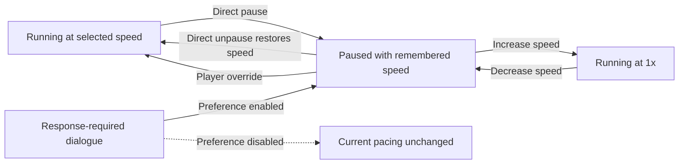

# Time and pacing

[Project index](../README.md) · [Simulation architecture](simulation-architecture.md) · [Economy](economy.md) · [Scale targets and benchmarks](scale-and-benchmark-targets.md)

## Decision status

**Decision status:** Accepted by the project owner on 2026-08-06.

`TASK-013` defines the local single-player pause, speed, and input-timing
contract. `TASK-038` owns implementation when the application is ready to
replace its current fixed real-time advancement.

## Separate clocks

The design distinguishes:

- **Wall-clock time:** time experienced outside the simulation
- **Simulation time:** the authoritative time within the galaxy
- **Process duration:** simulation time required to complete an activity

Computer performance determines how quickly simulation work can be calculated. It must not silently change process durations or economic outcomes.

## Control model at a glance

The application changes pacing only between completed simulation timestamp
cycles. Pause remembers a running speed, while speed-step input treats pause as
the position below `1x`. Response-required dialogue may acquire a temporary
automatic pause according to the player's preference.

The diagram shows pacing transitions, not simulation authority. Dialogue and
speed controls do not mutate galaxy state or bypass gameplay commands.

## Player-controlled simulation speed

The player should be able to pause and select from multiple simulation speeds. If the computer cannot calculate a requested speed in real time, simulation time advances more slowly without changing the rules.

The supported maximum speed remains a performance target to be established
through `TASK-024`. The current proposal is documented in
[Scale targets and benchmark architecture](scale-and-benchmark-targets.md).

### Speed state and transitions

Pause is separate from the selected running speed. A direct pause action
remembers the current running speed, and a direct unpause action restores it.
Changing speed operates on an ordered effective-speed ladder in which pause is
the lowest step:

- Increasing speed while paused starts the simulation at `1x` and makes `1x`
  the newly selected running speed.
- Decreasing from `1x` pauses and remembers `1x`.
- Decreasing while already paused has no effect.
- Selecting a specific speed preset while paused starts the simulation at that
  preset and makes it the selected running speed.

Therefore, pausing at a higher speed and directly unpausing returns to that
higher speed, while increasing speed from pause begins at `1x` rather than at
the previously selected speed.

A speed change takes effect before the next simulation advancement and never
within a timestamp cycle. Pause and speed controls are local application
pacing, not gameplay commands, and do not receive a `CommandSequence`. Paused
wall-clock time and computation delays create no simulation catch-up debt. If
the computer cannot sustain the selected speed, simulation time advances more
slowly without skipping work or changing authoritative outcomes.

### Configurable speed ladder

The running-speed ladder is versioned game configuration that a mod may replace
or extend. It must not be encoded as a fixed enum or a hardcoded number of
steps. Pause is an implicit application state and is not a numeric entry in the
configured ladder.

Each configured multiplier must be positive, finite, unique, and strictly
increasing. `1x` is required as the first running step so increasing speed from
pause retains the accepted pause-to-`1x` behavior. Invalid configuration fails
with a clear validation error rather than being silently sorted or corrected.
The application loads and validates the complete ladder before starting a
session.

The initial default ladder is `1x`, `2x`, `5x`, `10x`, and `30x`. Runtime speed
state identifies the selected multiplier rather than a fixed ordinal such as
`Speed3`, so a configured ladder may contain a different number of steps. The
configuration representation and file location remain implementation choices.

## Paused command timing

Pausing stops advancement of simulation time. It does not prevent the player
from submitting gameplay commands. Commands submitted while paused take effect
immediately at the frozen authoritative `SimulationTime` and receive the next
session-wide `CommandSequence`.

The pause boundary is quiescent: the current timestamp cycle, including every
event phase, has completed before paused input is accepted. Commands then
commit serially in command-sequence order. Each command observes the state
produced by every earlier command at that timestamp, so append, replacement,
cancellation, and any future queue-reordering command have deterministic
results. Simulation advancement does not resume until command processing has
finished.

A paused command must not reopen an event phase or schedule work into a phase
of the completed timestamp cycle. An accepted activity may begin at the frozen
current time, but every scheduled completion must have a future simulation
timestamp. Consequences that are genuinely immediate commit within the command
transaction itself.

## Running input timing

Gameplay input is applied only at a quiescent boundary between completed
timestamp cycles. Input received while simulation advancement is executing is
buffered by the application. At the next boundary, the application drains the
buffer in captured input order before advancing again.

Each gameplay command receives the authoritative simulation time at the
boundary and the next session-wide `CommandSequence`. It is never backdated
from wall-clock input time. Each command observes the changes committed by
earlier commands in the same drained input batch. Pause and speed actions in
the buffer also take effect before further advancement.

Advancement must expose sufficiently frequent completed-timestamp checkpoints
that a pause request cannot remain hidden behind an unbounded run. This does
not allow a timestamp cycle to be interrupted. Autonomous simulation decisions
remain deterministic decision-phase work and do not enter the application
input buffer.

## Response-required dialogue

The player has a persistent preference named **Pause when response-required
dialogue opens**. It is enabled by default. This is local player configuration,
not authoritative galaxy state.

When enabled, opening dialogue that requires a player response automatically
pauses at a completed timestamp boundary. Non-interactive speech,
notifications, and ambient dialogue never pause. When disabled, dialogue does
not change the current pause or speed state. The preference is evaluated when
dialogue opens; changing it does not retroactively pause or resume dialogue
that is already open.

If the game was running, automatic dialogue pause remembers the selected speed.
Closing the dialogue restores that speed only while the dialogue's automatic
pause remains active. The player may manually unpause, increase speed, or
select a preset while the dialogue remains open; doing so overrides the
automatic pause, and closing the dialogue then leaves the player's chosen
speed unchanged. If the game was already paused when dialogue opened, or the
player manually pauses during the dialogue, closing it leaves the game paused.

Multiple screens belonging to one continuous conversation retain one automatic
pause without resuming between screens. [Dialogue state and presentation](dialogue.md)
defines response-required classification, foreground opening, pending
conversations, response availability, and conversation continuity under
`TASK-016`. `TASK-065` owns dialogue implementation.

## Pacing levers

Major timing categories should be independently configurable:

- Travel, docking, and inter-system transit
- Resource extraction and cargo transfer
- Refining and component manufacturing
- Ship and station construction
- Repair and replenishment
- Economic reevaluation
- Faction military and diplomatic planning
- Combat actions

There should also be a global pacing control that can scale compatible categories together. Category-specific controls allow travel or production to be adjusted without changing the entire game.

## Work and throughput

Where practical, industrial duration should derive from required work and effective throughput rather than an isolated timer. Travel should similarly derive from route distance and effective speed.

This allows equipment, damage, technology, and local conditions to modify performance through consistent concepts.

## Configuration and saves

Timing values should be data-driven, versioned, and recorded in saved games. Development builds should make them easy to adjust and compare.

Useful balancing metrics include:

- Typical trip and delivery times
- Facility utilization and queue time
- Time from raw resource to completed ship
- Frequency and duration of shortages
- Replacement time after military losses
- Faction response time after major events

The implementation implications are summarized in [Technical direction](technical-direction.md).
