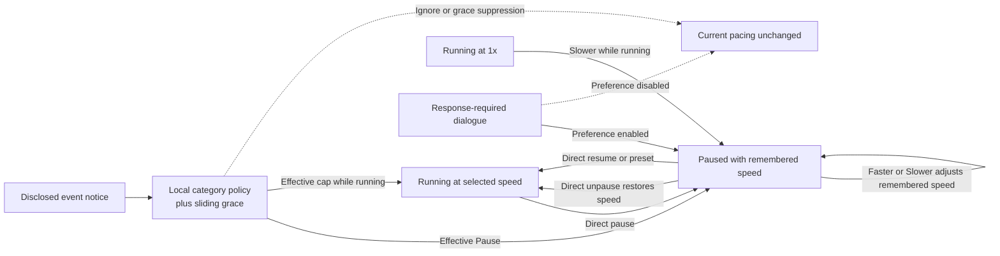

# Time and pacing

[Project index](../README.md) · [Simulation architecture](simulation-architecture.md) · [Economy](economy.md) · [Scale targets and benchmarks](scale-and-benchmark-targets.md)

## Decision status

**Decision status:** Accepted. The project owner accepted the `TASK-013`
contract on 2026-08-06 and revised it on 2026-08-25 so Faster and Slower adjust
the remembered speed while paused rather than resuming the simulation. The
project owner accepted the `TASK-064` event-responsive pacing contract on
2026-08-26.

`TASK-013` defines the local single-player pause, speed, and input-timing
contract. `TASK-038` owns implementation when the application is ready to
replace its current fixed real-time advancement.

`TASK-064` extends this document with accepted policy-driven local pacing
responses to events disclosed to player presentation. `TASK-038` owns its
implementation.

## Event-responsive pacing design boundaries

An event-responsive pacing request is local application behavior. It may
change pause or the selected running-speed multiplier only after a completed
simulation timestamp cycle. It is not a gameplay command, receives no
`CommandSequence`, creates no catch-up debt, and cannot interrupt or reopen an
authoritative event phase.

The application may consider an event only after that event has passed the
player-presentation disclosure boundary. Authoritative facts remain complete,
but hidden facts do not request player-facing pacing changes. A disclosed
notice may be public, concern a player-owned asset, or be observable under the
owning domain's committed visibility rule. Disclosure means the application is
authorized to receive the typed notice. It does not mean presentation has
rendered a notification or that the player has seen, opened, or acknowledged
it. Later observation does not retroactively replay a hidden pacing request.

Event producers do not own pacing. They publish typed committed meaning and,
where needed, presentation-safe classification. The application evaluates the
player's local policy, changes its own pacing state at a permitted boundary,
and presents a visible explanation. Dismissing a notification cannot mutate
authoritative simulation state.

### Accepted policy action vocabulary

The project owner accepted the initial per-category policy model on
2026-08-25. Each supported disclosed-event category maps to exactly one local
pacing action:

- **Ignore:** leave the current pacing state unchanged.
- **Pause:** enter the local paused state at the next permitted boundary.
- **Cap at a configured multiplier:** if the simulation is running faster than
  that configured ladder entry, reduce it to the cap; otherwise leave the
  current pacing state unchanged.

A speed cap never accelerates the simulation. In particular, it does not
resume a paused simulation or raise a running speed that is already below the
cap.

Informational dialogue has an initial default action of **Ignore**. Opening or
foregrounding it therefore leaves pacing unchanged unless the player later
selects another supported action for that category. Response-required dialogue
retains its separately accepted automatic-pause behavior and preference.

### Accepted initial categories

The initial category set and defaults are:

| Category | Initial default | Boundary |
| --- | --- | --- |
| Response-required dialogue foregrounded | Pause | Retains the separately accepted preference, foreground, continuity, override, and restoration contract. |
| Informational dialogue foregrounded | Ignore | Opening or foregrounding informational dialogue does not initially change pacing. |
| Combat started outside the current view involving a player-owned asset | Pause | Requires a disclosed typed combat-start notice that identifies the involved player-owned asset. |

No combat involving only non-player assets requests a pacing change, even when
its notice is otherwise disclosed to presentation. Hidden combat remains
ineligible because it never crosses the disclosure boundary.

For this policy, **outside the current view** is a local presentation
classification evaluated when the application processes the disclosed notice
at a completed timestamp boundary. It is distinct from sensor visibility and
does not become authoritative simulation state. Later camera movement neither
creates nor replays a pacing request for that notice.

The combat domain retains ownership of the exact authoritative meaning of
combat started and of the typed notice needed to identify involved assets.
TASK-064 does not infer a start from damage, repeated combat actions, rendered
effects, or notification text before that combat contract exists.

### Accepted conflict, lifetime, and override behavior

The project owner accepted the general event-response conflict and override
model on 2026-08-25. The application evaluates every eligible notice available
at one completed timestamp boundary as one batch:

1. Ignore actions contribute no requested change.
2. If any eligible action requests Pause, the batch result is Pause.
3. Otherwise, the lowest requested configured speed cap is the batch result.
4. The application applies the one effective result once and visibly explains
   the notices that contributed to it.

General event responses are one-shot adjustments. They retain no active pacing
token, impose no continuing constraint, and never restore a prior speed.
Manual pause, resume, Faster, Slower, or preset selection after the adjustment
fully controls the resulting pacing state. Acknowledging, dismissing, or
clearing the explanation does not change pacing.

Response-required dialogue is the deliberate exception. It retains the
separately accepted temporary automatic-pause ownership, continuity, manual
override, and conditional restoration behavior described below.

### Accepted recent-event grace behavior

The project owner rejected unconditional retriggering for every distinct event
occurrence. A player who chooses a higher pace must be able to retain it when
qualifying events have occurred within the previous five seconds.

This grace behavior may use local monotonic wall-clock time. It changes only
whether the application reapplies a local pacing action; it does not alter
simulation time, authoritative outcomes, event disclosure, or deterministic
commit. Suppressed pacing responses may still produce visible explanations.

The project owner accepted the grouping and sliding-window behavior on
2026-08-26:

- Each supported category defines a stable subject identity. The grace key is
  the category plus that subject identity; a category cannot participate until
  its owning contract defines the subject without using localized or rendered
  presentation data.
- The combat-start category uses the involved player-owned asset as its
  subject. Different player-owned assets therefore have independent windows.
- The first eligible non-Ignore occurrence for a key participates in normal
  conflict resolution and starts that key's five-second window.
- Another occurrence for the same key while its window is active does not
  request a pacing change and restarts the full five-second window.
- Suppression affects only pacing. Every occurrence remains eligible for its
  normal visible explanation.

The windows form a local sliding grace mechanism. Continuous occurrences may
therefore keep one key suppressed while a new key still requests its configured
pacing response.

### Accepted persistence and load behavior

The project owner accepted the event-responsive pacing persistence contract on
2026-08-26:

- Per-category actions and selected configured speed caps persist in the
  versioned device-local preference store defined by `TASK-050`. They apply to
  new and loaded games but remain outside save slots, authoritative
  checkpoints, and simulation state.
- A stored cap must name a multiplier in the currently validated speed ladder.
  When that multiplier is unavailable, the application displays a clear local
  configuration warning and uses the category's valid default action for that
  launch. It does not silently select another multiplier or rewrite the stored
  preference.
- Sliding grace windows are transient application state. Starting a new game,
  loading a game, or restarting the application clears every window.
- Event-responsive explanation and notification history is disposable local UI
  state and is not captured in authoritative checkpoints or save files.
- Loading never replays historical notices for pacing. Only notices newly
  disclosed after the load boundary may request a response.

These local exclusions do not change the separately accepted authoritative
save requirements for dialogue, player observation state, facts, or other
simulation owners.

`TASK-064` is complete. `TASK-038` may implement this accepted contract without
making event producers pacing owners or placing local policy state inside the
authoritative session.

## Separate clocks

The design distinguishes:

- **Wall-clock time:** time experienced outside the simulation
- **Simulation time:** the authoritative time within the galaxy
- **Process duration:** simulation time required to complete an activity

Computer performance determines how quickly simulation work can be calculated. It must not silently change process durations or economic outcomes.

## Control model at a glance

The application changes pacing only between completed simulation timestamp
cycles. Pause remembers a running speed; Faster and Slower adjust that
remembered speed without resuming. Response-required dialogue may acquire a
temporary automatic pause according to the player's preference.

The diagram shows pacing transitions, not simulation authority. Dialogue and
speed controls do not mutate galaxy state or bypass gameplay commands.

## Player-controlled simulation speed

The player should be able to pause and select from multiple simulation speeds. If the computer cannot calculate a requested speed in real time, simulation time advances more slowly without changing the rules.

The supported maximum speed remains a performance target to be established
through `TASK-024`. The current proposal is documented in
[Scale targets and benchmark architecture](scale-and-benchmark-targets.md).

### Speed state and transitions

Pause is separate from the selected running speed. A direct pause action
remembers the current running speed, and a direct unpause action restores it.
Changing speed operates on an ordered running-speed ladder:

- Increasing speed while paused selects the next configured running speed and
  remains paused.
- Decreasing speed while paused selects the previous configured running speed
  and remains paused.
- Increasing at the highest configured speed or decreasing at `1x` while
  paused has no effect.
- Decreasing from `1x` while running pauses and remembers `1x`.
- Selecting a specific speed preset while paused starts the simulation at that
  preset and makes it the selected running speed.

Therefore, pausing at a higher speed and directly unpausing returns to that
higher speed. While paused, Faster and Slower revise that remembered speed for
a later direct unpause; selecting a preset remains an explicit resume action.

A speed change takes effect before the next simulation advancement and never
within a timestamp cycle. Pause and speed controls are local application
pacing, not gameplay commands, and do not receive a `CommandSequence`. Paused
wall-clock time and computation delays create no simulation catch-up debt. If
the computer cannot sustain the selected speed, simulation time advances more
slowly without skipping work or changing authoritative outcomes.

### Configurable speed ladder

The running-speed ladder is versioned game configuration that a mod may replace
or extend. It must not be encoded as a fixed enum or a hardcoded number of
steps. Pause is an implicit application state and is not a numeric entry in the
configured ladder.

Each configured multiplier must be positive, finite, unique, and strictly
increasing. `1x` is required as the first running step so a slower adjustment
while paused has a defined minimum. Invalid configuration fails with a clear
validation error rather than being silently sorted or corrected. The application
loads and validates the complete ladder before starting a session.

The initial default ladder is `1x`, `2x`, `5x`, `10x`, and `30x`. Runtime speed
state identifies the selected multiplier rather than a fixed ordinal such as
`Speed3`, so a configured ladder may contain a different number of steps. The
configuration representation and file location remain implementation choices.

## Paused command timing

Pausing stops advancement of simulation time. It does not prevent the player
from submitting gameplay commands. Commands submitted while paused take effect
immediately at the frozen authoritative `SimulationTime` and receive the next
session-wide `CommandSequence`.

The pause boundary is quiescent: the current timestamp cycle, including every
event phase, has completed before paused input is accepted. Commands then
commit serially in command-sequence order. Each command observes the state
produced by every earlier command at that timestamp, so append, replacement,
cancellation, and any future queue-reordering command have deterministic
results. Simulation advancement does not resume until command processing has
finished.

A paused command must not reopen an event phase or schedule work into a phase
of the completed timestamp cycle. An accepted activity may begin at the frozen
current time, but every scheduled completion must have a future simulation
timestamp. Consequences that are genuinely immediate commit within the command
transaction itself.

## Running input timing

Gameplay input is applied only at a quiescent boundary between completed
timestamp cycles. Input received while simulation advancement is executing is
buffered by the application. At the next boundary, the application drains the
buffer in captured input order before advancing again.

Each gameplay command receives the authoritative simulation time at the
boundary and the next session-wide `CommandSequence`. It is never backdated
from wall-clock input time. Each command observes the changes committed by
earlier commands in the same drained input batch. Pause and speed actions in
the buffer also take effect before further advancement.

Advancement must expose sufficiently frequent completed-timestamp checkpoints
that a pause request cannot remain hidden behind an unbounded run. This does
not allow a timestamp cycle to be interrupted. Autonomous simulation decisions
remain deterministic decision-phase work and do not enter the application
input buffer.

## Response-required dialogue

The player has a persistent preference named **Pause when response-required
dialogue opens**. It is enabled by default. This is local player configuration,
not authoritative galaxy state.

When enabled, opening dialogue that requires a player response automatically
pauses at a completed timestamp boundary. Non-interactive speech,
notifications, and ambient dialogue never pause. When disabled, dialogue does
not change the current pause or speed state. The preference is evaluated when
dialogue opens; changing it does not retroactively pause or resume dialogue
that is already open.

If the game was running, automatic dialogue pause remembers the selected speed.
Closing the dialogue restores that speed only while the dialogue's automatic
pause remains active. The player may manually unpause, adjust the remembered
speed with Faster or Slower, or select a preset while the dialogue remains
open; doing so overrides the automatic pause. A Faster or Slower adjustment
keeps the game paused, while selecting a preset resumes it. Closing the dialogue
then leaves the player's chosen state unchanged. If the game was already paused
when dialogue opened, or the player manually pauses during the dialogue,
closing it leaves the game paused.

Multiple screens belonging to one continuous conversation retain one automatic
pause without resuming between screens. [Dialogue state and presentation](dialogue.md)
defines response-required classification, foreground opening, pending
conversations, response availability, and conversation continuity under
`TASK-016`. `TASK-065` owns dialogue implementation.

## Pacing levers

Major timing categories should be independently configurable:

- Travel, docking, and inter-system transit
- Resource extraction and cargo transfer
- Refining and component manufacturing
- Ship and station construction
- Repair and replenishment
- Economic reevaluation
- Faction military and diplomatic planning
- Combat actions

There should also be a global pacing control that can scale compatible categories together. Category-specific controls allow travel or production to be adjusted without changing the entire game.

## Work and throughput

Where practical, industrial duration should derive from required work and effective throughput rather than an isolated timer. Travel should similarly derive from route distance and effective speed.

This allows equipment, damage, technology, and local conditions to modify performance through consistent concepts.

## Configuration and saves

Timing values should be data-driven, versioned, and recorded in saved games. Development builds should make them easy to adjust and compare.

Useful balancing metrics include:

- Typical trip and delivery times
- Facility utilization and queue time
- Time from raw resource to completed ship
- Frequency and duration of shortages
- Replacement time after military losses
- Faction response time after major events

The implementation implications are summarized in [Technical direction](technical-direction.md).
